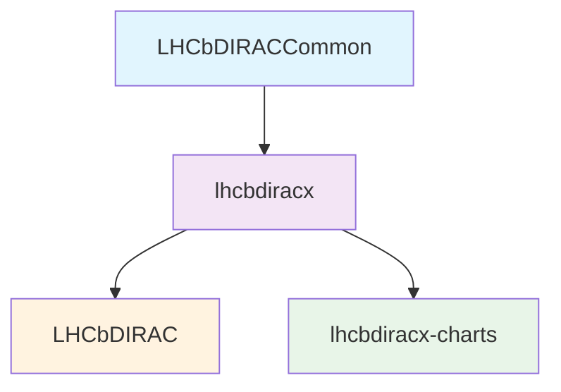

# LHCbDIRACCommon

LHCbDIRACCommon contains common utilities and components shared across the LHCb DIRAC ecosystem during the DIRAC → DiracX migration.

## Purpose

This package serves as a foundational layer containing shared code that is used by multiple LHCb DIRAC packages. By maintaining it as a separate repository, we:

- **Avoid dependency cycles** in the package tagging order
- **Minimize changes** as this code is expected to be stable and change infrequently
- **Provide a clean separation** of concerns between core utilities and higher-level functionality
- **Support the DIRAC → DiracX migration** by housing shared components needed across both systems

## Context

LHCbDIRACCommon is part of the broader DIRAC → DiracX migration effort, where DiracX represents "The neXt DIRAC incarnation" - a modern evolution of the existing DIRAC distributed computing framework. This package contains shared utilities that facilitate the transition between the legacy DIRAC system and the new DiracX architecture.

**Note:** This package is an implementation detail and is not intended for direct end-user consumption.

## Package Dependencies

The dependency structure is designed to prevent circular dependencies and ensure a clean build order:



## Development

### Running Tests

```bash
# Run all tests
pixi run test

# Run tests with coverage
pixi run pytest --cov=lhcbdiraccommon
```

### Code Quality

```bash
# Run pre-commit hooks
pixi run -e pre-commit pre-commit run --all-files

# Install pre-commit hooks for development
pixi run -e pre-commit pre-commit install
```

### Available Commands

- `pixi run test` / `pixi run pytest` - Run the test suite
- `pixi run -e pre-commit pre-commit` - Run pre-commit hooks

## Contributing

For detailed contribution guidelines and requirements for code inclusion, please refer to the [DIRAC-common README](https://github.com/DIRACGrid/DIRAC/blob/integration/dirac-common/README.md), which provides comprehensive guidance on:

- Code quality standards
- Testing requirements
- Migration patterns and best practices
- Architectural decisions and design principles

## License

This project is licensed under the same terms as the DIRAC project.
