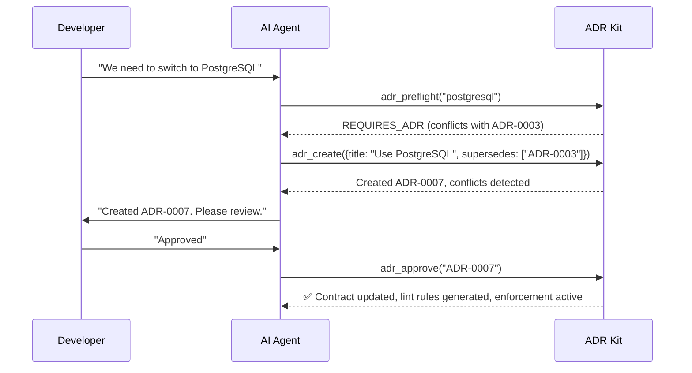

# ADR Kit

**AI-First Architectural Decision Records** - A toolkit designed for autonomous AI agents like Claude Code to manage ADRs with intelligent automation and policy enforcement.

[](https://www.python.org/downloads/)
[](https://opensource.org/licenses/MIT)

## What is ADR Kit?

ADR Kit transforms architectural decisions into **enforceable code policies**. It's built specifically for AI agents to autonomously manage your project's architectural decisions while preventing drift and conflicts.

**Key Philosophy:** Agents make smart decisions, tools handle reliable automation.

## Core Features

- **🎯 6-Entry-Point Architecture** - Simple interface for AI agents, comprehensive automation underneath
- **🧠 Intelligent Conflict Detection** - Semantic search prevents duplicate or conflicting decisions
- **🛡️ Automatic Policy Enforcement** - ADRs become ESLint/Ruff rules automatically
- **🚪 Preflight Validation** - Check technical choices before implementation
- **📝 MADR Format** - Industry standard with structured policy enforcement
- **🔍 Semantic Search** - Vector-based ADR discovery and relationship detection
- **🌐 Static Site Generation** - Beautiful documentation sites for developer transparency

## Quick Start for AI Agents

### 1. Installation & Setup

**Recommended Installation (Virtual Environment):**
```bash
# Create and activate virtual environment
python -m venv .venv
source .venv/bin/activate  # On Windows: .venv\Scripts\activate

# Install ADR Kit with all dependencies
pip install adr-kit

# Initialize in your project
cd your-project
adr-kit init

# Start MCP server for AI integration  
adr-kit mcp-server
```

**Alternative Installation (Global with pipx):**
```bash
# Install globally with pipx (recommended for CLI tools)
pipx install adr-kit

# Or upgrade if already installed
pipx upgrade adr-kit
```

**Built-in Updates:**
```bash
# Check for and install updates
adr-kit update

# Just check for updates
adr-kit update --check
```

### 2. Configure Your AI Agent (Claude Code/Cursor)

Add to your MCP settings.json:
```json
{
  "mcpServers": {
    "adr-kit": {
      "command": "adr-kit", 
      "args": ["mcp-server"]
    }
  }
}
```

**Quick Setup:**
```bash
# Auto-generate MCP configuration for Cursor and Claude Code
adr-kit dual-setup
```

### 3. Start Using with Your AI Agent

Tell your AI agent:
- *"Analyze my project for architectural decisions that need ADRs"*
- *"Check if I can use PostgreSQL in this project"* 
- *"Create an ADR for switching to React Query"*
- *"Give me architectural context for implementing authentication"*

## How It Works: 6-Entry-Point Architecture

ADR Kit provides **6 intelligent entry points** that trigger comprehensive internal workflows:

### 🔍 1. `adr_analyze_project()` - Discover Missing ADRs
Scans your codebase and generates prompts for the agent to identify architectural decisions that need documentation.

### 🚦 2. `adr_preflight(choice)` - Validate Technical Choices
Before any technical decision, check: **ALLOWED** | **REQUIRES_ADR** | **BLOCKED**
- Prevents conflicts with existing decisions
- Routes agent to create ADRs when needed

### 📝 3. `adr_create(proposal)` - Create ADR Proposals  
Agent writes comprehensive ADRs with:
- Context, decision, consequences, alternatives
- Structured policies for automatic enforcement
- Conflict detection and validation

### ✅ 4. `adr_approve(adr_id)` - Trigger Full Automation
When human approves an ADR, automatically:
- Updates constraints contract
- Generates lint rules (ESLint, Ruff, import-linter)
- Rebuilds indexes and relationships
- Enables policy enforcement

### 🔄 5. `adr_supersede(old, new)` - Replace Decisions
Manages decision evolution with proper relationships and history tracking.

### 🗺️ 6. `adr_planning_context(task)` - Get Architectural Context
Provides curated guidance for specific development tasks based on existing ADRs.

## The Agent Workflow



## ADR Format with Policy Enforcement

ADRs use MADR format with structured policies that become executable rules:

```markdown
---
id: ADR-0001
title: Use React Query for data fetching
status: accepted
deciders: [frontend-team, tech-lead]
tags: [frontend, data]
policy:
  imports:
    disallow: [axios, fetch]
    prefer: [react-query, @tanstack/react-query]
  boundaries:
    rules:
      - forbid: "components -> database"
---

## Context
Custom data fetching is scattered across components...

## Decision  
Use React Query for all data fetching operations.

## Consequences
### Positive
- Standardized patterns, built-in caching, better DX
### Negative
- Additional dependency, learning curve

## Alternatives
- **Native fetch()**: Simple but lacks caching
- **Axios**: Good client but no state management
```

**This automatically generates:**
```json
// .eslintrc.adrs.json
{
  "rules": {
    "no-restricted-imports": [
      "error",
      {
        "paths": [
          {"name": "axios", "message": "Use React Query instead (ADR-0001)"}
        ]
      }
    ]
  }
}
```

## Directory Structure

```
your-project/
├── docs/adr/                    # ADR files
│   ├── ADR-0001-react-query.md
│   └── adr-index.json          # Generated index
├── .eslintrc.adrs.json         # Generated lint rules
└── .adr-kit/                   # System files
    └── constraints.json        # Policy contract
```

## Manual Usage (Optional)

Basic CLI commands for non-AI workflows:

```bash
# Validate ADRs
adr-kit validate

# Generate documentation site  
adr-kit render-site

# Export lint configurations
adr-kit export-lint eslint --out .eslintrc.adrs.json
```

## Integration

### CI/CD Pipeline
```yaml
# .github/workflows/adr.yml
- run: pip install adr-kit
- run: adr-kit validate
- run: git diff --exit-code .eslintrc.adrs.json  # Ensure rules are current
```

### Pre-commit Hooks
```yaml
# .pre-commit-config.yaml
- repo: local
  hooks:
    - id: adr-validate
      entry: adr-kit validate
      language: system
```

## Learn More

- **MADR Format**: [Markdown ADR specification](https://adr.github.io/madr/)
- **MCP Protocol**: [Model Context Protocol for AI agents](https://modelcontextprotocol.io)
- **Example ADR**: See `docs/adr/ADR-0001-sample.md` for complete example

## License

MIT License - see [LICENSE](LICENSE) file for details.