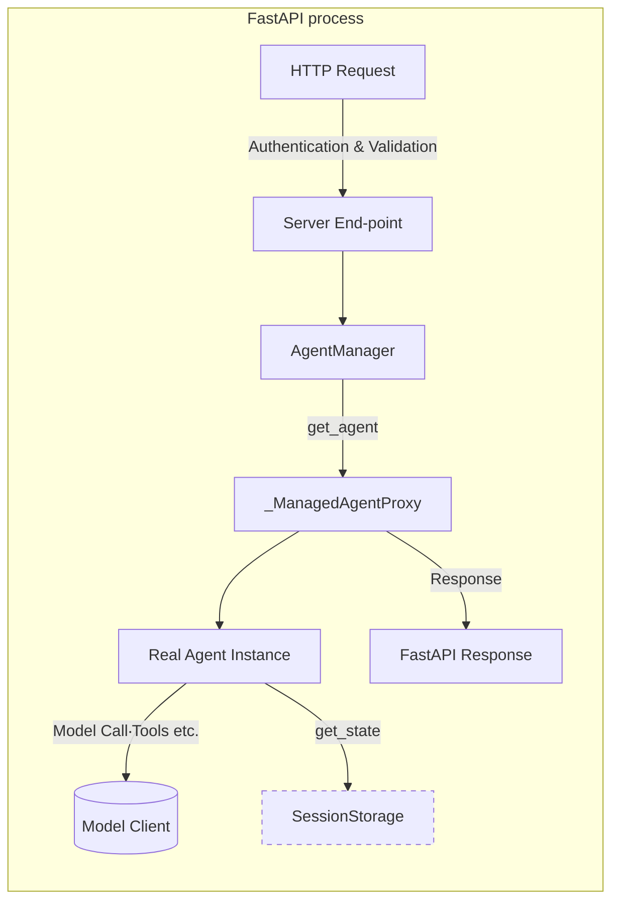

# Agent Framework – Comprehensive Documentation

## Table of Contents

1. Introduction
2. Quick-Start (Hello, World!)
3. High-Level Architecture
4. Core Python API

   4.1 AgentInterface

   4.2 StructuredAgentInput / Output & Content Parts

   4.3 Session Storage Abstraction

   4.4 Model Configuration & Clients
5. HTTP Service

   5.1 Authentication

   5.2 REST End-points – Summary

   5.3 End-point Reference (detailed)
6. Internal Life-Cycle – How a Request Is Processed
7. Extending the Framework (writing your own Agent)
8. Deployment Recipes
9. Troubleshooting & FAQ
10. Changelog
11. Enhanced File Management System

   11.1 Enhanced File Processing Guide

   11.2 Multimodal Tools Guide

   11.3 AI Content Management Guide

   11.4 Usage Examples

   11.5 Migration Guide

---

## 1  Introduction

The **Agent Framework** is a batteries-included library for serving conversational agents over HTTP.

Key features:

• FastAPI-powered HTTP service with optional **streaming** support.

• Pluggable **Agent** abstraction – bring your own LLM logic or AutoGen agent.

• Transparent, back-end agnostic **session & state** persistence (in-memory or MongoDB).

• Multi-provider **model routing** (OpenAI, Gemini, …) with automatic API-key resolution.

• Rich, structured I/O: text, images, files, tables, forms, options-blocks, mermaid diagrams, Chart.js charts…

The code lives inside the `agent_framework` package and can be imported or executed as a standalone server.

---

## 2  Quick-Start

```python

from agent_framework import AgentInterface, create_basic_agent_server


classEchoAgent(AgentInterface):

    asyncdefget_metadata(self):

        return {"name": "Echo","description": "Echoes user input"}


    asyncdefget_state(self):

        return {}

    asyncdefload_state(self, state):

        pass


    asyncdefhandle_message(self, session_id, agent_input):

        returnStructuredAgentOutput(response_text=f"You said: {agent_input.query}")


# Fire up an HTTP server on :8000

create_basic_agent_server(EchoAgent,port=8000,reload=True)

```

Visit `http://localhost:8000/docs` for the Swagger UI and start chatting.

---

## 3  High-Level Architecture



1.**Server** (`server.py`) exposes REST end-points, performs auth & input validation.

2.**AgentManager** lazily constructs or loads the required agent for each session, injects session configuration and wraps it in a **proxy** that automatically persists state after every call.

3.**SessionStorage** provides a uniform CRUD API – memory by default, MongoDB in production.

4.**ModelClientFactory** creates an LLM client based on requested model name.

---

## 4  Core Python API

### 4.1 `AgentInterface`

Located at `agent_framework/agent_interface.py`.  Implement the following async methods:

*`get_metadata() -> dict` – human/readable capabilities.

*`get_state() -> dict` / `load_state(dict)` – serialize your whole brain.

*`handle_message(session_id, StructuredAgentInput) -> StructuredAgentOutput` – main entry point.

* Optional helpers: `handle_message_stream`, `configure_session`, `get_system_prompt`, `get_current_model`.

### 4.2 Structured I/O

```text

+ StructuredAgentInput

   ├─ query: Optional[str]

   ├─ parts: List[AgentInputPartUnion]

   └─ agent_config / system_prompt (optional)

```

**Input parts** (union): `TextInputPart`, `ImageUrlInputPart`, `FileDataInputPart`.

```text

+ StructuredAgentOutput

   ├─ response_text: Optional[str]

   └─ parts: List[AgentOutputPartUnion]

```

**Output parts** include rich artefacts such as `MermaidOutputPart`, `ChartJsOutputPart`, `TableDataOutputPart`, `FormDefinitionOutputPart`, `OptionsBlockOutputPart`, etc.

### 4.3 Session Storage

`SessionStorageInterface` defines ~20 async methods. Two implementations ship with the framework:

*`MemorySessionStorage` – default, zero-config.

*`MongoDBSessionStorage` – scalable, requires `MONGODB_URI` env var.

The manager persists:

*`SessionData` (metadata & per-session configuration)

*`MessageData` (every user & agent message, plus insights / feedback)

* Optional `agent_state` blobs (compressed & truncated automatically).

### 4.4 Model Configuration & Clients

`model_config.py` maps model names to providers and pulls API keys from env: `OPENAI_API_KEY`, `GEMINI_API_KEY`, …

`model_clients.py` then instantiates provider-specific clients (currently OpenAI & Gemini stubs).

---

## 5  HTTP Service

### 5.1 Authentication

Authentication is **optional** and controlled via env vars:

| Variable | Meaning | Default |

|----------|---------|---------|

| `REQUIRE_AUTH` | `true/false` | `false` |

| `BASIC_AUTH_USERNAME` / `BASIC_AUTH_PASSWORD` | Basic auth creds | `admin/password` |

| `API_KEYS` | Comma-separated list of Bearer or `X-API-Key` keys | _empty_ |

If `REQUIRE_AUTH=true` the server accepts **either** Basic Auth **or** API Key in the following places:

* HTTP `Authorization: Bearer <key>` header

*`X-API-Key: <key>` header

### 5.2 End-point Summary

| Method & Path | Purpose |

|---------------|---------|

| `POST /init` | Create or resume a session & optionally supply configuration |

| `POST /message` | Send a message & get full response |

| `POST /sessions/{session_id}/stream` | Same as above but **streams** chunks (Server-Sent Events) |

| `POST /end` | Mark session as archived/ended |

| **Session Data** ||

| `GET /sessions` | List session IDs for current user |

| `GET /sessions/by-correlation/{cid}` | List sessions sharing a correlation ID |

| `GET /sessions/{session_id}/history` | Retrieve full message history |

| `GET /session/{session_id}/status` | Quick status & timestamps |

| `GET /sessions/{session_id}/response-times` | Per-interaction latency stats |

| `GET /interactions/{interaction_id}/response-time` | Latency for a single interaction |

| **Agent & Config** ||

| `GET /metadata` | Agent metadata (`get_metadata`) |

| `GET /system-prompt` | Current system prompt for session |

| `GET /config/models` | Available models & provider info |

| **Feedback** ||

| `POST /feedback/message` | Up/Down-vote a single message |

| `POST /feedback/flag` (also `PUT`) | Flag a session with free-text reason |

| `GET /feedback/session/{session_id}` | List feedback for session |

| `GET /feedback/message/{message_id}` | Retrieve feedback details |

| **Misc** ||

| `GET /` | Health-check – returns "Agent server is running" |

| `GET /endpoints` | Machine-readable list of all registered routes |

| `GET /testapp` | Ships an HTML playground (no auth) |

### 5.3 End-point Reference (selected)

#### `POST /init`

Initialises or resumes a session, and stores optional configuration.

Request JSON (`SessionInitRequest`):

```jsonc

{

  "user_id": "alice",                // required

  "session_id": "session-uuid",       // optional (server generates if missing)

  "correlation_id": "proj-42",        // optional – cross-agent grouping

  "data": {"foo": "bar"},            // free-form metadata

  "configuration": {

      "system_prompt": "You are …",

      "model_name": "gpt-4o-mini",

      "model_config": {"temperature": 0.3}

  }

}

```

Response JSON (`SessionInitResponse`):

```jsonc

{

  "user_id": "alice",

  "session_id": "session-uuid",

  "correlation_id": "proj-42",

  "data": {"foo": "bar"},

  "configuration": { … }

}

```

#### `POST /message`

Send a standard (non-streaming) message.

Request JSON (`MessageRequest`):

```jsonc

{

  "query": "How can I help?",

  "parts": [

    {"type": "text", "text": "Hello"},

    {"type": "image_url", "url": "https://…/cat.png"}

  ],

  "session_id": "session-uuid",  // may also come from query-param

  "correlation_id": "proj-42"

}

```

Response JSON (`SessionMessageResponse`):

```jsonc

{

  "response_text": "Hi there!",

  "parts": [ {"type": "text_output", "text": "…"} ],

  "session_id": "session-uuid",

  "user_id": "alice",

  "correlation_id": "proj-42",

  "interaction_id": "uuid-per-exchange",

  "processing_time_ms": 1234,

  "model_used": "gpt-4o"

}

```

#### `POST /sessions/{session_id}/stream`

Same payload as `/message`, but the response is a `text/event-stream` where each event body is a JSON serialisation of `StructuredAgentOutput`. The final event is marked `"event": "eof"`.

---

## 6  Internal Life-Cycle

1.**Lifespan startup** (FastAPI):

    * Server loads the Agent class – either

    * passed via`create_basic_agent_server(MyAgent)`**or**

    * looked up through`AGENT_CLASS_PATH="module:Class"` env var.

    * Instantiates session storage via`SessionStorageFactory.create_storage()`.

    * Constructs a singleton`AgentManager`.

2.**Client calls `/message`**:

    * Request validation (Pydantic) & auth.

    *`AgentManager.get_agent`:

    * Creates a fresh Agent instance.

    * Injects session configuration (`configure_session`).

    * Loads saved state from storage (`load_state`).

    * Wraps it in`_ManagedAgentProxy` that auto-persists afterwards.

    * Proxy forwards`handle_message` (or `handle_message_stream`) to real agent.

    * On return, proxy triggers`save_agent_state` → storage.

    * Server persists`MessageData` for **both** user input & agent output.

3.**Shutdown** cleans up storage connections.

---

## 7  Extending the Framework

1. Sub-class `AgentInterface` and implement mandatory methods.
2. Optionally support streaming by overriding `handle_message_stream` and yielding incremental `StructuredAgentOutput` objects.
3. Run with either:

   *`agent_framework.create_basic_agent_server(MyAgent, port=8000)` (quick dev)

   * or point `AGENT_CLASS_PATH` when running `python -m agent_framework.server`.
4. Persist any internal state via `get_state`/`load_state` – the framework compresses & truncates large AutoGen sessions automatically.

---

## 8  Deployment Recipes

***Docker**: An example `Dockerfile` and `.dockerignore` are provided in `examples/`.  Build with `docker build -t my-agent .`.

***Uvicorn / Gunicorn**: `uvicorn agent_framework.server:app --host 0.0.0.0 --port 8000 --workers 4`.

***Env-Vars**:

  *`SESSION_STORAGE=memory|mongodb` (defaults to memory).

  *`MONGODB_URI` – required if `mongodb` selected.

* Model provider keys, auth variables (see §5.1).

---

## 9  Troubleshooting & FAQ

***401 Unauthorized** – Set `REQUIRE_AUTH=false` or provide credentials.

***"Could not load agent class"** – pass your class via `create_basic_agent_server` or set `AGENT_CLASS_PATH`.

***Large state errors** – State > 12 MB triggers automatic truncation & gzip compression, but you can tune thresholds in `docs/mongodb_state_config.py`.

***Missing OpenAI client** – Install `autogen-ext[openai]` or point to a custom client.

---

## 10  Changelog (abridged)

See `CHANGELOG.md` for full history.

***v0.1.0** – Initial public release with FastAPI server, memory & MongoDB back-ends, Model routing, structured I/O.

***v0.2.0** – Streaming end-point, AgentManager proxy, unified auth, automatic state compression.

---

## 11  Enhanced File Management System

The Agent Framework includes a comprehensive Enhanced File Management System that provides advanced file processing, multimodal analysis, and AI content management capabilities.

### 11.1 Enhanced File Processing Guide

**Location**: `docs/ENHANCED_FILE_PROCESSING_GUIDE.md`

Covers the enhanced file processing capabilities including:
- Dual file storage (original + markdown versions)
- Comprehensive metadata reporting
- Enhanced error handling with user-friendly feedback
- Multimodal image analysis integration
- ImageAnalysisTool for on-demand image analysis

Key features:
- Universal file storage for all document types
- Intelligent markdown conversion with graceful degradation
- Comprehensive processing status and capability reporting
- Integration with existing agent workflows

### 11.2 Multimodal Tools Guide

**Location**: `docs/MULTIMODAL_TOOLS_GUIDE.md`

Comprehensive guide to multimodal image analysis capabilities:
- ImageAnalysisTool for AI-powered image analysis
- OCR text extraction from images
- Image description and question answering
- Support for JPEG, PNG, GIF, WebP, BMP, and TIFF formats
- Integration with OpenAI vision models

Configuration:
```bash
ENABLE_MULTIMODAL_ANALYSIS=true
OPENAI_API_KEY=your_api_key_here
OPENAI_API_MODEL=gpt-4o-mini
```

### 11.3 AI Content Management Guide

**Location**: `docs/AI_CONTENT_MANAGEMENT_GUIDE.md`

Automatic detection and storage of AI-generated content:
- Automatic detection of code blocks, HTML, charts, and diagrams
- Storage with comprehensive metadata and tagging
- Backend separation for different content types
- Integration with agent response processing

Supported content types:
- Code blocks (Python, JavaScript, SQL, etc.)
- HTML components and web content
- Chart.js configurations and visualizations
- Mermaid diagrams and flowcharts
- Structured data and configuration files

### 11.4 Usage Examples

**Location**: `docs/ENHANCED_FILE_MANAGEMENT_USAGE_EXAMPLES.md`

Comprehensive real-world usage examples including:
- Basic file operations and processing
- Multimodal image processing workflows
- AI content management scenarios
- Complete agent integration examples
- Error handling and graceful degradation
- Performance optimization techniques
- Advanced document processing pipelines

### 11.5 Migration Guide

**Location**: `docs/ENHANCED_AGENT_MIGRATION_GUIDE.md`

Migration guide for upgrading to enhanced capabilities:
- Comparison between original and enhanced agents
- Backward compatibility information
- Step-by-step migration instructions
- Configuration changes and new environment variables
- Performance comparisons and optimization tips

## Quick Start with Enhanced File Management

```python
from agent_framework.file_system_management import process_file_inputs
from agent_framework.multimodal_tools import ImageAnalysisTool
from agent_framework.ai_content_management import AIContentManager

# Enhanced file processing
processed_input, files = await process_file_inputs(
    agent_input,
    file_storage_manager,
    convert_to_markdown=True,
    enable_multimodal_processing=True
)

# Image analysis
image_tool = ImageAnalysisTool(storage_manager)
description = await image_tool.describe_image(file_id)

# AI content management
ai_manager = AIContentManager(storage_manager)
enhanced_output = await ai_manager.process_agent_response(
    agent_output, session_id, user_id
)
```

For complete examples and detailed documentation, see the individual guide files listed above.
