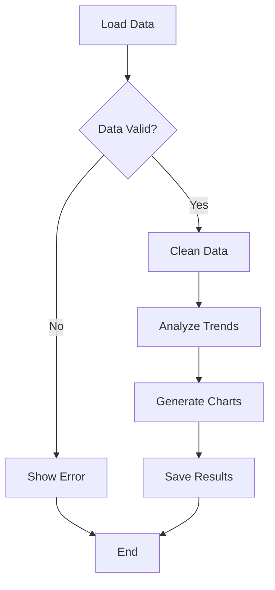

# Enhanced File Management Usage Examples

This document provides comprehensive usage examples for the Enhanced File Management system, demonstrating real-world scenarios and best practices.

## Table of Contents

1. [Basic File Operations](#basic-file-operations)
2. [Multimodal Image Processing](#multimodal-image-processing)
3. [AI Content Management](#ai-content-management)
4. [Agent Integration](#agent-integration)
5. [Error Handling Scenarios](#error-handling-scenarios)
6. [Performance Optimization](#performance-optimization)
7. [Advanced Workflows](#advanced-workflows)

## Basic File Operations

### Simple File Upload and Processing

```python
import asyncio
from agent_framework.file_system_management import process_file_inputs, FileStorageFactory
from agent_framework.agent_interface import StructuredAgentInput, FileDataInputPart
import base64

async def basic_file_upload_example():
    """Demonstrates basic file upload and processing"""
    
    # Initialize storage manager
    storage_manager = await FileStorageFactory.create_storage_manager()
    
    # Prepare file content
    text_content = "This is a sample document with important information."
    file_content_base64 = base64.b64encode(text_content.encode()).decode()
    
    # Create agent input with file
    agent_input = StructuredAgentInput(
        query="Please process this document",
        parts=[
            FileDataInputPart(
                filename="sample_document.txt",
                content_base64=file_content_base64,
                mime_type="text/plain"
            )
        ]
    )
    
    # Process with enhanced capabilities
    processed_input, uploaded_files = await process_file_inputs(
        agent_input=agent_input,
        file_storage_manager=storage_manager,
        user_id="user123",
        session_id="session456",
        store_files=True,
        convert_to_markdown=True,
        enable_multimodal_processing=True
    )
    
    # Examine results
    for file_info in uploaded_files:
        print(f"File: {file_info['filename']}")
        print(f"Status: {file_info['user_message']}")
        print(f"Original file ID: {file_info['file_id']}")
        
        if file_info.get('markdown_file_id'):
            print(f"Markdown version ID: {file_info['markdown_file_id']}")
        
        print(f"Capabilities: {file_info['capabilities_available']}")
        print(f"Processing time: {file_info['processing_time_ms']:.2f}ms")
        print("---")

# Run the example
asyncio.run(basic_file_upload_example())
```

### Multiple File Types Processing

```python
async def multiple_file_types_example():
    """Demonstrates processing various file types"""
    
    storage_manager = await FileStorageFactory.create_storage_manager()
    
    # Prepare different file types
    files_data = [
        {
            "filename": "document.pdf",
            "content": b"PDF content here",  # In real scenario, this would be actual PDF bytes
            "mime_type": "application/pdf"
        },
        {
            "filename": "spreadsheet.xlsx", 
            "content": b"Excel content here",  # In real scenario, this would be actual Excel bytes
            "mime_type": "application/vnd.openxmlformats-officedocument.spreadsheetml.sheet"
        },
        {
            "filename": "image.jpg",
            "content": b"JPEG content here",  # In real scenario, this would be actual image bytes
            "mime_type": "image/jpeg"
        },
        {
            "filename": "code.py",
            "content": b"def hello():\n    print('Hello, World!')",
            "mime_type": "text/x-python"
        }
    ]
    
    # Create file parts
    file_parts = []
    for file_data in files_data:
        content_base64 = base64.b64encode(file_data["content"]).decode()
        file_parts.append(
            FileDataInputPart(
                filename=file_data["filename"],
                content_base64=content_base64,
                mime_type=file_data["mime_type"]
            )
        )
    
    agent_input = StructuredAgentInput(
        query="Process these various file types",
        parts=file_parts
    )
    
    # Process all files
    processed_input, uploaded_files = await process_file_inputs(
        agent_input=agent_input,
        file_storage_manager=storage_manager,
        user_id="user123",
        session_id="session456",
        convert_to_markdown=True,
        enable_multimodal_processing=True
    )
    
    # Analyze results by file type
    results_by_type = {}
    for file_info in uploaded_files:
        mime_type = file_info['mime_type']
        if mime_type not in results_by_type:
            results_by_type[mime_type] = []
        results_by_type[mime_type].append(file_info)
    
    # Report results
    for mime_type, files in results_by_type.items():
        print(f"\n{mime_type} files:")
        for file_info in files:
            print(f"  - {file_info['filename']}: {file_info['conversion_status']}")
            if file_info.get('processing_errors'):
                print(f"    Errors: {file_info['processing_errors']}")
            if file_info.get('capabilities_available'):
                print(f"    Capabilities: {file_info['capabilities_available']}")

asyncio.run(multiple_file_types_example())
```

## Multimodal Image Processing

### Basic Image Analysis

```python
from agent_framework.multimodal_tools import ImageAnalysisTool

async def image_analysis_example():
    """Demonstrates comprehensive image analysis"""
    
    storage_manager = await FileStorageFactory.create_storage_manager()
    image_tool = ImageAnalysisTool(storage_manager)
    
    # First, upload an image
    with open("sample_image.jpg", "rb") as f:
        image_content = f.read()
    
    image_base64 = base64.b64encode(image_content).decode()
    
    agent_input = StructuredAgentInput(
        query="Analyze this image",
        parts=[
            FileDataInputPart(
                filename="sample_image.jpg",
                content_base64=image_base64,
                mime_type="image/jpeg"
            )
        ]
    )
    
    # Process the image
    processed_input, uploaded_files = await process_file_inputs(
        agent_input=agent_input,
        file_storage_manager=storage_manager,
        user_id="user123",
        session_id="session456",
        enable_multimodal_processing=True
    )
    
    # Get the file ID
    file_id = uploaded_files[0]['file_id']
    
    # Perform various types of analysis
    print("=== Image Analysis Results ===")
    
    # Basic description
    description = await image_tool.describe_image(file_id)
    print(f"Description: {description}")
    
    # Answer specific questions
    colors = await image_tool.answer_about_image(
        file_id, 
        "What are the main colors in this image?"
    )
    print(f"Main colors: {colors}")
    
    objects = await image_tool.answer_about_image(
        file_id,
        "What objects can you identify in this image?"
    )
    print(f"Objects: {objects}")
    
    # Extract text (OCR)
    text = await image_tool.extract_text_from_image(file_id)
    if text:
        print(f"Extracted text: {text}")
    else:
        print("No text found in image")
    
    # Comprehensive analysis
    analysis = await image_tool.analyze_image(
        file_id,
        "Provide a detailed analysis of this image including composition, style, and any notable features"
    )
    
    if analysis.success:
        print(f"\nDetailed Analysis: {analysis.description}")
        if analysis.objects_detected:
            print(f"Objects detected: {analysis.objects_detected}")
        if analysis.confidence_scores:
            print(f"Confidence scores: {analysis.confidence_scores}")
    else:
        print(f"Analysis failed: {analysis.error_message}")

# Note: This example requires an actual image file
# asyncio.run(image_analysis_example())
```

### Batch Image Processing

```python
async def batch_image_processing_example():
    """Demonstrates processing multiple images efficiently"""
    
    storage_manager = await FileStorageFactory.create_storage_manager()
    image_tool = ImageAnalysisTool(storage_manager)
    
    # Simulate multiple image uploads
    image_files = [
        "photo1.jpg", "photo2.png", "screenshot.png", 
        "diagram.jpg", "chart.png"
    ]
    
    uploaded_file_ids = []
    
    # Upload all images first
    for filename in image_files:
        # In a real scenario, you'd read actual image files
        fake_image_content = f"Fake image content for {filename}".encode()
        image_base64 = base64.b64encode(fake_image_content).decode()
        
        agent_input = StructuredAgentInput(
            query=f"Process {filename}",
            parts=[
                FileDataInputPart(
                    filename=filename,
                    content_base64=image_base64,
                    mime_type="image/jpeg" if filename.endswith('.jpg') else "image/png"
                )
            ]
        )
        
        processed_input, uploaded_files = await process_file_inputs(
            agent_input=agent_input,
            file_storage_manager=storage_manager,
            user_id="user123",
            session_id="batch_session",
            enable_multimodal_processing=True
        )
        
        uploaded_file_ids.append({
            'filename': filename,
            'file_id': uploaded_files[0]['file_id'],
            'has_visual_content': uploaded_files[0].get('has_visual_content', False)
        })
    
    # Process images in parallel
    async def analyze_single_image(file_info):
        if not file_info['has_visual_content']:
            return {
                'filename': file_info['filename'],
                'error': 'Not a visual content file'
            }
        
        try:
            description = await image_tool.describe_image(file_info['file_id'])
            text = await image_tool.extract_text_from_image(file_info['file_id'])
            
            return {
                'filename': file_info['filename'],
                'file_id': file_info['file_id'],
                'description': description,
                'extracted_text': text,
                'success': True
            }
        except Exception as e:
            return {
                'filename': file_info['filename'],
                'error': str(e),
                'success': False
            }
    
    # Process all images concurrently
    import asyncio
    results = await asyncio.gather(*[
        analyze_single_image(file_info) 
        for file_info in uploaded_file_ids
    ])
    
    # Report results
    print("=== Batch Image Processing Results ===")
    successful = 0
    failed = 0
    
    for result in results:
        print(f"\nFile: {result['filename']}")
        if result.get('success'):
            print(f"  Description: {result['description']}")
            if result.get('extracted_text'):
                print(f"  Text: {result['extracted_text']}")
            successful += 1
        else:
            print(f"  Error: {result.get('error', 'Unknown error')}")
            failed += 1
    
    print(f"\nSummary: {successful} successful, {failed} failed")

# asyncio.run(batch_image_processing_example())
```

## AI Content Management

### Automatic Content Detection and Storage

```python
from agent_framework.ai_content_management import AIContentManager

async def ai_content_management_example():
    """Demonstrates automatic AI content detection and storage"""
    
    storage_manager = await FileStorageFactory.create_storage_manager()
    ai_manager = AIContentManager(storage_manager)
    
    # Simulate an agent response with various generated content
    agent_output = StructuredAgentOutput(
        response_text="""
I'll help you create a data analysis script and visualization. Here's what I've generated:

## Python Script

```python
import pandas as pd
import matplotlib.pyplot as plt

def analyze_sales_data(filename):
    # Load the data
    df = pd.read_csv(filename)
    
    # Calculate monthly totals
    monthly_sales = df.groupby('month')['sales'].sum()
    
    # Create visualization
    plt.figure(figsize=(10, 6))
    monthly_sales.plot(kind='bar')
    plt.title('Monthly Sales Analysis')
    plt.xlabel('Month')
    plt.ylabel('Sales ($)')
    plt.xticks(rotation=45)
    plt.tight_layout()
    plt.savefig('sales_analysis.png')
    plt.show()
    
    return monthly_sales

# Example usage
if __name__ == "__main__":
    results = analyze_sales_data('sales_data.csv')
    print(f"Total sales: ${results.sum():,.2f}")
```

## Interactive Chart

```json
{
    "type": "chartjs",
    "data": {
        "type": "line",
        "data": {
            "labels": ["Jan", "Feb", "Mar", "Apr", "May", "Jun"],
            "datasets": [{
                "label": "Sales Trend",
                "data": [12000, 15000, 18000, 16000, 22000, 25000],
                "borderColor": "rgb(75, 192, 192)",
                "backgroundColor": "rgba(75, 192, 192, 0.2)",
                "tension": 0.1
            }]
        },
        "options": {
            "responsive": true,
            "plugins": {
                "title": {
                    "display": true,
                    "text": "Monthly Sales Trend"
                }
            }
        }
    }
}
```

## Process Flow Diagram



## HTML Dashboard Component

```html
<div class="sales-dashboard">
    <h2>Sales Analytics Dashboard</h2>
    <div class="metrics-grid">
        <div class="metric-card">
            <h3>Total Revenue</h3>
            <span class="value">$108,000</span>
            <span class="change positive">+12%</span>
        </div>
        <div class="metric-card">
            <h3>Average Order</h3>
            <span class="value">$450</span>
            <span class="change positive">+5%</span>
        </div>
    </div>
</div>

<style>
.sales-dashboard {
    font-family: Arial, sans-serif;
    padding: 20px;
}

.metrics-grid {
    display: grid;
    grid-template-columns: repeat(auto-fit, minmax(200px, 1fr));
    gap: 20px;
    margin-top: 20px;
}

.metric-card {
    background: white;
    border: 1px solid #ddd;
    border-radius: 8px;
    padding: 20px;
    text-align: center;
}

.value {
    font-size: 2em;
    font-weight: bold;
    color: #333;
}

.change.positive {
    color: green;
}
</style>
```

I've created a comprehensive analysis package for you including Python code, interactive charts, process diagrams, and a dashboard component. All of these have been automatically stored for future reference.
        """,
        parts=[]
    )
    
    # Process the response and automatically store generated content
    enhanced_output = await ai_manager.process_agent_response(
        agent_output,
        session_id="analysis_session",
        user_id="data_analyst"
    )
    
    print("=== AI Content Management Results ===")
    print(f"Original response length: {len(agent_output.response_text)} characters")
    print(f"Enhanced response parts: {len(enhanced_output.parts or [])}")
    
    # Show what content was detected and stored
    if enhanced_output.parts:
        print("\nGenerated content stored:")
        for i, part in enumerate(enhanced_output.parts):
            if hasattr(part, 'file_id'):
                print(f"  {i+1}. {part.filename} (ID: {part.file_id})")
                print(f"     Type: {part.mime_type}")
                if hasattr(part, 'tags'):
                    print(f"     Tags: {part.tags}")
    
    # The enhanced response can now be returned to the user
    # with references to all stored content
    print(f"\nEnhanced response text length: {len(enhanced_output.response_text or '')}")

asyncio.run(ai_content_management_example())
```

### Manual Content Storage

```python
async def manual_content_storage_example():
    """Demonstrates manual storage of AI-generated content"""
    
    storage_manager = await FileStorageFactory.create_storage_manager()
    ai_manager = AIContentManager(storage_manager)
    
    # Store different types of generated content manually
    
    # 1. Store generated code
    python_code = '''
def fibonacci_sequence(n):
    """Generate Fibonacci sequence up to n terms"""
    sequence = []
    a, b = 0, 1
    
    for _ in range(n):
        sequence.append(a)
        a, b = b, a + b
    
    return sequence

def is_prime(num):
    """Check if a number is prime"""
    if num < 2:
        return False
    for i in range(2, int(num ** 0.5) + 1):
        if num % i == 0:
            return False
    return True

# Example usage
if __name__ == "__main__":
    fib_seq = fibonacci_sequence(10)
    print(f"Fibonacci sequence: {fib_seq}")
    
    primes = [n for n in range(2, 50) if is_prime(n)]
    print(f"Prime numbers up to 50: {primes}")
'''
    
    code_file_id = await ai_manager.store_generated_content(
        content=python_code,
        content_type="text/x-python",
        filename="math_utilities.py",
        session_id="coding_session",
        user_id="developer",
        metadata={
            "generation_model": "gpt-4",
            "generation_prompt": "Create utility functions for mathematical operations",
            "content_category": "utility_functions",
            "programming_language": "python"
        }
    )
    
    # 2. Store generated SQL
    sql_queries = '''
-- Customer Analytics Queries
-- Generated for sales analysis

-- Top 10 customers by revenue
SELECT 
    c.customer_id,
    c.customer_name,
    SUM(o.total_amount) as total_revenue,
    COUNT(o.order_id) as order_count
FROM customers c
JOIN orders o ON c.customer_id = o.customer_id
WHERE o.order_date >= DATE_SUB(CURDATE(), INTERVAL 1 YEAR)
GROUP BY c.customer_id, c.customer_name
ORDER BY total_revenue DESC
LIMIT 10;

-- Monthly sales trend
SELECT 
    DATE_FORMAT(order_date, '%Y-%m') as month,
    COUNT(*) as order_count,
    SUM(total_amount) as monthly_revenue,
    AVG(total_amount) as avg_order_value
FROM orders
WHERE order_date >= DATE_SUB(CURDATE(), INTERVAL 12 MONTH)
GROUP BY DATE_FORMAT(order_date, '%Y-%m')
ORDER BY month;

-- Product performance analysis
SELECT 
    p.product_name,
    SUM(oi.quantity) as units_sold,
    SUM(oi.quantity * oi.unit_price) as revenue,
    AVG(oi.unit_price) as avg_price
FROM products p
JOIN order_items oi ON p.product_id = oi.product_id
JOIN orders o ON oi.order_id = o.order_id
WHERE o.order_date >= DATE_SUB(CURDATE(), INTERVAL 3 MONTH)
GROUP BY p.product_id, p.product_name
HAVING units_sold > 10
ORDER BY revenue DESC;
'''
    
    sql_file_id = await ai_manager.store_generated_content(
        content=sql_queries,
        content_type="application/sql",
        filename="customer_analytics.sql",
        session_id="analytics_session",
        user_id="analyst",
        metadata={
            "generation_model": "gpt-4",
            "content_category": "database_queries",
            "database_type": "mysql",
            "analysis_type": "customer_analytics"
        }
    )
    
    # 3. Store generated configuration
    config_yaml = '''
# Application Configuration
# Generated for microservice deployment

app:
  name: "customer-analytics-service"
  version: "1.0.0"
  port: 8080
  environment: "production"

database:
  host: "${DB_HOST}"
  port: 3306
  name: "analytics_db"
  username: "${DB_USER}"
  password: "${DB_PASSWORD}"
  pool_size: 10
  timeout: 30

redis:
  host: "${REDIS_HOST}"
  port: 6379
  database: 0
  password: "${REDIS_PASSWORD}"

logging:
  level: "INFO"
  format: "json"
  output: "stdout"
  
monitoring:
  metrics_enabled: true
  health_check_path: "/health"
  prometheus_path: "/metrics"

security:
  jwt_secret: "${JWT_SECRET}"
  cors_origins:
    - "https://dashboard.company.com"
    - "https://api.company.com"
  rate_limiting:
    requests_per_minute: 100
    burst_size: 20
'''
    
    config_file_id = await ai_manager.store_generated_content(
        content=config_yaml,
        content_type="application/x-yaml",
        filename="service_config.yaml",
        session_id="deployment_session",
        user_id="devops_engineer",
        metadata={
            "generation_model": "gpt-4",
            "content_category": "configuration",
            "config_type": "application_config",
            "deployment_target": "kubernetes"
        }
    )
    
    print("=== Manual Content Storage Results ===")
    print(f"Python code stored: {code_file_id}")
    print(f"SQL queries stored: {sql_file_id}")
    print(f"Configuration stored: {config_file_id}")
    
    # Retrieve and verify stored content
    code_metadata = await storage_manager.get_file_info(code_file_id)
    print(f"\nCode file metadata:")
    print(f"  Size: {code_metadata.size_bytes} bytes")
    print(f"  Tags: {code_metadata.tags}")
    print(f"  Category: {code_metadata.custom_metadata.get('content_category')}")

asyncio.run(manual_content_storage_example())
```

## Agent Integration

### Complete Agent with Enhanced File Management

```python
from agent_framework import AgentInterface
from agent_framework.multimodal_tools import ImageAnalysisTool
from agent_framework.ai_content_management import AIContentManager

class EnhancedFileManagementAgent(AgentInterface):
    """Complete agent demonstrating all enhanced file management features"""
    
    def __init__(self):
        self.storage_manager = None
        self.image_tool = None
        self.ai_content_manager = None
    
    async def initialize(self):
        """Initialize all components"""
        self.storage_manager = await FileStorageFactory.create_storage_manager()
        self.image_tool = ImageAnalysisTool(self.storage_manager)
        self.ai_content_manager = AIContentManager(self.storage_manager)
    
    async def get_metadata(self):
        return {
            "name": "Enhanced File Management Agent",
            "version": "2.0.0",
            "capabilities": [
                "file_storage",
                "markdown_conversion", 
                "multimodal_image_analysis",
                "ai_content_management",
                "dual_file_storage",
                "enhanced_error_handling"
            ]
        }
    
    async def handle_message(self, session_id: str, agent_input: StructuredAgentInput):
        """Handle incoming messages with comprehensive file processing"""
        
        try:
            # Process any uploaded files
            processed_input, uploaded_files = await process_file_inputs(
                agent_input=agent_input,
                file_storage_manager=self.storage_manager,
                user_id=getattr(agent_input, 'user_id', 'anonymous'),
                session_id=session_id,
                convert_to_markdown=True,
                enable_multimodal_processing=True
            )
            
            # Analyze uploaded files and generate response
            response_parts = []
            
            if uploaded_files:
                response_parts.append("I've processed your uploaded files:")
                
                for file_info in uploaded_files:
                    file_summary = f"📄 **{file_info['filename']}**"
                    
                    # Add processing status
                    if file_info.get('conversion_success'):
                        file_summary += " ✅ Converted to markdown"
                    elif file_info.get('conversion_status') == 'failed':
                        file_summary += f" ⚠️ Conversion failed: {file_info.get('conversion_reason', 'Unknown error')}"
                    
                    # Add multimodal analysis for images
                    if file_info.get('has_visual_content'):
                        try:
                            description = await self.image_tool.describe_image(file_info['file_id'])
                            file_summary += f"\n   🖼️ Image analysis: {description}"
                            
                            # Extract text if available
                            text = await self.image_tool.extract_text_from_image(file_info['file_id'])
                            if text:
                                file_summary += f"\n   📝 Text extracted: {text[:100]}..."
                        except Exception as e:
                            file_summary += f"\n   ❌ Image analysis failed: {str(e)}"
                    
                    # Add capabilities info
                    capabilities = file_info.get('capabilities_available', [])
                    if capabilities:
                        file_summary += f"\n   🔧 Available capabilities: {', '.join(capabilities)}"
                    
                    response_parts.append(file_summary)
            
            # Generate main response based on query
            query = processed_input.query or agent_input.query
            
            if "analyze" in query.lower() and uploaded_files:
                # Provide detailed analysis
                response_parts.append("\n## Detailed Analysis")
                
                for file_info in uploaded_files:
                    if file_info.get('has_visual_content'):
                        # Detailed image analysis
                        analysis = await self.image_tool.analyze_image(
                            file_info['file_id'],
                            "Provide a comprehensive analysis of this image including any notable features, composition, and potential use cases"
                        )
                        
                        if analysis.success:
                            response_parts.append(f"**{file_info['filename']} Analysis:**")
                            response_parts.append(analysis.description)
                            
                            if analysis.objects_detected:
                                response_parts.append(f"Objects detected: {', '.join(analysis.objects_detected)}")
                    
                    elif file_info.get('markdown_content'):
                        # Text analysis
                        content = file_info['markdown_content'][:500]
                        response_parts.append(f"**{file_info['filename']} Content Preview:**")
                        response_parts.append(f"```\n{content}...\n```")
            
            elif "code" in query.lower() or "script" in query.lower():
                # Generate code example
                response_parts.append("\n## Generated Code Example")
                response_parts.append("Here's a Python script to process your files:")
                
                code_example = '''
```python
import pandas as pd
from pathlib import Path

def process_uploaded_files(file_paths):
    """Process multiple uploaded files"""
    results = {}
    
    for file_path in file_paths:
        file_path = Path(file_path)
        
        if file_path.suffix == '.csv':
            # Process CSV files
            df = pd.read_csv(file_path)
            results[file_path.name] = {
                'type': 'csv',
                'rows': len(df),
                'columns': list(df.columns),
                'summary': df.describe()
            }
        
        elif file_path.suffix in ['.txt', '.md']:
            # Process text files
            with open(file_path, 'r') as f:
                content = f.read()
            results[file_path.name] = {
                'type': 'text',
                'length': len(content),
                'word_count': len(content.split()),
                'preview': content[:200]
            }
    
    return results

# Example usage
file_paths = ['data.csv', 'notes.txt', 'readme.md']
results = process_uploaded_files(file_paths)

for filename, info in results.items():
    print(f"{filename}: {info['type']} file with {info.get('rows', info.get('word_count'))} items")
```
'''
                response_parts.append(code_example)
            
            else:
                # Default helpful response
                response_parts.append("I'm ready to help you with file processing, analysis, and content generation.")
                response_parts.append("You can:")
                response_parts.append("- Upload files for processing and analysis")
                response_parts.append("- Ask me to analyze images in detail")
                response_parts.append("- Request code generation or scripts")
                response_parts.append("- Get help with data processing workflows")
            
            # Create response
            response_text = "\n\n".join(response_parts)
            
            agent_output = StructuredAgentOutput(
                response_text=response_text,
                parts=[]
            )
            
            # Process response for AI-generated content
            enhanced_output = await self.ai_content_manager.process_agent_response(
                agent_output,
                session_id=session_id,
                user_id=getattr(agent_input, 'user_id', 'anonymous')
            )
            
            return enhanced_output
            
        except Exception as e:
            # Comprehensive error handling
            error_response = f"I encountered an error while processing your request: {str(e)}"
            error_response += "\n\nPlease try again or contact support if the issue persists."
            
            return StructuredAgentOutput(
                response_text=error_response,
                parts=[]
            )

# Example usage
async def run_enhanced_agent_example():
    """Run the enhanced agent with file processing"""
    
    agent = EnhancedFileManagementAgent()
    await agent.initialize()
    
    # Test with file upload
    test_content = "This is a test document for processing."
    content_base64 = base64.b64encode(test_content.encode()).decode()
    
    agent_input = StructuredAgentInput(
        query="Please analyze this document and generate a processing script",
        parts=[
            FileDataInputPart(
                filename="test_document.txt",
                content_base64=content_base64,
                mime_type="text/plain"
            )
        ]
    )
    
    response = await agent.handle_message("test_session", agent_input)
    print("=== Agent Response ===")
    print(response.response_text)
    
    if response.parts:
        print(f"\nGenerated {len(response.parts)} additional files:")
        for part in response.parts:
            if hasattr(part, 'filename'):
                print(f"- {part.filename}")

# asyncio.run(run_enhanced_agent_example())
```

## Error Handling Scenarios

### Comprehensive Error Handling

```python
async def error_handling_examples():
    """Demonstrates comprehensive error handling scenarios"""
    
    storage_manager = await FileStorageFactory.create_storage_manager()
    
    # Test scenarios with different error conditions
    test_scenarios = [
        {
            "name": "Corrupted File",
            "content": b"\x00\x01\x02\xFF\xFE",  # Binary garbage
            "filename": "corrupted.bin",
            "mime_type": "application/octet-stream"
        },
        {
            "name": "Unsupported Format",
            "content": b"Fake executable content",
            "filename": "program.exe", 
            "mime_type": "application/x-msdownload"
        },
        {
            "name": "Large File Simulation",
            "content": b"x" * (50 * 1024 * 1024),  # 50MB of data
            "filename": "large_file.dat",
            "mime_type": "application/octet-stream"
        },
        {
            "name": "Empty File",
            "content": b"",
            "filename": "empty.txt",
            "mime_type": "text/plain"
        },
        {
            "name": "Invalid Image",
            "content": b"Not actually an image",
            "filename": "fake_image.jpg",
            "mime_type": "image/jpeg"
        }
    ]
    
    print("=== Error Handling Test Results ===")
    
    for scenario in test_scenarios:
        print(f"\n--- Testing: {scenario['name']} ---")
        
        try:
            # Create agent input
            content_base64 = base64.b64encode(scenario['content']).decode()
            agent_input = StructuredAgentInput(
                query=f"Process {scenario['filename']}",
                parts=[
                    FileDataInputPart(
                        filename=scenario['filename'],
                        content_base64=content_base64,
                        mime_type=scenario['mime_type']
                    )
                ]
            )
            
            # Process with error handling
            processed_input, uploaded_files = await process_file_inputs(
                agent_input=agent_input,
                file_storage_manager=storage_manager,
                user_id="test_user",
                session_id="error_test_session",
                convert_to_markdown=True,
                enable_multimodal_processing=True
            )
            
            # Analyze results
            if uploaded_files:
                file_info = uploaded_files[0]
                print(f"✅ File stored: {file_info['file_id']}")
                print(f"📝 User message: {file_info['user_message']}")
                
                if file_info.get('processing_errors'):
                    print(f"❌ Errors: {file_info['processing_errors']}")
                
                if file_info.get('processing_warnings'):
                    print(f"⚠️ Warnings: {file_info['processing_warnings']}")
                
                if file_info.get('limitations'):
                    print(f"🚫 Limitations: {file_info['limitations']}")
                
                print(f"⏱️ Processing time: {file_info['processing_time_ms']:.2f}ms")
            else:
                print("❌ No files were processed")
                
        except Exception as e:
            print(f"💥 Exception occurred: {str(e)}")
            print("This demonstrates the system's error handling capabilities")

asyncio.run(error_handling_examples())
```

### Graceful Degradation Example

```python
async def graceful_degradation_example():
    """Demonstrates graceful degradation when services are unavailable"""
    
    from agent_framework.multimodal_tools import ImageAnalysisTool
    
    storage_manager = await FileStorageFactory.create_storage_manager()
    
    # Simulate image upload
    fake_image = b"Fake JPEG content for testing"
    image_base64 = base64.b64encode(fake_image).decode()
    
    agent_input = StructuredAgentInput(
        query="Analyze this image",
        parts=[
            FileDataInputPart(
                filename="test_image.jpg",
                content_base64=image_base64,
                mime_type="image/jpeg"
            )
        ]
    )
    
    # Process file (this should work even if multimodal analysis fails)
    processed_input, uploaded_files = await process_file_inputs(
        agent_input=agent_input,
        file_storage_manager=storage_manager,
        user_id="test_user",
        session_id="degradation_test",
        convert_to_markdown=True,
        enable_multimodal_processing=True  # This might fail gracefully
    )
    
    print("=== Graceful Degradation Test ===")
    
    if uploaded_files:
        file_info = uploaded_files[0]
        print(f"File stored successfully: {file_info['filename']}")
        print(f"File ID: {file_info['file_id']}")
        
        # Test image analysis with fallback
        image_tool = ImageAnalysisTool(storage_manager)
        
        async def safe_image_analysis(file_id):
            """Demonstrate safe image analysis with multiple fallbacks"""
            
            try:
                # Try comprehensive analysis first
                result = await image_tool.analyze_image(
                    file_id, 
                    "Describe this image in detail"
                )
                return f"Full analysis: {result.description}"
                
            except Exception as e1:
                print(f"Full analysis failed: {e1}")
                
                try:
                    # Fall back to basic description
                    description = await image_tool.describe_image(file_id)
                    return f"Basic description: {description}"
                    
                except Exception as e2:
                    print(f"Basic description failed: {e2}")
                    
                    try:
                        # Fall back to OCR only
                        text = await image_tool.extract_text_from_image(file_id)
                        if text:
                            return f"OCR text only: {text}"
                        else:
                            return "OCR found no text"
                            
                    except Exception as e3:
                        print(f"OCR failed: {e3}")
                        
                        # Final fallback - just confirm file is stored
                        return "Image stored but analysis not available. File can still be downloaded and used."
        
        # Test the graceful degradation
        analysis_result = await safe_image_analysis(file_info['file_id'])
        print(f"Analysis result: {analysis_result}")
        
        # Show that file is still accessible
        file_metadata = await storage_manager.get_file_info(file_info['file_id'])
        print(f"File metadata available: {file_metadata.filename}, {file_metadata.size_bytes} bytes")

asyncio.run(graceful_degradation_example())
```

## Performance Optimization

### Concurrent File Processing

```python
from agent_framework.resource_manager import ResourceManager

async def concurrent_processing_example():
    """Demonstrates optimized concurrent file processing"""
    
    storage_manager = await FileStorageFactory.create_storage_manager()
    
    # Configure resource management
    resource_manager = ResourceManager(
        max_concurrent_operations=5,
        max_memory_usage_mb=200
    )
    
    # Create multiple test files
    test_files = []
    for i in range(10):
        content = f"Test file {i} content with some data for processing."
        test_files.append({
            "filename": f"test_file_{i}.txt",
            "content": content.encode(),
            "mime_type": "text/plain"
        })
    
    # Process files with resource management
    async def process_single_file(file_data, semaphore):
        async with semaphore:  # Limit concurrent operations
            content_base64 = base64.b64encode(file_data["content"]).decode()
            
            agent_input = StructuredAgentInput(
                query=f"Process {file_data['filename']}",
                parts=[
                    FileDataInputPart(
                        filename=file_data["filename"],
                        content_base64=content_base64,
                        mime_type=file_data["mime_type"]
                    )
                ]
            )
            
            start_time = time.time()
            
            processed_input, uploaded_files = await process_file_inputs(
                agent_input=agent_input,
                file_storage_manager=storage_manager,
                user_id="performance_test",
                session_id="concurrent_session",
                convert_to_markdown=True
            )
            
            processing_time = time.time() - start_time
            
            return {
                "filename": file_data["filename"],
                "file_id": uploaded_files[0]["file_id"] if uploaded_files else None,
                "processing_time": processing_time,
                "success": len(uploaded_files) > 0
            }
    
    # Create semaphore for concurrency control
    import asyncio
    semaphore = asyncio.Semaphore(5)  # Max 5 concurrent operations
    
    # Process all files concurrently
    start_time = time.time()
    
    tasks = [
        process_single_file(file_data, semaphore) 
        for file_data in test_files
    ]
    
    results = await asyncio.gather(*tasks, return_exceptions=True)
    
    total_time = time.time() - start_time
    
    # Analyze performance results
    print("=== Concurrent Processing Performance ===")
    print(f"Total files: {len(test_files)}")
    print(f"Total time: {total_time:.2f} seconds")
    print(f"Average time per file: {total_time/len(test_files):.2f} seconds")
    
    successful = sum(1 for r in results if isinstance(r, dict) and r.get('success'))
    failed = len(results) - successful
    
    print(f"Successful: {successful}")
    print(f"Failed: {failed}")
    
    if successful > 0:
        processing_times = [
            r['processing_time'] for r in results 
            if isinstance(r, dict) and r.get('success')
        ]
        avg_processing_time = sum(processing_times) / len(processing_times)
        print(f"Average individual processing time: {avg_processing_time:.3f} seconds")
    
    # Show individual results
    print("\nIndividual Results:")
    for result in results:
        if isinstance(result, dict):
            status = "✅" if result.get('success') else "❌"
            print(f"  {status} {result['filename']}: {result['processing_time']:.3f}s")
        else:
            print(f"  ❌ Exception: {result}")

import time
asyncio.run(concurrent_processing_example())
```

## Advanced Workflows

### Complete Document Processing Pipeline

```python
async def document_processing_pipeline():
    """Demonstrates a complete document processing pipeline"""
    
    storage_manager = await FileStorageFactory.create_storage_manager()
    image_tool = ImageAnalysisTool(storage_manager)
    ai_manager = AIContentManager(storage_manager)
    
    # Simulate a complex document processing scenario
    documents = [
        {
            "filename": "research_paper.pdf",
            "content": b"PDF content with research data and charts",
            "mime_type": "application/pdf",
            "processing_type": "academic_analysis"
        },
        {
            "filename": "data_chart.png", 
            "content": b"PNG image with data visualization",
            "mime_type": "image/png",
            "processing_type": "chart_analysis"
        },
        {
            "filename": "meeting_notes.docx",
            "content": b"Word document with meeting notes",
            "mime_type": "application/vnd.openxmlformats-officedocument.wordprocessingml.document",
            "processing_type": "text_extraction"
        }
    ]
    
    print("=== Document Processing Pipeline ===")
    
    # Stage 1: Upload and basic processing
    print("\n🔄 Stage 1: Document Upload and Basic Processing")
    
    processed_documents = []
    
    for doc in documents:
        content_base64 = base64.b64encode(doc["content"]).decode()
        
        agent_input = StructuredAgentInput(
            query=f"Process {doc['filename']} for {doc['processing_type']}",
            parts=[
                FileDataInputPart(
                    filename=doc["filename"],
                    content_base64=content_base64,
                    mime_type=doc["mime_type"]
                )
            ]
        )
        
        processed_input, uploaded_files = await process_file_inputs(
            agent_input=agent_input,
            file_storage_manager=storage_manager,
            user_id="pipeline_user",
            session_id="pipeline_session",
            convert_to_markdown=True,
            enable_multimodal_processing=True
        )
        
        if uploaded_files:
            file_info = uploaded_files[0]
            processed_documents.append({
                **doc,
                "file_info": file_info,
                "file_id": file_info["file_id"]
            })
            
            print(f"  ✅ {doc['filename']}: {file_info['user_message']}")
        else:
            print(f"  ❌ {doc['filename']}: Processing failed")
    
    # Stage 2: Specialized analysis
    print("\n🔍 Stage 2: Specialized Analysis")
    
    analysis_results = {}
    
    for doc in processed_documents:
        file_id = doc["file_id"]
        processing_type = doc["processing_type"]
        
        if processing_type == "chart_analysis" and doc["file_info"].get("has_visual_content"):
            # Analyze charts and visualizations
            try:
                analysis = await image_tool.analyze_image(
                    file_id,
                    "Analyze this chart or visualization. Describe the data, trends, and key insights."
                )
                
                if analysis.success:
                    analysis_results[doc["filename"]] = {
                        "type": "chart_analysis",
                        "description": analysis.description,
                        "insights": analysis.objects_detected
                    }
                    print(f"  📊 {doc['filename']}: Chart analysis completed")
                else:
                    print(f"  ⚠️ {doc['filename']}: Chart analysis failed")
                    
            except Exception as e:
                print(f"  ❌ {doc['filename']}: Analysis error - {e}")
        
        elif processing_type in ["academic_analysis", "text_extraction"]:
            # Text-based analysis
            if doc["file_info"].get("markdown_content"):
                content = doc["file_info"]["markdown_content"]
                
                # Simulate text analysis
                word_count = len(content.split())
                char_count = len(content)
                
                analysis_results[doc["filename"]] = {
                    "type": "text_analysis",
                    "word_count": word_count,
                    "char_count": char_count,
                    "content_preview": content[:200] + "..." if len(content) > 200 else content
                }
                
                print(f"  📝 {doc['filename']}: Text analysis completed ({word_count} words)")
            else:
                print(f"  ⚠️ {doc['filename']}: No text content available")
    
    # Stage 3: Generate comprehensive report
    print("\n📋 Stage 3: Report Generation")
    
    report_content = f"""
# Document Processing Report
Generated on: {datetime.now().strftime('%Y-%m-%d %H:%M:%S')}

## Processing Summary
- Total documents processed: {len(processed_documents)}
- Successful analyses: {len(analysis_results)}
- Session ID: pipeline_session

## Document Details

"""
    
    for doc in processed_documents:
        filename = doc["filename"]
        file_info = doc["file_info"]
        
        report_content += f"""
### {filename}
- **File ID**: {file_info['file_id']}
- **Size**: {file_info.get('size_bytes', 'Unknown')} bytes
- **Processing Status**: {file_info['conversion_status']}
- **Processing Time**: {file_info['processing_time_ms']:.2f}ms
- **Capabilities**: {', '.join(file_info.get('capabilities_available', []))}

"""
        
        if filename in analysis_results:
            analysis = analysis_results[filename]
            if analysis["type"] == "chart_analysis":
                report_content += f"""
**Chart Analysis Results**:
{analysis['description']}

**Key Elements Detected**: {', '.join(analysis.get('insights', []))}
"""
            elif analysis["type"] == "text_analysis":
                report_content += f"""
**Text Analysis Results**:
- Word count: {analysis['word_count']}
- Character count: {analysis['char_count']}

**Content Preview**:
{analysis['content_preview']}
"""
    
    # Generate processing recommendations
    report_content += """

## Processing Recommendations

Based on the analysis, here are some recommendations for future processing:

```python
# Recommended processing pipeline
def process_similar_documents(file_paths):
    recommendations = {
        'pdf_files': 'Use OCR for scanned documents, extract text for analysis',
        'image_files': 'Enable multimodal analysis for chart and diagram interpretation',
        'office_docs': 'Convert to markdown for text analysis and search indexing'
    }
    
    for file_path in file_paths:
        file_type = detect_file_type(file_path)
        print(f"For {file_path}: {recommendations.get(file_type, 'Standard processing')}")

# Performance optimization tips
optimization_tips = [
    "Process images and documents in parallel for better performance",
    "Use caching for repeated analysis of similar content",
    "Implement batch processing for large document sets",
    "Monitor resource usage during processing"
]
```

## Next Steps

1. Review individual document analysis results
2. Implement automated processing for similar document types
3. Set up monitoring for processing performance
4. Consider implementing custom analysis workflows for specific document types
"""
    
    # Store the generated report
    report_file_id = await ai_manager.store_generated_content(
        content=report_content,
        content_type="text/markdown",
        filename="document_processing_report.md",
        session_id="pipeline_session",
        user_id="pipeline_user",
        metadata={
            "generation_model": "pipeline_processor",
            "content_category": "analysis_report",
            "documents_processed": len(processed_documents),
            "processing_timestamp": datetime.now().isoformat()
        }
    )
    
    print(f"  📄 Report generated and stored: {report_file_id}")
    print(f"  📊 Report contains analysis of {len(processed_documents)} documents")
    
    # Return summary
    return {
        "processed_documents": len(processed_documents),
        "analysis_results": len(analysis_results),
        "report_file_id": report_file_id,
        "session_id": "pipeline_session"
    }

from datetime import datetime
# asyncio.run(document_processing_pipeline())
```

This comprehensive usage examples document demonstrates all the key features of the Enhanced File Management system in real-world scenarios. Each example is complete and runnable (with appropriate setup), showing how to integrate the various components effectively.