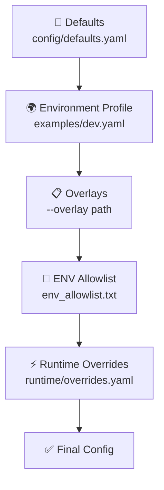

<div align="center">

# 🚀 ampy-config

**Typed Configuration & Secrets Façade for AmpyFin**

[](https://www.python.org/downloads/)
[](LICENSE)
[](https://github.com/AmpyFin/ampy-config/actions)
[](https://pypi.org/project/ampy-config/)
[](https://github.com/psf/black)

> 🎯 **Single, safe source of truth** for configuration and secrets across AmpyFin services  
> 🔗 Built to integrate with **ampy-bus** (control plane over NATS/JetStream) and **ampy-proto** (payload contracts)

[📖 Documentation](#-highlights-what-you-get) • [🚀 Quick Start](#-install-python--pypi) • [🔧 Usage](#-cli-usage) • [🤝 Contributing](#-contributing)

</div>

---

## 📋 Table of Contents

- [🎯 Why this exists](#-why-this-exists-the-problem)
- [✨ Highlights](#-highlights-what-you-get)
- [🚀 Install](#-install-python--pypi)
- [🎮 Control Plane](#-control-plane-natsjetstream)
- [📚 Layering Model](#-layering-model)
- [🔐 Secrets](#-secrets-indirection-caching-rotation-redaction)
- [💻 CLI Usage](#-cli-usage)
- [🐍 Python Integration](#-use-from-a-service-python-example)
- [📊 Schema Examples](#-schema-notes-metrics-example)
- [🌍 Environment Variables](#-environment-variables)
- [🔧 Troubleshooting](#-troubleshooting)
- [🛡️ Security](#-security-notes)
- [🤝 Contributing](#-contributing)

---

## 🎯 Why this exists (the problem)

Without a unified configuration layer, distributed trading systems tend to develop:

> ⚠️ **Common Issues:**
> - **ENV/YAML sprawl** → drift, surprises, outages
> - **Secret handling risks** → credentials in logs, brittle rotations, no redaction
> - **Non-reproducibility** → can't reconstruct exactly which parameters were live for a given trade/run
> - **Inconsistent runtime behavior** → some services reload, others require restarts

**ampy-config** provides a single, typed, validated, observable configuration view with clean secret indirection and a runtime control plane for safe updates.

---

## ✨ Highlights (what you get)

| Feature | Description |
|---------|-------------|
| 🔍 **Typed schema + validation** | JSON Schema + semantic cross-field checks |
| 📚 **Layering & precedence** | defaults → environment profile → overlays → ENV allowlist → runtime overrides |
| 🔐 **Secret indirection** | `secret://…`, `aws-sm://…`, `gcp-sm://…` with caching, rotation, and universal redaction |
| 🎮 **Control plane for updates** | `config_preview` → `config_apply` → `config_applied` events on NATS (JetStream) |
| 📊 **Auditability & observability** | provenance for each key; logs/metrics/traces (no secrets) |
| 🌐 **Language-agnostic** | produces plain YAML effective config for Python, Go, C++, etc. |

---

## 🚀 Install

### 🐍 Python / PyPI

```bash
pip install ampy-config
```

**Developer mode** (local repo):
```bash
pip install -e .
```

### 🐹 Go Client

**Library:**
```bash
go get github.com/AmpyFin/ampy-config/go/ampyconfig@v0.1.0
```

**Binaries:**
```bash
cd go/ampyconfig
make     # builds bin/ampyconfig-{ops,agent,listener}
```

> 📦 **Available on [pkg.go.dev](https://pkg.go.dev/github.com/AmpyFin/ampy-config/go/ampyconfig)**

### 🔧 Optional secret backends

| Backend | Install Command | Use Case |
|---------|----------------|----------|
| 🔐 **HashiCorp Vault** | `pip install hvac` | Enterprise secret management |
| ☁️ **AWS Secrets Manager** | `pip install boto3` | AWS-native secret storage |
| 🌐 **GCP Secret Manager** | `pip install google-cloud-secret-manager` | Google Cloud secret storage |

> 💡 **Tip:** You **do not** need to sign up for all of these. Choose one or more real backends for your deployment; the library gracefully falls back to a local JSON file in development.

---

## 🎮 Control plane (NATS/JetStream)

**Start a local NATS with JetStream:**
```bash
docker run --rm -d --name nats -p 4222:4222 nats:2.10 -js
export NATS_URL="nats://127.0.0.1:4222"
```

**Provision the stream and durable consumers** (once). Using the `nats` CLI:

```bash
# Stream to cover all control-plane subjects
nats --server "$NATS_URL" stream add ampy-control \
  --subjects "ampy.*.control.v1.*" \
  --retention limits --max-age 24h --storage file \
  --max-msgs 10000 --max-bytes 100MB --discard old --defaults

# Agent durables (pull + explicit ack)
nats --server "$NATS_URL" consumer add ampy-control ampy-config-agent-ampy-dev-control-v1-config-preview \
  --filter "ampy.dev.control.v1.config_preview" --pull --deliver all --ack explicit --defaults
nats --server "$NATS_URL" consumer add ampy-control ampy-config-agent-ampy-dev-control-v1-config-apply \
  --filter "ampy.dev.control.v1.config_apply" --pull --deliver all --ack explicit --defaults
nats --server "$NATS_URL" consumer add ampy-control ampy-config-agent-ampy-dev-control-v1-secret-rotated \
  --filter "ampy.dev.control.v1.secret_rotated" --pull --deliver all --ack explicit --defaults
```

**Verify setup:**
```bash
nats --server "$NATS_URL" stream ls
nats --server "$NATS_URL" consumer ls ampy-control
```

> ⚡ **Note:** The library can also auto-provision if permitted, but explicit creation is more predictable for local dev and CI.

---

## 📚 Layering model

Effective config = **merge** in this order (later overrides earlier):



| Layer | Description | Example |
|-------|-------------|---------|
| 1️⃣ **Defaults** | Checked-in base config | `config/defaults.yaml` |
| 2️⃣ **Environment profile** | Environment-specific settings | `examples/dev.yaml`, `examples/paper.yaml`, `examples/prod.yaml` |
| 3️⃣ **Overlays** | Region/cluster/service YAMLs | `--overlay path` (repeatable) |
| 4️⃣ **ENV allowlist** | Environment variable mapping | `env_allowlist.txt` maps allowed env keys |
| 5️⃣ **Runtime overrides** | Live configuration updates | `runtime/overrides.yaml` (written by agent) |

Each key tracks **provenance**: where it came from (defaults/profile/overlay/ENV/runtime).

### 📏 Units & types

| Type | Format | Examples |
|------|--------|----------|
| ⏱️ **Durations** | String format | `150ms`, `2s`, `5m`, `1h` |
| 📊 **Sizes** | String format | `128KiB`, `1MiB` |
| 🏷️ **Domains** | Explicit prefixes | `oms.*`, `ingest.*`, `broker.*`, `ml.*`, `warehouse.*`, `fx.*`, `metrics`, `logging`, `tracing`, `security.*`, `feature_flags.*` |

---

## 🔐 Secrets (indirection, caching, rotation, redaction)

Use **references**, not literal values:

| Backend | Format | Example |
|---------|--------|---------|
| 🔐 **Vault** | `secret://vault/<path>#<key>` | `secret://vault/tiingo#token` |
| ☁️ **AWS SM** | `aws-sm://<name>?versionStage=AWSCURRENT` | `aws-sm://ALPACA_SECRET?versionStage=AWSCURRENT` |
| 🌐 **GCP SM** | `gcp-sm://projects/<project>/secrets/<name>/versions/latest` | `gcp-sm://projects/demo/secrets/AMPY_API/versions/latest` |

**Local development fallback file** (`.secrets.local.json`):
```json
{
  "secret://vault/tiingo#token": "TIINGO_LOCAL_DEV_TOKEN",
  "aws-sm://ALPACA_SECRET?versionStage=AWSCURRENT": "ALPACA_LOCAL_DEV_SECRET",
  "gcp-sm://projects/demo/secrets/AMPY_API/versions/latest": "AMPY_LOCAL_DEV_API"
}
```

> 🔒 **Security:** Secrets are **always redacted** in logs/metrics/traces; rotation is signaled via `secret_rotated` events.

---

## 💻 CLI usage

All commands are available via `python -m ampy_config.cli …` (works without global entrypoints).

### 🎨 Render effective config

```bash
python -m ampy_config.cli render \
  --profile dev \
  --resolve-secrets redacted \
  --provenance
```

**Write it to a file:**
```bash
python -m ampy_config.cli render \
  --profile dev \
  --resolve-secrets redacted \
  --output /tmp/effective.yaml
```

**Resolve values** (dev only; requires `.secrets.local.json` or configured backends):
```bash
AMPY_CONFIG_LOCAL_SECRETS=.secrets.local.json \
python -m ampy_config.cli render --profile dev --resolve-secrets values
```

### ✅ Validate (schema + semantic checks)

```bash
python tools/validate.py examples/dev.yaml
# Or explicitly:
python tools/validate.py --schema schema/ampy-config.schema.json examples/*.yaml
```

### 🔧 Secrets utilities

```bash
# Resolve (redacted by default)
python -m ampy_config.cli secret get "aws-sm://ALPACA_SECRET?versionStage=AWSCURRENT"

# Print plain (development only)
python -m ampy_config.cli secret get --plain "secret://vault/tiingo#token"

# Invalidate cache entry
python -m ampy_config.cli secret rotate "gcp-sm://projects/demo/secrets/AMPY_API/versions/latest"
```

### 🤖 Run the agent

```bash
export NATS_URL="nats://127.0.0.1:4222"
export AMPY_CONFIG_SERVICE="ampy-config-agent"

python -m ampy_config.cli agent --profile dev
```

**It subscribes to:**
```
ampy.dev.control.v1.config_preview
ampy.dev.control.v1.config_apply
ampy.dev.control.v1.secret_rotated
```

### ⚡ Ops: preview & apply a runtime override

**Create an overlay:**
```bash
cat >/tmp/overlay.yaml <<'YAML'
oms:
  risk:
    max_order_notional_usd: 77777
YAML
```

**Preview** (validate only):
```bash
python -m ampy_config.cli ops preview \
  --profile dev \
  --overlay-file /tmp/overlay.yaml \
  --expires-at "2025-12-31T23:59:59Z" \
  --reason "intraday risk tightening" \
  --dry-run
```

**Apply** (persist) and **wait** until it's effective in the resolved view:
```bash
python -m ampy_config.cli ops apply \
  --profile dev \
  --overlay-file /tmp/overlay.yaml \
  --wait-applied --timeout 20
```

**Then verify:**
```bash
python -m ampy_config.cli render \
  --profile dev \
  --runtime runtime/overrides.yaml \
  --resolve-secrets redacted \
  --provenance
```

---

## 🐍 Use from a service (Python example)

```python
# examples/service_skel.py
import asyncio, os
from ampy_config.layering import build_effective_config
from ampy_config.bus.ampy_bus import AmpyBus
from ampy_config.control.events import subjects

async def main():
    cfg, _ = build_effective_config(
        schema_path="schema/ampy-config.schema.json",
        defaults_path="config/defaults.yaml",
        profile_yaml="examples/dev.yaml",
        overlays=[],
        service_overrides=[],
        env_allowlist_path="env_allowlist.txt",
        env_file=None,
        runtime_overrides_path="runtime/overrides.yaml",
    )
    print("[service] max_order_notional_usd =", cfg["oms"]["risk"]["max_order_notional_usd"])

    bus = AmpyBus(os.environ.get("NATS_URL"))
    await bus.connect()
    subs = subjects(cfg["bus"]["topic_prefix"])

    async def on_apply(subject, data):
        # Re-build after apply; in real code, you’d update state atomically & validate
        new_cfg, _ = build_effective_config(
            "schema/ampy-config.schema.json",
            "config/defaults.yaml",
            "examples/dev.yaml",
            [], [], "env_allowlist.txt", None, "runtime/overrides.yaml"
        )
        print("[service] updated max_order_notional_usd =", new_cfg["oms"]["risk"]["max_order_notional_usd"])

    await bus.subscribe_json(subs["apply"], on_apply)
    while True:
        await asyncio.sleep(1)

if __name__ == "__main__":
    os.environ.setdefault("AMPY_CONFIG_SERVICE", "ampy-service-demo")
    os.environ.setdefault("NATS_URL", "nats://127.0.0.1:4222")
    asyncio.run(main())
```

### 🐹 Go Client Usage

**Start the agent:**
```bash
./bin/ampyconfig-agent \
  -nats "$NATS_URL" \
  -topic ampy/dev \
  -runtime runtime/overrides.yaml \
  -service ampy-config-agent \
  -log info
```

**Apply configuration changes:**
```bash
cat >/tmp/overlay.yaml <<'YAML'
oms:
  risk:
    max_order_notional_usd: 123456
YAML

./bin/ampyconfig-ops \
  -nats "$NATS_URL" \
  -topic ampy/dev \
  -overlay-file /tmp/overlay.yaml \
  -wait-applied -timeout 20 \
  -runtime runtime/overrides.yaml
```

**Available binaries:**
- `ampyconfig-ops` — publish `config_preview`, `config_apply`, `secret_rotated`
- `ampyconfig-agent` — consume control events and persist `runtime/overrides.yaml`
- `ampyconfig-listener` — example service listener that reacts to changes

> 📝 **Status:** v0 thin client — Python `ampy-config` remains the source of truth for schema validation and layering. This Go module focuses on control-plane parity and operational UX.

### 🌐 Go / C++ services

- Parse the **effective YAML** (rendered by ops at boot or on a schedule)
- Subscribe to the same control-plane subjects and re-load your resolved config (or just read `runtime/overrides.yaml`) when a `config_apply` is observed
- Keep reloads **transactional** for safety-critical domains

---

## 📊 Schema notes (metrics example)

The schema allows **either** OTLP (with endpoint) **or** Prometheus (with port):

```json
"metrics": {
  "type": "object",
  "additionalProperties": false,
  "properties": {
    "exporter": { "type": "string", "enum": ["otlp", "prom"] },
    "endpoint": { "type": "string" },
    "sampling_ratio": { "type": "number", "minimum": 0, "maximum": 1 },
    "port": { "type": "integer", "minimum": 1, "maximum": 65535 }
  },
  "required": ["exporter"]
}
```

**Examples:**

```yaml
# OTLP
metrics:
  exporter: otlp
  endpoint: https://otel.dev.ampyfin.com:4317
  sampling_ratio: 0.25

# Prometheus
metrics:
  exporter: prom
  port: 9464
```

---

## 🌍 Environment variables

| Variable | Description | Example |
|----------|-------------|---------|
| `NATS_URL` | NATS server URL | `nats://127.0.0.1:4222` |
| `AMPY_CONFIG_SERVICE` | Logical service name (used to derive durable names) | `ampy-config-agent` |
| `AMPY_CONFIG_RUNTIME_OVERRIDES` | Path for persisted runtime overrides | `runtime/overrides.yaml` |
| `AMPY_CONFIG_LOCAL_SECRETS` | Path to local dev secrets JSON | `.secrets.local.json` |
| `AMPY_CONFIG_SECRET_TTL_MS` | Secrets cache TTL in milliseconds | `120000` |
| `AMPY_CONFIG_JS_FALLBACK` | Force direct NATS subscription fallback | `1` (skip JetStream) |

**Secret Backend Variables:**
- **🔐 Vault**: `VAULT_ADDR`, `VAULT_TOKEN` (if using `secret://`)
- **☁️ AWS**: `AWS_DEFAULT_REGION` + credentials (if using `aws-sm://`)
- **🌐 GCP**: `GOOGLE_APPLICATION_CREDENTIALS` (if using `gcp-sm://`)

---

## 🔧 Troubleshooting

| Issue | Cause | Solution |
|-------|-------|----------|
| **🤖 Agent only shows one subscription** | Blocked while initializing a secret backend (e.g., boto3 waiting for metadata/creds) | Unset or configure that backend properly, or run with only local secrets in dev |
| **⏰ No messages consumed / timeouts** | `NATS_URL` points to wrong port, JetStream disabled, or missing stream/consumers | Check `NATS_URL`, enable JetStream, verify `ampy-control` stream & consumers exist |
| **❌ Apply says OK but value didn't change** | Agent didn't write `runtime/overrides.yaml` or service doesn't reload config | Verify file path via `AMPY_CONFIG_RUNTIME_OVERRIDES` and service reloads on `config_apply` |
| **⚠️ Schema validation passes but semantic check fails** | Semantic checks run after schema validation | Fix the offending values called out in the error |

---

## 🛡️ Security notes

- 🔒 **Secrets are never logged**; redaction is enforced throughout the library
- 🚨 **Prefer fail-shut** for safety-critical domains (OMS risk, broker creds) and **fail-open** for low-risk knobs (metric sampling)
- 🔐 **Ensure access to secret backends** is locked down with least privilege

---

## 🤝 Contributing

PRs welcome! Please include tests for new config keys, validation rules, and control-plane flows.

**Before submitting:**
```bash
pytest -q
python tools/validate.py examples/*.yaml
```

---

## 📄 License

Apache-2.0 (proposed). See `LICENSE` for details.
