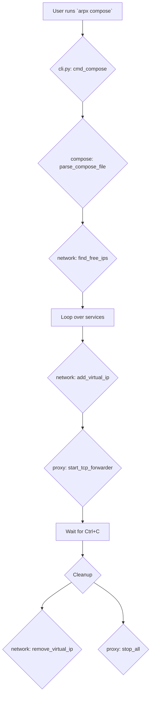

# Architecture Overview

ARPx is designed as a modular command-line tool to simplify local network service management. Its architecture revolves around a central CLI that dispatches tasks to specialized managers for networking, web serving, and certificate handling.

## Core Components

- **`arpx.cli`**: The entry point of the application. It uses `argparse` to define commands (`up`, `compose`, `cert`, `dns`) and dispatches to the corresponding functions.
- **`arpx.network`**: Handles all low-level network operations, such as finding free IPs, creating virtual IP aliases, and announcing them on the LAN using ARP.
- **`arpx.server`**: Manages the lifecycle of lightweight HTTP/HTTPS web servers bound to the virtual IPs.
- **`arpx.certs`**: A utility module for generating and managing TLS certificates (self-signed, mkcert, Let's Encrypt).
- **`arpx.bridge`**: Implements the logic for bridging Docker/Podman Compose services to the LAN.
- **`arpx.utils`**: Provides helper functions, such as dependency checking.

## High-Level Flow (`arpx up`)

The following diagram illustrates the typical flow when a user runs the `arpx up` command.

```mermaid
graph TD
    A[User runs `arpx up`] --> B{cli.py: cmd_up};
    B --> C{utils: check_dependencies};
    C -- Dependencies OK --> D{network: check_root};
    D --> E{network: get_network_details};
    E --> F{network: find_free_ips};
    F --> G[Loop over IPs];
    G --> H{network: add_virtual_ip};
    H --> I{certs: generate_cert (optional)};
    I --> J{server: start_lan_server};
    J --> K[Wait for Ctrl+C];
    K --> L{Cleanup};
    L --> M{network: remove_virtual_ip};
    L --> N{server: stop_all};
```

## Docker Compose Bridge Flow (`arpx compose`)

This diagram shows the flow for bridging containerized services.



## On-Disk Structure

ARPx creates a `.arpx` directory in the current working directory to store state, primarily TLS certificates.

```
.arpx/
└── certs/
    ├── self-signed/
    │   ├── cert.pem
    │   └── key.pem
    └── mkcert/
        ├── cert.pem
        └── key.pem
```
