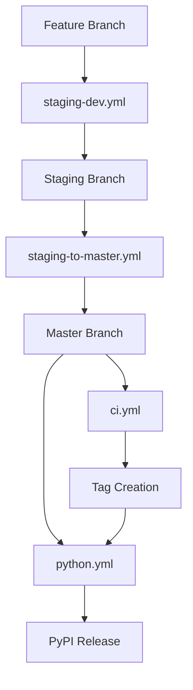

# GitHub Actions Workflows 🤖

This directory contains the CI/CD workflows for DataProfiler. Each workflow has a specific purpose to avoid redundancy and optimize CI resources.

## 📋 Workflow Overview

| Workflow | Trigger | Purpose | Duration |
|----------|---------|---------|----------|
| `ci.yml` | Push/PR to `master` | Master branch protection | ~5 min |
| `python.yml` | Push to `master` + tags | Python package release | ~15 min |
| `staging-dev.yml` | Push/PR to `staging` | Development workflow | ~20 min |
| `staging-to-master.yml` | PR `staging`→`master` | Production release gate | ~25 min |

## 🎯 Workflow Responsibilities

### `ci.yml` - Master Branch Protection
**When**: Direct pushes to master (admin only) or emergency fixes

**Jobs**:
- ✅ **test**: Unit tests, formatting, linting (Ubuntu only)
- ✅ **build**: Basic release build verification (Ubuntu only)

**Why lightweight**: Master should only receive PRs from staging that already passed comprehensive tests.

### `python.yml` - Python Package Release
**When**: Master branch changes or version tags

**Jobs**:
- 🐍 **Cross-platform wheel building**: Linux, Windows, macOS
- 📦 **PyPI publishing**: Automated release to PyPI on tags
- 🦀 **Crates.io publishing**: Rust crate release
- 🧪 **Python bindings test**: Verify Python integration works

**Purpose**: Handle Python packaging and distribution, which requires different tooling than Rust CI.

### `staging-dev.yml` - Development Workflow
**When**: Any push or PR to staging branch

**Jobs**:
- ⚡ **quick-check**: Fast feedback loop (<2 min)
  - Code formatting, linting, unwrap detection
- 🧪 **test-suite**: Comprehensive testing (Ubuntu/Windows/macOS)
  - Multiple Rust versions (stable, beta, nightly)
  - All feature combinations
- 🔍 **performance-check**: Memory and performance analysis
  - AddressSanitizer, Valgrind, basic benchmarks
- 🛠️ **dev-environment**: Development tools validation
- 🔒 **security-audit**: Dependency vulnerabilities
- 🔗 **integration-check**: End-to-end CLI testing

**Philosophy**: Catch issues early in development with comprehensive testing.

### `staging-to-master.yml` - Production Release Gate
**When**: PR from staging to master (production release)

**Jobs**:
- ✅ **validate-pr**: Enforce staging→master workflow
- 🏗️ **production-tests**: Platform-specific testing (Windows/macOS only)
- 🔒 **security-production-audit**: Enhanced security scanning
- 🚀 **performance-validation**: Production performance benchmarks
- 📚 **documentation-check**: Version consistency, changelog validation
- ✅ **production-ready**: Final approval gate

**Why different from staging-dev**: Production releases need stricter validation, performance benchmarks, and documentation checks.

## 🔄 Workflow Interactions



## ⚖️ Resource Optimization

### Avoiding Redundancy
- **Linux tests**: Comprehensive in `staging-dev.yml`, basic in `ci.yml`, skip in `staging-to-master.yml`
- **Cross-platform**: Only in `staging-dev.yml` (dev) and `staging-to-master.yml` (production)
- **Python testing**: Only in `python.yml` (release-focused)
- **Security scans**: Basic in `staging-dev.yml`, comprehensive in `staging-to-master.yml`

### Cache Strategy
```yaml
# Each workflow uses distinct cache keys
staging-dev: "staging-${{ matrix.os }}-${{ matrix.rust }}-${{ hashFiles }}"
staging-prod: "prod-${{ matrix.os }}-${{ hashFiles }}"
master-ci: "master-ci-${{ hashFiles }}"
python: "python-${{ matrix.target }}-${{ hashFiles }}"
```

### Parallel vs Sequential
- **staging-dev.yml**: Maximum parallelism for fast feedback
- **staging-to-master.yml**: Some sequential jobs for production validation
- **python.yml**: Parallel wheel building, sequential testing
- **ci.yml**: Minimal parallel jobs for basic checks

## 🚨 Failure Handling

### Development (staging-dev.yml)
- **fail-fast: false** - See all failures for comprehensive debugging
- **continue-on-error: true** - For experimental features (nightly Rust)
- **Non-blocking performance checks** - Don't block development for minor perf issues

### Production (staging-to-master.yml)
- **fail-fast: true** - Stop immediately on any failure
- **Strict error handling** - All checks must pass
- **Performance regressions** - Block if >10% slower

## 📊 Monitoring & Metrics

### Success Rate Targets
- `ci.yml`: >99% (should rarely fail)
- `python.yml`: >95% (complex multi-platform builds)
- `staging-dev.yml`: >90% (catches development issues)
- `staging-to-master.yml`: >95% (production readiness)

### Performance Targets
- `ci.yml`: <5 minutes (fast feedback)
- `staging-dev.yml`: <20 minutes (comprehensive but reasonable)
- `staging-to-master.yml`: <25 minutes (thorough production validation)
- `python.yml`: <15 minutes (efficient packaging)

## 🔧 Troubleshooting

### Common Issues

**Q: Why did staging-dev.yml pass but staging-to-master.yml fail?**
- staging-to-master has stricter performance thresholds
- Enhanced security scanning may catch new issues
- Documentation/version checks are production-specific

**Q: Python workflow fails on tag creation**
- Check `CRATES_TOKEN` secret is configured
- Ensure version in Cargo.toml matches git tag
- Verify PyPI trusted publishing is set up

**Q: Too many parallel jobs consuming CI minutes**
- staging-dev.yml runs on every push - consider squashing commits
- Use draft PRs to avoid triggering workflows during development
- Manual trigger (`workflow_dispatch`) available for testing

### Debugging Failed Workflows

1. **Check job dependencies**: Later jobs may fail due to earlier job failures
2. **Review cache keys**: Ensure caches aren't corrupted
3. **Platform-specific issues**: Check matrix strategy for OS differences
4. **Resource limits**: Some jobs may fail due to memory/time constraints

## 🔮 Future Improvements

### Planned Enhancements
- **Benchmark tracking**: Historical performance trend monitoring
- **Coverage reporting**: Automated test coverage analysis
- **Dependency updates**: Automated Dependabot integration
- **Security scanning**: Advanced SAST/DAST integration

### Workflow Evolution
- Consider splitting large workflows into smaller, focused ones
- Add workflow reusability with composite actions
- Implement smart testing (only test changed components)
- Progressive deployment strategies for releases

---

## 📚 Quick Reference

```bash
# Trigger staging development workflow
git push origin staging

# Trigger production release workflow
gh pr create --base master --head staging

# Manual workflow trigger (if enabled)
gh workflow run staging-dev.yml

# Check workflow status
gh run list --workflow=staging-dev.yml --limit=5
```

For detailed development workflow, see [DEVELOPMENT.md](../DEVELOPMENT.md).
