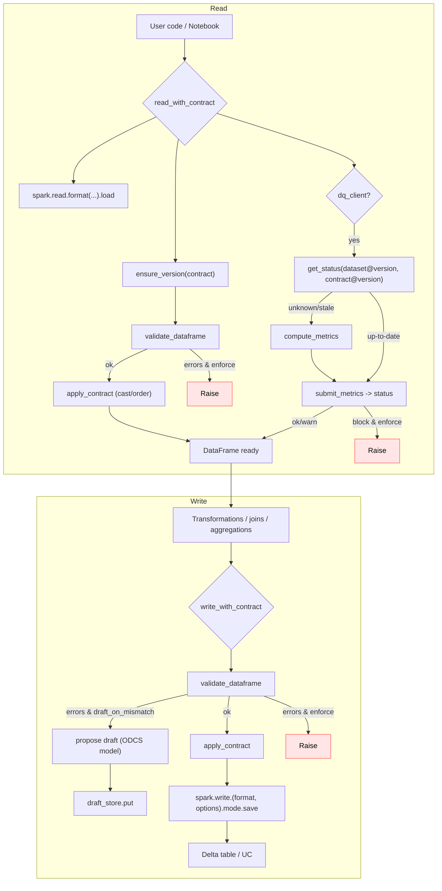

# dc43 — Data Contracts For Free!

## Overview

- Purpose: Generate, store, evolve and apply data contracts in Databricks pipelines, using standard Spark IO and Delta Live Tables (DLT) where possible.
- Contract style: Bitol/ODCS v3.0.2 JSON. Maps to Spark schemas and DLT expectations.
- Core features:
  - SemVer helpers for version checks
  - Validation and auto-casting for Spark DataFrames
  - IO helpers for read/write with contract enforcement
  - Storage backends: filesystem (DBFS/UC volumes) and Delta table
- DLT helpers: build expectations from contracts
  - DQ orchestration: pluggable client interface; stub implementation provided
- Bitol/ODCS support: relies on the official `open-data-contract-standard` models (v3.0.2). No internal stubs.

## Install

- As a source lib (Databricks Repos, workspace files) or package. No hard dependencies by default; bring your own `pyspark` on Databricks clusters.

## Quickstart

1) Define a contract (ODCS typed model)

```python
from open_data_contract_standard.model import (
    OpenDataContractStandard, SchemaObject, SchemaProperty, Description
)

contract = OpenDataContractStandard(
    version="0.1.0",
    kind="DataContract",
    apiVersion="3.0.2",
    id="sales.orders",
    name="Orders",
    description=Description(usage="Orders facts"),
    schema_=[
        SchemaObject(
            name="orders",
            properties=[
                SchemaProperty(name="order_id", physicalType="bigint", required=True, unique=True),
                SchemaProperty(name="customer_id", physicalType="bigint", required=True),
                SchemaProperty(name="order_ts", physicalType="timestamp", required=True),
                SchemaProperty(name="amount", physicalType="double", required=True),
                SchemaProperty(
                    name="currency", physicalType="string", required=True,
                    logicalTypeOptions={"enum": ["EUR", "USD"]}
                ),
            ],
        )
    ],
)
```

2) Validate and write with Spark

```python
from dc43.integration.spark_io import write_with_contract

write_with_contract(
    df=orders_df,
    contract=contract,
    path="/mnt/gold/sales/orders",
    format=contract.servers[0].format,
    mode="append",
    enforce=True,
    auto_cast=True,
)
```

3) DLT usage (inside a pipeline notebook)

```python
import dlt
from dc43.integration.dlt_helpers import expectations_from_contract

@dlt.table(name="orders")
def orders():
    df = spark.read.stream.table("bronze.sales_orders_raw")
    exps = expectations_from_contract(contract)
    dlt.expect_all(exps)
    return df.select("order_id", "customer_id", "order_ts", "amount", "currency")
```

4) Store and resolve contracts

```python
from dc43.storage.fs import FSContractStore

store = FSContractStore(base_path="/mnt/contracts")
store.put(contract)
latest = store.latest("sales.orders")
```

5) DQ/DO orchestration on read

```python
from dc43.integration.spark_io import read_with_contract
from dc43.dq.stub import StubDQClient

dq = StubDQClient(base_path="/mnt/dq_state")
df, status = read_with_contract(
    spark,
    format="delta",
    path="/mnt/gold/sales/orders",
    contract=contract,
    expected_contract_version="==0.1.0",
    dq_client=dq,
    return_status=True,
)
print(status.status, status.reason)
```

6) Draft contract proposal on mismatch (write)

```python
from dc43.integration.spark_io import write_with_contract
from dc43.storage.fs import FSContractStore

store = FSContractStore("/mnt/contracts-drafts")
vr, draft = write_with_contract(
    df=orders_df,
    contract=contract,
    path="/mnt/gold/sales/orders",
    format=contract.servers[0].format,
    mode="append",
    enforce=False,                 # continue writing
    draft_on_mismatch=True,        # create a draft when schema diverges
    draft_store=store,             # persist the draft
    return_draft=True,
)
if draft:
    print("Draft created:", draft.id, draft.version)  # send to workflow
```

## Demo application

A Vue-powered FastAPI application in ``dc43.demo_app`` offers a visual way to
explore contracts, datasets and data quality results. Install the optional
dependencies and launch the app with:

```bash
pip install ".[demo]"
dc43-demo
```

Visit ``http://localhost:8000`` to:

- Browse contracts and their versions with draft/active status.
- Inspect dataset versions, their linked contract, validation status and
  detailed DQ metrics derived from contract rules.
- Highlight datasets using draft contracts and trigger validation to promote
  them.

An additional Reveal.js presentation is available at
``http://localhost:8000/static/presentation.html`` to walk through the
contract lifecycle and automation steps.

The application also exposes an example Spark pipeline in
``dc43.demo_app.pipeline`` used when registering new dataset versions.

## Spark Flow (Mermaid)



Notes

- The library uses the official ODCS package and enforces `$schema` version `3.0.2` by default (configurable via `DC43_ODCS_REQUIRED`).
- Validation focuses on practical checks: presence, types, nullability and common constraints (enum, regex, min/max, unique best-effort).
- DLT helpers translate constraints into `expect` expressions when feasible.
 - DQ orchestration: the IO wrapper checks schema vs contract and consults the DQ client. If dataset version is newer than DQ’s known version, it computes the required metrics and submits them, then enforces the resulting status if requested.

Local Dev

- Install dependencies locally (match your Databricks runtime where possible):

```bash
pip install open-data-contract-standard==3.0.2 pyspark
```

- dc43 enforces `apiVersion` via `DC43_ODCS_REQUIRED` (default `3.0.2`).

# Tests

- Install test extras and run

```bash
pip install -e ".[test]"
pytest
```

# Publishing

- Push a tag `v*` on a commit in `main`.
- The workflow `.github/workflows/release.yml` runs tests, builds the package, waits for manual approval via environment `release`, publishes to PyPI, and creates a GitHub release with autogenerated notes.
- Set `PYPI_TOKEN` secret and configure the `release` environment with required reviewers.

# License

Apache 2
