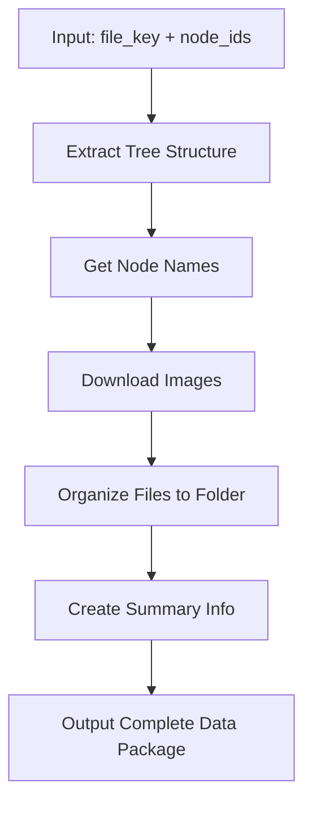

# Figma MCP Server

> **English**: [README.en.md](README.en.md) | **中文**: [README.zh-CN.md](README.zh-CN.md)

[](README.en.md)
[](README.zh-CN.md)

## 🌍 Language Selection / 语言选择

### 🇺🇸 English
For English documentation, please visit: **[README.en.md](README.en.md)**

### 🇨🇳 中文
对于中文文档，请访问：**[README.zh-CN.md](README.zh-CN.md)**

---

## 🚀 Quick Overview / 快速概览

A specialized MCP server designed for **developers** to systematically extract and organize Figma design files at the **page level**.

一个专门为**程序员**设计的MCP服务器，用于系统性地按**页面级别**提取和组织Figma设计文件。

## 🎯 **Main Feature: Complete Node Data Extraction** / **主要功能：完整节点数据提取**

### get_complete_node_data ⭐ **Primary Tool** / **主要工具**
Get complete node data (tree structure + images) and organize into folders

获取完整的节点数据（树结构 + 图片）并组织到文件夹中

**Workflow / 工作流程:**


- **Parameters / 参数**:
  - `file_key`: Figma file unique identifier / Figma 文件唯一标识符
  - `node_ids`: Node IDs, comma-separated / 节点 ID，逗号分隔
  - `image_format`: Image format (default: png) / 图片格式（默认：png）
  - `image_scale`: Image scale factor (default: 1.0) / 图片缩放因子（默认：1.0）
  - `tree_depth`: Tree depth (default: 4) / 树深度（默认：4）

**Output Structure / 输出结构:**
```
your_node_name_your_node_id_here/
├── nodesinfo.json    # Complete tree structure data (core) / 完整树结构数据（核心）
└── your_node_id_here.png  # Downloaded image file / 下载的图片文件
```

### 🧠 **Why This Structure for AI Understanding** / **为什么这种结构适合 AI 理解**

This output structure is specifically designed to help AI understand design comprehensively:

这种输出结构专门设计用于帮助 AI 全面理解设计：

#### **Multi-modal Information Fusion** / **多模态信息融合**
- **Structured Data** (`nodesinfo.json`): Contains precise positioning, styling, constraints, and hierarchical relationships
- **结构化数据** (`nodesinfo.json`): 包含精确的定位、样式、约束和层次关系
- **Visual Data** (`.png`): Provides actual rendered appearance for visual verification
- **视觉数据** (`.png`): 提供实际渲染外观用于视觉验证
- **Contextual Information**: File naming and organization provide design context
- **上下文信息**: 文件命名和组织提供设计上下文

#### **AI-Friendly Design** / **AI 友好设计**
- **Complete Context**: AI can understand both the logical structure and visual appearance
- **完整上下文**: AI 可以理解逻辑结构和视觉外观
- **Relationship Clarity**: Hierarchical relationships and constraints are explicitly defined
- **关系清晰**: 层次关系和约束被明确定义
- **Parseable Format**: JSON structure allows AI to easily extract and process information
- **可解析格式**: JSON 结构允许 AI 轻松提取和处理信息

#### **Real-world AI Use Cases** / **实际 AI 使用场景**
- **Design Analysis**: "This page has 12 frames, 18 text elements, uses white background..."
- **设计分析**: "此页面有 12 个框架，18 个文本元素，使用白色背景..."
- **Code Generation**: "Based on layout constraints, generate React component with 375px width..."
- **代码生成**: "基于布局约束，生成宽度为 375px 的 React 组件..."
- **Design Suggestions**: "45 nodes detected, consider componentization to reduce complexity..."
- **设计建议**: "检测到 45 个节点，考虑组件化以减少复杂性..."
- **Responsive Adaptation**: "Header uses SCALE constraint, needs mobile layout adjustment..."
- **响应式适配**: "头部使用 SCALE 约束，需要移动端布局调整..."

#### **Optimized Structure** / **优化结构**
- **Essential Only**: Contains only the most important files for AI understanding
- **仅包含必要**: 仅包含 AI 理解所需的最重要文件
- **Efficient Data**: Compact output structure while maintaining all necessary information
- **高效数据**: 紧凑的输出结构，同时保持所有必要信息
- **Cost Effective**: Minimizes API token usage while maximizing AI understanding
- **成本效益**: 最小化 API 令牌使用，同时最大化 AI 理解

### ✨ Key Features / 主要功能

- 📋 **Node Listing** (`list_nodes_depth2`) / **节点列表**
- 🔍 **Tree Structure Extraction** (`extract_figma_tree`) / **树结构提取**
- 🖼️ **Image Download** (`download_figma_images`) / **图片下载**
- 🔧 **Complete Data Export** (`get_complete_node_data`) / **完整数据导出**
- 🖼️ **Frame Extraction** (`extract_frame_nodes`) / **框架提取**
- 🌐 **Cross-platform** / **跨平台支持**
- 💡 **AI-Optimized Structure** / **AI优化结构**

### 🛠️ Quick Installation / 快速安装

#### Option 1: Install from PyPI (Recommended) / 从 PyPI 安装（推荐）
```bash
pip install figma-mcp-tools
```

#### Option 2: Install from source / 从源码安装
```bash
# Clone the repository
git clone https://github.com/DRX-1877/figma-mcp-server.git
cd figma-mcp-server

# Run installation script (automatically configures environment)
./install.sh  # macOS/Linux
# or
install.bat   # Windows
```

**That's it!** The command will be available globally after installation.

**就这么简单！** 安装后命令即可全局使用。

### 🌍 Global Command Availability / 全局命令可用性

After installation, the `figma-mcp-tools` command will be available **globally** from any directory:

安装完成后，`figma-mcp-tools` 命令将在**任何目录**中全局可用：

#### macOS/Linux
```bash
# Use from any directory
figma-mcp-tools --help

# If command is not available, run the fix script
./fix-command.sh

# Or manually reload shell configuration
source ~/.zshrc  # for zsh
# or
source ~/.bashrc # for bash
```

#### Windows
```cmd
# Use from any directory
figma-mcp-tools --help

# If command is not available, run the fix script
fix-command.bat

# Or reopen command prompt to reload environment variables
```

### 🔧 Automatic Environment Configuration / 自动环境配置

The installation script automatically configures your environment:

安装脚本会自动配置您的环境：

- **PATH Configuration**: Adds virtual environment and local bin directories to PATH
- **PATH 配置**: 自动将虚拟环境和本地 bin 目录添加到 PATH
- **Global Symlinks**: Creates symbolic links in system directories
- **全局符号链接**: 在系统目录中创建符号链接
- **Shell Integration**: Updates shell configuration files (.zshrc, .bashrc)
- **Shell 集成**: 更新 shell 配置文件 (.zshrc, .bashrc)

**No manual configuration required!** 🎉

**无需手动配置！** 🎉

### 🔍 Troubleshooting / 故障排除

If the command is not available after installation:

如果安装后命令不可用：

#### macOS/Linux
```bash
# Option 1: Run the fix script
./fix-command.sh

# Option 2: Manually reload shell configuration
source ~/.zshrc  # for zsh
# or
source ~/.bashrc # for bash

# Option 3: Open a new terminal window
```

#### Windows
```cmd
# Option 1: Run the fix script
fix-command.bat

# Option 2: Reopen command prompt

# Option 3: Restart computer
```

### 📚 Documentation / 文档

- **[Usage Guide / 使用指南](USAGE.md)** | **[English](USAGE_EN.md)**
- **[Project Summary / 项目总结](PROJECT_SUMMARY.md)** | **[English](PROJECT_SUMMARY_EN.md)**

---

## 📖 Choose Your Language / 选择您的语言

### 🇺🇸 [English Documentation](README.en.md)
Complete English documentation with detailed installation instructions, usage examples, and API reference.

### 🇨🇳 [中文文档](README.zh-CN.md)
完整的中文文档，包含详细的安装说明、使用示例和API参考。
