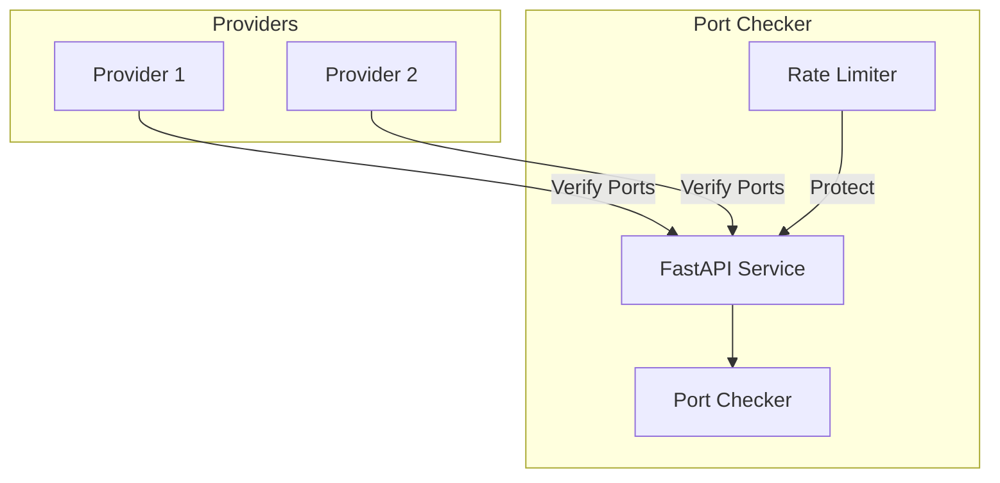
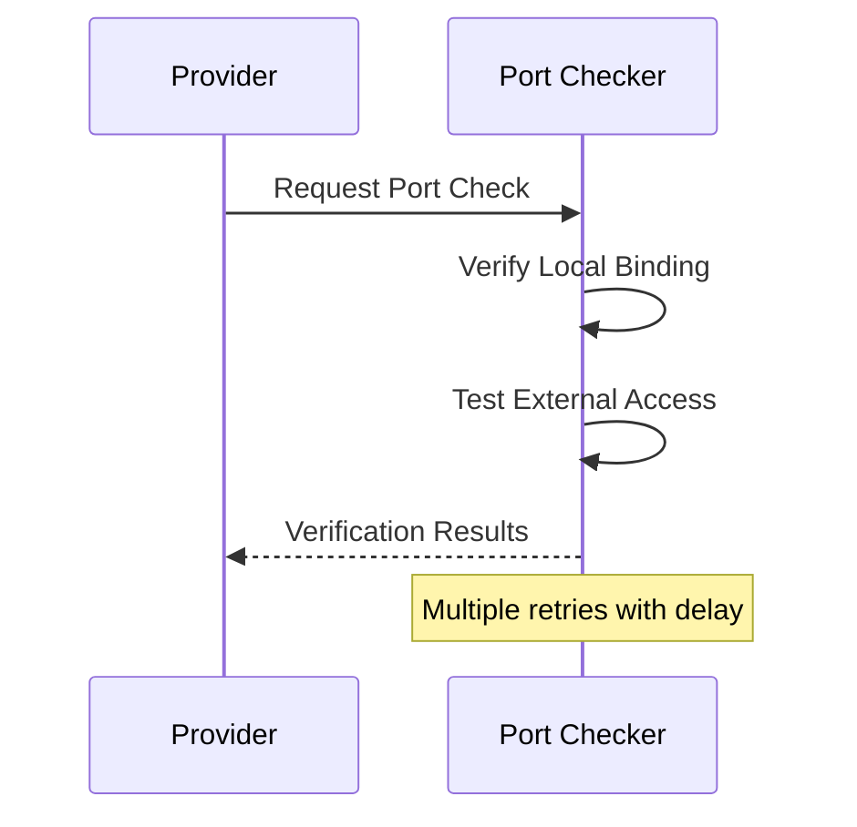

# VM on Golem Port Checker Server

The Port Checker Server provides a critical network verification service for the Golem Network, ensuring providers have proper port accessibility before joining the network. It verifies both local and external port accessibility through a simple REST API.

## System Architecture



## How It Works

### Port Verification Flow



The port checker service verifies port accessibility through:
1. TCP connection attempts to specified ports
2. Retry mechanism with configurable attempts
3. Detailed error reporting
4. Concurrent port checking

## Installation

```bash
# Clone the repository
git clone https://github.com/golem/vm-on-golem.git
cd vm-on-golem/port-checker-server

# Install dependencies
poetry install
```

## Configuration

The server can be configured through environment variables:

```bash
# Server Settings
PORT_CHECKER_HOST="0.0.0.0"
PORT_CHECKER_PORT=9000
PORT_CHECKER_DEBUG=false

# Port Check Settings
PORT_CHECK_RETRIES=3
PORT_CHECK_RETRY_DELAY=1.0
PORT_CHECK_TIMEOUT=5.0
```

## API Reference

### Check Ports

```bash
POST /check-ports
```

Request:
```json
{
    "provider_ip": "192.168.1.100",
    "ports": [7466, 50800, 50801]
}
```

Response:
```json
{
    "success": true,
    "results": {
        "7466": {
            "accessible": true,
            "error": null
        },
        "50800": {
            "accessible": true,
            "error": null
        },
        "50801": {
            "accessible": false,
            "error": "Connection refused"
        }
    },
    "message": "Successfully verified 2 out of 3 ports"
}
```

### Health Check

```bash
GET /health
```

Response:
```json
{
    "status": "ok"
}
```

## Technical Details

### Port Verification Process

1. **Request Validation**
   - Valid IP address format
   - Port numbers within range (1-65535)
   - Maximum ports per request

2. **Verification Steps**
   - TCP connection attempt
   - Configurable timeout
   - Multiple retry attempts
   - Delay between retries

3. **Response Details**
   - Per-port accessibility status
   - Detailed error messages
   - Overall success indicator
   - Summary message

### Error Handling

The API uses standardized error responses:

```json
{
    "detail": {
        "code": "ERROR_CODE",
        "message": "Human readable message"
    }
}
```

Common error codes:
- `INVALID_IP`: Invalid IP address format
- `INVALID_PORT`: Port number out of range
- `CHECK_FAILED`: Port check operation failed

## Running the Server

### Manual Start

```bash
# Start the server
poetry run python run.py

# The server will be available at:
# - API: http://localhost:9000
# - Health Check: http://localhost:9000/health
# - OpenAPI Docs: http://localhost:9000/docs
```

### Running as a Systemd Service

The port checker can run as a systemd service for automatic startup and restart:

1. Install the service file:
```bash
sudo cp golem-port-checker.service /etc/systemd/system/
sudo systemctl daemon-reload
```

2. (Optional) Configure environment variables:
```bash
# Create environment file if you need custom settings
sudo mkdir -p /etc/golem
sudo nano /etc/golem/port-checker.env

# Example environment variables:
PORT_CHECKER_HOST=0.0.0.0
PORT_CHECKER_PORT=9000
PORT_CHECKER_DEBUG=false
```

3. Enable and start the service:
```bash
sudo systemctl enable golem-port-checker
sudo systemctl start golem-port-checker
```

4. Check service status:
```bash
sudo systemctl status golem-port-checker
```

5. View service logs:
```bash
# View all logs
sudo journalctl -u golem-port-checker

# Follow new logs
sudo journalctl -u golem-port-checker -f
```

The service is configured to:
- Start automatically on system boot
- Restart automatically if it crashes
- Log output to systemd journal

## Contributing

1. Fork the repository
2. Create a feature branch
3. Make your changes
4. Run the tests
5. Submit a pull request
