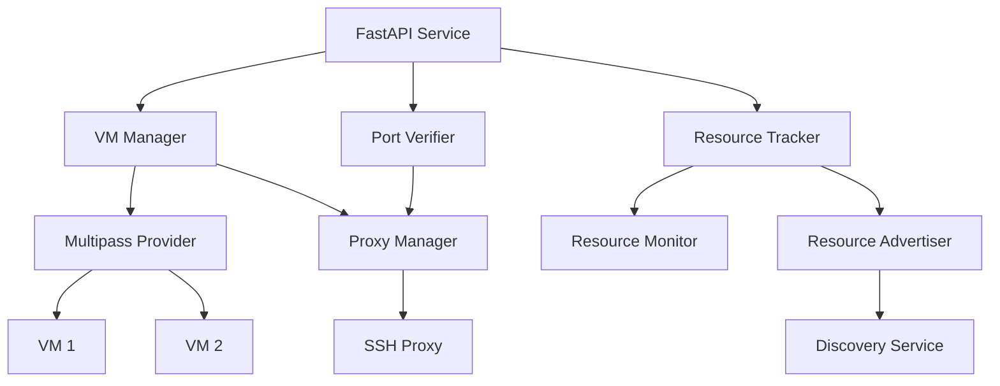
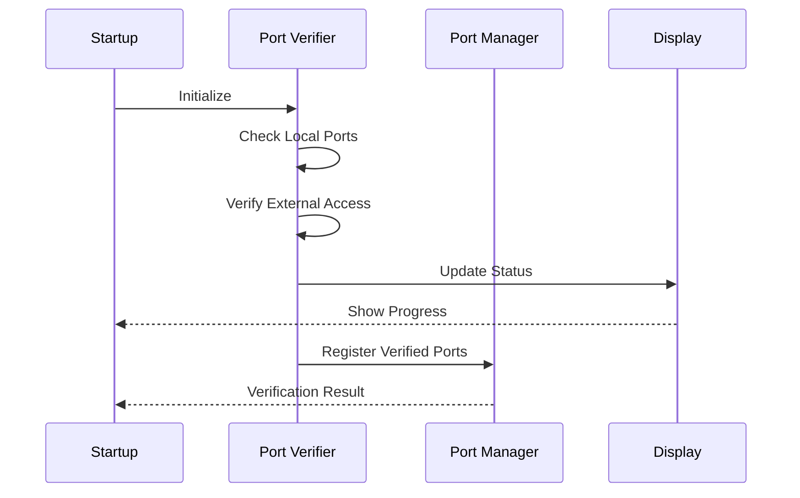
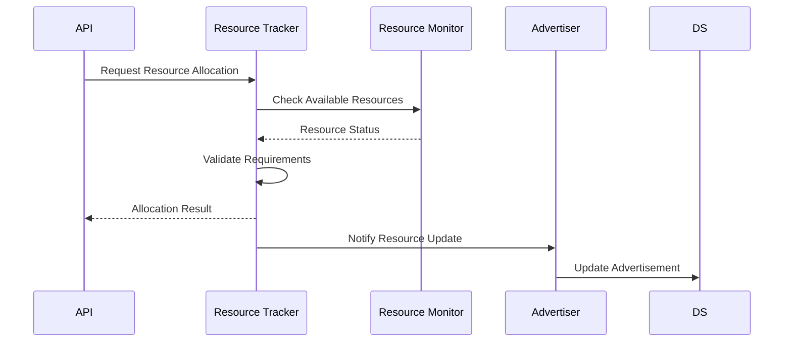
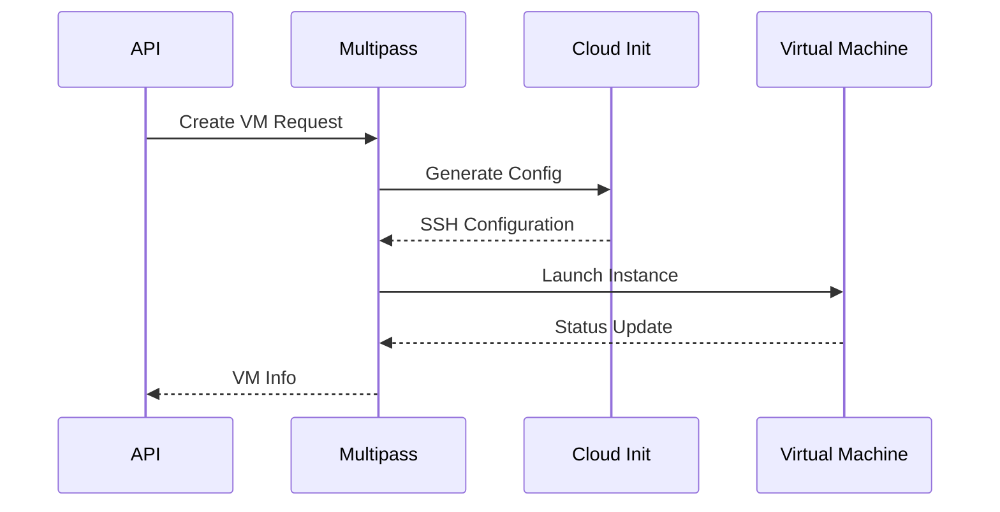
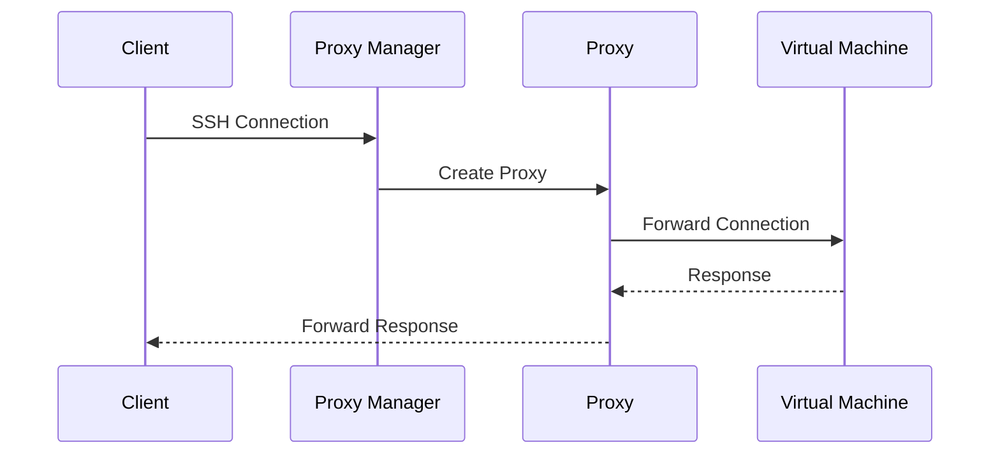
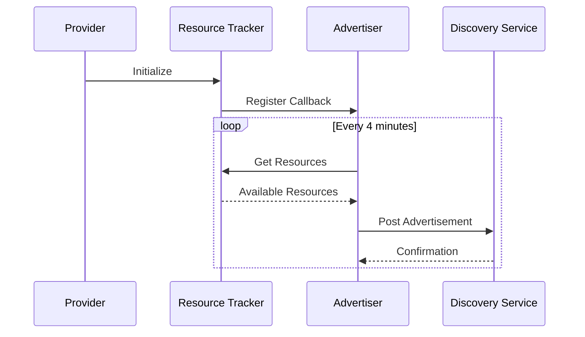

# VM on Golem Provider Node

The Provider Node enables participation in the Golem Network by managing virtual machines and computing resources. It handles VM lifecycle management, resource allocation, network proxying, and automated discovery advertisement.

## System Architecture



The Provider Node implements a clean, modular architecture where each component handles a specific responsibility:

## Core Components

### Port Verification

The port verification system ensures proper network connectivity:



-   Comprehensive port accessibility verification
-   Real-time status display with progress indicators
-   Local and external port validation
-   Automatic port allocation management

### Future Developments

The current port verification system uses dedicated port check servers to verify external accessibility. In future releases, this functionality will be integrated into the Golem Network's verifier nodes, providing:

-   Decentralized port verification through the network
-   Increased reliability with multiple verification sources
-   Consensus-based verification results
-   Reduced dependency on centralized services
-   Enhanced security through the network's trust system

This integration aligns with Golem's vision of a fully decentralized computing platform, moving critical infrastructure services like port verification into the network itself.

### Resource Management

The resource management system ensures optimal allocation and utilization of system resources:

-   Real-time monitoring of CPU, memory, and storage
-   Intelligent resource allocation with minimum requirement enforcement
-   Threshold-based resource protection
-   Automatic resource reclamation



### VM Management

VM operations are handled through Multipass integration:



-   Automated VM provisioning with cloud-init
-   Secure SSH key management
-   Status monitoring and health checks
-   Automatic cleanup procedures

### Network Proxy System

A pure Python implementation manages SSH connections:



-   Dynamic port allocation and management
-   Connection state persistence
-   Clean connection handling
-   Automatic proxy cleanup

## Installation

1. Prerequisites:

    - Python 3.9+
    - Multipass
    - Poetry

2. Install dependencies:

    ```bash
    cd provider-server
    poetry install
    ```

3. Configure environment:
    ```bash
    cp .env.example .env
    # Edit .env with your settings
    ```

## Configuration

Key configuration options in `.env`:

```bash
# Provider Settings
GOLEM_PROVIDER_ID="your-provider-id"
GOLEM_PROVIDER_NAME="your-provider-name"
GOLEM_PROVIDER_COUNTRY="SE"

# Resource Limits
GOLEM_PROVIDER_MAX_VMS=10
GOLEM_PROVIDER_MIN_CPU_CORES=1
GOLEM_PROVIDER_MIN_MEMORY_GB=1
GOLEM_PROVIDER_MIN_STORAGE_GB=10

# Port Verification Settings
GOLEM_PROVIDER_PORT={provider_port}  # Default: 7466
GOLEM_PROVIDER_PORT_CHECK_SERVERS=[
    "https://ports1.golem.network",
    "https://ports2.golem.network"
]

# Network Settings
GOLEM_PROVIDER_PORT_RANGE_START={start_port}  # Default: 50800
GOLEM_PROVIDER_PORT_RANGE_END={end_port}      # Default: 50900
GOLEM_PROVIDER_PUBLIC_IP="auto"

# Discovery Settings
GOLEM_PROVIDER_DISCOVERY_URL="http://discovery.golem.network:9001"
GOLEM_PROVIDER_ADVERTISEMENT_INTERVAL=240
```

## API Reference

### Create VM

```bash
POST /api/v1/vms
```

Request:

```json
{
    "name": "my-webserver",
    "cpu_cores": 2,
    "memory_gb": 4,
    "storage_gb": 20
}
```

Response:

```json
{
    "id": "golem-my-webserver-20250219-130424",
    "name": "my-webserver",
    "status": "running",
    "ip_address": "192.168.64.2",
    "ssh_port": 50800,
    "resources": {
        "cpu": 2,
        "memory": 4,
        "storage": 20
    }
}
```

### VM Operations

-   List VMs: `GET /api/v1/vms`
-   Get VM Status: `GET /api/v1/vms/{vm_id}`
-   Delete VM: `DELETE /api/v1/vms/{vm_id}`
-   Stop VM: `POST /api/v1/vms/{vm_id}/stop`
-   Get Access Info: `GET /api/v1/vms/{vm_id}/access`
 
 ## Operations
 
### Starting the Provider

```bash
# To run in production mode
poetry run golem-provider start

# To run in development mode
poetry run golem-provider dev
```

The provider will:

1. Verify port accessibility
    - Check discovery port (7466)
    - Verify SSH ports (50800-50900)
    - Display verification progress
2. Initialize resource monitoring
3. Start the proxy manager
4. Begin resource advertisement
5. Listen for VM requests

### Resource Advertisement Flow



### Monitoring

The provider includes comprehensive logging:

-   Resource allocation events
-   VM lifecycle changes
-   Network proxy operations
-   Discovery service interactions

## Technical Details

### Security

-   Resource isolation through Multipass
-   Secure SSH key provisioning
-   Connection proxying for network isolation
-   Rate limiting on API endpoints

### Performance

-   Asynchronous operations with FastAPI
-   Efficient resource tracking
-   Connection pooling for proxy servers
-   Optimized VM provisioning

### Resource Protection

-   CPU threshold: 90%
-   Memory threshold: 85%
-   Storage threshold: 90%
-   Minimum resource guarantees

## Troubleshooting

Common issues and solutions:

### Port Verification Issues

1. Provider Port ({provider_port}) Issues

    - Check if port is already in use
    - Verify port forwarding on router
    - Check firewall rules
    - Ensure provider is accessible to requestors

2. VM Access Port Range ({start_port}-{end_port}) Issues

    - Verify port range availability
    - Check for port conflicts
    - Configure router port forwarding
    - Review firewall settings for range

3. External Access Issues
    - Verify internet connectivity
    - Check port check servers are accessible
    - Review router NAT/firewall settings
    - Consider using alternative port check servers

### Port Verification Monitoring

The provider includes real-time port verification status:

-   Visual progress indicators
-   Port accessibility status
-   Critical issues detection
-   Quick fix suggestions
-   Links to troubleshooting documentation

Example status output:

```bash
🌟 Port Verification Status
==========================
[✅] Provider Port {provider_port}: External ✓ | Internal ✓
[✅] VM Access Ports: 3 ports available ({start_port}-{start_port+2})
[✅] Overall Status: Provider Ready
└─ Can handle up to {n} concurrent VMs
```

### Resource Allocation Issues

-   Check system resource availability
-   Verify minimum requirements
-   Monitor resource thresholds
-   Review resource allocation logs

### Discovery Service Issues

-   Check network connectivity
-   Verify discovery service URL
-   Check advertisement interval
-   Monitor advertisement responses
-   Verify provider registration status

## Contributing

1. Fork the repository
2. Create a feature branch
3. Make your changes
4. Run the tests
5. Submit a pull request
