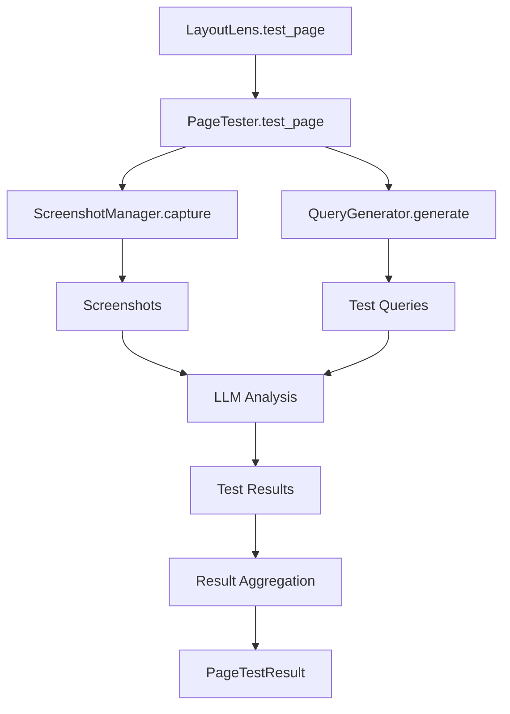
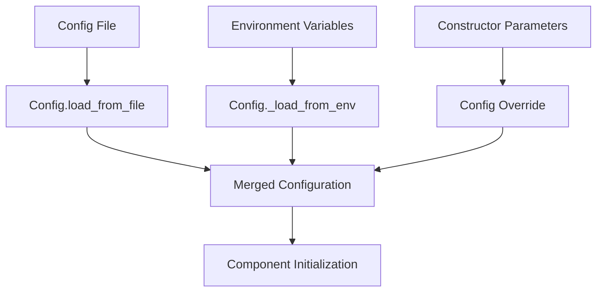
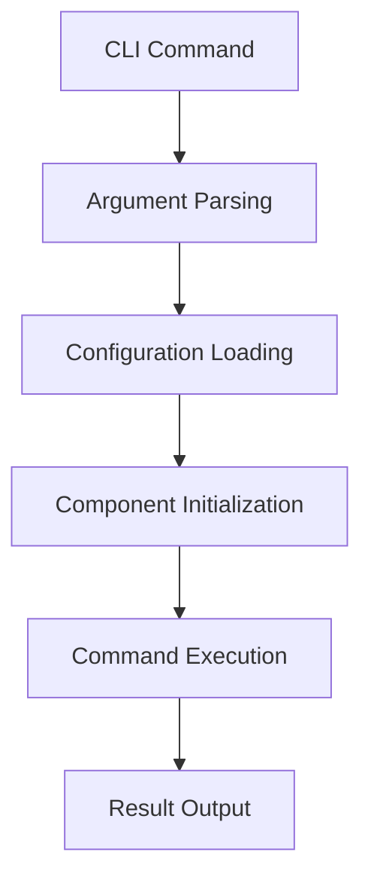

# LayoutLens Architecture

This document describes the architecture and design principles of the LayoutLens framework.

## Overview

LayoutLens is designed as a modular, extensible framework for AI-powered UI testing. The architecture separates concerns while providing a unified interface for users.

## Core Components

### 1. Core Framework (`layoutlens/`)

```
layoutlens/
├── __init__.py          # Public API exports
├── core.py              # Main LayoutLens class
├── config.py            # Configuration management
├── test_runner.py       # Test execution engine
└── cli.py               # Command-line interface
```

**Key Responsibilities:**
- User-facing API and abstraction layer
- Configuration management and validation
- Test suite orchestration
- CLI command processing

### 2. Testing Engine (`scripts/testing/`)

```
scripts/testing/
├── page_tester.py       # Main testing orchestrator
├── screenshot_manager.py # Advanced screenshot capture
├── query_generator.py   # Intelligent test generation
└── __init__.py
```

**Key Responsibilities:**
- Screenshot capture across multiple viewports
- DOM analysis and query generation
- LLM integration for visual testing
- Result aggregation and reporting

### 3. Benchmark System (`scripts/benchmark/`)

```
scripts/benchmark/
├── benchmark_generator.py # Systematic test generation
├── template_engine.py     # HTML template system
├── templates/             # Template files
└── __init__.py
```

**Key Responsibilities:**
- Systematic test case generation
- HTML template rendering
- Benchmark data export and management

### 4. Legacy Components (`legacy/`)

```
legacy/
├── framework.py         # Original LayoutLens implementation
├── screenshot.py        # Basic screenshot utilities
├── benchmark_runner.py  # Original benchmark runner
└── README.md           # Migration guide
```

## Data Flow

### 1. Test Execution Flow



### 2. Configuration Flow



### 3. CLI Flow



## Design Principles

### 1. Modularity
- **Separation of Concerns**: Each component has a specific, well-defined responsibility
- **Loose Coupling**: Components interact through well-defined interfaces
- **High Cohesion**: Related functionality is grouped together

### 2. Extensibility
- **Plugin Architecture**: Easy to add new screenshot managers, query generators, etc.
- **Configuration-Driven**: Behavior can be customized without code changes
- **Hook System**: Extension points for custom functionality

### 3. Reliability
- **Error Handling**: Graceful degradation when services are unavailable
- **Input Validation**: Robust validation of user inputs and configurations
- **Testing**: Comprehensive test coverage with mocked dependencies

### 4. Performance
- **Parallel Execution**: Tests can run in parallel for faster execution
- **Caching**: Results and assets can be cached to avoid redundant work
- **Resource Management**: Efficient use of browser instances and API calls

## Component Interactions

### LayoutLens (Core Class)
The main entry point that orchestrates all other components:

```python
class LayoutLens:
    def __init__(self, config=None):
        self.config = self._load_config(config)
        self.page_tester = self._initialize_page_tester()
        self.benchmark_generator = self._initialize_benchmark_generator()
    
    def test_page(self, html_path, queries=None, viewports=None):
        return self.page_tester.test_page(html_path, queries, viewports)
```

### PageTester (Testing Orchestrator)
Coordinates screenshot capture and LLM analysis:

```python
class PageTester:
    def __init__(self, screenshot_dir, results_dir, openai_api_key):
        self.screenshot_manager = ScreenshotManager(screenshot_dir)
        self.query_generator = QueryGenerator()
        self.layout_lens = LayoutLens(api_key=openai_api_key)
    
    def test_page(self, html_path, queries, viewports):
        screenshots = self._capture_screenshots(html_path, viewports)
        test_queries = self._generate_queries(html_path, queries)
        return self._execute_tests(screenshots, test_queries)
```

### Configuration System
Hierarchical configuration with multiple sources:

1. **Default Values**: Sensible defaults for all settings
2. **Config Files**: YAML files for project-specific settings
3. **Environment Variables**: Runtime overrides
4. **Constructor Parameters**: Programmatic overrides

### Error Handling Strategy

```python
# Graceful degradation example
def test_page(self, html_path):
    try:
        screenshots = self._capture_screenshots(html_path)
    except PlaywrightError as e:
        self.logger.warning(f"Screenshot failed: {e}")
        screenshots = []  # Continue without screenshots
    
    try:
        if self.llm_available:
            results = self._run_llm_tests(screenshots)
        else:
            results = []  # Skip LLM tests if not available
    except APIError as e:
        self.logger.error(f"LLM analysis failed: {e}")
        results = []
    
    return self._aggregate_results(results)
```

## Extension Points

### Custom Screenshot Managers
```python
class CustomScreenshotManager(ScreenshotManager):
    def capture_single(self, html_path, viewport):
        # Custom screenshot logic
        pass
```

### Custom Query Generators
```python
class CustomQueryGenerator(QueryGenerator):
    def generate_queries_from_elements(self, elements):
        # Custom query generation logic
        pass
```

### Custom LLM Providers
```python
class AnthropicProvider:
    def ask(self, images, query):
        # Anthropic API integration
        pass
```

## Testing Architecture

### Test Organization
```
tests/
├── unit/           # Isolated component tests
├── integration/    # Component interaction tests
├── e2e/           # Full system tests
└── fixtures/      # Test data and mocks
```

### Mock Strategy
- **External APIs**: Always mocked in tests
- **File Operations**: Mocked to avoid filesystem dependencies
- **Browser Automation**: Mocked to avoid browser dependencies

### Test Isolation
- Each test runs in isolation
- Temporary directories for file operations
- Mock external dependencies
- Reset global state between tests

## Performance Considerations

### Bottlenecks
1. **Screenshot Capture**: Launching browsers and rendering pages
2. **LLM API Calls**: Network latency and rate limits
3. **File I/O**: Reading HTML files and writing results

### Optimization Strategies
1. **Browser Reuse**: Keep browser instances alive between tests
2. **Parallel Execution**: Run tests concurrently when possible
3. **Caching**: Cache screenshots and API responses
4. **Batching**: Batch API calls when possible

### Resource Management
```python
# Context manager for browser lifecycle
with ScreenshotManager() as manager:
    for page in pages:
        manager.capture_single(page, viewport)
# Browser automatically closed
```

## Security Considerations

### API Key Management
- Store API keys in environment variables
- Never log or expose API keys
- Support multiple API key sources

### File Access
- Validate file paths to prevent directory traversal
- Use absolute paths internally
- Sanitize user-provided paths

### External Dependencies
- Pin dependency versions for reproducibility
- Regularly update dependencies for security
- Validate all external inputs

## Future Architecture Considerations

### Scalability
- **Distributed Execution**: Run tests across multiple machines
- **Cloud Integration**: Leverage cloud services for processing
- **Result Storage**: Persist results in databases for analysis

### Multi-Language Support
- **Language Abstraction**: Core engine independent of language
- **RPC Interface**: Language-specific clients communicate via RPC
- **Shared Protocol**: Common protocol for cross-language compatibility