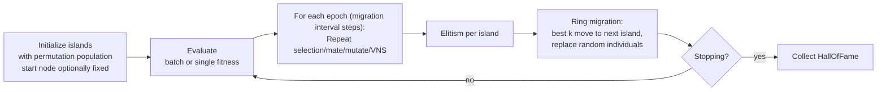

# memeticga — Memetic Genetic Algorithm (Island Model)

This project grew out of a failed entrance contest for [AI Masters](https://aimasters.ru), which posed a non-convex, non-differentiable permutation optimization problem. After an attempted genetic algorithm (GA) failed to produce a breakthrough, I decided to try a more powerful, parallelizable approach: a Memetic Genetic Algorithm (MGA). I couldn’t find a ready-to-use MGA implementation for Python, so I developed one and packaged it as an out-of-the-box MGA library. FYI: the winning solution was CUDA-accelerated Simulated Annealing. The project was completed with the help of Grok, ChatGPT, and Cursor. 

**MGA** is a production-ready, minimization-oriented memetic genetic algorithm built on **[DEAP](https://deap.readthedocs.io/)**. It targets **permutation problems** (TSP, routing, assignment) and combines a classical GA with a **Variable Neighborhood Search (VNS)** local improver inside an **island model** with periodic **ring migration**.


- Representation: permutation with an **optional fixed start** (only when `start_candidates` is provided; if multiple candidates are given, one is sampled per individual).
- Crossover: **Edge Recombination (ERX)**
- Mutation: **swap mutation** (per-gene probability)
- Selection: **tournament**
- Local search: **VNS** (swap → insertion → inversion)
- Parallelism: **multiprocessing** (per-island workers)
- Batch or single fitness evaluation (with automatic wrapping)

> **Note on objective:** The algorithm **minimizes** fitness. If your score is maximized by default, pass `-score` or transform accordingly.


## Installation

```bash
pip install memeticga
````

Or from [source](https://github.com/kakoyvostorg/memeticga):

```bash
pip install .
```

Dependencies: `deap`, `numpy`, `tqdm`.
Optional: `cloudpickle` (needed if your fitness functions are locally defined/closures and you run with `num_workers > 1`).


## Quickstart (TSP-style distance matrix)
> **CRUCIAL**: Use the `if __name__ == '__main__':` guard if `num_workers` > 1. Otherwise multiprocessing fails.
```python
import numpy as np
from memeticga import MGA

# Example: symmetric distance matrix (N x N)
rng = np.random.default_rng(42)
N = 50
D = rng.integers(1, 100, size=(N, N)).astype(float)
np.fill_diagonal(D, 0)

# Single-individual fitness: total tour length (start node fixed at index 0)
def tour_length(perm: np.ndarray, X: np.ndarray) -> float:
    # perm is a permutation of [0..N-1], with perm[0] fixed as start node
    total = 0.0
    for i in range(len(perm)-1):
        total += X[perm[i], perm[i+1]]
    total += X[perm[-1], perm[0]]  # return to start
    return float(total)

if __name__ == '__main__': ###IMPORTANT USE THIS GUARD FOR MULTIPROCESSING
    mga = MGA(
        problem="permutation",
        fitness_func=tour_length,  # or use fitness_func_batch (vectorized) for speed
        population=200,
        ngen=1000,
        n_islands=10,
        migration_interval=25,
        migration_rate=2,
        elite_size=1,
        X=D,              # used to infer permutation length
        start_candidates=[0],  # fix start node at index 0
        seed=42,
    )

    hof = mga.optimize(hall_of_fame_size=3)  # DEAP HallOfFame
    best = hof[0]
    print("Best fitness:", best.fitness.values[0]) #Best fitness: 419.0
    print("Best permutation:", list(best)) #Best permutation: [0, 40, 5, 49, 24,...
    #Time: 01:07
```


### Vectorized fitness (batch) for speed

```python
import numpy as np

def tour_length_batch(perms_2d: np.ndarray, X: np.ndarray) -> np.ndarray:
    # perms_2d shape: (n_individuals, N)
    n, N = perms_2d.shape
    out = np.zeros(n, dtype=float)
    for r in range(n):
        perm = perms_2d[r]
        out[r] = (X[perm[:-1], perm[1:]].sum() + X[perm[-1], perm[0]])
    return out

if __name__ == '__main__':
  mga = MGA(
      problem="permutation",
      fitness_func_batch=tour_length_batch,
      population=400,
      ngen=800,
      n_islands=8,
      X=D,
  )
  hof = mga.optimize()
```


## How it works (high-level)



At each **island**:

1. **Selection:** Tournament selection builds a mating pool.
2. **Variation:** Crossover with **Edge Recombination (ERX)** and swap **mutation** (respecting fixed start node only if configured).
3. **Memetic step:** A fraction of individuals undergo **VNS** with neighborhoods `swap → insertion → inversion`, iterating per settings for shallow/deep search.
4. **Elitism:** Best individuals are preserved.
5. **Migration (ring):** Every `migration_interval` generations, each island sends its top `migration_rate` individuals to the **next** island, replacing random members there.
6. **Parallelism:** Each island evolves independently in a worker process.


## Implementation details

### Constructor: all initialization values

```python
MGA(
  problem: str = "permutation",
  fitness_func: Optional[Callable[[np.ndarray, Optional[np.ndarray]], float]] = None,
  fitness_func_batch: Optional[Callable[[np.ndarray, Optional[np.ndarray]], np.ndarray]] = None,
  population: int = 200,
  ngen: int = 1000,
  verbosity: int = 1,
  log_file: Optional[str] = None,
  n_islands: int = 10,
  migration_interval: int = 25,
  migration_rate: int = 2,
  elite_size: int = 1,
  island_stagnation_limit: int = 50,
  tournament_size: int = 3,
  cx_prpb: float = 0.9,
  mut_prob: float = 0.8,
  mut_prob_gene: float = 0.12,
  vns_apply_fraction: float = 0.3,
  vns_iter_short: int = 15,
  vns_iter_deep: int = 250,
  start_candidates: Optional[Sequence[int]] = None,
  num_workers: Optional[int] = None,
  seed: int = 42,
  X: Optional[np.ndarray] = None,
  perm_len: Optional[int] = None,
  pickle_fitness_with_cloudpickle: bool = True,
)
```

| Argument                  |                                                       Type |         Default | What it controls                                                                                                                    |
| ------------------------- | ---------------------------------------------------------: | --------------: | ----------------------------------------------------------------------------------------------------------------------------------- |
| `problem`                 |                                                      `str` | `"permutation"` | Representation type. **Currently supports only permutation**.                                       |
| `fitness_func`            |      `Callable[[np.ndarray, Optional[np.ndarray]], float]` |          `None` | Single-individual fitness. Return a scalar **to minimize**. If no `fitness_func_batch`, a batch wrapper is created automatically.   |
| `fitness_func_batch`      | `Callable[[np.ndarray, Optional[np.ndarray]], np.ndarray]` |          `None` | Batch fitness (vectorized). Receives `(n_individuals, perm_len)` and returns `shape=(n_individuals,)`. Prefer this for performance. |
| `population`              |                                                      `int` |           `200` | Total population across all islands. Each island gets `max(2, population // n_islands)`.                                            |
| `ngen`                    |                                                      `int` |          `1000` | Total number of generations to run (distributed across epochs/migrations).                                                          |
| `verbosity`               |                                                      `int` |             `1` | `0` = silent; `1+` shows a `tqdm` progress bar and info logging.                                                                    |
| `log_file`                |                                                      `str` |          `None` | Optional path to write `logging.INFO` messages; falls back to `WARNING` on stdout otherwise.                                        |
| `n_islands`               |                                                      `int` |            `10` | Number of islands (parallel demes).                                                                                                 |
| `migration_interval`      |                                                      `int` |            `25` | Generations between migrations (one **epoch**).                                                                                     |
| `migration_rate`          |                                                      `int` |             `2` | Migrants to send **per island** during each migration (best individuals).                                                           |
| `elite_size`              |                                                      `int` |             `1` | Elites preserved **per island** each generation.                                                                                    |
| `island_stagnation_limit` |                                                      `int` |            `50` | If an island’s best fitness doesn’t improve for this many gens, it’s considered “stagnant” and may be diversified internally.       |
| `tournament_size`         |                                                      `int` |             `3` | Tournament size for selection.                                                                                                      |
| `cx_prpb`                 |                                                    `float` |           `0.9` | Probability to apply **ERX** crossover to a selected pair.                                                                          |
| `mut_prob`                |                                                    `float` |           `0.8` | Probability to apply **mutation** to a newly created offspring.                                                                     |
| `mut_prob_gene`           |                                                    `float` |          `0.12` | Per-gene probability for swap mutation (DEAP’s `indpb`).                                                                            |
| `vns_apply_fraction`      |                                                    `float` |           `0.3` | Fraction of individuals per generation that undergo **VNS** local search.                                                           |
| `vns_iter_short`          |                                                      `int` |            `15` | Iterations for **short** VNS passes.                                                                                                |
| `vns_iter_deep`           |                                                      `int` |           `250` | Iterations for **deep** VNS passes (e.g., on elites).                                                                               |
| `start_candidates`        |                                            `Sequence[int]` |          `None` | Optional start nodes. If one value, index 0 is fixed to it. If multiple, a start is sampled per individual at creation. If omitted, no fixed start. |
| `num_workers`             |                                                      `int` |          `None` | Worker processes (per-island). Defaults to `max(1, cpu_count() - 1)`.                                                               |
| `seed`                    |                                                      `int` |            `42` | RNG seed for reproducibility.                                                                                                       |
| `X`                       |                                               `np.ndarray` |          `None` | Optional data blob passed to your fitness (commonly a distance matrix). If provided, infers `perm_len = X.shape[1]`.                |
| `perm_len`                |                                                      `int` |          `None` | Permutation length when `X` is `None`. **Required** in that case and must be positive.                                              |
| `pickle_fitness_with_cloudpickle` |                                           `bool` |          `True` | When `num_workers > 1`, serialize fitness functions with `cloudpickle` so locally defined/closure functions can run in workers.     |

> Implementation detail: DEAP classes are created with `creator.FitnessMin(weights=(-1.0,))` and `creator.Individual(list, fitness=...)`, so the API assumes minimization and list-based permutations.


### Public API (class methods)

`MGA.__init__(...)`

**Purpose:** Configure the algorithm, operators, and DEAP toolbox.

* Sets GA/VNS/island hyperparameters, builds the DEAP `Toolbox`, and, if `X` is provided, infers `perm_len` from `X.shape[1]` (otherwise you must pass `perm_len`).
* Registers:

  * `evaluate` → your `fitness_func` (or a batch wrapper)
  * `mate` → **Edge Recombination (ERX)** (two offspring). If `start_candidates` provided, starts from the first node; otherwise starts from a random node.
  * `mutate` → swap mutation with `indpb=mut_prob_gene`. Index 0 is protected only when `start_candidates` is provided; otherwise it is mutable.
  * `select` → tournament with `tournsize=tournament_size`
  * `individual` → permutation with **optionally fixed start node**
    (when multiple `start_candidates` are provided, a start is sampled per individual).
  * `population` → repeated `individual`

Returns: **`None`**


`MGA.optimize(num_workers: Optional[int] = None, hall_of_fame_size: int = 1)`

**Purpose:** Run the full memetic GA with an island model and return the **Hall of Fame**.

* Spawns per-island workers (multiprocessing).
* Evolves in **epochs** of `migration_interval` generations.
* Applies crossover/mutation/VNS, elitism, and periodic **ring migration**.
* Evaluates fitness in **batch** if available (or a wrapped single function).
* Maintains a global **`tools.HallOfFame`** of size `hall_of_fame_size`.

Returns: **`deap.tools.HallOfFame`**


### Advanced (module-level helpers)

You typically won’t call these directly, but they’re part of the implementation:

* `create_individual(perm_len: int, start_node: Optional[int] = None)`
  Create a DEAP `Individual` permutation with an optional fixed start node. When integrating via `MGA`, if multiple `start_candidates` are provided, the start node is sampled at individual creation time.
* `cxEdgeRecombination_fixed(parent1, parent2)`
  **Edge Recombination Crossover** producing **two** children, each starting from a different parent. If no fixed start is configured, the starting node is chosen at random.
* `mut_permutation_fixed(individual, indpb: float)`
  **Swap mutation** that respects a fixed start node only when configured. Returns a 1-tuple per DEAP convention.
* `vns(toolbox, individual, max_iters: int)`
  **VNS** with neighborhoods: swap → insertion → inversion; tries each sequentially per iteration. Index 0 is treated as fixed only when configured.
* `evaluate_individual(...)` / `evaluate_batch_deap(...)` / `_build_default_batch_from_single(...)`
  Glue utilities so you can supply either single or batch fitness; the wrapper does a simple Python loop if you only provide `fitness_func`.
* `MGA.migrate_islands(islands: List[List[creator.Individual]])`
  Perforsms ring migration replacing random individual from island $i+1 \mod n$ with the best individuals from island $i$.

## Other

### Tips & Gotchas

* **You can fix the start node.** Enable this by setting `start_candidates=[your_start]`. Provide multiple candidates to randomize the start per individual and increase diversity. If not set, position 0 is mutable and ERX starts from a random node.
* **Multiprocessing & fitness functions.** If you define `fitness_func` inside another function (a closure) or not at module top-level, enable `pickle_fitness_with_cloudpickle=True` (default) and install `cloudpickle` to run with `num_workers > 1`.
* **Batch fitness is faster.** If you can implement `fitness_func_batch`, do it—especially for large populations.
* **Minimization only.** Invert your objective if you currently maximize.
* **Scaling.** Tune `n_islands`, `population`, `migration_interval`, and `vns_*` iter budgets based on problem size.


### License

MIT

### Changelog

* **0.1.0** — Initial release.