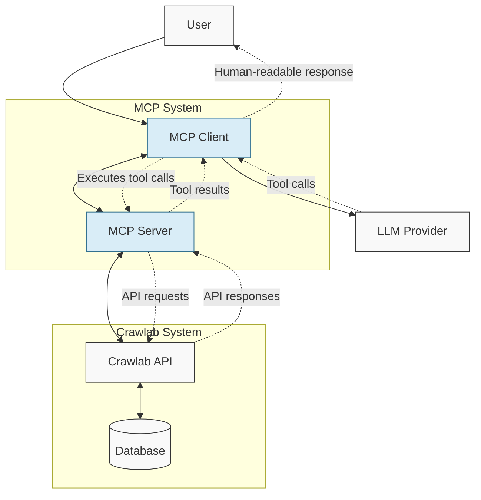

# Crawlab MCP Server

This is a Model Context Protocol (MCP) server for Crawlab, allowing AI applications to interact with Crawlab's functionality.

## Overview

The MCP server provides a standardized way for AI applications to access Crawlab's features, including:

- Spider management (create, read, update, delete)
- Task management (run, cancel, restart)
- File management (read, write)
- Resource access (spiders, tasks)

## Architecture

The MCP Server/Client architecture facilitates communication between AI applications and Crawlab:



### Communication Flow

1. **User Query**: The user sends a natural language query to the MCP Client
2. **LLM Processing**: The Client forwards the query to an LLM provider (e.g., Claude, OpenAI)
3. **Tool Selection**: The LLM identifies necessary tools and generates tool calls
4. **Tool Execution**: The Client sends tool calls to the MCP Server
5. **API Interaction**: The Server executes the corresponding Crawlab API requests
6. **Response Generation**: Results flow back through the Server to the Client to the LLM
7. **User Response**: The Client delivers the final human-readable response to the user

## Installation and Usage

### Option 1: Install as a Python package

You can install the MCP server as a Python package, which provides a convenient CLI:

```bash
# Install from source
pip install -e .

# Or install from GitHub (when available)
# pip install git+https://github.com/crawlab-team/crawlab-mcp-server.git
```

After installation, you can use the CLI:

```bash
# Start the MCP server
crawlab_mcp-mcp server [--spec PATH_TO_SPEC] [--host HOST] [--port PORT]

# Start the MCP client
crawlab_mcp-mcp client SERVER_URL
```

### Option 2: Running Locally

### Prerequisites

- Python 3.8+
- Crawlab instance running and accessible
- API token from Crawlab

### Configuration

1. Copy the `.env.example` file to `.env`:
   ```
   cp .env.example .env
   ```

2. Edit the `.env` file with your Crawlab API details:
   ```
   CRAWLAB_API_BASE_URL=http://your-crawlab-instance:8080/api
   CRAWLAB_API_TOKEN=your_api_token_here
   ```

### Running Locally

1. Install dependencies:
   ```
   pip install -r requirements.txt
   ```

2. Run the server:
   ```
   python server.py
   ```

### Running with Docker

1. Build the Docker image:
   ```
   docker build -t crawlab-mcp-server .
   ```

2. Run the container:
   ```
   docker run -p 8000:8000 --env-file .env crawlab-mcp-server
   ```

## Integration with Docker Compose

To add the MCP server to your existing Crawlab Docker Compose setup, add the following service to your `docker-compose.yml`:

```yaml
services:
  # ... existing Crawlab services
  
  mcp-server:
    build: ./backend/mcp-server
    ports:
      - "8000:8000"
    environment:
      - CRAWLAB_API_BASE_URL=http://backend:8000/api
      - CRAWLAB_API_TOKEN=your_api_token_here
    depends_on:
      - backend
```

## Using with AI Applications

The MCP server enables AI applications to interact with Crawlab through natural language. Following the architecture diagram above, here's how to use the MCP system:

### Setting Up the Connection

1. **Start the MCP Server**: Make sure your MCP server is running and accessible
2. **Configure the AI Client**: Connect your AI application to the MCP server 

### Example: Using with Claude Desktop

1. Open Claude Desktop
2. Go to Settings > MCP Servers
3. Add a new server with the URL of your MCP server (e.g., `http://localhost:8000`)
4. In a conversation with Claude, you can now use Crawlab functionality by describing what you want to do in natural language

### Example Interactions

Based on our architecture, here are example interactions with the system:

**Create a Spider:**
```
User: "Create a new spider named 'Product Scraper' for the e-commerce project"
↓
LLM identifies intent and calls the create_spider tool
↓
MCP Server executes the API call to Crawlab
↓
Spider is created and details are returned to the user
```

**Run a Task:**
```
User: "Run the 'Product Scraper' spider on all available nodes"
↓
LLM calls the run_spider tool with appropriate parameters
↓
MCP Server sends the command to Crawlab API
↓
Task is started and confirmation is returned to the user
```

### Available Commands

You can interact with the system using natural language commands like:

- "List all my spiders"
- "Create a new spider with these specifications..."
- "Show me the code for the spider named X"
- "Update the file main.py in spider X with this code..."
- "Run spider X and notify me when it's complete"
- "Show me the results of the last run of spider X"

## Available Resources and Tools

These are the underlying tools that power the natural language interactions:

### Resources

- `spiders`: List all spiders
- `tasks`: List all tasks

### Tools

#### Spider Management
- `get_spider`: Get details of a specific spider
- `create_spider`: Create a new spider
- `update_spider`: Update an existing spider
- `delete_spider`: Delete a spider

#### Task Management
- `get_task`: Get details of a specific task
- `run_spider`: Run a spider
- `cancel_task`: Cancel a running task
- `restart_task`: Restart a task
- `get_task_logs`: Get logs for a task

#### File Management
- `get_spider_files`: List files for a spider
- `get_spider_file`: Get content of a specific file
- `save_spider_file`: Save content to a file