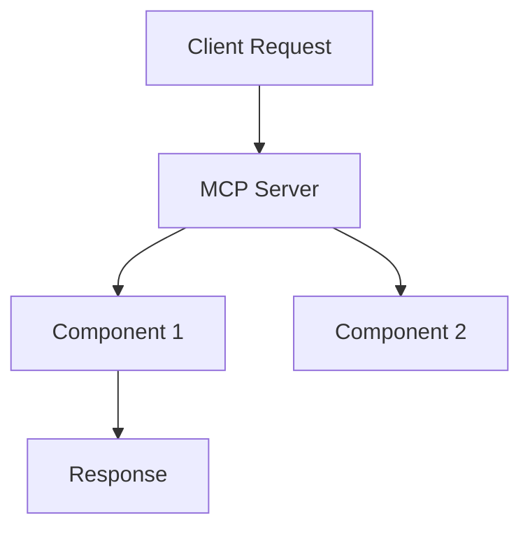

# Getting Started with MCP Server Planning

A quick guide to planning and implementing MCP servers using these resources.

## Planning Workflow

### 1. Gather Requirements

Use [requirements_questionnaire.md](templates/requirements_questionnaire.md) to capture:
- Core purpose and functionality
- Input/output specifications
- External dependencies
- Constraints and edge cases

Example approach:
```
Q: What problem does this MCP server solve?
A: [User's answer]

Q: What capabilities must it provide?
A: [User's answer]
```

### 2. Define Architecture

Create a component-based architecture:
- Identify major components and responsibilities
- Define interactions between components
- Document with a Mermaid diagram

Example:


### 3. Create Implementation Plan

Use [implementation_plan_template.md](templates/implementation_plan_template.md) to document:
- Project overview
- Architecture
- Implementation tasks
- Testing approach

### 4. Define Tasks

Break down implementation into tasks using [task_template.md](templates/task_template.md):
- Clear objective
- Detailed specifications
- Acceptance criteria
- Testing requirements

### 5. Track Progress

Set up [work_progress_log_template.md](templates/work_progress_log_template.md) to track:
- Task status
- Implementation notes
- Blockers and decisions

## Planning Artifacts Organization

All planning artifacts must be colocated in the project's `planning/` directory:

```
my-mcp-server/
├── planning/                 # Planning artifacts directory
│   ├── implementation_plan.md # Main implementation plan
│   ├── work_progress_log.md  # Progress tracking
│   └── tasks/                # Task definitions
│       ├── T1_Project_Setup.md
│       ├── T2_Component1.md
│       └── T3_Component2.md
```

This organization ensures that all planning-related documents are kept together and easily referenced during implementation. See the [project structure guide](guides/project_structure_guide.md) for complete details.

## Implementation Flow

1. Set up environment ([environment_setup_guide.md](guides/environment_setup_guide.md))
2. Create project structure ([project_structure_guide.md](guides/project_structure_guide.md))
3. Implement each task sequentially
4. Test thoroughly ([testing_guide.md](guides/testing_guide.md))
5. Register the MCP server ([registration_guide.md](guides/registration_guide.md))

## Example Walkthrough

See these examples:
- [planning_example.md](examples/planning_example.md): Complete implementation plan
- [task_example.md](examples/task_example.md): Detailed task definition
- [weather_mcp_example.md](examples/weather_mcp_example.md): Working MCP server

## Quick Reference

| Phase | Key Template | Supporting Guide |
|-------|-------------|------------------|
| Requirements | [requirements_questionnaire.md](templates/requirements_questionnaire.md) | - |
| Architecture | [implementation_plan_template.md](templates/implementation_plan_template.md) | [implementation_guide.md](guides/implementation_guide.md) |
| Tasks | [task_template.md](templates/task_template.md) | - |
| Implementation | - | [project_structure_guide.md](guides/project_structure_guide.md) |
| Testing | - | [testing_guide.md](guides/testing_guide.md) |