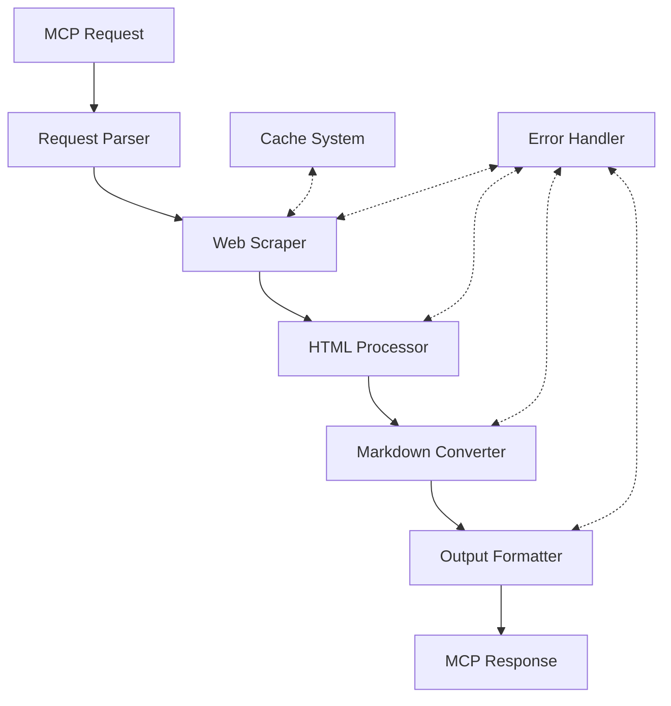
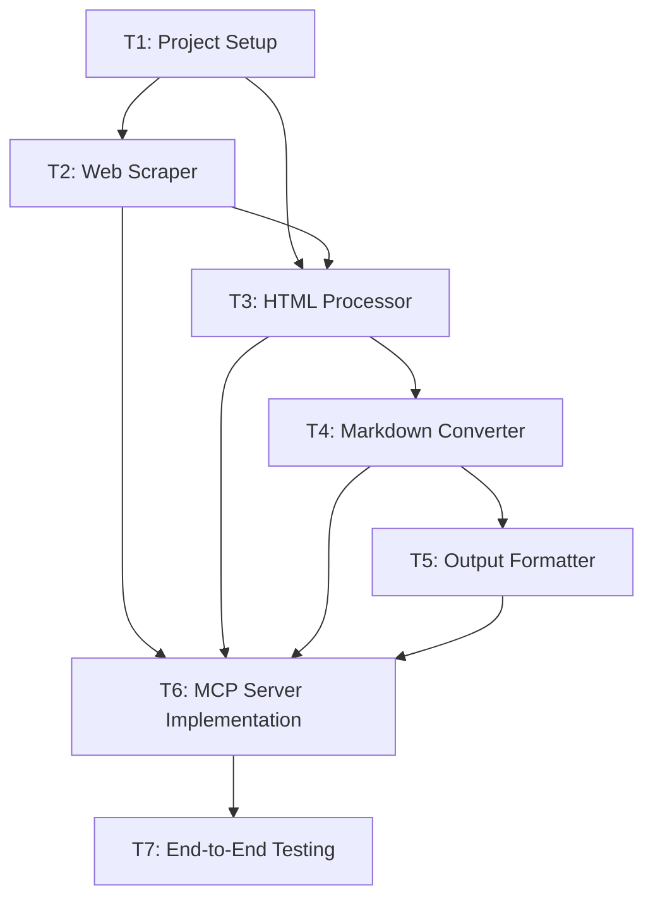

# Implementation Plan: API Documentation MCP Server

## 1. Project Overview

### 1.1 Purpose

This MCP server fetches API documentation from websites, processes the HTML content, and converts it into structured Markdown format optimized for LLMs, enabling AI assistants to retrieve up-to-date API documentation.

### 1.2 Core Functionality

- Fetch API documentation from specified URLs
- Extract and process relevant HTML content
- Convert HTML to clean, structured Markdown
- Optimize output for LLM context windows
- Implement caching and fallback mechanisms

### 1.3 Constraints and Limitations

- Rate limits on API documentation sites
- LLM context window size limitations
- Response time requirements (< 10 seconds)
- Support for various documentation formats

## 2. Architecture

### 2.1 Component Diagram

### 2.2 Component Descriptions

| Component | Responsibility |
|-----------|----------------|
| Request Parser | Validate input parameters, prepare for processing |
| Web Scraper | Fetch HTML with retry logic and error handling |
| HTML Processor | Extract relevant sections, clean up HTML |
| Markdown Converter | Convert HTML to structured Markdown |
| Output Formatter | Optimize for context window with prioritization |
| Cache System | Reduce redundant fetches |
| Error Handler | Provide meaningful errors and fallbacks |

### 2.3 Data Flow

1. Request arrives with parameters (API name/URL, object to document)
2. HTML content is fetched, using cache if available
3. Relevant documentation sections are extracted
4. HTML is converted to Markdown
5. Output is formatted and optimized
6. Response is returned to the client

## 3. Implementation Tasks

*Note: Detailed task definitions will be created in separate files using the task template.*

- **Task T1: Project Setup** - Environment, structure, and base configuration
- **Task T2: Web Scraper Module** - Robust HTML fetching with error handling
- **Task T3: HTML Processor Module** - Extract and clean documentation content
- **Task T4: Markdown Converter Module** - Convert to structured Markdown
- **Task T5: Output Formatter Module** - Optimize for LLM consumption
- **Task T6: MCP Server Implementation** - Server interface and integration
- **Task T7: End-to-End Testing** - Comprehensive testing

## 4. Task Dependencies

## 5. Testing Strategy

### 5.1 Key Testing Areas

| Component | Focus Areas |
|-----------|------------|
| Web Scraper | Success cases, error handling, retries |
| HTML Processor | Different HTML formats, extraction accuracy |
| Markdown Converter | Element conversion, structure preservation |
| Output Formatter | Size optimization, prioritization |
| MCP Server | Parameter validation, integration |

### 5.2 Edge Cases

- Very large documentation pages (> 1MB)
- JavaScript-rendered content
- Rate-limited sites
- Malformed HTML
- Documentation behind authentication
- Non-English documentation

## 6. Configuration

| Variable | Purpose | Example |
|----------|---------|---------|
| LOG_LEVEL | Logging verbosity | `INFO` |
| CACHE_DIR | Cache location | `/tmp/api_docs_cache` |
| MAX_RETRIES | Retry attempts | `3` |
| TIMEOUT_SECONDS | Request timeout | `30` |

## 7. Challenges and Mitigations

| Challenge | Mitigation Strategy |
|-----------|---------------------|
| Blocking scrapers | User-agent rotation, respect robots.txt, request delays |
| JS-rendered content | Optional headless browser support |
| Rate limiting | Exponential backoff, caching, request throttling |
| Varying doc formats | Format-specific extractors, fallback heuristics |
| Large content | Smart prioritization and summarization |

## 8. References

- [MCP Protocol Documentation](https://modelcontextprotocol.ai)
- [Beautiful Soup Documentation](https://www.crummy.com/software/BeautifulSoup/bs4/doc/)
- [HTML to Markdown Conversion](https://github.com/matthewwithanm/python-markdownify)