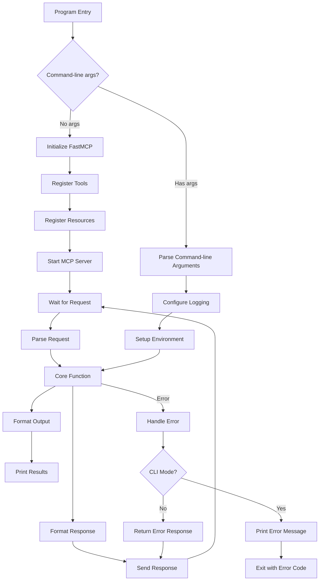

# MCP Server Implementation Guide

## Overview

This guide covers the core implementation patterns for Model Context Protocol (MCP) servers in Python, including program flow, component types, and best practices.

## Program Flow

The following diagram illustrates the typical program flow for an MCP server that supports both MCP server mode and CLI mode, showing how both modes use the same core function:



This dual-mode design allows the same core functionality to be accessed both through the MCP protocol (for AI assistants) and via command-line interface (for direct user interaction and testing).

## Python Libraries

The following libraries are categorized by their role in MCP server development:

| Category | Libraries | Purpose | Requirement Level |
|----------|----------|---------|------------------|
| **Core** | mcp[cli], pydantic, argparse, typing | MCP implementation, data validation, CLI interface | **REQUIRED** for all MCP servers |
| **Testing** | pytest | Unit and integration testing | **REQUIRED** for all MCP servers |
| **HTTP/Networking** | requests | Basic HTTP client | **REQUIRED** if making API calls |
| **HTTP/Networking** | aiohttp, httpx | Async HTTP operations | **OPTIONAL** - use for async operations |
| **Data Processing** | pandas, numpy | Data manipulation | **OPTIONAL** - use only for data-heavy applications |
| **Text/HTML Processing** | beautifulsoup4 | HTML parsing | **REQUIRED** if processing HTML |
| **Text/HTML Processing** | lxml, markdownify | Additional parsing tools | **OPTIONAL** - use as needed |
| **API Clients** | openai, anthropic | LLM API integration | **OPTIONAL** - use only if integrating with these specific APIs |
| **Utilities** | python-dotenv | Environment management | **REQUIRED** for all MCP servers |
| **Utilities** | validators | Input validation | **OPTIONAL** - use as needed |

## MCP Component Types

MCP servers can expose three types of components to clients:

### 1. Tools

Tools are functions that perform actions. They are the primary way that MCP servers provide functionality.

```python
@mcp.tool()
async def my_tool(param1: str, param2: int, optional_param: bool = True) -> str:
    """Tool description - this becomes the description shown to users.
    
    Args:
        param1: Description of parameter 1
        param2: Description of parameter 2
        optional_param: Description of optional parameter
        
    Returns:
        Result of the tool operation
    """
    try:
        # Log the function call at debug level
        logger.debug(f"my_tool called with params: {param1}, {param2}, {optional_param}")
        
        # Your tool implementation here
        result = f"Processed {param1} with {param2}"
        logger.info(f"Successfully processed request")
        
        return result
    except Exception as e:
        # Log the error
        logger.error(f"Error in my_tool: {str(e)}", exc_info=True)
        
        # Convert exceptions to MCP errors
        raise McpError(ErrorData(
            code=INTERNAL_ERROR,
            message=f"Error in my_tool: {str(e)}"
        ))
```

### 2. Resources (Optional)

Resources expose data that can be accessed by reference:

```python
@mcp.resource("my-resource://{resource_id}")
def get_resource(resource_id: str) -> str:
    """Resource description"""
    # Fetch and return the resource
    return fetch_resource(resource_id)
```

### 3. Prompts (Optional)

Prompts provide reusable templates:

```python
@mcp.prompt()
def my_prompt(param1: str, param2: str) -> str:
    """Generate a prompt template"""
    return f"""
    Process {param1} in the context of {param2}.
    """
```


## Error Handling Strategy

MCP servers MUST follow a consistent error handling strategy:

1. **Catch specific exceptions first** (e.g., `ValueError` for validation errors)
2. **Convert all exceptions to appropriate `McpError` types**:
   - `INVALID_PARAMS` for validation errors
   - `INTERNAL_ERROR` for system/runtime errors
   - `METHOD_NOT_FOUND` for unknown tools/methods
3. **Include helpful error messages** that explain what went wrong
4. **Log detailed error information** including stack traces

Example:

```python
try:
    # Validate input
    if days < 1 or days > 5:
        raise ValueError("Days must be between 1 and 5")
        
    # Call external API
    result = requests.get(...)
    result.raise_for_status()
    
    # Process data
    return process_data(result.json())
except ValueError as e:
    # Handle validation errors
    logger.warning(f"Validation error: {str(e)}")
    raise McpError(ErrorData(
        code=INVALID_PARAMS,
        message=str(e)
    ))
except requests.RequestException as e:
    # Handle API request errors
    logger.error(f"API request failed: {str(e)}", exc_info=True)
    raise McpError(ErrorData(
        code=INTERNAL_ERROR,
        message=f"External API error: {str(e)}"
    ))
except Exception as e:
    # Handle unexpected errors
    logger.error(f"Unexpected error: {str(e)}", exc_info=True)
    raise McpError(ErrorData(
        code=INTERNAL_ERROR,
        message=f"An unexpected error occurred: {str(e)}"
    ))
```

## CLI vs MCP Server Operation

MCP servers MUST support both CLI and MCP server operation modes following these conventions:

1. **Mode Detection**:
   - The presence of command-line arguments indicates CLI mode
   - No arguments indicates MCP server mode

2. **Shared Core Logic**:
   - Both modes should use the same core functions to ensure consistent behavior
   - Example: `process_request()` function called by both the CLI and MCP tool

3. **Parameter Validation**:
   - CLI mode: Validate parameters with argparse
   - MCP server mode: Validate parameters with Pydantic models

4. **Error Handling**:
   - CLI mode: Print error messages to stderr and exit with non-zero code
   - MCP server mode: Return McpError responses

Example mode detection:

```python
if __name__ == "__main__":
    # If --test flag is present, initialize the server but exit immediately
    if "--test" in sys.argv:
        # Test initialization and exit
        ...
    # If no command-line arguments, run as MCP server
    elif len(sys.argv) == 1:
        logger.info("Starting in MCP server mode")
        mcp.run()
    # Otherwise, run as CLI tool
    else:
        sys.exit(main())
```

## Async vs Sync Functions

Follow these guidelines for async vs sync functions:

1. **Use async functions for**:
   - MCP tools that make external API calls
   - Operations that might block for significant time
   - Concurrent operations

2. **Use sync functions for**:
   - Simple operations without I/O
   - Pure computational tasks
   - State management

3. **General rule**: When in doubt, implement async functions as they provide better scalability

## Best Practices

1. **Single Responsibility**: Each function should have a clear, single purpose
2. **Descriptive Naming**: Use clear, descriptive names for tools and parameters
3. **Comprehensive Logging**: Log all significant events with appropriate levels
4. **Thorough Documentation**: Document all tools, parameters, and return values
5. **Consistent Error Handling**: Follow the error handling strategy consistently
6. **Parameter Validation**: Validate all parameters as early as possible
7. **Code Reuse**: Share core logic between CLI and MCP server modes
8. **Test Driven Development**: Write tests before implementing functionality

## Next Steps

After implementing your MCP server:
- Refer to [Testing Guide](testing_guide.md) for testing requirements
- Refer to [Registration Guide](registration_guide.md) for registering your MCP server