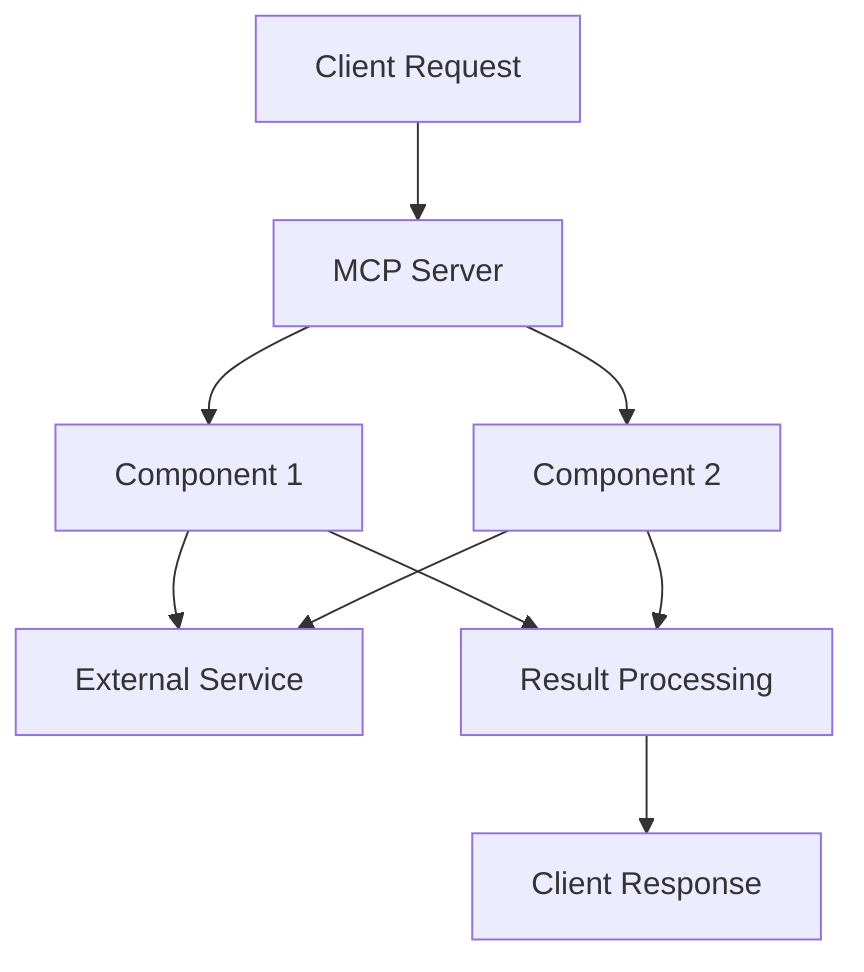
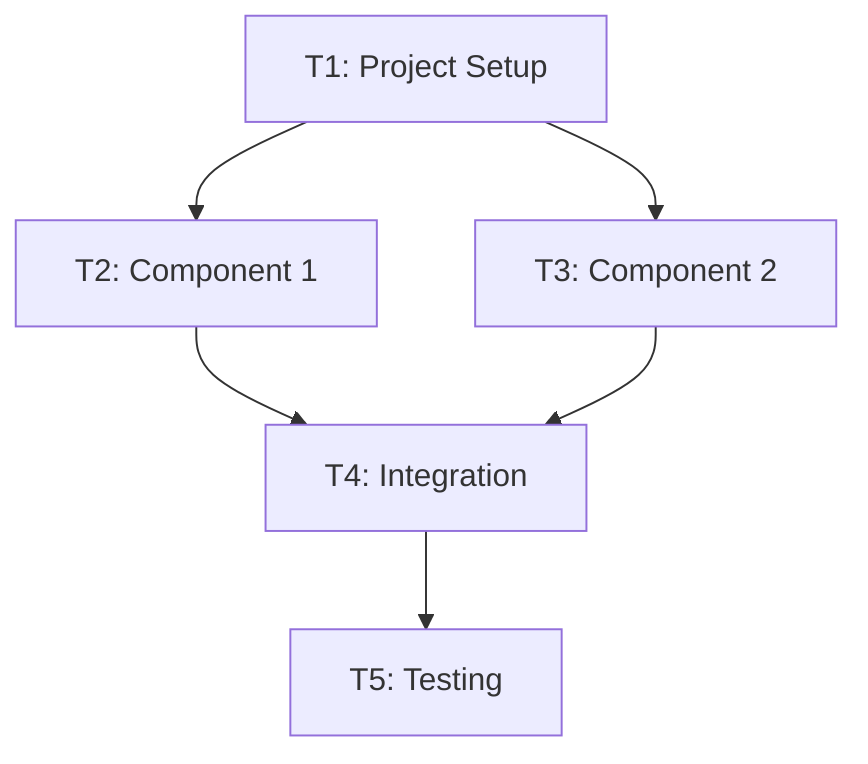

# Implementation Plan: [Project Name]

## 1. Project Overview

### 1.1 Purpose

[Concise statement of what this MCP server will do and why it's valuable]

### 1.2 Core Functionality

- [Key capability 1]
- [Key capability 2]
- [Key capability 3]

### 1.3 Integration Points

[Brief description of how this MCP server will be used and what systems it will interact with]

### 1.4 Constraints and Limitations

- Rate limits: [Details]
- Size limitations: [Details]
- Performance requirements: [Details]

## 2. Architecture

### 2.1 Component Diagram

### 2.2 Component Descriptions

| Component | Description | Responsibility |
|-----------|-------------|----------------|
| Component 1 | [Brief description] | [Main responsibilities] |
| Component 2 | [Brief description] | [Main responsibilities] |
| External Service | [Brief description] | [Main responsibilities] |
| Result Processing | [Brief description] | [Main responsibilities] |

## 3. Implementation Tasks

*Note: Detailed task definitions will be created in separate files using the [task template](../templates/task_template.md).*

- **Task T1: Project Setup** - [Brief description]
- **Task T2: [Component 1]** - [Brief description]
- **Task T3: [Component 2]** - [Brief description]
- **Task T4: Integration** - [Brief description]
- **Task T5: Testing** - [Brief description]

## 4. Task Dependencies

## 5. Testing Approach

*Note: Refer to [testing guide](../guides/testing_guide.md) for detailed testing requirements and best practices.*

| Test Type | Key Focus Areas | Success Criteria |
|-----------|----------------|------------------|
| Unit Testing | [Key components to test] | [Success criteria] |
| Integration Testing | [Integration points] | [Success criteria] |
| End-to-End Testing | [Critical flows] | [Success criteria] |
| Edge Case Testing | [Important edge cases] | [Success criteria] |

## 6. Environment Variables

| Variable | Purpose | Required | Default |
|----------|---------|----------|---------|
| API_KEY | Authentication for external service | Yes | None |
| TIMEOUT_SECONDS | Request timeout | No | 30 |
| DEBUG | Enable debug logging | No | false |

## 7. Challenges and Mitigations

| Challenge | Impact | Mitigation |
|-----------|--------|------------|
| [Challenge 1] | [Impact] | [Mitigation approach] |
| [Challenge 2] | [Impact] | [Mitigation approach] |

## 8. References

- [Relevant reference 1]
- [Relevant reference 2]

## Next Steps

1. Create the work progress log using the [work progress template](../templates/work_progress_log_template.md)
2. Define detailed tasks using the [task template](../templates/task_template.md)
3. Set up project structure following the [project structure guide](../guides/project_structure_guide.md)