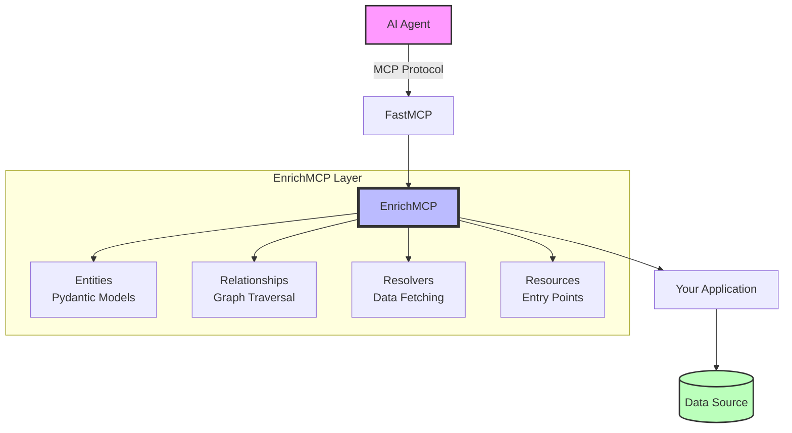

# Core Concepts

This guide explains the core concepts and architecture of enrichmcp.

## Agentic Enrichment

Agentic Enrichment is a paradigm where AI agents can intelligently discover and navigate your data model without extensive documentation or hand-holding. Instead of teaching AI about your API, your API teaches itself to AI.

Key principles:

1. **Self-Describing**: Every entity, field, and relationship includes rich descriptions
2. **Discoverable**: AI agents can explore the entire data model through introspection
3. **Navigable**: Relationships allow natural traversal of the data graph
4. **Type-Safe**: Full validation ensures data integrity

## Architecture Overview



EnrichMCP sits on top of FastMCP, providing:

1. **Data Model Layer**: Define your domain using Pydantic models
2. **Relationship Graph**: Express connections between entities
3. **Automatic Tool Generation**: Every entity and relationship becomes discoverable
4. **Schema Introspection**: AI agents can explore your entire data model

## Entities

Entities are the core building blocks of your data model. They extend Pydantic's BaseModel with additional capabilities:

```python
from enrichmcp import EnrichModel
from pydantic import Field


@app.entity
class Customer(EnrichModel):
    """Represents a customer account."""

    # Fields with descriptions
    id: int = Field(description="Unique customer ID")
    email: str = Field(description="Primary email address")
    status: str = Field(description="Account status", examples=["active", "suspended", "churned"])

    # Computed properties
    @property
    def display_name(self) -> str:
        """Format for UI display."""
        return f"Customer #{self.id}"
```

### Entity Best Practices

1. **Always include docstrings** - These become part of the schema AI agents see
2. **Use descriptive field names** - `customer_lifetime_value` not `clv`
3. **Include examples** - Help AI understand valid values
4. **Group related fields** - Use nested models for addresses, etc.

## Relationships

Relationships define how entities connect to each other:

```python
from enrichmcp import Relationship


@app.entity
class Order(EnrichModel):
    """Customer order."""

    # One-to-one relationship
    customer: Customer = Relationship(description="Customer who placed this order")

    # One-to-many relationship
    line_items: list[OrderItem] = Relationship(description="Individual items in this order")
```

### Relationship Types

1. **One-to-One**: Single related entity
2. **One-to-Many**: List of related entities
3. **Many-to-Many**: (Coming soon) Through intermediate entities

## Resolvers

Resolvers fetch the actual data for relationships:

```python
@Order.customer.resolver
async def resolve_order_customer(order_id: int) -> Customer:
    """Fetch the customer who placed an order.

    Args:
        order_id: The ID from the parent Order entity

    Returns:
        The related Customer entity
    """
    # The resolver receives the parent entity's ID
    customer_id = await db.get_order_customer_id(order_id)
    return await db.get_customer(customer_id)
```

### Resolver Patterns

**Basic Resolver**:
```python
@Parent.child.resolver
async def get_child(parent_id: int) -> Child:
    return await fetch_child(parent_id)
```

**With Filtering** (coming soon):
```python
@Customer.orders.resolver
async def get_orders(
    customer_id: int, status: str | None = None, since: date | None = None
) -> list[Order]:
    return await fetch_orders(customer_id, status, since)
```

**With Pagination** (coming soon):
```python
@Customer.orders.resolver
async def get_orders(customer_id: int, limit: int = 10, offset: int = 0) -> list[Order]:
    return await fetch_orders(customer_id, limit, offset)
```

## Resources

Resources are the entry points for AI agents:

```python
@app.retrieve
async def get_customer(customer_id: int) -> Customer:
    """Retrieve a customer by ID.

    This is a primary entry point. From here, agents can
    traverse to orders, addresses, and other related data.
    """
    customer = await db.get_customer(customer_id)
    if not customer:
        raise NotFoundError(f"Customer {customer_id} not found")
    return customer


@app.retrieve
async def search_customers(query: str, status: str | None = None) -> list[Customer]:
    """Search for customers by name or email.

    Supports partial matching and optional status filtering.
    """
    return await db.search_customers(query, status)
```

### Resource Guidelines

1. **Provide multiple entry points** - Don't make AI traverse unnecessarily
2. **Use clear naming** - `get_customer` not `fetch_customer_data`
3. **Include search/list operations** - AI needs to discover data
4. **Handle errors gracefully** - Use built-in error types

## Context Management

Context provides shared resources across your API:

```python
from enrichmcp import EnrichContext


class AppContext(EnrichContext):
    """Application-specific context."""

    db: Database
    cache: Cache
    user: User | None = None


@app.retrieve
async def get_customer(customer_id: int) -> Customer:
    """Get customer using context."""
    context = app.get_context()
    # Check cache first
    cached = await context.cache.get(f"customer:{customer_id}")
    if cached:
        return Customer.model_validate(cached)

    # Fetch from database
    customer = await context.db.get_customer(customer_id)
    await context.cache.set(f"customer:{customer_id}", customer)

    return customer
```

## Schema Introspection

AI agents can explore your entire data model:

```python
# This is automatically provided by enrichmcp
{
    "title": "Customer API",
    "entities": {
        "Customer": {
            "description": "Represents a customer account",
            "fields": {
                "id": {"type": "int", "description": "Unique ID"},
                "email": {"type": "str", "description": "Email"},
            },
            "relationships": {"orders": {"type": "list[Order]", "description": "Customer orders"}},
        }
    },
}
```

## Type Safety

enrichmcp leverages Pydantic for comprehensive validation:

```python
# This automatically validates inputs
@app.retrieve
async def create_customer(
    email: EmailStr,  # Validates email format
    age: int = Field(ge=18, le=150),  # Range validation
    status: Literal["active", "pending"]  # Enum validation
) -> Customer:
    # All inputs are validated before reaching your code
    ...
```
The `describe_model()` output will list these allowed values.

## Context and Lifespan Management

EnrichMCP extends FastMCP's context system to provide logging, progress reporting, and shared resources.

### Accessing Context

Call ``app.get_context()`` inside resources or resolvers to work with the current request context:

```python
@app.retrieve
async def my_resource(param: str) -> Result:
    ctx = app.get_context()
    await ctx.info("Processing request")
    await ctx.report_progress(50, 100)
    return result
```

### Lifespan Pattern

Use the lifespan pattern for managing resources like database connections:

```python
from contextlib import asynccontextmanager


@asynccontextmanager
async def lifespan(app: EnrichMCP) -> AsyncIterator[dict[str, Any]]:
    # Startup: Initialize resources
    db = await create_connection()
    cache = await Redis.connect()

    try:
        # Yield context dict - available via ctx.request_context.lifespan_context
        yield {
            "db": db,
            "cache": cache,
        }
    finally:
        # Shutdown: Clean up resources
        await db.close()
        await cache.close()


# Pass lifespan to app
app = EnrichMCP("My API", "Description", lifespan=lifespan)
```

### Accessing Lifespan Resources

Access lifespan resources through the context:

```python
@User.orders.resolver
async def get_user_orders(user_id: int) -> list[Order]:
    ctx = app.get_context()
    # Get database from lifespan context
    db = ctx.request_context.lifespan_context["db"]

    # Use it
    return await db.fetch_orders(user_id)
```

### Context Features

The context provides:

1. **Logging**: `await ctx.info()`, `debug()`, `warning()`, `error()`
2. **Progress**: `await ctx.report_progress(current, total, message)`
3. **Resource Reading**: `await ctx.read_resource(uri)`
4. **Request Info**: `ctx.request_id`, `ctx.client_id`
5. **Lifespan Access**: `ctx.request_context.lifespan_context`

## Error Handling

Use semantic errors that AI agents understand:

```python
from enrichmcp.errors import NotFoundError, ValidationError, AuthorizationError


@app.retrieve
async def get_order(order_id: int) -> Order:
    context = app.get_context()
    order = await context.db.get_order(order_id)

    if not order:
        raise NotFoundError(
            f"Order {order_id} not found", resource_type="Order", resource_id=order_id
        )

    if order.customer_id != context.user.id:
        raise AuthorizationError("Cannot access orders for other customers")

    return order
```
