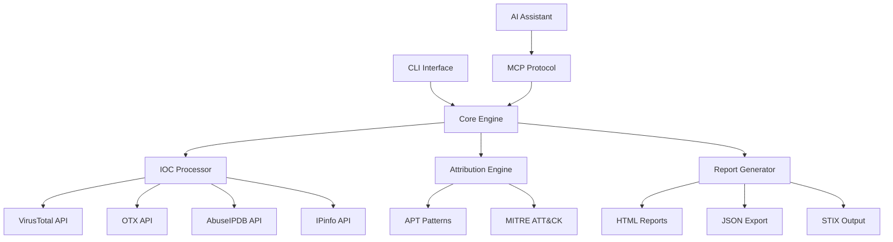

[](https://mseep.ai/app/4r9un-fastmcp-threatintel)

# 🛡️ FastMCP ThreatIntel - AI-Powered Threat Intelligence

[](https://github.com/4R9UN/fastmcp-threatintel/actions/workflows/ci.yml)
[](https://codecov.io/gh/4R9UN/fastmcp-threatintel)
[](https://badge.fury.io/py/fastmcp-threatintel)
[](https://www.python.org/downloads/)
[](https://opensource.org/licenses/Apache-2.0)
[](https://hub.docker.com/r/arjuntrivedi/fastmcp-threatintel)
[](https://mseep.ai/app/09be09c3-bda9-4cb9-82d3-329459fecbc7)

> 🚀 **MCP AI Powered Threat Intelligence - Revolutionizing Cybersecurity**
> *Built by **Arjun Trivedi (4R9UN)** - Enterprise-Grade Threat Intelligence Platform*

A comprehensive **Model Context Protocol (MCP)** server that provides enterprise-grade threat intelligence capabilities through natural language AI prompts. Analyze IPs, domains, URLs, and file hashes across multiple threat intelligence platforms with advanced APT attribution and interactive reporting.


## ✨ Why FastMCP ThreatIntel?

### 🎯 **Purpose-Built for Modern Security Teams**
- **🤖 AI-First Design**: Natural language queries with intelligent IOC detection
- **🔗 MCP Integration**: Seamless integration with Claude Desktop, VSCode (Roo-Cline), and other AI assistants
- **⚡ Lightning Fast**: UV-powered development with optimized async processing
- **🏢 Enterprise Ready**: Production-grade Docker containers and Kubernetes support

### 🔍 **Multi-Source Intelligence**
- **VirusTotal**: File and URL reputation analysis with 70+ antivirus engines
- **AlienVault OTX**: Community-driven threat intelligence and IOC feeds
- **AbuseIPDB**: IP reputation and geolocation with abuse confidence scoring
- **IPinfo**: Enhanced geolocation, ASN, and infrastructure data

### 🤖 **AI-Powered Analysis**
- **Natural Language Interface**: Query threats using plain English
- **Advanced APT Attribution**: Confidence-scored attribution with MITRE ATT&CK mapping
- **Intelligent IOC Detection**: Auto-detects IP addresses, domains, URLs, and file hashes
- **Context-Aware Reporting**: Generates comprehensive threat intelligence reports

### 📊 **Rich Reporting & Visualization**
- **Interactive HTML Reports**: Modern, responsive design with dark/light modes
- **D3.js Network Graphs**: Visual IOC relationship mapping
- **Multiple Output Formats**: Markdown, JSON, HTML, and STIX-compliant outputs
- **Export Capabilities**: PDF, CSV, and JSON export for integration

### 🚀 **Flexible Deployment Options**
- **🔌 MCP Server**: Direct integration with AI assistants
- **💻 Standalone CLI**: Interactive and batch processing modes
- **🐳 Docker Container**: Production-ready containerization
- **📦 Python Package**: Embed in your applications and workflows


## 🏗️ Architecture




## 🚀 Quick Start

Choose your preferred installation method and get started in minutes:

### 🐍 pip (Fastest)
```bash
# Install from PyPI
pip install fastmcp-threatintel

# Interactive setup wizard
threatintel setup

# Analyze your first IOC
threatintel analyze 8.8.8.8 --output-format table --verbose
```

### 🐳 Docker (Production Ready)
```bash
# Pull and run with your API keys
docker pull arjuntrivedi/fastmcp-threatintel:latest
docker run -e VIRUSTOTAL_API_KEY=your_key \
           -e OTX_API_KEY=your_key \
           arjuntrivedi/fastmcp-threatintel:latest \
           analyze 192.168.1.1
```

### 🔥 UV (Developer Recommended)
```bash
# Clone and install with UV
git clone https://github.com/4R9UN/fastmcp-threatintel.git
cd fastmcp-threatintel
uv sync

# Run interactive setup
uv run threatintel setup

# Start analyzing
uv run threatintel interactive
```

### 📦 Poetry (Traditional)
```bash
# Clone and install with Poetry
git clone https://github.com/4R9UN/fastmcp-threatintel.git
cd fastmcp-threatintel
poetry install

# Activate and run
poetry shell
threatintel analyze example.com --output-format html --open-browser
```

## ⚙️ Configuration

### 🔑 API Keys Setup

Get your free API keys and unlock the full potential:

| Service | Status | Free Tier Limit | Get Your Key |
|---------|--------|----------------|--------------|
| **VirusTotal** | Required | 1,000 requests/day | [Sign Up →](https://www.virustotal.com/gui/join-us) |
| **OTX** | Required | Unlimited | [Sign Up →](https://otx.alienvault.com/) |
| **AbuseIPDB** | Optional | 1,000 requests/day | [Sign Up →](https://www.abuseipdb.com/register) |
| **IPinfo** | Optional | 50,000 requests/month | [Sign Up →](https://ipinfo.io/signup) |

### 🛠️ Environment Configuration

Create a `.env` file in your project directory:

```bash
# Required API Keys
VIRUSTOTAL_API_KEY=your_virustotal_api_key
OTX_API_KEY=your_alienvault_otx_api_key

# Optional API Keys (for enhanced functionality)
ABUSEIPDB_API_KEY=your_abuseipdb_api_key
IPINFO_API_KEY=your_ipinfo_api_key

# Performance Tuning
CACHE_TTL=3600              # Cache duration (seconds)
MAX_RETRIES=3               # API retry attempts
REQUEST_TIMEOUT=30          # Request timeout (seconds)
```

## 💻 Usage Examples

### CLI Analysis
```bash
# Quick single IOC analysis
threatintel analyze 192.168.1.1 --verbose

# Batch analysis from file
threatintel batch iocs.txt --output-file report.html --output-format html

# Interactive threat hunting session
threatintel interactive

# Start MCP server for AI integration
threatintel server --host 0.0.0.0 --port 8000
```

### 🔌 MCP Integration

**Integrate with AI assistants for natural language threat intelligence:**

#### VSCode with Roo-Cline
```json
{
  "mcpServers": {
    "threatintel": {
      "command": "threatintel",
      "args": ["server", "--port", "8001"],
      "env": {
        "VIRUSTOTAL_API_KEY": "your_key",
        "OTX_API_KEY": "your_key"
      }
    }
  }
}
```

#### Claude Desktop
```json
{
  "mcpServers": {
    "threatintel": {
      "command": "threatintel",
      "args": ["server"],
      "env": {
        "VIRUSTOTAL_API_KEY": "your_key",
        "OTX_API_KEY": "your_key"
      }
    }
  }
}
```

**🔗 [Complete MCP Integration Guide →](docs/integration/MCP_INTEGRATION.md)**

### 🎯 AI Prompt Examples

```
"Analyze IP 8.8.8.8 for security threats and provide geolocation data"
"Check if domain example.com has any malicious associations"
"Perform comprehensive threat analysis on 185.220.101.1 with APT attribution"
"Generate a security incident report for these IOCs: [list]"
```
## 📚 Documentation

### 📖 **User Guides**
- **[MCP Integration](docs/integration/MCP_INTEGRATION.md)** - Connect with AI assistants
- **[Python API](docs/advanced/PYTHON_API.md)** - Programmatic integration
- **[Performance Guide](docs/advanced/PERFORMANCE.md)** - Optimization and scaling

### 🛠️ **Developer Resources**
- **[Development Setup](docs/development/DEVELOPMENT.md)** - Contributing and building
- **[API Reference](https://4r9un.github.io/fastmcp-threatintel/)** - Complete API documentation
- **[Examples Repository](https://github.com/4R9UN/fastmcp-threatintel/tree/main/examples)** - Sample implementations

## 🌟 What Makes It Special

### **🔥 MCP Functionality **
- **MCP AI Powered**: Cutting-edge threat intelligence automation
- **Revolutionizing Cybersecurity**: Enterprise-grade AI-powered platform
- **Community-Focused**: Open source with professional quality

### **🚀 Production-Ready Features**
- **Multi-Architecture Docker**: ARM64 and AMD64 support
- **Kubernetes Ready**: Helm charts and deployment manifests
- **Comprehensive Testing**: 80%+ code coverage with CI/CD pipeline
- **Security First**: Secure by design with best practices

### **⚡ Performance Optimized**
- **Async Everything**: Non-blocking I/O for maximum throughput
- **Intelligent Caching**: Redis-compatible caching layer
- **Rate Limiting**: Built-in API rate limit management
- **Batch Processing**: Efficient bulk IOC analysis

## 🤝 Contributing

We welcome contributions from the cybersecurity community!

### Quick Start
```bash
# Fork and clone
git clone https://github.com/YOUR_USERNAME/fastmcp-threatintel.git
cd fastmcp-threatintel

# Setup development environment
uv sync --dev
uv run pre-commit install

# Make your changes and test
uv run pytest
uv run ruff format . && uv run ruff check .

# Submit your PR
git push origin feature/your-feature
```

**[📖 Complete Contributing Guide →](docs/development/DEVELOPMENT.md)**

## 📜 License

This project is licensed under the **Apache License 2.0** - see the [LICENSE](LICENSE) file for details.

## 🙏 Acknowledgments

**Special thanks to the cybersecurity community and these amazing projects:**

- **[FastMCP](https://github.com/jlowin/fastmcp)** - Excellent MCP framework foundation
- **[VirusTotal](https://www.virustotal.com/)** - Comprehensive malware analysis platform  
- **[AlienVault OTX](https://otx.alienvault.com/)** - Open threat intelligence sharing
- **[AbuseIPDB](https://www.abuseipdb.com/)** - IP reputation and abuse reporting
- **[MITRE ATT&CK](https://attack.mitre.org/)** - Threat intelligence framework

## 🔗 Links & Resources

<div align="center">

**🌟 Star this repo if you find it useful! 🌟**

[](https://github.com/4R9UN/fastmcp-threatintel)
[](https://github.com/4R9UN/fastmcp-threatintel/fork)

**📚 [Documentation](https://4r9un.github.io/fastmcp-threatintel/) • 🐛 [Report Bug](https://github.com/4R9UN/fastmcp-threatintel/issues) • 💡 [Request Feature](https://github.com/4R9UN/fastmcp-threatintel/issues) • 💬 [Discussions](https://github.com/4R9UN/fastmcp-threatintel/discussions)**

**📦 [PyPI Package](https://pypi.org/project/fastmcp-threatintel/) • 🐳 [Docker Hub](https://hub.docker.com/r/arjuntrivedi/fastmcp-threatintel)**

---

*Built with ❤️ by **Arjun Trivedi (4R9UN)** for the cybersecurity community*

</div>
