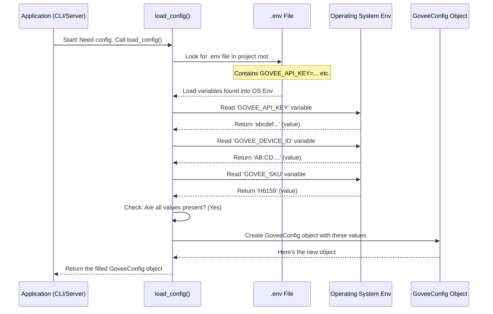

# Chapter 1: Configuration Management - Giving Your App Its Credentials

Welcome to the `govee_mcp_server` tutorial! We're excited to guide you through how this project works. Let's start with the very first step any application needs: figuring out its basic settings.

## What's the Big Idea?

Imagine you want to send a letter. You need a few key things:
1.  The **address** of the recipient (who are you sending it to?).
2.  A **stamp** (proof you're allowed to send mail).
3.  Maybe the **type of envelope** needed for that specific address.

Our `govee_mcp_server` application is similar. To talk to your Govee lights, it needs to know:
1.  **Which specific device** it should control (like the address).
2.  Your **Govee API Key** (like a secret password or stamp proving it's allowed to talk to Govee).
3.  The **device model (SKU)** (like knowing the type of envelope needed).

"Configuration Management" is just a fancy term for how the application finds and manages these essential pieces of information. It's like the application's **ID card and key storage** – it holds the credentials and details needed to operate.

## Storing Secrets: Environment Variables and `.env`

We need a place to store sensitive information like your Govee API Key. Putting it directly into the code isn't safe or flexible. Instead, we use **environment variables**.

Think of environment variables as settings that live *outside* the application code, within the computer's operating system environment. This keeps secrets separate from the main logic.

For convenience, especially during development, we often store these environment variables in a special file named `.env` located in the project's main folder.

**Example `.env` file:**

```bash
# This is a comment - lines starting with # are ignored
GOVEE_API_KEY=abcdef12-3456-7890-abcd-ef1234567890
GOVEE_DEVICE_ID=AB:CD:EF:12:34:56:78:90
GOVEE_SKU=H6159
```

*   `GOVEE_API_KEY`: Your personal key from Govee. Keep this secret!
*   `GOVEE_DEVICE_ID`: The unique identifier for your specific Govee light.
*   `GOVEE_SKU`: The model number of your Govee light.

**Analogy:** Think of the `.env` file like a secure sticky note next to your computer with login details, rather than writing them directly in your public diary (the code).

## Loading the Settings: The `load_config` Function

Okay, so the details are in the `.env` file (or set directly as environment variables). How does our application actually *read* them? It uses a helper function called `load_config`.

Let's look at the heart of this process in `src/govee_mcp_server/config.py`:

```python
# Simplified snippet from src/govee_mcp_server/config.py

import os
from dotenv import load_dotenv
from pathlib import Path

# ... (GoveeConfig class defined elsewhere) ...
# ... (GoveeConfigError class defined elsewhere) ...

def load_config():
    # Find and load the .env file
    env_path = Path(__file__).resolve().parent.parent.parent / '.env'
    load_dotenv(dotenv_path=env_path) # Reads .env into environment

    # Read values from the environment
    api_key = os.getenv('GOVEE_API_KEY')
    device_id = os.getenv('GOVEE_DEVICE_ID')
    sku = os.getenv('GOVEE_SKU')

    # Check if any are missing
    if not api_key or not device_id or not sku:
        # If something is missing, raise an error!
        raise GoveeConfigError("Missing required environment variables!")

    # If all good, package them up and return
    return GoveeConfig(api_key=api_key, device_id=device_id, sku=sku)
```

**Explanation:**
1.  `load_dotenv(dotenv_path=env_path)`: This line uses a library (`python-dotenv`) to read your `.env` file and load its contents into the environment variables for the current run.
2.  `os.getenv(...)`: This standard Python function reads the value of an environment variable. It checks for `GOVEE_API_KEY`, `GOVEE_DEVICE_ID`, and `GOVEE_SKU`.
3.  **Validation:** The code checks if it successfully found all three required values. If any are missing (`None`), it raises a `GoveeConfigError` to stop the application with a helpful message. This prevents weird errors later on.
4.  `return GoveeConfig(...)`: If all values are found, they are bundled neatly into a `GoveeConfig` object (we'll see this next) and returned.

## A Tidy Package: The `GoveeConfig` Object

Reading variables one by one is okay, but it's much cleaner to pass them around bundled together. That's where the `GoveeConfig` object comes in. It's defined using a Python feature called `dataclass`.

```python
# Simplified snippet from src/govee_mcp_server/config.py
from dataclasses import dataclass

@dataclass
class GoveeConfig:
    """Configuration class for Govee API settings."""
    api_key: str
    device_id: str
    sku: str
```

**Explanation:**
*   `@dataclass`: This is a shortcut in Python to create simple classes that mostly just hold data.
*   `api_key: str`, `device_id: str`, `sku: str`: This defines the "slots" within our `GoveeConfig` object. It expects to hold three pieces of text (strings): the API key, device ID, and SKU.

**Analogy:** The `GoveeConfig` object is like a small, labelled box specifically designed to hold the application's ID card (`api_key`), address label (`device_id`), and envelope type (`sku`). The `load_config` function fills this box.

## Using the Configuration

Once `load_config()` creates the `GoveeConfig` object, it's passed to other parts of the application that need this information. The most important user is the [Govee API Client](03_govee_api_client.md), which handles the actual communication with Govee.

Here's a simplified idea of how it's used in `src/govee_mcp_server/api.py`:

```python
# Simplified concept from src/govee_mcp_server/api.py

from .config import GoveeConfig # Import the config class

class GoveeAPI:
    # The __init__ method runs when a GoveeAPI object is created
    def __init__(self, config: GoveeConfig):
        """Initialize API client with configuration."""
        self.config = config # Store the passed-in config object
        # Now, self.config.api_key, self.config.device_id,
        # and self.config.sku are available inside this class.

    async def _make_request(self, ...):
        # When making a real request to Govee...
        api_key = self.config.api_key # <-- Access the stored key
        headers = {"Govee-API-Key": api_key, ...}
        # ... use the key in the request headers ...

    async def set_power(self, state: bool):
        # When controlling the device...
        device = self.config.device_id # <-- Access the stored ID
        sku = self.config.sku         # <-- Access the stored SKU
        payload = {
            "sku": sku,
            "device": device,
            # ... other control details ...
        }
        # ... use the ID and SKU in the request body ...
```

**Explanation:**
*   The `GoveeAPI` class takes the `GoveeConfig` object when it's created.
*   It stores this `config` object internally.
*   Whenever it needs the API key, device ID, or SKU to talk to the Govee servers, it simply accesses them from its stored `self.config` object (e.g., `self.config.api_key`).

## Under the Hood: How Loading Works

Let's trace the steps when the application starts and needs its configuration:



This sequence shows how the application reliably gets its necessary startup information from the environment, validates it, and packages it for easy use.

## Conclusion

You've learned about the first crucial step: **Configuration Management**. You now know:

*   Why applications need configuration (like API keys and device IDs).
*   How `govee_mcp_server` uses environment variables and `.env` files to store these settings securely.
*   How the `load_config` function reads and validates these settings.
*   How the `GoveeConfig` object provides a tidy way to access these settings throughout the application.

With the configuration loaded, the application knows *which* device to talk to and *how* to authenticate. But what actions *can* it perform on that device? That leads us to our next topic: defining the capabilities of our device.

Let's move on to [Chapter 2: Device Control Interfaces](02_device_control_interfaces.md) to see how we define actions like turning the light on/off or changing its color.

---

Generated by [AI Codebase Knowledge Builder](https://github.com/The-Pocket/Tutorial-Codebase-Knowledge)