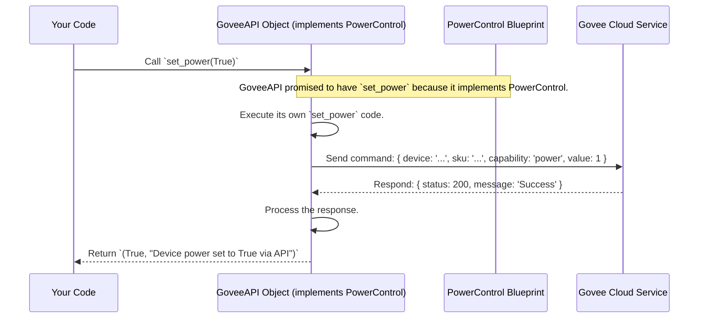

# Chapter 2: Device Control Interfaces - The Standard Sockets for Lights

In [Chapter 1: Configuration Management](01_configuration_management.md), we learned how our application gets its essential settings, like which Govee device to talk to (`device_id`) and the secret key (`api_key`) needed to communicate. Think of it like knowing the address and having the key to a specific smart light bulb.

But just knowing *which* bulb doesn't tell us *what we can do* with it. Can we turn it on? Can we change its color? Can we dim it? This chapter is about defining a standard way to talk about these capabilities.

## What's the Big Idea? Standardizing Actions

Imagine you have different smart devices: a Govee light strip, maybe a smart plug from another brand, or even a simulated light for testing. You want a consistent way to tell them "turn on" or "set color to blue". You don't want to learn a completely different set of commands for each one!

This is where **Device Control Interfaces** come in. They act like **standard electrical sockets** or **blueprints** for device abilities.

*   **Power Socket:** Defines *how* to plug something in to get power (e.g., Turn On/Off).
*   **Color Socket:** Defines *how* to tell a device which color to display.
*   **Brightness Socket:** Defines *how* to adjust the brightness level.

An "interface" in programming is a **contract**. It says: "If you claim to have power control, you *must* provide a way to `set_power` and `get_power_state` exactly like this." Any part of our code that knows how to control a Govee device (like the `GoveeAPI` client we'll see more of soon) has to promise to follow these contracts.

## The Blueprints: `PowerControl`, `ColorControl`, `BrightnessControl`

In our project, these blueprints are defined in `src/govee_mcp_server/interfaces.py` using Python's `abc` (Abstract Base Classes) module. Let's look at a simplified version of `PowerControl`:

```python
# Simplified from src/govee_mcp_server/interfaces.py
from abc import ABC, abstractmethod
from typing import Tuple # Used to describe the function's output type

class PowerControl(ABC): # ABC means "This is a blueprint/interface"
    """Blueprint for turning things on/off."""

    @abstractmethod # Means: Any class using this blueprint MUST provide this method
    async def set_power(self, state: bool) -> Tuple[bool, str]:
        """
        Blueprint for a function to turn the device on (True) or off (False).

        It MUST take 'state' (True/False) as input.
        It MUST return a pair: (was it successful?, a message).
        """
        pass # The blueprint only defines *what*, not *how*. Implementations fill this.

    @abstractmethod
    async def get_power_state(self) -> Tuple[bool, str]:
        """
        Blueprint for checking if the device is currently on.

        It MUST return a pair: (is it on?, a message).
        """
        pass
```

**Explanation:**
*   `class PowerControl(ABC):`: Defines a blueprint named `PowerControl`. `ABC` marks it as an abstract blueprint, not a real, usable object on its own.
*   `@abstractmethod`: This marker says "Any real class that claims to be a `PowerControl` *must* provide its own version of the function below."
*   `async def set_power(...)`: Defines the *signature* of the `set_power` function:
    *   `async`: It's designed to work asynchronously (we'll see why in later chapters).
    *   `self`: A standard reference to the object itself.
    *   `state: bool`: It must accept one input argument named `state`, which must be a boolean (`True` or `False`).
    *   `-> Tuple[bool, str]`: It must return a "tuple" (an ordered pair) containing a boolean (success/failure) and a string (a status message).
*   `pass`: In the blueprint, the methods don't actually *do* anything. They just define the requirements.

Similarly, we have `ColorControl` (requiring `set_color`, `get_color`) and `BrightnessControl` (requiring `set_brightness`, `get_brightness`).

## Using the Blueprints: The `GoveeAPI` Class

Okay, we have blueprints. Now we need something concrete that *follows* these blueprints. In our project, the main class responsible for talking to the actual Govee Cloud service is `GoveeAPI` (found in `src/govee_mcp_server/api.py`).

Look at the very first line defining this class:

```python
# Simplified from src/govee_mcp_server/api.py
from .interfaces import PowerControl, ColorControl, BrightnessControl
# ... other imports ...
from .config import GoveeConfig

class GoveeAPI(PowerControl, ColorControl, BrightnessControl):
    """
    Govee API client that PROMISES to follow the rules
    of PowerControl, ColorControl, and BrightnessControl.
    """
    def __init__(self, config: GoveeConfig):
        """Gets the API key and device details when created."""
        self.config = config
        # ... other setup ...

    # --- Implementing PowerControl ---
    async def set_power(self, state: bool) -> Tuple[bool, str]:
        """Turns the actual Govee device on/off using its API."""
        print(f"Actually telling Govee API to set power: {state}")
        # ... code to make the real web request to Govee ...
        # (We'll look inside this in Chapter 3!)
        success = True # Let's assume it worked for now
        message = f"Device power set to {state} via API"
        return success, message

    async def get_power_state(self) -> Tuple[bool, str]:
        """Asks the Govee API if the device is on."""
        print("Actually asking Govee API for power state")
        # ... code to make the real web request to Govee ...
        is_on = True # Let's pretend it's on
        message = "Device is currently ON (from API)"
        return is_on, message

    # --- Implementing ColorControl (methods like set_color) ---
    # ... implementations for set_color, get_color ...

    # --- Implementing BrightnessControl (methods like set_brightness) ---
    # ... implementations for set_brightness, get_brightness ...

```

**Explanation:**
*   `class GoveeAPI(PowerControl, ColorControl, BrightnessControl):`: This line is the **promise**. It declares that the `GoveeAPI` class will provide *concrete implementations* for all the `@abstractmethod` functions defined in the `PowerControl`, `ColorControl`, and `BrightnessControl` blueprints.
*   If `GoveeAPI` *forgot* to include, say, the `set_power` method, Python would give an error when you try to use it, because it broke its promise!
*   Inside `GoveeAPI`, the `set_power` method now has real code (represented by the `print` statement and comments for now) that actually interacts with the Govee web service. Crucially, its signature (`async def set_power(self, state: bool) -> Tuple[bool, str]`) exactly matches the blueprint.

**Analogy:** If `PowerControl` is the blueprint for a standard wall socket, `GoveeAPI` is like a specific brand of smart plug that is built according to that blueprint and actually connects to the house wiring (the Govee Cloud API) when used.

## Benefits: Why Is This Structure Useful?

1.  **Consistency:** Any code that needs to turn a light on/off can expect *any* object that follows the `PowerControl` blueprint to have a `.set_power(state)` method. It doesn't need to know if it's talking to a `GoveeAPI` object, a `GoveeBluetooth` object (if we added one later), or even a `FakeLightForTesting` object, as long as they all follow the blueprint.
2.  **Flexibility (Swappability):** Imagine we want to add control via Bluetooth later. We could create a `GoveeBluetooth(PowerControl, ...)` class. Code that only cares about power control could use either `GoveeAPI` or `GoveeBluetooth` interchangeably without modification, because both fulfill the `PowerControl` contract.
3.  **Testability:** It's much easier to write tests. We can create a simple `MockPowerControl` class that just pretends to turn things on/off without actually talking to Govee, and use it to test other parts of our application that rely on power control.

## Safety First: Input Validation with Decorators

What if someone tries to set the color to RGB values like `(300, -50, 1000)`? Those aren't valid! Red, Green, and Blue values must be between 0 and 255.

Interfaces can also help enforce rules like this. We use a feature called **decorators**. Think of a decorator as a wrapper function that adds extra behavior (like a check) before or after another function runs.

In `src/govee_mcp_server/interfaces.py`, we have a `validate_rgb` decorator:

```python
# Simplified from src/govee_mcp_server/interfaces.py
from .exceptions import GoveeValidationError # Our custom error for bad input

def validate_rgb(func):
    """A function that wraps another function to check RGB values first."""
    async def wrapper(self, r: int, g: int, b: int, *args, **kwargs):
        print(f"VALIDATOR: Checking RGB ({r}, {g}, {b})") # Show the check
        is_valid = True
        for name, value in [('Red', r), ('Green', g), ('Blue', b)]:
            if not (isinstance(value, int) and 0 <= value <= 255):
                print(f"VALIDATOR: Invalid value for {name}: {value}")
                is_valid = False
                # Stop! Raise an error instead of calling the real function.
                raise GoveeValidationError(f"{name} value must be an integer 0-255")

        if is_valid:
            # If all checks pass, call the original function (like set_color)
            print("VALIDATOR: Looks good! Proceeding.")
            return await func(self, r, g, b, *args, **kwargs)
    return wrapper
```

And we apply this decorator to the `set_color` blueprint in `ColorControl`:

```python
# Simplified from src/govee_mcp_server/interfaces.py
# ... imports ...

class ColorControl(ABC):
    @abstractmethod
    @validate_rgb # <-- Apply the validator HERE
    async def set_color(self, r: int, g: int, b: int) -> Tuple[bool, str]:
        """
        Set device color. The @validate_rgb ensures values are checked
        BEFORE the actual implementation in GoveeAPI is even called.
        """
        pass

    # ... get_color method ...
```

**Explanation:**
*   `@validate_rgb`: This line attaches the `validate_rgb` wrapper to the `set_color` method definition in the blueprint.
*   Now, whenever *any* implementation of `set_color` (like the one in `GoveeAPI`) is called, the `validate_rgb` code runs *first*.
*   If the RGB values are invalid (e.g., `r=300`), `validate_rgb` raises a `GoveeValidationError` immediately, preventing the invalid values from ever reaching the code that talks to the Govee API.

**Analogy:** The `@validate_rgb` decorator is like a safety fuse built into the "Color Socket" blueprint. It checks the "electrical current" (the RGB values) before letting it flow to the actual device, preventing damage or errors.

## How it Works Under the Hood

Let's trace what happens when some user code tries to turn the light on using our `GoveeAPI` object, which implements the `PowerControl` interface:



If we called `set_color` instead, the flow would be similar, but the `@validate_rgb` check would happen right after `UserCode` calls `set_color` on `GoveeObj`, before the object tries to talk to the `GoveeCloud`.

## Conclusion

You've now learned about **Device Control Interfaces**, the crucial blueprints that define *what* actions can be performed on a device in a standard way.

*   Interfaces (`PowerControl`, `ColorControl`, etc.) act as **contracts** or **standard sockets**.
*   They use `ABC` and `@abstractmethod` to define required functions (like `set_power`, `get_color`).
*   Classes like `GoveeAPI` **implement** these interfaces, promising to provide the required functions.
*   This brings **consistency**, **flexibility**, and **testability** to our code.
*   **Decorators** like `@validate_rgb` can be attached to interface methods to add checks (like input validation) automatically.

We have the configuration (Chapter 1) and the blueprints for control (Chapter 2). Now, let's dive into the specific class that follows these blueprints and actually communicates with the Govee servers.

Get ready to explore the engine room in [Chapter 3: Govee API Client](03_govee_api_client.md)!

---

Generated by [AI Codebase Knowledge Builder](https://github.com/The-Pocket/Tutorial-Codebase-Knowledge)