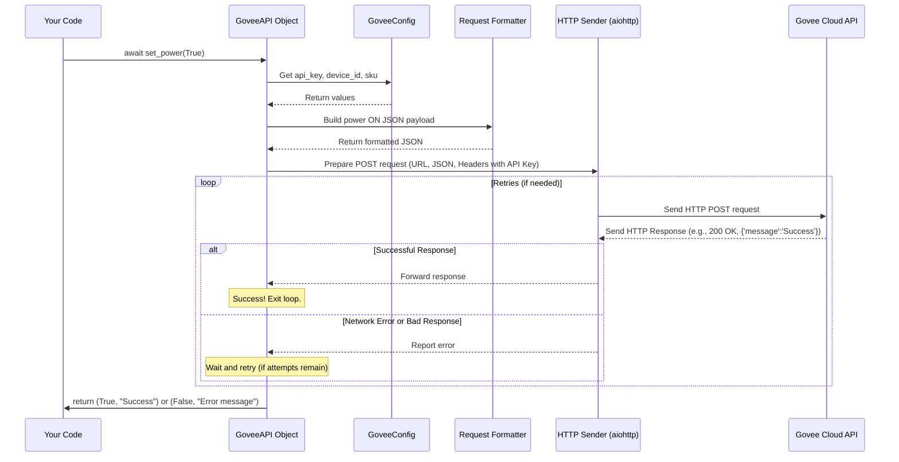

# Chapter 3: Govee API Client - The Messenger to Govee

In [Chapter 1: Configuration Management](01_configuration_management.md), we learned how our application gets its essential details (like your API Key and Device ID). Then, in [Chapter 2: Device Control Interfaces](02_device_control_interfaces.md), we saw how we create standard blueprints (`PowerControl`, `ColorControl`, etc.) that define *what* actions we can perform, like turning a light on or changing its color.

But defining a blueprint for a "power socket" doesn't actually provide electricity! We need a component that takes our standard command (like "turn power on") and translates it into the specific language the Govee Cloud understands, then actually sends that message over the internet.

This chapter introduces the **Govee API Client** – the heart of our communication system.

## What's the Big Idea? Talking the Govee Talk

Imagine you need to send instructions to someone who only speaks a very specific, technical language (the "Govee language"). You wouldn't just shout your request in English! You'd hire a specialized **translator or diplomat** who knows:

1.  **The Language:** Exactly how to phrase the request (the structure, the vocabulary).
2.  **The Protocol:** How to properly address the message and where to send it (the specific web address or "endpoint").
3.  **The Credentials:** How to prove they are allowed to speak on your behalf (using your API Key).
4.  **Handling Issues:** What to do if the message doesn't get through (like trying again or reporting an error).

The **Govee API Client** (implemented in our project as the `GoveeAPI` class in `src/govee_mcp_server/api.py`) is exactly this translator. It takes simple commands defined by our interfaces (like `set_power(True)`) and handles all the complex details of communicating with the actual Govee servers.

## Key Roles of the Govee API Client

Let's break down the main jobs of this crucial component:

1.  **Using Credentials:** It takes the `GoveeConfig` object (containing your API Key, Device ID, and SKU) that we loaded in [Chapter 1: Configuration Management](01_configuration_management.md). It needs these to authenticate itself and specify which device to control.
2.  **Formatting Requests:** Govee's API expects commands in a very specific format, usually JSON (a standard way to structure data). The client builds these correctly formatted messages. For example, turning a light on isn't just sending "ON"; it's sending structured data like `{"device": "YOUR_ID", "sku": "YOUR_SKU", "capability": {... "value": 1 ...}}`.
3.  **Sending Over the Internet:** It uses standard web protocols (HTTP) to send these formatted requests to the correct Govee API server address (like `https://openapi.api.govee.com/...`).
4.  **Processing Responses:** Govee's servers send back replies, also usually in JSON. The client needs to understand these replies to know if the command worked and to get information (like the current brightness).
5.  **Handling Network Hiccups:** The internet isn't always perfect. Connections can drop, or servers might be slow. The client includes logic to automatically **retry** sending a request a few times if it fails initially. It also handles specific errors like timeouts or connection failures gracefully.

## Using the Govee API Client

Let's see how simple it looks from the outside, thanks to the groundwork laid in previous chapters.

First, we need the configuration and then we create an instance of the `GoveeAPI` client:

```python
# --- Conceptual Example ---
from govee_mcp_server.config import load_config
from govee_mcp_server.api import GoveeAPI
import asyncio # We need this for 'async' functions

async def main():
    # 1. Load the configuration (API Key, Device ID, SKU)
    try:
        config = load_config()
        print(f"Loaded config for device: {config.device_id}")
    except Exception as e:
        print(f"Error loading config: {e}")
        return

    # 2. Create the Govee API Client instance, giving it the config
    api_client = GoveeAPI(config=config)
    print("GoveeAPI client created.")

    # 3. Now we can use the client to control the device!
    #    (Example in the next section)

    # Don't forget to close the connection when done
    await api_client.close()
    print("API client connection closed.")

# Run the example function
# asyncio.run(main()) # You'd typically run this in a real script
```

**Explanation:**
1.  We use `load_config()` from [Chapter 1: Configuration Management](01_configuration_management.md) to get our settings.
2.  We create `GoveeAPI` by passing the `config` object to it. The client now knows *which* device to talk to and *how* to authenticate.
3.  The `api_client` object is now ready to send commands.
4.  `await api_client.close()` is important to clean up network connections gracefully when we're finished.

Now, let's use the client. Remember how `GoveeAPI` implements the interfaces from [Chapter 2: Device Control Interfaces](02_device_control_interfaces.md)? We can call those interface methods directly on our `api_client` object:

```python
# --- Continuing the conceptual example ---

# Assume 'api_client' was created as shown above

# Let's turn the light ON
print("Attempting to turn power ON...")
success, message = await api_client.set_power(True)

if success:
    print(f"Success! Govee replied: '{message}'")
else:
    print(f"Failed. Govee error: '{message}'")

# Example Output (if successful):
# Attempting to turn power ON...
# Success! Govee replied: 'Success'

# Example Output (if failed, e.g., wrong API key):
# Attempting to turn power ON...
# Failed. Govee error: 'API error: 401 - Invalid API Key'
```

**Explanation:**
*   We call `api_client.set_power(True)`. Even though this looks simple, behind the scenes, the `GoveeAPI` client is doing all the hard work: formatting the request, adding the API key, sending it, and interpreting the response.
*   Because our interfaces (and thus the `GoveeAPI` implementation) are defined to return a `Tuple[bool, str]`, we get back whether the operation succeeded (`success`) and a message from the API (`message`).

## Under the Hood: How a Command is Sent

Let's trace the journey of a `set_power(True)` command:

1.  **You Call:** Your code calls `await api_client.set_power(True)`.
2.  **Client Receives:** The `set_power` method inside the `GoveeAPI` object starts running.
3.  **Get Credentials:** It accesses the stored `config` object to retrieve `api_key`, `device_id`, and `sku`.
4.  **Build the Message:** It constructs the specific JSON payload Govee expects for power control. This might look something like:
    ```json
    {
      "requestId": "some_unique_id", // Often based on time
      "payload": {
        "sku": "H6159", // Your device model
        "device": "AB:CD:EF...", // Your device ID
        "capability": {
          "type": "devices.capabilities.on_off",
          "instance": "powerSwitch",
          "value": 1 // 1 means ON, 0 means OFF
        }
      }
    }
    ```
5.  **Prepare the Envelope:** It gets ready to make an HTTP POST request. It sets the destination URL (`https://openapi.api.govee.com/router/api/v1/device/control`) and adds required headers, most importantly the `Govee-API-Key` header with your key.
6.  **Send:** It sends the request over the internet using an HTTP library (`aiohttp` in our case).
7.  **Wait & Listen:** It waits for Govee's servers to respond.
8.  **Check Reply:** Govee sends back a response (e.g., HTTP status code 200 OK and some JSON data like `{"message": "Success"}`).
9.  **Handle Problems (Retry?):** If there was a network error (e.g., timeout) or a bad response from Govee (e.g., status 500 Server Error), the client might wait a second and try sending the request again (up to a certain limit).
10. **Translate Result:** Based on the final response (or lack thereof after retries), it determines if the command was successful (`True` or `False`) and extracts a relevant message.
11. **Return:** It returns the `(success, message)` tuple back to your code.

Here's a simplified diagram of this flow:



## Inside the Code: Key Parts of `GoveeAPI`

Let's peek at simplified snippets from `src/govee_mcp_server/api.py` to see how this is implemented.

**1. Initialization (`__init__`)**

```python
# Simplified from src/govee_mcp_server/api.py
import aiohttp # Library for making async web requests
from .config import GoveeConfig
# ... other imports ...

class GoveeAPI(PowerControl, ColorControl, BrightnessControl):
    # ... constants like BASE_URL, MAX_RETRIES ...

    def __init__(self, config: GoveeConfig):
        """Initialize API client with configuration."""
        self.config = config # Store the config object
        self.session: Optional[aiohttp.ClientSession] = None # Network session setup later
        # ... maybe other setup ...
        print(f"GoveeAPI initialized for device {self.config.device_id}")
```

**Explanation:**
*   The `__init__` method runs when you create `GoveeAPI(config=...)`.
*   It simply stores the passed-in `config` object so other methods in the class can access the API key, device ID, etc., using `self.config.api_key`.
*   It also prepares a variable `self.session` to hold the network connection details, which will be created when needed.

**2. Making the Request (`_make_request`)**

This is the core helper method that handles sending *any* request, including retries and basic error handling.

```python
# Simplified from src/govee_mcp_server/api.py
import asyncio
# ... other imports ...

class GoveeAPI:
    # ... __init__ and constants ...

    async def _ensure_session(self) -> None:
        """Create network session if needed."""
        if self.session is None or self.session.closed:
            print("Creating new network session...")
            self.session = aiohttp.ClientSession(
                headers={"Govee-API-Key": self.config.api_key}, # Set API key for ALL requests!
                timeout=aiohttp.ClientTimeout(total=10) # 10-second timeout
            )

    async def _make_request(self, method: str, endpoint: str, **kwargs):
        """Make HTTP request with retries."""
        await self._ensure_session() # Make sure we have a network session

        last_error = None
        for attempt in range(self.MAX_RETRIES): # Try up to MAX_RETRIES times
            try:
                print(f"Attempt {attempt+1}: Sending {method} to {endpoint}")
                async with self.session.request(method, f"{self.BASE_URL}/{endpoint}", **kwargs) as response:
                    data = await response.json()
                    print(f"Received status: {response.status}")
                    if response.status == 200: # HTTP 200 means OK!
                        return data, data.get('message', 'Success') # Return data and message
                    else:
                        # Govee returned an error status
                        last_error = GoveeAPIError(f"API error: {response.status} - {data.get('message', 'Unknown')}")

            except asyncio.TimeoutError:
                last_error = GoveeTimeoutError("Request timed out")
            except aiohttp.ClientError as e:
                last_error = GoveeConnectionError(f"Connection error: {e}")

            # If error occurred, wait before retrying (increasing delay)
            if attempt < self.MAX_RETRIES - 1:
                delay = self.RETRY_DELAY * (attempt + 1)
                print(f"Request failed. Retrying in {delay}s...")
                await asyncio.sleep(delay)

        # If all retries failed, raise the last encountered error
        print("Max retries exceeded.")
        raise last_error

```

**Explanation:**
*   `_ensure_session`: Checks if a network `session` exists; if not, it creates one using `aiohttp`. Crucially, it sets the `Govee-API-Key` header here, so it's automatically included in all requests made with this session. It also sets a timeout.
*   The main loop runs `MAX_RETRIES` times (e.g., 3 times).
*   `try...except`: It tries to make the request using `self.session.request(...)`. It catches specific network errors like `TimeoutError` or general `ClientError`.
*   `if response.status == 200`: Checks if Govee reported success. If yes, it returns the data.
*   `else`: If Govee returns an error code (like 401 Unauthorized or 400 Bad Request), it creates a `GoveeAPIError`.
*   Retry Logic: If an error occurs, it waits (`asyncio.sleep`) before the next attempt. The delay increases with each retry.
*   If all retries fail, it `raise`s the last error it encountered, which can then be caught by the calling method (like `set_power`).

**3. Implementing an Interface Method (`set_power`)**

This method uses `_make_request` to perform a specific action.

```python
# Simplified from src/govee_mcp_server/api.py
from time import time # To generate a unique request ID

class GoveeAPI:
    # ... __init__, _make_request ...

    async def set_power(self, state: bool) -> Tuple[bool, str]:
        """Implement PowerControl.set_power"""
        try:
            # Prepare the specific JSON payload for the power command
            payload = {
                "requestId": str(int(time())), # Unique ID for the request
                "payload": {
                    "sku": self.config.sku,
                    "device": self.config.device_id,
                    "capability": {
                        "type": "devices.capabilities.on_off",
                        "instance": "powerSwitch",
                        "value": 1 if state else 0 # Convert True/False to 1/0
                    }
                }
            }
            # Call the generic request handler
            _, message = await self._make_request(
                method="POST",
                endpoint="router/api/v1/device/control", # Govee's endpoint for control
                json=payload # Pass the JSON data
            )
            return True, message # If _make_request succeeded, return True
        except GoveeError as e:
            # If _make_request raised an error after retries
            print(f"set_power failed: {e}")
            return False, str(e) # Return False and the error message
```

**Explanation:**
*   It builds the `payload` dictionary exactly as Govee requires for the `on_off` capability, using the `device_id` and `sku` from `self.config`.
*   It calls `self._make_request`, telling it to use the `POST` method, the specific `/device/control` endpoint, and the `payload` as JSON data.
*   `try...except GoveeError`: It wraps the call to `_make_request`. If `_make_request` succeeds, it returns `(True, message)`. If `_make_request` eventually fails (after retries) and raises a `GoveeError` (or one of its subtypes like `GoveeAPIError`, `GoveeTimeoutError`), the `except` block catches it and returns `(False, error_message)`.

The other methods (`set_color`, `get_brightness`, etc.) follow a very similar pattern: build the specific payload for that capability and call `_make_request`.

## Conclusion

You've now explored the **Govee API Client (`GoveeAPI`)**, the component that acts as our application's diplomat to the Govee Cloud.

You learned:
*   Its role is to translate standard commands (from our interfaces) into Govee's specific API language.
*   It uses the configuration ([Chapter 1: Configuration Management](01_configuration_management.md)) for authentication and targeting.
*   It handles formatting requests, sending them via HTTP, and processing responses.
*   It includes essential features like automatic retries and handling network errors (`TimeoutError`, `ConnectionError`).
*   Internally, it uses a helper (`_make_request`) to manage the common parts of API communication.
*   Methods like `set_power` build the specific command payload and rely on `_make_request` to send it.

With the configuration loaded, interfaces defined, and the API client ready to communicate, we have the core logic in place. But how does a user actually *trigger* these actions?

Next, we'll look at one way users can interact with our application: the command line. Let's move on to [Chapter 4: Command Line Interface (CLI)](04_command_line_interface__cli_.md)!

---

Generated by [AI Codebase Knowledge Builder](https://github.com/The-Pocket/Tutorial-Codebase-Knowledge)