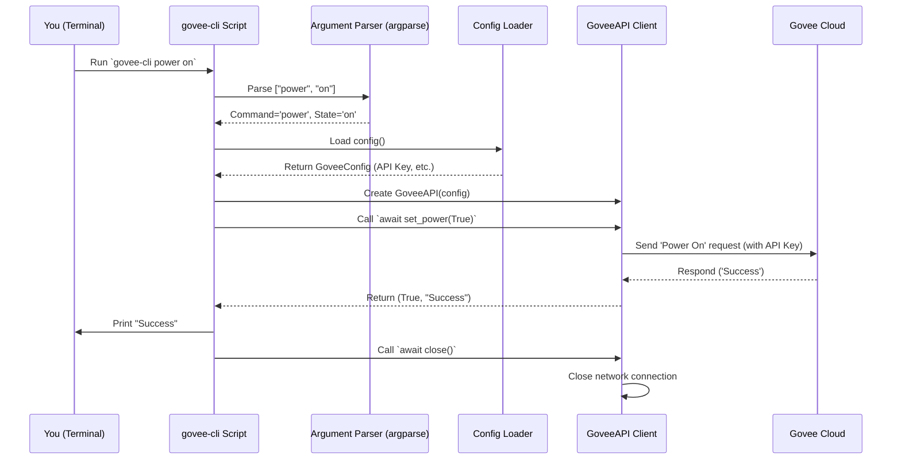

# Chapter 4: Command Line Interface (CLI) - Your Simple Remote Control

In the [Chapter 3: Govee API Client](03_govee_api_client.md), we built the "translator" – the `GoveeAPI` client that knows how to talk directly to the Govee Cloud service using your API key and device details. It can turn the light on, change its color, and more, based on the blueprints from [Chapter 2: Device Control Interfaces](02_device_control_interfaces.md).

But how do *you*, the user, tell this `GoveeAPI` client what to do? You need a way to interact with it. One of the simplest ways is through a **Command Line Interface**, or **CLI**.

## What's the Big Idea? Direct Control from Your Terminal

Imagine you have a fancy TV system with a complex universal remote (that will be our [MCP Server Implementation](05_mcp_server_implementation.md) later). But sometimes, you just want a really simple, basic remote with only a few buttons: Power On/Off, maybe Volume Up/Down. It's quick, easy, and gets the job done for simple tasks.

The **Command Line Interface (CLI)** for our project is like that simple remote control. It lets you interact with your Govee light directly by typing commands into your computer's **terminal** (also called a command prompt or shell).

Instead of needing a full graphical application or starting the main server, you can just type something like:

```bash
govee-cli power on
```

or

```bash
govee-cli color 255 0 0 # Set color to Red
```

This provides a fast and straightforward way to manually control your light or even use it in simple scripts.

## How Does It Work? Typing Commands

When you use a CLI tool, here's the basic flow:
1.  **You Type:** You open your terminal and type the name of the program, followed by the action you want to perform, and any necessary details (arguments).
    *   `govee-cli` is the program name.
    *   `power` or `color` is the command (the action).
    *   `on` or `255 0 0` are the arguments (the details for the action).
2.  **Program Reads:** The `govee-cli` program reads the command and arguments you typed. It uses a helper library (in Python, often `argparse`) to understand what you're asking it to do.
3.  **Program Acts:** Based on your command, it uses the **same `GoveeAPI` client** from [Chapter 3: Govee API Client](03_govee_api_client.md) to send the instruction to your Govee light via the Govee Cloud.
4.  **Program Reports:** It usually prints a message back to your terminal telling you if the command was successful or if there was an error.

## Using the `govee-cli`

Let's try some commands! (Make sure you have your `.env` file set up as described in [Chapter 1: Configuration Management](01_configuration_management.md) so the CLI knows your API key and device).

**(Note: You might need to install the project first or run it using `python -m govee_mcp_server.cli ...` depending on your setup. For simplicity, we'll assume `govee-cli` is available.)**

1.  **Get Help:** See what commands are available.
    ```bash
    govee-cli --help
    ```
    *   **Output:** Shows a list of commands like `power`, `color`, `brightness`, `status` and how to use them.

2.  **Turn Power On:**
    ```bash
    govee-cli power on
    ```
    *   **Output (if successful):** `Success` (or a similar message from the Govee API). Your light should turn on!

3.  **Turn Power Off:**
    ```bash
    govee-cli power off
    ```
    *   **Output (if successful):** `Success`. Your light should turn off.

4.  **Set Color (Red):**
    ```bash
    govee-cli color 255 0 0
    ```
    *   **Output (if successful):** `Success`. Your light should turn red.
    *   **Note:** The arguments are Red, Green, Blue values (0-255).

5.  **Set Brightness (50%):**
    ```bash
    govee-cli brightness 50
    ```
    *   **Output (if successful):** `Success`. Your light's brightness should change.
    *   **Note:** The argument is the brightness percentage (0-100).

6.  **Check Status:** Get the current state of the light.
    ```bash
    govee-cli status
    ```
    *   **Output (example):**
        ```
        Power: ON
        Color: RGB(255, 0, 0)
        Brightness: 50%
        ```

If something goes wrong (like a typo in the command, invalid color values, or a problem talking to Govee), the CLI will usually print an error message.

## Under the Hood: What Happens When You Type `govee-cli power on`?

Let's trace the steps behind the scenes:

1.  **Terminal:** You hit Enter after typing `govee-cli power on`. The terminal finds the `govee-cli` program and runs it, passing `power` and `on` as inputs.
2.  **CLI Script Starts:** The Python script `src/govee_mcp_server/cli.py` begins running.
3.  **Parse Arguments:** The script uses the `argparse` library to figure out: "The user wants the `power` command with the `state` argument set to `on`."
4.  **Load Config:** It calls `load_config()` from [Chapter 1: Configuration Management](01_configuration_management.md) to read your `GOVEE_API_KEY`, `GOVEE_DEVICE_ID`, and `GOVEE_SKU` from the environment (or `.env` file).
5.  **Create API Client:** It creates an instance of the `GoveeAPI` client (from [Chapter 3: Govee API Client](03_govee_api_client.md)), giving it the configuration details it just loaded. `api_client = GoveeAPI(config=...)`
6.  **Call API Method:** Since the command was `power on`, the script calls the corresponding method on the API client: `await api_client.set_power(True)`. (It converts "on" to the boolean `True`).
7.  **API Client Works:** The `GoveeAPI` client does its job (as described in Chapter 3): formats the request, sends it to the Govee Cloud with the API key, gets the response, handles retries if needed.
8.  **Get Result:** The `set_power` method returns a result (e.g., `(True, "Success")`) back to the CLI script.
9.  **Print Output:** The CLI script takes the result message ("Success") and prints it to your terminal.
10. **Cleanup:** The script makes sure to close the network connection used by the `GoveeAPI` client (`await api_client.close()`).

Here's a diagram showing this flow:



## Inside the Code: `src/govee_mcp_server/cli.py`

Let's look at simplified parts of the code that make this work.

**1. Defining the Commands (`create_parser`)**

This function sets up `argparse` to understand the commands and arguments.

```python
# Simplified from src/govee_mcp_server/cli.py
import argparse

def create_parser() -> argparse.ArgumentParser:
    """Create and configure argument parser."""
    parser = argparse.ArgumentParser(description='Control Govee LED device')
    # Create categories for commands (like 'power', 'color')
    subparsers = parser.add_subparsers(dest='command', help='Commands', required=True)

    # --- Define the 'power' command ---
    power_parser = subparsers.add_parser('power', help='Turn device on/off')
    # It needs one argument: 'state', which must be 'on' or 'off'
    power_parser.add_argument('state', choices=['on', 'off'], help='Power state')

    # --- Define the 'color' command ---
    color_parser = subparsers.add_parser('color', help='Set device color')
    # It needs three integer arguments: red, green, blue
    color_parser.add_argument('red', type=int, help='Red value (0-255)')
    color_parser.add_argument('green', type=int, help='Green value (0-255)')
    color_parser.add_argument('blue', type=int, help='Blue value (0-255)')

    # --- Define other commands similarly (brightness, status) ---
    # ... parser setup for brightness ...
    # ... parser setup for status ...

    return parser
```

**Explanation:**
*   `argparse.ArgumentParser`: Creates the main parser object.
*   `parser.add_subparsers()`: Allows us to define distinct commands (like `git commit`, `git push`). `dest='command'` stores which command was used.
*   `subparsers.add_parser('power', ...)`: Defines the `power` command.
*   `power_parser.add_argument('state', ...)`: Specifies that the `power` command requires an argument named `state`, which must be either the text `"on"` or `"off"`.
*   Similarly, it defines the `color` command and its required `red`, `green`, `blue` integer arguments.

**2. Handling a Specific Command (`handle_power`)**

Each command has a small function to handle its logic.

```python
# Simplified from src/govee_mcp_server/cli.py
from .api import GoveeAPI # We need the API client class
from .exceptions import GoveeError # We need our custom error

async def handle_power(api: GoveeAPI, state: str) -> None:
    """Handle the 'power' command."""
    # Convert 'on'/'off' string to True/False boolean
    is_on = (state == 'on')

    print(f"Sending command: Power {'ON' if is_on else 'OFF'}...")
    # Call the actual API client method
    success, message = await api.set_power(is_on)

    # Check the result from the API client
    if success:
        print(f"Result: {message}")
    else:
        # If the API client reported failure, raise an error to stop the script
        print(f"Error reported by API: {message}")
        raise GoveeError(f"Failed to set power: {message}")
```

**Explanation:**
*   Takes the `api` client object and the parsed `state` ("on" or "off") as input.
*   Converts the string `state` into a boolean `is_on` (`True` or `False`).
*   Calls the corresponding method on the API client: `await api.set_power(is_on)`. This is where the communication with Govee happens (via the API client).
*   Prints the result or raises an error if the API call failed.

**3. The Main Script Logic (`main` function)**

This function ties everything together: load config, parse args, call the right handler.

```python
# Simplified from src/govee_mcp_server/cli.py
import sys
import asyncio
from .config import load_config
from .api import GoveeAPI
from .exceptions import GoveeError

# ... create_parser() defined above ...
# ... handle_power(), handle_color(), etc. defined above ...

async def main() -> None:
    """Main CLI entrypoint."""
    api = None # Initialize api variable
    try:
        # 1. Load configuration
        config = load_config()
        print(f"Loaded config for device: {config.device_id}")

        # 2. Create the Govee API Client
        api = GoveeAPI(config)
        print("GoveeAPI client ready.")

        # 3. Parse command line arguments
        parser = create_parser()
        args = parser.parse_args() # Reads sys.argv (what you typed)
        print(f"Executing command: {args.command}")

        # 4. Call the appropriate handler based on the command
        if args.command == 'power':
            await handle_power(api, args.state)
        elif args.command == 'color':
            await handle_color(api, args.red, args.green, args.blue)
        # ... elif for brightness ...
        # ... elif for status ...
        else:
            # Should not happen if parser is configured correctly
            print(f"Unknown command: {args.command}")
            parser.print_help()
            sys.exit(1) # Exit with an error code

    except GoveeError as e:
        # Catch errors from our API client or handlers
        print(f"\nOperation Failed: {str(e)}")
        sys.exit(1) # Exit with an error code
    except Exception as e:
        # Catch any other unexpected errors
        print(f"\nAn Unexpected Error Occurred: {str(e)}")
        sys.exit(1) # Exit with an error code
    finally:
        # 5. ALWAYS try to clean up the API client connection
        if api:
            print("Closing API connection...")
            await api.close()
            print("Connection closed.")

# --- This part runs the main async function ---
# def cli_main():
#    asyncio.run(main())
# if __name__ == "__main__":
#    cli_main()
```

**Explanation:**
1.  Calls `load_config()` to get settings.
2.  Creates the `GoveeAPI` instance.
3.  Calls `parser.parse_args()` which uses `argparse` to figure out which command and arguments were given.
4.  Uses an `if/elif` block to check `args.command` and call the correct handler function (like `handle_power` or `handle_color`), passing the `api` client and the specific arguments needed (like `args.state` or `args.red`).
5.  Includes `try...except` blocks to catch potential errors (like configuration errors, API errors, or validation errors) and print user-friendly messages before exiting.
6.  The `finally` block ensures that `await api.close()` is called to release network resources, even if an error occurred.

## Conclusion

You've learned about the **Command Line Interface (CLI)**, a simple way to directly control your Govee device from the terminal.

*   It acts like a **basic remote control**.
*   You use it by typing commands like `govee-cli power on`.
*   It **parses** your command and arguments using `argparse`.
*   Crucially, it uses the **same `GoveeAPI` client** from [Chapter 3: Govee API Client](03_govee_api_client.md) to interact with the Govee Cloud.
*   It provides immediate feedback in your terminal.

The CLI is great for quick tests, manual control, or simple automation scripts. However, it requires you to be at your computer typing commands. What if we want other applications or systems to control the light over a network, perhaps using a standard protocol?

That's where the main part of our project comes in: the server. Let's move on to [Chapter 5: MCP Server Implementation](05_mcp_server_implementation.md) to see how we build a server that listens for commands using the Mission Control Protocol (MCP).

---

Generated by [AI Codebase Knowledge Builder](https://github.com/The-Pocket/Tutorial-Codebase-Knowledge)