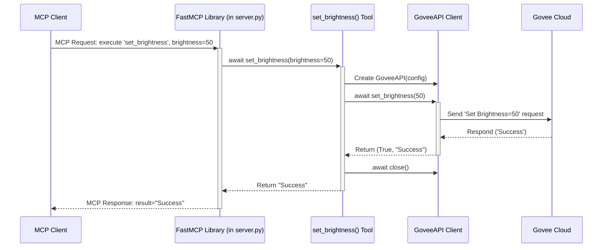

# Chapter 5: MCP Server Implementation - The Universal Remote Receiver

In [Chapter 4: Command Line Interface (CLI)](04_command_line_interface__cli_.md), we created a simple way for *you* to control your Govee light by typing commands directly into your terminal. It's like having a basic remote with just a few buttons – useful, but limited.

What if you want something more powerful? What if you want *other programs*, like an AI assistant or a smart home dashboard, to be able to control the light? They can't easily "type" commands into your terminal. They need a standardized way to send instructions over a network or through standard program communication channels.

This is where the **MCP Server** comes in. It's the core of our `govee_mcp_server` project!

## What's the Big Idea? A Standard Interface for Programs

Imagine you have various smart devices (lights, plugs, maybe a fan). You want your fancy AI assistant to control them all. It would be messy if the AI needed to learn a completely different communication method for each device!

The **Mission Control Protocol (MCP)** is designed to solve this. It's a standard way for a program (like our AI, called an **MCP Client**) to:
1.  Ask another program (our **MCP Server**) what "tools" it offers.
2.  Ask the server to use one of those tools with specific instructions.

Our `govee_mcp_server` acts as an MCP server specifically for your Govee light. It advertises "tools" like `turn_on_off`, `set_color`, `set_brightness`, and `get_status`. When an MCP client calls one of these tools, our server receives the request, uses the [Govee API Client](03_govee_api_client.md) to perform the action on the real light, and sends a standard response back.

**Analogy:** Think of the MCP server like a **universal remote control receiver** attached to your Govee light. Any device that knows the standard "universal remote language" (MCP) can send signals to this receiver, which then translates them into the specific commands your Govee light understands.

## How MCP Works: Tools and Communication

1.  **Discovery (Optional but Common):** An MCP client might first ask the server, "What capabilities or tools do you have?" Our server would respond, "I have `turn_on_off` (takes a power state: true/false), `set_color` (takes red, green, blue numbers), `set_brightness` (takes a number 0-100), and `get_status`."
2.  **Execution:** The client then sends a structured message like, "Please execute the tool named `set_color` with arguments `red=0`, `green=255`, `blue=0`."
3.  **Action:** Our server receives this, finds its `set_color` function, calls it with the provided arguments (0, 255, 0). Inside that function, it uses the `GoveeAPI` client to actually tell the Govee cloud to set the light to green.
4.  **Response:** The server sends a structured message back to the client, like, "Okay, I executed `set_color`. The result was: 'Success'."

MCP communication often happens over standard input/output (stdio) between processes or sometimes over network sockets (like TCP). Our server uses a library called `FastMCP` which handles the details of listening for these requests and sending responses in the correct MCP format.

## Implementing the Server (`src/govee_mcp_server/server.py`)

The main logic for our MCP server lives in the `src/govee_mcp_server/server.py` file. Let's look at the key parts.

**1. Setting Up the Server**

First, we import the necessary pieces and create the `FastMCP` server instance.

```python
# Simplified from src/govee_mcp_server/server.py
import sys
from mcp.server.fastmcp import FastMCP # The MCP library
from govee_mcp_server.config import load_config # To get API key etc.
from govee_mcp_server.api import GoveeAPI # To control the light
from govee_mcp_server.exceptions import GoveeError # Our custom errors

# Initialize the MCP server
mcp = FastMCP(
    "govee", # A simple name for our server
    # Define some basic info about the server
    capabilities={
        "server_info": { "name": "govee-mcp", "version": "0.1.0" }
    },
    log_level='WARNING' # Keep logs tidy
)
```

**Explanation:**
*   We import `FastMCP`, our configuration loader, and the `GoveeAPI` client.
*   `mcp = FastMCP(...)` creates the server object. We give it a name (`"govee"`) and some basic information that clients might ask for.

**2. Loading Configuration**

The server needs the API key and device details, just like the CLI did.

```python
# Simplified from src/govee_mcp_server/server.py

print("Loading configuration...", file=sys.stderr)
try:
    # Load API Key, Device ID, SKU from .env or environment
    config = load_config() # Uses the function from Chapter 1
except GoveeError as e:
    print(f"Configuration error: {e}", file=sys.stderr)
    sys.exit(1) # Stop if config fails

# 'config' now holds our GoveeConfig object
```

**Explanation:**
*   This uses the `load_config` function from [Chapter 1: Configuration Management](01_configuration_management.md) to get the necessary credentials.
*   If loading fails (e.g., missing `.env` file), it prints an error and stops.

**3. Defining the Tools**

This is where we define the actions the server can perform. We use the `@mcp.tool()` decorator to register functions as MCP tools.

```python
# Simplified from src/govee_mcp_server/server.py

print("Setting up tools...", file=sys.stderr)

# --- Tool: turn_on_off ---
@mcp.tool("turn_on_off") # Register this function as an MCP tool
async def turn_on_off(power: bool) -> str:
    """Turn the LED on (True) or off (False)."""
    api = GoveeAPI(config) # Create API client *for this request*
    try:
        # Use the API client to send the command
        success, message = await api.set_power(power)
        # Return a simple status message
        return message if success else f"Failed: {message}"
    except GoveeError as e:
        return f"Error: {str(e)}" # Handle expected errors
    finally:
        await api.close() # IMPORTANT: Clean up the connection

# --- Tool: set_color ---
@mcp.tool("set_color")
async def set_color(red: int, green: int, blue: int) -> str:
    """Set the LED color using RGB (0-255)."""
    api = GoveeAPI(config)
    try:
        # Use the API client to set the color
        success, message = await api.set_color(red, green, blue)
        return message if success else f"Failed: {message}"
    except GoveeError as e:
        return f"Error: {str(e)}"
    finally:
        await api.close()

# --- Other tools (set_brightness, get_status) defined similarly ---
# @mcp.tool("set_brightness")
# async def set_brightness(brightness: int) -> str: ...
# @mcp.tool("get_status")
# async def get_status() -> dict: ...
```

**Explanation:**
*   `@mcp.tool("tool_name")`: This magic line tells the `FastMCP` library: "When a client asks to run the tool named `turn_on_off`, execute the following function (`async def turn_on_off(...)`)."
*   `async def turn_on_off(power: bool) -> str:`: Defines the function that handles the `turn_on_off` tool.
    *   It takes `power` (a boolean: `True` or `False`) as input, just as the client specified.
    *   It's declared `async` because it uses `await` to call the asynchronous `GoveeAPI` methods.
    *   It's defined to return a `str` (a string message indicating success or failure).
*   **Inside the Tool:**
    1.  `api = GoveeAPI(config)`: A *new* instance of the [Govee API Client](03_govee_api_client.md) is created for each tool request, using the loaded configuration.
    2.  `await api.set_power(power)`: This is where the actual work happens! It calls the API client method to communicate with the Govee cloud.
    3.  `return ...`: It returns a simple string message back to the MCP framework.
    4.  `finally: await api.close()`: **Crucially**, after the tool logic is done (whether it succeeded or failed), it closes the network connection associated with the `GoveeAPI` client instance to release resources. This happens in the `finally` block to ensure cleanup.
*   The `set_color` tool follows the same pattern: decorate, define function with correct arguments, create API client, call the relevant API method (`set_color`), handle errors, return a message, and clean up the client.

**4. Running the Server**

Finally, we need code to actually start the server and make it listen for incoming MCP requests.

```python
# Simplified from src/govee_mcp_server/server.py
import asyncio

# ... other code above ...

if __name__ == "__main__": # Standard Python way to run code directly
    try:
        print("Starting MCP server...", file=sys.stderr)
        # Tell FastMCP to run, listening via standard input/output
        asyncio.run(mcp.run(transport='stdio'))
    except KeyboardInterrupt:
        # Allow stopping the server with Ctrl+C
        print("\nServer stopped by user", file=sys.stderr)
    except Exception as e:
        # Catch unexpected server errors
        print(f"Server error: {e}", file=sys.stderr)
        sys.exit(1)
```

**Explanation:**
*   `if __name__ == "__main__":`: This code runs only when you execute the `server.py` script directly (e.g., `python -m govee_mcp_server.server`).
*   `asyncio.run(mcp.run(transport='stdio'))`: This is the command that starts the `FastMCP` server.
    *   `transport='stdio'` tells it to listen for MCP requests coming in via standard input and send responses via standard output. This is a common way for programs to talk to each other locally. (MCP can also run over network sockets).
    *   `asyncio.run(...)` starts the asynchronous event loop needed for `async`/`await` functions.
*   The `try...except` blocks handle stopping the server cleanly (Ctrl+C) or catching unexpected crashes.

## Under the Hood: A Client Calls `set_brightness(50)`

Let's trace what happens when an MCP client sends a request:

1.  **Client Request:** The MCP client program sends a specially formatted message (likely JSON) via standard input to our running `server.py` process. The message essentially says: "Execute tool `set_brightness` with argument `brightness=50`."
2.  **FastMCP Receives:** The `mcp.run()` loop in our server reads this message from its standard input.
3.  **FastMCP Parses:** The `FastMCP` library parses the message, identifies the target tool (`set_brightness`), and extracts the arguments (`brightness=50`).
4.  **FastMCP Dispatches:** It finds the Python function registered with `@mcp.tool("set_brightness")`, which is our `async def set_brightness(brightness: int)` function.
5.  **Tool Function Executes:** `FastMCP` calls `await set_brightness(brightness=50)`.
    *   Inside `set_brightness`:
        *   `api = GoveeAPI(config)`: Creates a new Govee API client.
        *   `await api.set_brightness(50)`: Calls the API client method.
            *   The `GoveeAPI` client builds the JSON request, adds the API key, sends it to the Govee cloud, gets the response (e.g., "Success").
        *   The API client returns `(True, "Success")` to the `set_brightness` function.
        *   The function prepares the return string: `"Success"`.
        *   `finally: await api.close()`: The API client connection is closed.
        *   The function `return`s the string `"Success"`.
6.  **FastMCP Receives Result:** `FastMCP` gets the `"Success"` string back from the tool function.
7.  **FastMCP Responds:** `FastMCP` formats an MCP response message (likely JSON) containing the result `"Success"` and sends it back to the client program via its standard output.
8.  **Client Receives Response:** The MCP client reads the response from its standard input and knows the command was successful.

Here's a diagram of that flow:



## Conclusion

You've now learned how the **MCP Server Implementation** works in `govee_mcp_server`:

*   It acts as a **standardized interface** (like a universal remote receiver) for controlling the Govee device, designed to be used by *other programs* (MCP clients).
*   It uses the **Mission Control Protocol (MCP)** standard for communication.
*   It leverages the `FastMCP` library to handle incoming requests and outgoing responses.
*   It defines specific **tools** (`turn_on_off`, `set_color`, etc.) using the `@mcp.tool` decorator.
*   Each tool function uses the [Govee API Client](03_govee_api_client.md) (created per-request) to interact with the actual Govee device via the cloud.
*   Proper cleanup (closing the API client) is essential within each tool.

This server provides a powerful and flexible way to integrate your Govee light control into larger systems. However, real-world interactions aren't always perfect. What happens if the Govee API returns an error, or the network connection fails, or the client sends invalid input? We need robust ways to handle these situations.

Let's explore how we manage errors gracefully in [Chapter 6: Custom Error Handling](06_custom_error_handling.md).

---

Generated by [AI Codebase Knowledge Builder](https://github.com/The-Pocket/Tutorial-Codebase-Knowledge)