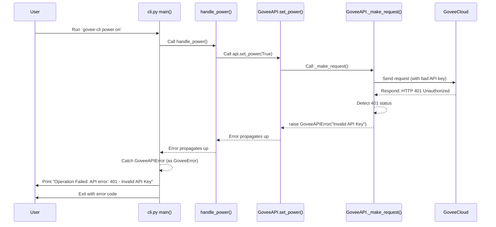

# Chapter 6: Custom Error Handling - Specific Warning Lights

Welcome to the final chapter of our `govee_mcp_server` tutorial! In [Chapter 5: MCP Server Implementation](05_mcp_server_implementation.md), we saw how our server listens for commands from other programs using the Mission Control Protocol (MCP) and uses the [Govee API Client](03_govee_api_client.md) to control the light.

But what happens when things don't go as planned? Maybe the internet connection drops, the Govee service is temporarily down, your API key is wrong, or a client sends an invalid command like trying to set the color to "purple" instead of RGB values. If the program just crashes with a generic error, it's hard to figure out what went wrong.

This chapter is about how `govee_mcp_server` uses **Custom Error Handling** to provide specific, helpful information when problems occur.

## What's the Big Idea? Knowing *Why* Things Broke

Imagine driving a car. If something goes wrong, you wouldn't want just one single "Check Engine" light for *every* possible problem, would you? Is it low oil? Are the brakes failing? Is a tire flat? A good dashboard has specific lights: "Low Fuel," "Oil Pressure Low," "Brake System Alert," etc. This tells you exactly what needs attention.

Standard Python errors (like `ValueError`, `TypeError`, `Exception`) are like that generic "Check Engine" light. They tell you *something* is wrong, but not always the specific context within *our* application.

**Custom Error Handling** in our project means we've created our *own* types of errors, specific to talking with Govee devices. Instead of just saying "Error!", we can say:
*   "Error talking to the Govee API!" (`GoveeAPIError`)
*   "Error: Your API key is missing or wrong!" (`GoveeConfigError`)
*   "Error: That's not a valid color value!" (`GoveeValidationError`)
*   "Error: Couldn't connect to the Govee servers!" (`GoveeConnectionError`)
*   "Error: Govee took too long to reply!" (`GoveeTimeoutError`)

This makes it much easier for both the user and the developer to understand and fix the problem. It's like having those specific warning lights on our Govee control dashboard.

## Our Custom Warning Lights: The Exception Classes

In programming, errors are often handled using "Exceptions". When something goes wrong, the code can `raise` an exception, which stops the normal flow and signals that a problem occurred.

We've defined our custom exception types in the file `src/govee_mcp_server/exceptions.py`. They all inherit from a base `GoveeError`, making it easy to catch any Govee-specific problem if needed.

```python
# Simplified from src/govee_mcp_server/exceptions.py

class GoveeError(Exception):
    """Base exception for all Govee-related errors in this project."""
    pass # It's just a label, inheriting basic Exception features

class GoveeAPIError(GoveeError):
    """Problem communicating with the Govee API itself
       (e.g., Govee returned an error message like 'Invalid API Key')."""
    pass

class GoveeConfigError(GoveeError):
    """Problem with the configuration settings
       (e.g., missing GOVEE_API_KEY in the .env file)."""
    pass

class GoveeValidationError(GoveeError):
    """Problem with the data provided by the user/client
       (e.g., brightness=150, or invalid RGB values)."""
    pass

class GoveeConnectionError(GoveeError):
    """Problem with the network connection to Govee servers."""
    pass

class GoveeTimeoutError(GoveeError):
    """Govee's servers took too long to respond to our request."""
    pass
```

**Explanation:**
*   `class GoveeError(Exception):`: This defines our main category. Anything that's a `GoveeConfigError` is *also* a `GoveeError`.
*   The other classes (`GoveeAPIError`, `GoveeConfigError`, etc.) inherit from `GoveeError`. They don't need any special code inside them; their *name* is what makes them specific. Think of them as different colored warning light bulbs.

## Turning On the Warning Lights: Raising Exceptions

Different parts of our code are responsible for detecting specific problems and `raise`-ing the appropriate custom exception.

**Example 1: Missing Configuration (`load_config`)**

Remember the `load_config` function from [Chapter 1: Configuration Management](01_configuration_management.md)? If it can't find your API key, it raises a `GoveeConfigError`.

```python
# Simplified from src/govee_mcp_server/config.py
from .exceptions import GoveeConfigError # Import the specific error
# ... other imports ...

def load_config():
    # ... code to load api_key, device_id, sku ...
    api_key = None # Let's pretend API key wasn't found

    if not api_key: # Check if it's missing
        # Raise the specific configuration error!
        raise GoveeConfigError("Missing required environment variable: GOVEE_API_KEY")

    # ... return config object if all is well ...
```

**Explanation:**
*   If `api_key` is not found, `raise GoveeConfigError(...)` immediately stops the `load_config` function and signals this specific problem.

**Example 2: Invalid Color Input (`validate_rgb`)**

The `@validate_rgb` decorator we saw in [Chapter 2: Device Control Interfaces](02_device_control_interfaces.md) checks color values before they even reach the API client.

```python
# Simplified from src/govee_mcp_server/interfaces.py
from .exceptions import GoveeValidationError # Import the specific error
# ... other imports ...

def validate_rgb(func):
    async def wrapper(self, r: int, g: int, b: int, *args, **kwargs):
        if not (0 <= r <= 255): # Check if Red value is valid
            # Raise the specific validation error!
            raise GoveeValidationError("red value must be between 0-255")
        # ... check g and b ...
        # If all good, call the original function (like set_color)
        return await func(self, r, g, b, *args, **kwargs)
    return wrapper

class ColorControl(ABC):
    @abstractmethod
    @validate_rgb # Apply the validator
    async def set_color(self, r: int, g: int, b: int) -> Tuple[bool, str]:
        pass
```

**Explanation:**
*   If `r` is outside the 0-255 range, `raise GoveeValidationError(...)` stops the process *before* the actual `set_color` logic in `GoveeAPI` runs.

**Example 3: API Communication Problems (`_make_request`)**

The core `_make_request` function inside the [Govee API Client](03_govee_api_client.md) handles errors from the Govee servers or network issues.

```python
# Simplified from src/govee_mcp_server/api.py
import aiohttp
import asyncio
from .exceptions import GoveeAPIError, GoveeConnectionError, GoveeTimeoutError

class GoveeAPI:
    # ... other methods ...

    async def _make_request(self, method: str, endpoint: str, **kwargs):
        # ... setup ...
        for attempt in range(self.MAX_RETRIES):
            try:
                async with self.session.request(...) as response:
                    data = await response.json()
                    if response.status == 401: # Example: Unauthorized
                        # Raise specific API error!
                        raise GoveeAPIError(f"API error: 401 - Invalid API Key")
                    elif response.status != 200:
                         # Raise general API error for other bad statuses
                         raise GoveeAPIError(f"API error: {response.status} - {data.get('message')}")
                    # ... success path ...
                    return data, data.get('message', 'Success')

            except asyncio.TimeoutError:
                if attempt == self.MAX_RETRIES - 1:
                    # Raise specific timeout error!
                    raise GoveeTimeoutError("Request timed out")
            except aiohttp.ClientError as e:
                 if attempt == self.MAX_RETRIES - 1:
                    # Raise specific connection error!
                    raise GoveeConnectionError(f"Connection error: {e}")
            # ... retry logic ...
        raise GoveeAPIError("Max retries exceeded") # If all retries fail
```

**Explanation:**
*   Based on the HTTP status code from Govee (like 401) or network exceptions (`TimeoutError`, `ClientError`), this code raises the corresponding specific `GoveeError`.

## Reacting to Warning Lights: Catching Exceptions

Raising an error is only half the story. Other parts of the code need to *catch* these specific errors and handle them gracefully, perhaps by showing a helpful message to the user. This is done using `try...except` blocks.

**Example: Handling Errors in the CLI**

The main function in our [Chapter 4: Command Line Interface (CLI)](04_command_line_interface__cli_.md) wraps the core logic in a `try...except` block.

```python
# Simplified from src/govee_mcp_server/cli.py
import sys
from .exceptions import GoveeError, GoveeConfigError, GoveeValidationError
# ... other imports ...

async def main() -> None:
    api = None
    try:
        # --- Operations that might raise GoveeErrors ---
        config = load_config() # Might raise GoveeConfigError
        api = GoveeAPI(config)
        args = parser.parse_args()

        if args.command == 'color':
            # Might raise GoveeValidationError (from decorator)
            # or GoveeAPIError, etc. (from api.set_color)
            await handle_color(api, args.red, args.green, args.blue)
        # ... other command handlers ...
        # --- End of operations ---

    # --- Catching specific errors ---
    except GoveeConfigError as e:
        print(f"\nConfiguration Problem: {str(e)}")
        print("Please check your .env file or environment variables.")
        sys.exit(1) # Exit with an error status
    except GoveeValidationError as e:
        print(f"\nInvalid Input: {str(e)}")
        sys.exit(1)
    except GoveeError as e: # Catch any other Govee-specific error
        print(f"\nOperation Failed: {str(e)}")
        sys.exit(1)
    except Exception as e: # Catch any totally unexpected error
        print(f"\nAn Unexpected Error Occurred: {str(e)}")
        sys.exit(1)
    finally:
        # Cleanup runs whether there was an error or not
        if api:
            await api.close()

# ... function to run main ...
```

**Explanation:**
*   The code inside the `try` block is executed.
*   If `load_config()` raises a `GoveeConfigError`, the code jumps directly to the `except GoveeConfigError as e:` block. It prints a specific message about configuration and exits.
*   If `handle_color` (or the underlying `api.set_color`) raises a `GoveeValidationError`, it jumps to the `except GoveeValidationError as e:` block.
*   If any *other* type of `GoveeError` occurs (like `GoveeAPIError`, `GoveeTimeoutError`), it's caught by the more general `except GoveeError as e:` block.
*   This allows the CLI to give tailored feedback based on *what kind* of error happened.

The MCP server in [Chapter 5: MCP Server Implementation](05_mcp_server_implementation.md) uses a similar `try...except` structure within each `@mcp.tool` function to catch `GoveeError`s and return an informative error message to the MCP client instead of crashing.

## Under the Hood: Tracing an "Invalid API Key" Error

Let's follow the journey of an error when the user tries to run the CLI with a wrong API key:

1.  **User Runs:** `govee-cli power on`
2.  **CLI Starts:** `cli.py` `main()` function begins.
3.  **Load Config:** `load_config()` runs successfully (it finds *an* API key, just the wrong one).
4.  **Create API Client:** `api = GoveeAPI(config)` is created.
5.  **Call Handler:** `handle_power(api, 'on')` is called.
6.  **Call API Method:** `await api.set_power(True)` is called.
7.  **Make Request:** Inside `set_power`, `await self._make_request(...)` is called.
8.  **Send to Govee:** `_make_request` sends the command to the Govee Cloud API, including the *invalid* API key in the headers.
9.  **Govee Responds:** The Govee API sees the invalid key and sends back an HTTP 401 Unauthorized error response (e.g., `{"message": "Invalid API Key"}`).
10. **Detect Error:** `_make_request` receives the 401 status.
11. **Raise Specific Error:** It executes `raise GoveeAPIError("API error: 401 - Invalid API Key")`. This stops `_make_request`.
12. **Propagate Error:** The `GoveeAPIError` travels up out of `_make_request` and then out of `api.set_power`. (Note: our simplified `set_power` in the previous chapter *caught* the error and returned `False`, but the real one might let it propagate or re-raise it). Let's assume for this trace it propagates up.
13. **Catch in Handler:** The `try...except` block in `handle_power` catches the `GoveeAPIError`.
14. **Raise from Handler:** The handler re-raises the error: `raise GoveeError(message)` (or simply lets the original `GoveeAPIError` propagate).
15. **Catch in Main:** The main `try...except` block in `cli.py` `main()` catches the `GoveeError` (since `GoveeAPIError` is a type of `GoveeError`).
16. **Print Message:** The code inside `except GoveeError as e:` runs, printing: `Operation Failed: API error: 401 - Invalid API Key`
17. **Exit:** The CLI exits with an error code (`sys.exit(1)`).



This detailed flow shows how the specific error generated deep within the API client travels up and is eventually caught by the top-level error handler, allowing for a precise message to be shown to the user.

## Conclusion

You've reached the end of the `govee_mcp_server` tutorial! In this chapter, we learned about **Custom Error Handling**:

*   It's like having specific **warning lights** instead of one generic "Check Engine" light.
*   We defined our own exception classes (`GoveeAPIError`, `GoveeConfigError`, `GoveeValidationError`, etc.) inheriting from a base `GoveeError`.
*   Different parts of the code `raise` these specific errors when problems are detected (e.g., bad config, invalid input, API failure).
*   Other parts of the code (like the CLI and MCP server) use `try...except` blocks to `catch` these specific errors and provide informative feedback or take corrective action.
*   This makes debugging easier and the application more user-friendly.

Throughout this tutorial, you've seen how `govee_mcp_server` manages configuration, defines device capabilities using interfaces, communicates with the Govee API, provides both a command-line interface and an MCP server, and handles errors gracefully.

We hope this journey has given you a clear understanding of how the project is structured and how its core components work together. Happy controlling!

---

Generated by [AI Codebase Knowledge Builder](https://github.com/The-Pocket/Tutorial-Codebase-Knowledge)