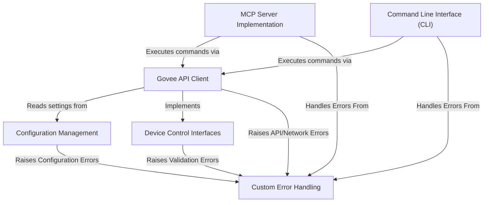

# Tutorial: govee_mcp_server

This project lets you control your **Govee LED lights** over the internet.
It acts as a bridge, translating commands into the *Govee API language*.
You can interact with it either through an **AI assistant** (using the *MCP server*) or directly using simple **command-line** instructions.
It needs your Govee *API key* and *device details* to work, which it reads from configuration settings.

**Source Repository:** [https://github.com/mathd/govee_mcp_server](https://github.com/mathd/govee_mcp_server)

## Chapters

1. [Configuration Management](01_configuration_management.md)
2. [Device Control Interfaces](02_device_control_interfaces.md)
3. [Govee API Client](03_govee_api_client.md)
4. [Command Line Interface (CLI)](04_command_line_interface__cli_.md)
5. [MCP Server Implementation](05_mcp_server_implementation.md)
6. [Custom Error Handling](06_custom_error_handling.md)

---

Generated by [AI Codebase Knowledge Builder](https://github.com/The-Pocket/Tutorial-Codebase-Knowledge)