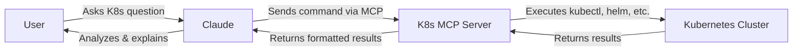
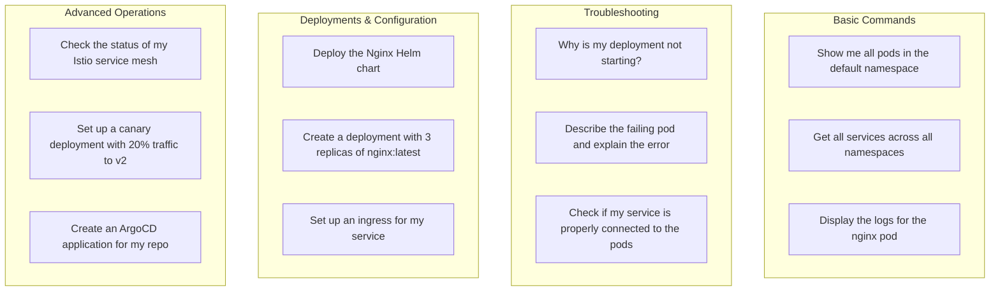

# K8s MCP Server

[](https://github.com/alexei-led/k8s-mcp-server/actions/workflows/ci.yml)
[](https://github.com/alexei-led/k8s-mcp-server/actions/workflows/release.yml)
[](https://codecov.io/gh/alexei-led/k8s-mcp-server)
[](https://github.com/alexei-led/k8s-mcp-server/pkgs/container/k8s-mcp-server/versions)
[](https://github.com/alexei-led/k8s-mcp-server/pkgs/container/k8s-mcp-server)
[](https://www.python.org/downloads/)
[](https://opensource.org/licenses/MIT)

K8s MCP Server is a Docker-based server implementing [Anthropic's Model Context Protocol (MCP)](https://www.anthropic.com/news/introducing-mcp) that enables Claude to run Kubernetes CLI tools (`kubectl`, `istioctl`, `helm`, `argocd`) in a secure, containerized environment.

## Demo: Deploy and Troubleshoot WordPress

**Session 1:** Using k8s-mcp-server and Helm CLI to deploy a WordPress application in the claude-demo namespace, then intentionally breaking it by scaling the MariaDB StatefulSet to zero.

**Session 2:** Troubleshooting session where we use k8s-mcp-server to diagnose the broken WordPress site through kubectl commands, identify the missing database issue, and fix it by scaling up the StatefulSet and configuring ingress access..

[Demo](https://private-user-images.githubusercontent.com/1898375/428398164-5ddce5bc-ec92-459b-a506-5d4442618a81.mp4?jwt=eyJhbGciOiJIUzI1NiIsInR5cCI6IkpXVCJ9.eyJpc3MiOiJnaXRodWIuY29tIiwiYXVkIjoicmF3LmdpdGh1YnVzZXJjb250ZW50LmNvbSIsImtleSI6ImtleTUiLCJleHAiOjE3NDMzNDE0OTEsIm5iZiI6MTc0MzM0MTE5MSwicGF0aCI6Ii8xODk4Mzc1LzQyODM5ODE2NC01ZGRjZTViYy1lYzkyLTQ1OWItYTUwNi01ZDQ0NDI2MThhODEubXA0P1gtQW16LUFsZ29yaXRobT1BV1M0LUhNQUMtU0hBMjU2JlgtQW16LUNyZWRlbnRpYWw9QUtJQVZDT0RZTFNBNTNQUUs0WkElMkYyMDI1MDMzMCUyRnVzLWVhc3QtMSUyRnMzJTJGYXdzNF9yZXF1ZXN0JlgtQW16LURhdGU9MjAyNTAzMzBUMTMyNjMxWiZYLUFtei1FeHBpcmVzPTMwMCZYLUFtei1TaWduYXR1cmU9YmUyNDExMGUzOGRlN2QxNWViMzhhOTE4Y2U1ZmRjMTQxYTI0OGNlNTFjNTRlMjFjNmQ3NTNhNGFmODNkODIzMSZYLUFtei1TaWduZWRIZWFkZXJzPWhvc3QifQ.hwKERwuQRXxHEYJ9d_fQ__XL1gj8l76nO6Yy6M4Uov8)

## How It Works



Claude can help users by:
- Explaining complex Kubernetes concepts
- Running commands against your cluster
- Troubleshooting issues
- Suggesting optimizations
- Crafting Kubernetes manifests

## Quick Start with Claude Desktop

Get Claude helping with your Kubernetes clusters in under 2 minutes:

1. **Create or update your Claude Desktop configuration file**:
   - **macOS**: Edit `$HOME/Library/Application Support/Claude/claude_desktop_config.json`
   - **Windows**: Edit `%APPDATA%\Claude\claude_desktop_config.json`
   - **Linux**: Edit `$HOME/.config/Claude/claude_desktop_config.json`

   ```json
   {
     "mcpServers": {
       "kubernetes": {
         "command": "docker",
         "args": [
           "run",
           "-i",
           "--rm",
           "-v",
           "/Users/YOUR_USER_NAME/.kube:/home/appuser/.kube:ro",
           "ghcr.io/alexei-led/k8s-mcp-server:latest"
         ]
       }
     }
   }
   ```

2. **Restart Claude Desktop**
   - After restart, you'll see the Tools icon (🔨) in the bottom right of your input field
   - This indicates Claude can now access K8s tools via the MCP server

3. **Start using K8s tools directly in Claude Desktop**:
   - "What Kubernetes contexts do I have available?"
   - "Show me all pods in the default namespace"
   - "Create a deployment with 3 replicas of nginx:1.21"
   - "Explain what's wrong with my StatefulSet 'database' in namespace 'prod'"
   - "Deploy the bitnami/wordpress chart with Helm and set service type to LoadBalancer"

> **Note**: Claude Desktop will automatically route K8s commands through the MCP server, allowing natural conversation about your clusters without leaving the Claude interface.

> **Cloud Providers**: For AWS EKS, GKE, or Azure AKS, you'll need additional configuration. See the [Cloud Provider Support](./docs/cloud-providers.md) guide.

## Features

- **Multiple Kubernetes Tools**: `kubectl`, `helm`, `istioctl`, and `argocd` in one container
- **Cloud Providers**: Native support for AWS EKS, Google GKE, and Azure AKS
- **Security**: Runs as non-root user with strict command validation
- **Command Piping**: Support for common Unix tools like `jq`, `grep`, and `sed`
- **Easy Configuration**: Simple environment variables for customization

## Documentation

- [Getting Started Guide](./docs/getting-started.md) - Detailed setup instructions
- [Cloud Provider Support](./docs/cloud-providers.md) - EKS, GKE, and AKS configuration
- [Supported Tools](./docs/supported-tools.md) - Complete list of all included CLI tools
- [Environment Variables](./docs/environment-variables.md) - Configuration options
- [Security Features](./docs/security.md) - Security modes and custom rules
- [Claude Integration](./docs/claude-integration.md) - Detailed Claude Desktop setup
- [Architecture](./docs/architecture.md) - System architecture and components
- [Detailed Specification](./docs/spec.md) - Complete technical specification

## Usage Examples

Once connected, you can ask Claude to help with Kubernetes tasks using natural language:



Claude can understand your intent and run the appropriate kubectl, helm, istioctl, or argocd commands based on your request. It can then explain the output in simple terms or help you troubleshoot issues.

## Advanced Claude Desktop Configuration

Configure Claude Desktop to optimize your Kubernetes workflow:

### Target Specific Clusters and Namespaces

```json
{
  "mcpServers": {
    "kubernetes": {
      "command": "docker",
      "args": [
        "run", "-i", "--rm",
        "-v", "/Users/YOUR_USER_NAME/.kube:/home/appuser/.kube:ro",
        "-e", "K8S_CONTEXT=production-cluster",
        "-e", "K8S_NAMESPACE=my-application",
        "-e", "K8S_MCP_TIMEOUT=600",
        "ghcr.io/alexei-led/k8s-mcp-server:latest"
      ]
    }
  }
}
```

### Connect to AWS EKS Clusters

```json
{
  "mcpServers": {
    "kubernetes": {
      "command": "docker",
      "args": [
        "run", "-i", "--rm",
        "-v", "/Users/YOUR_USER_NAME/.kube:/home/appuser/.kube:ro",
        "-v", "/Users/YOUR_USER_NAME/.aws:/home/appuser/.aws:ro",
        "-e", "AWS_PROFILE=production",
        "-e", "AWS_REGION=us-west-2",
        "ghcr.io/alexei-led/k8s-mcp-server:latest"
      ]
    }
  }
}
```

### Connect to Google GKE Clusters

```json
{
  "mcpServers": {
    "kubernetes": {
      "command": "docker",
      "args": [
        "run", "-i", "--rm",
        "-v", "/Users/YOUR_USER_NAME/.kube:/home/appuser/.kube:ro",
        "-v", "/Users/YOUR_USER_NAME/.config/gcloud:/home/appuser/.config/gcloud:ro",
        "-e", "CLOUDSDK_CORE_PROJECT=my-gcp-project",
        "-e", "CLOUDSDK_COMPUTE_REGION=us-central1",
        "ghcr.io/alexei-led/k8s-mcp-server:latest"
      ]
    }
  }
}
```

### Connect to Azure AKS Clusters

```json
{
  "mcpServers": {
    "kubernetes": {
      "command": "docker",
      "args": [
        "run", "-i", "--rm",
        "-v", "/Users/YOUR_USER_NAME/.kube:/home/appuser/.kube:ro",
        "-v", "/Users/YOUR_USER_NAME/.azure:/home/appuser/.azure:ro",
        "-e", "AZURE_SUBSCRIPTION=my-subscription-id",
        "ghcr.io/alexei-led/k8s-mcp-server:latest"
      ]
    }
  }
}
```

### Permissive Security Mode

```json
{
  "mcpServers": {
    "kubernetes": {
      "command": "docker",
      "args": [
        "run", "-i", "--rm",
        "-v", "/Users/YOUR_USER_NAME/.kube:/home/appuser/.kube:ro",
        "-e", "K8S_MCP_SECURITY_MODE=permissive",
        "ghcr.io/alexei-led/k8s-mcp-server:latest"
      ]
    }
  }
}
```

> For detailed security configuration options, see [Security Documentation](./docs/security.md).

## License

This project is licensed under the MIT License - see the [LICENSE](LICENSE) file for details.