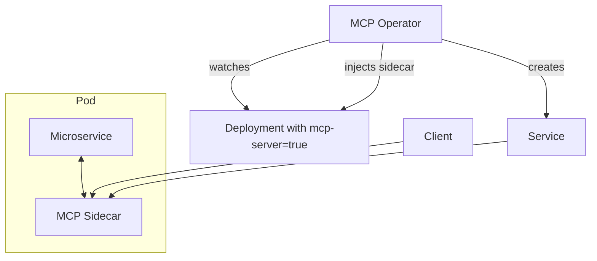

# Kube MCP Operator

This repository provides a minimal implementation of a Kubernetes operator and sidecar that expose microservice APIs as MCP services.

## Components

- **Sidecar** - Lightweight FastAPI application that proxies requests to the main container and exposes its OpenAPI specification from a configurable path.
- **Operator** - A Kopf based operator watching for deployments annotated with `mcp-server: "true"`, injecting the sidecar and creating a service for it.
- **CRD** - `MCPConfig` allows selecting deployments by label and exposing only those annotated.
- **Helm chart** - Installs the operator and CRD.

## Architecture



## Building

Sidecar image:
```bash
docker build -t mcp-sidecar ./sidecar
```

Operator image:
```bash
docker build -t mcp-operator ./mcp_operator
```

## Installing with Helm

```bash
helm install mcp-operator charts/mcp-operator
```

## Usage

Annotate your deployment to enable MCP integration:

```yaml
metadata:
  annotations:
    mcp-server: "true"
```

When the operator sees this annotation it injects the MCP sidecar and creates a service `<deployment>-mcp` exposing port `8000`.
Existing annotated deployments are processed on startup so sidecars are injected even if the operator is installed later.

### Configuration

The sidecar locates the upstream service using environment variables:

- `SERVICE_HOST` – hostname of the microservice (default `localhost`)
- `SERVICE_PORT` – port of the microservice (default `80`)
- `OPENAPI_PATH` – path to the OpenAPI or Swagger file including the file name
  (default `openapi.json`)

Requests to `/openapi.json` on the sidecar return the file from
`http://$SERVICE_HOST:$SERVICE_PORT/$OPENAPI_PATH`.

## Testing

Run the unit tests with coverage:

```bash
pip install -e .[dev]
pytest --cov=sidecar --cov=mcp_operator --cov-report=term --cov-fail-under=80
```

## CI Artifacts

The GitHub Actions workflow builds the sidecar Docker image and packages the
Helm chart on each push. When changes land on `main`, a release is created using
**python-semantic-release** (GitHub Action `v9`) which automatically bumps the version, updates the
changelog and attaches:

- `mcp-sidecar.tar` – the Docker image saved as a tarball
- `mcp-operator-<version>.tgz` – the packaged Helm chart

Version history lives in [CHANGELOG.md](CHANGELOG.md) and is maintained by
`python-semantic-release` via the latest GitHub Action.

## Security

Each build scans the sidecar image using Trivy. The generated report is
available in [SECURITY.md](SECURITY.md) and is committed back to the repository
whenever a new release is published.

## Contributing

Please see [CONTRIBUTING.md](CONTRIBUTING.md) for guidelines on developing and submitting changes.
