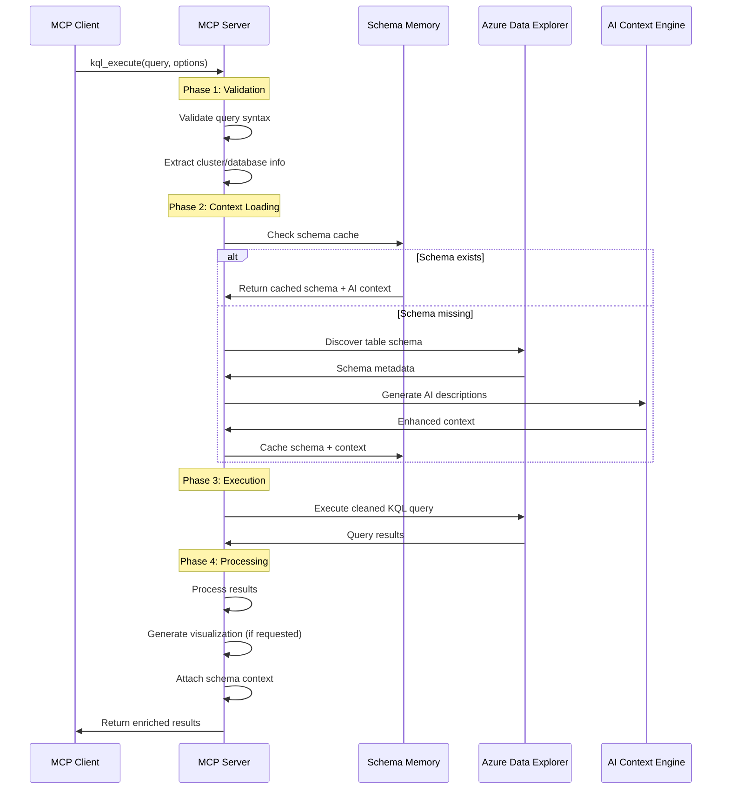
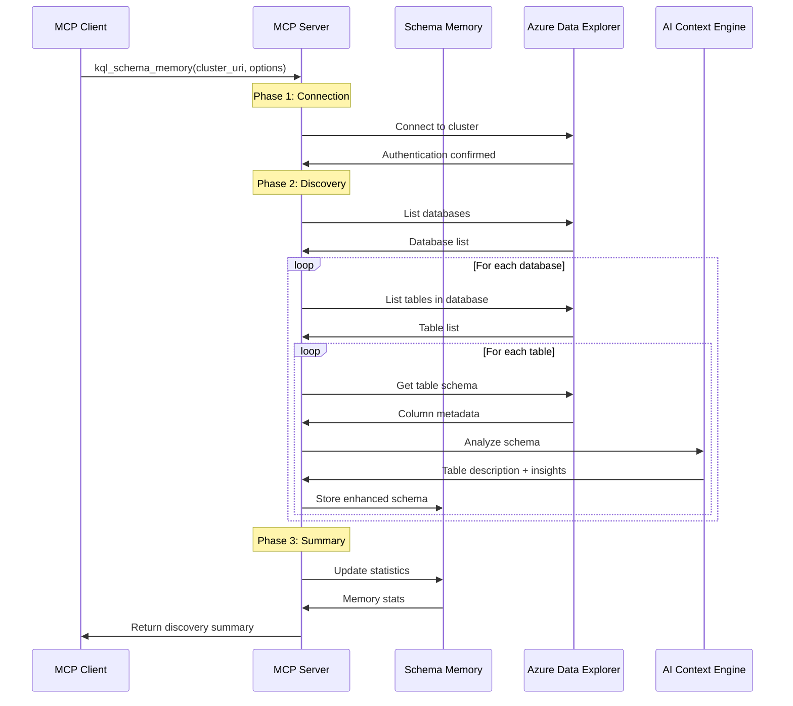

# MCP KQL Server Architecture

## System Overview

The MCP KQL Server provides intelligent KQL query execution with AI-powered schema caching. This document details the architecture, data flow, and key components.

## High-Level Architecture

```
┌─────────────────────────────────────────────────────────────────┐
│                     MCP Client Environment                     │
│  ┌─────────────────┐  ┌─────────────────┐  ┌─────────────────┐ │
│  │     Claude      │  │   Custom App    │  │   VS Code       │ │
│  │      AI         │  │                 │  │   Extension     │ │
│  └─────────────────┘  └─────────────────┘  └─────────────────┘ │
└─────────────────────────────────┬───────────────────────────────┘
                                  │ MCP Protocol
                                  ▼
┌─────────────────────────────────────────────────────────────────┐
│                    MCP KQL Server                              │
│  ┌─────────────────┐  ┌─────────────────┐  ┌─────────────────┐ │
│  │  Tool Handler   │  │ Schema Memory   │  │ Query Executor  │ │
│  │   (FastMCP)     │  │    System       │  │     (Azure)     │ │
│  └─────────────────┘  └─────────────────┘  └─────────────────┘ │
└─────────────────────────────────┬───────────────────────────────┘
                                  │ Azure SDK
                                  ▼
┌─────────────────────────────────────────────────────────────────┐
│                   Azure Data Explorer                          │
│  ┌─────────────────┐  ┌─────────────────┐  ┌─────────────────┐ │
│  │   Cluster 1     │  │   Cluster 2     │  │   Cluster N     │ │
│  │  (Kusto/ADX)    │  │  (Kusto/ADX)    │  │  (Kusto/ADX)    │ │
│  └─────────────────┘  └─────────────────┘  └─────────────────┘ │
└─────────────────────────────────────────────────────────────────┘
```

## Detailed Component Flow

### 1. Query Execution Flow (`kql_execute`)



### 2. Schema Discovery Flow (`kql_schema_memory`)



## Core Components

### 1. MCP Server (`mcp_server.py`)
- **Purpose**: Main FastMCP server implementation
- **Responsibilities**:
  - Tool registration (`kql_execute`, `kql_schema_memory`)
  - Request routing and validation
  - Response formatting
  - Error handling and logging

### 2. Query Executor (`execute_kql.py`)
- **Purpose**: KQL query execution engine
- **Responsibilities**:
  - Query validation and cleaning
  - Azure authentication handling
  - Result processing and visualization
  - Context integration

### 3. Schema Memory System (`schema_memory.py`, `unified_memory.py`)
- **Purpose**: Intelligent schema caching
- **Responsibilities**:
  - Schema discovery and storage
  - AI context generation
  - Cache management and optimization
  - Performance monitoring

### 4. Authentication (`kql_auth.py`)
- **Purpose**: Azure authentication management
- **Responsibilities**:
  - Azure CLI integration
  - Token management
  - Authentication validation

## Data Structures

### Schema Memory Format

```json
{
  "version": "2.0",
  "last_updated": "2025-01-07T12:00:00",
  "total_clusters": 1,
  "total_databases": 3,
  "total_tables": 25,
  "clusters": {
    "https://cluster.kusto.windows.net": {
      "databases": {
        "MyDatabase": {
          "tables": {
            "MyTable": {
              "columns": [
                {
                  "name": "Timestamp",
                  "type": "datetime",
                  "description": "Event timestamp"
                },
                {
                  "name": "UserId", 
                  "type": "string",
                  "description": "User identifier"
                }
              ],
              "ai_context": {
                "description": "User activity events with temporal data",
                "key_columns": ["Timestamp", "UserId"],
                "common_patterns": ["time-series analysis", "user tracking"],
                "relationships": ["Links to Users table via UserId"]
              },
              "stats": {
                "last_accessed": "2025-01-07T11:30:00",
                "access_count": 15,
                "avg_query_time": 1.2
              }
            }
          }
        }
      }
    }
  }
}
```

### Query Response Format

```json
{
  "status": "success|error",
  "result": {
    "columns": ["col1", "col2"],
    "rows": [["val1", "val2"], ["val3", "val4"]],
    "row_count": 2,
    "visualization": "| col1 | col2 |\n|------|------|\n| val1 | val2 |",
    "schema_context": [
      "Table: MyTable - User activity events",
      "Key insight: Timestamp column for time-series analysis"
    ]
  },
  "error": null
}
```

## Performance Optimizations

### 1. Intelligent Caching
- **Table-Level Caching**: Individual table schemas cached separately
- **Lazy Loading**: Schemas loaded only when needed
- **Background Updates**: Schema refresh happens asynchronously
- **Memory Management**: Automatic cleanup of stale cache entries

### 2. Query Optimization
- **Context Size Management**: AI context limited to relevant tables
- **Parallel Processing**: Multiple schema discoveries run concurrently
- **Connection Pooling**: Reuse Azure connections when possible
- **Result Streaming**: Large result sets processed incrementally

### 3. AI Context Optimization
- **Compact Tokens**: AI descriptions compressed for efficiency
- **Relevance Scoring**: Most relevant context prioritized
- **Update Strategies**: Smart refresh based on usage patterns

## Security Model

### 1. Authentication Flow
```
User → Azure CLI → Azure AD → Token → MCP Server → Azure Data Explorer
```

### 2. Security Features
- **No Credential Storage**: Server uses Azure CLI tokens
- **Query Validation**: Protection against injection attacks
- **Local Memory**: Schema cache stored locally only
- **Audit Logging**: All queries logged for security monitoring

## Scalability Considerations

### 1. Memory Management
- **Configurable Limits**: Max memory size per cluster
- **Cleanup Strategies**: LRU eviction for old schemas
- **Compression**: Schema data compressed in storage

### 2. Performance Scaling
- **Concurrent Queries**: Multiple queries processed simultaneously
- **Resource Limits**: CPU and memory usage monitoring
- **Graceful Degradation**: Fallback to basic mode under load

### 3. Multi-Cluster Support
- **Isolated Caches**: Separate memory per cluster
- **Cross-Cluster Queries**: Support for federated queries
- **Load Balancing**: Distribute queries across available clusters

## Error Handling Strategy

### 1. Error Categories
- **Authentication Errors**: Azure login issues
- **Network Errors**: Connectivity problems
- **Query Errors**: KQL syntax or logic errors
- **Memory Errors**: Schema cache corruption

### 2. Recovery Mechanisms
- **Automatic Retry**: Transient failures retried automatically
- **Fallback Modes**: Degraded functionality when cache unavailable
- **Error Context**: Enhanced error messages with suggestions
- **Self-Healing**: Automatic cache rebuild when corrupted

## Monitoring and Observability

### 1. Metrics Collected
- Query execution times
- Schema cache hit rates
- Memory usage statistics
- Error frequencies
- Authentication status

### 2. Logging Strategy
- **Debug Mode**: Detailed execution logs
- **Performance Logs**: Query timing and optimization
- **Error Logs**: Comprehensive error tracking
- **Audit Logs**: Security and access logging

## Future Architecture Enhancements

### 1. Planned Features
- **Distributed Caching**: Redis-based shared cache
- **Real-time Schema Updates**: Live schema change detection
- **Advanced AI Features**: Query optimization suggestions
- **Multi-Tenant Support**: Isolated environments per tenant

### 2. Integration Opportunities
- **Power BI Integration**: Direct visualization support
- **Jupyter Notebooks**: Enhanced notebook experience
- **Azure Monitor**: Deep integration with Azure monitoring
- **GitHub Actions**: CI/CD pipeline integration