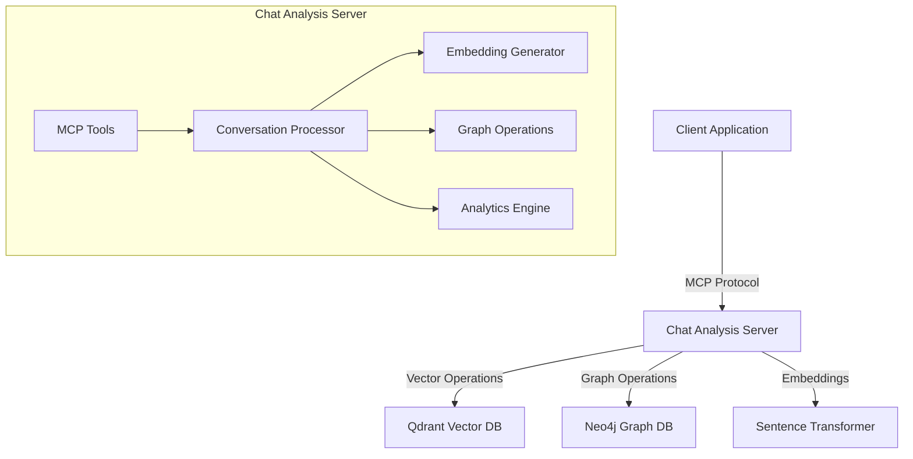
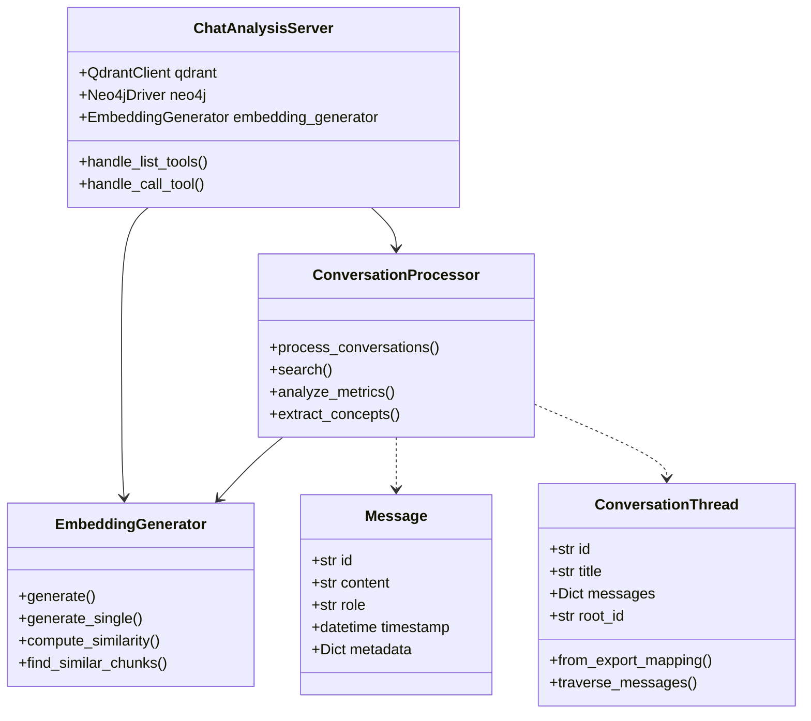
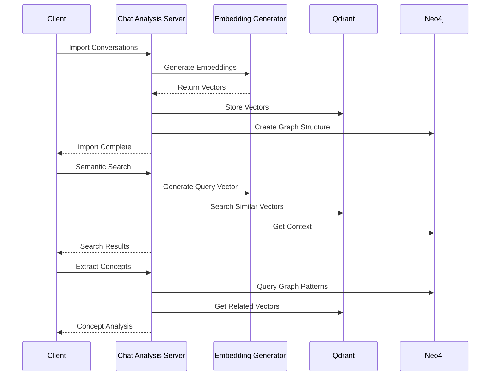
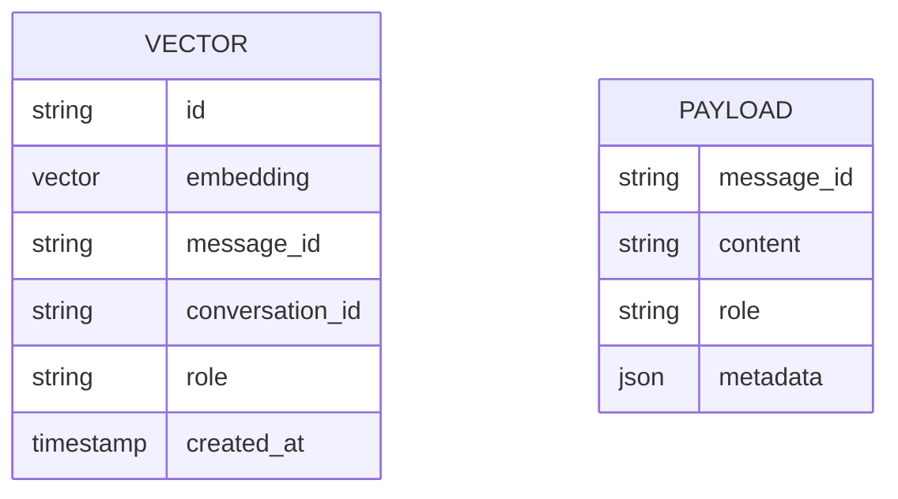
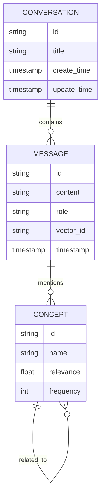
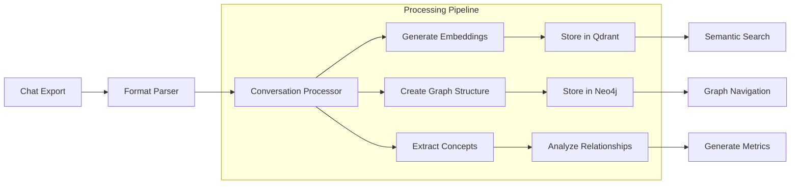

# Architecture Documentation

## System Overview



## Component Architecture



## Data Flow



## Storage Schema

### Vector Storage (Qdrant)



### Graph Storage (Neo4j)



## Processing Pipeline



## Tool Integration

```mermaid
graph TB
    MCP[MCP Protocol] --> Tools[Tool Registry]
    
    subgraph "Available Tools"
        Import[import_conversations]
        Search[semantic_search]
        Metrics[analyze_metrics]
        Concepts[extract_concepts]
    end
    
    Tools --> Import
    Tools --> Search
    Tools --> Metrics
    Tools --> Concepts
    
    Import --> Processor[Conversation Processor]
    Search --> Processor
    Metrics --> Processor
    Concepts --> Processor