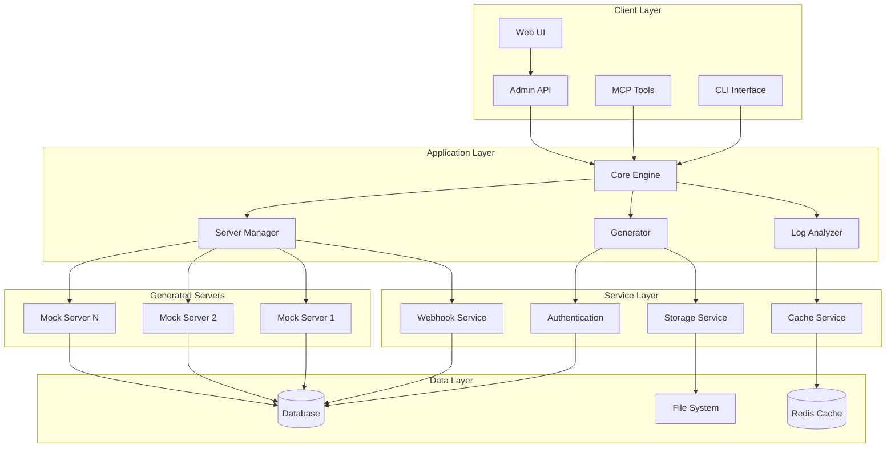
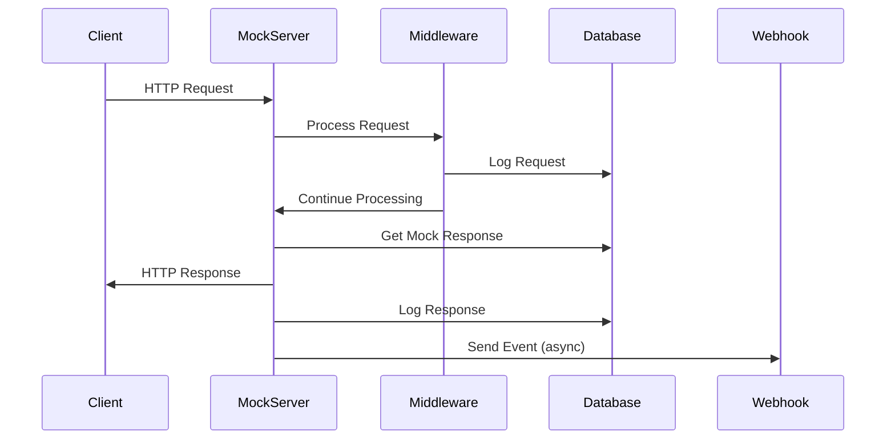
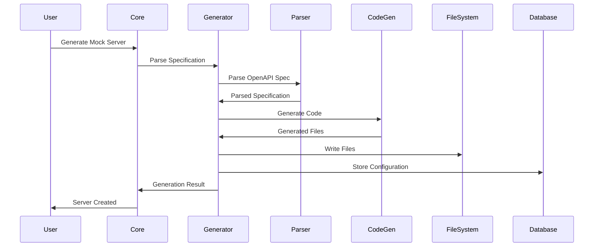
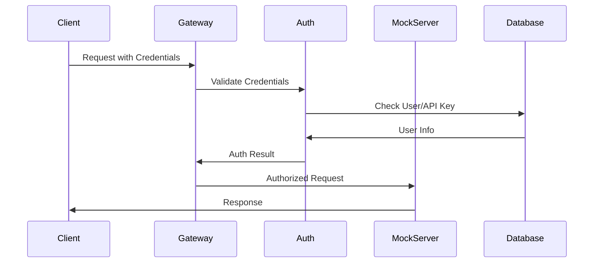

# System Architecture

This document provides a comprehensive overview of MockLoop MCP's system architecture, including core components, design patterns, data flow, and integration points.

## Overview

MockLoop MCP is designed as a modular, scalable system for generating and managing sophisticated mock API servers. The architecture follows modern software engineering principles including separation of concerns, dependency injection, and event-driven design.

## High-Level Architecture



## Core Components

### 1. Core Engine

The central orchestrator that coordinates all system operations.

```python
class MockLoopCore:
    """
    Central engine for MockLoop MCP operations.
    
    Coordinates between generators, managers, and services
    to provide unified functionality.
    """
    
    def __init__(self, config: Configuration):
        self.config = config
        self.generator = MockServerGenerator(config.generation)
        self.manager = MockServerManager(config.server)
        self.log_analyzer = LogAnalyzer(config.logging)
        self.auth_service = AuthenticationService(config.auth)
        self.webhook_service = WebhookService(config.webhooks)
        self.storage_service = StorageService(config.storage)
        
    async def generate_mock_server(self, spec_source: str, options: GenerationOptions) -> GenerationResult:
        """Generate a new mock server from API specification."""
        
    async def manage_server_lifecycle(self, server_id: str, action: str) -> OperationResult:
        """Manage server lifecycle (start, stop, restart)."""
        
    async def analyze_server_logs(self, server_id: str, query: LogQuery) -> LogAnalysis:
        """Analyze server request logs."""
```

### 2. Mock Server Generator

Responsible for parsing API specifications and generating FastAPI mock servers.

```python
class MockServerGenerator:
    """
    Generates FastAPI mock servers from OpenAPI specifications.
    
    Handles specification parsing, code generation, and file creation.
    """
    
    def __init__(self, config: GenerationConfig):
        self.config = config
        self.parser = SpecificationParser()
        self.code_generator = CodeGenerator()
        self.template_engine = TemplateEngine()
        
    async def generate(self, spec_source: str, output_dir: str, options: GenerationOptions) -> GenerationResult:
        """
        Main generation workflow:
        1. Parse API specification
        2. Generate route definitions
        3. Create FastAPI application
        4. Generate middleware and utilities
        5. Create configuration files
        """
        
        # Parse specification
        parsed_spec = await self.parser.parse(spec_source)
        
        # Generate routes
        routes = self.code_generator.generate_routes(parsed_spec, options)
        
        # Generate application
        app_code = self.code_generator.generate_application(routes, options)
        
        # Generate middleware
        middleware = self.code_generator.generate_middleware(options)
        
        # Write files
        await self.write_generated_files(output_dir, app_code, middleware, routes)
        
        return GenerationResult(
            server_id=generate_server_id(),
            output_directory=output_dir,
            routes=routes,
            config=options
        )
```

### 3. Server Manager

Manages the lifecycle of generated mock servers.

```python
class MockServerManager:
    """
    Manages mock server instances and their lifecycle.
    
    Handles starting, stopping, monitoring, and configuration
    of generated mock servers.
    """
    
    def __init__(self, config: ServerConfig):
        self.config = config
        self.servers: Dict[str, ServerInstance] = {}
        self.process_monitor = ProcessMonitor()
        
    async def start_server(self, server_config: ServerConfiguration) -> ServerInstance:
        """Start a mock server instance."""
        
    async def stop_server(self, server_id: str) -> bool:
        """Stop a running mock server."""
        
    async def restart_server(self, server_id: str) -> ServerInstance:
        """Restart a mock server."""
        
    async def monitor_servers(self) -> List[ServerStatus]:
        """Monitor health and status of all servers."""
```

### 4. Log Analyzer

Analyzes request logs and provides insights.

```python
class LogAnalyzer:
    """
    Analyzes request logs to provide insights and metrics.
    
    Processes log data to generate statistics, identify patterns,
    and detect anomalies.
    """
    
    def __init__(self, config: LoggingConfig):
        self.config = config
        self.database = DatabaseConnection(config.database)
        self.metrics_calculator = MetricsCalculator()
        
    async def analyze_logs(self, query: LogQuery) -> LogAnalysis:
        """Analyze logs based on query parameters."""
        
    async def generate_report(self, server_id: str, time_range: TimeRange) -> AnalysisReport:
        """Generate comprehensive analysis report."""
        
    async def detect_anomalies(self, server_id: str) -> List[Anomaly]:
        """Detect anomalies in request patterns."""
```

## Data Flow Architecture

### Request Processing Flow



### Mock Generation Flow



## Component Interactions

### Service Dependencies

```python
# Dependency injection container
class ServiceContainer:
    def __init__(self, config: Configuration):
        # Core services
        self.database = DatabaseService(config.database)
        self.cache = CacheService(config.cache)
        self.storage = StorageService(config.storage)
        
        # Application services
        self.auth_service = AuthenticationService(config.auth, self.database)
        self.webhook_service = WebhookService(config.webhooks, self.database)
        self.log_service = LogService(self.database, self.cache)
        
        # Core components
        self.generator = MockServerGenerator(config.generation, self.storage)
        self.manager = MockServerManager(config.server, self.database)
        self.analyzer = LogAnalyzer(config.logging, self.database, self.cache)
        
        # API layer
        self.admin_api = AdminAPI(
            self.generator,
            self.manager,
            self.analyzer,
            self.auth_service
        )
```

### Event System

MockLoop MCP uses an event-driven architecture for loose coupling:

```python
class EventBus:
    """Central event bus for system-wide communication."""
    
    def __init__(self):
        self.handlers: Dict[str, List[EventHandler]] = {}
        
    def subscribe(self, event_type: str, handler: EventHandler):
        """Subscribe to events of a specific type."""
        
    async def publish(self, event: Event):
        """Publish an event to all subscribers."""
        
    async def publish_async(self, event: Event):
        """Publish event asynchronously."""

# Event types
class Events:
    SERVER_STARTED = "server.started"
    SERVER_STOPPED = "server.stopped"
    REQUEST_RECEIVED = "request.received"
    RESPONSE_SENT = "response.sent"
    SCENARIO_CHANGED = "scenario.changed"
    ERROR_OCCURRED = "error.occurred"

# Event handlers
class WebhookEventHandler:
    async def handle(self, event: Event):
        """Send webhook notifications for events."""
        
class LogEventHandler:
    async def handle(self, event: Event):
        """Log events to database."""
        
class MetricsEventHandler:
    async def handle(self, event: Event):
        """Update metrics based on events."""
```

## Design Patterns

### 1. Factory Pattern

Used for creating different types of mock servers and components:

```python
class MockServerFactory:
    """Factory for creating different types of mock servers."""
    
    @staticmethod
    def create_server(spec_type: str, config: ServerConfig) -> MockServer:
        if spec_type == "openapi":
            return OpenAPIMockServer(config)
        elif spec_type == "graphql":
            return GraphQLMockServer(config)
        elif spec_type == "grpc":
            return GRPCMockServer(config)
        else:
            raise ValueError(f"Unsupported spec type: {spec_type}")

class MiddlewareFactory:
    """Factory for creating middleware components."""
    
    @staticmethod
    def create_middleware(middleware_type: str, config: dict) -> Middleware:
        if middleware_type == "auth":
            return AuthenticationMiddleware(config)
        elif middleware_type == "logging":
            return LoggingMiddleware(config)
        elif middleware_type == "cors":
            return CORSMiddleware(config)
        else:
            raise ValueError(f"Unknown middleware type: {middleware_type}")
```

### 2. Strategy Pattern

Used for different authentication and storage strategies:

```python
class AuthenticationStrategy(ABC):
    """Abstract base class for authentication strategies."""
    
    @abstractmethod
    async def authenticate(self, request: Request) -> AuthResult:
        pass

class APIKeyAuthentication(AuthenticationStrategy):
    async def authenticate(self, request: Request) -> AuthResult:
        # API key authentication logic
        pass

class JWTAuthentication(AuthenticationStrategy):
    async def authenticate(self, request: Request) -> AuthResult:
        # JWT authentication logic
        pass

class StorageStrategy(ABC):
    """Abstract base class for storage strategies."""
    
    @abstractmethod
    async def store(self, key: str, data: bytes) -> bool:
        pass
    
    @abstractmethod
    async def retrieve(self, key: str) -> Optional[bytes]:
        pass

class FileSystemStorage(StorageStrategy):
    async def store(self, key: str, data: bytes) -> bool:
        # File system storage logic
        pass

class S3Storage(StorageStrategy):
    async def store(self, key: str, data: bytes) -> bool:
        # S3 storage logic
        pass
```

### 3. Observer Pattern

Used for monitoring and event handling:

```python
class ServerObserver(ABC):
    """Abstract observer for server events."""
    
    @abstractmethod
    async def on_server_started(self, server: ServerInstance):
        pass
    
    @abstractmethod
    async def on_server_stopped(self, server: ServerInstance):
        pass
    
    @abstractmethod
    async def on_request_received(self, server: ServerInstance, request: Request):
        pass

class MetricsObserver(ServerObserver):
    """Observer that collects metrics."""
    
    async def on_request_received(self, server: ServerInstance, request: Request):
        # Update request metrics
        pass

class LoggingObserver(ServerObserver):
    """Observer that logs server events."""
    
    async def on_server_started(self, server: ServerInstance):
        logger.info(f"Server {server.id} started on port {server.port}")
```

## Scalability Considerations

### Horizontal Scaling

MockLoop MCP is designed to scale horizontally:

```python
class ClusterManager:
    """Manages MockLoop MCP cluster nodes."""
    
    def __init__(self, config: ClusterConfig):
        self.config = config
        self.nodes: Dict[str, NodeInfo] = {}
        self.load_balancer = LoadBalancer()
        
    async def add_node(self, node_info: NodeInfo):
        """Add a new node to the cluster."""
        
    async def remove_node(self, node_id: str):
        """Remove a node from the cluster."""
        
    async def distribute_load(self, request: Request) -> NodeInfo:
        """Distribute requests across cluster nodes."""
```

### Database Scaling

Support for database scaling strategies:

```python
class DatabaseCluster:
    """Manages database cluster for high availability."""
    
    def __init__(self, config: DatabaseClusterConfig):
        self.primary = DatabaseConnection(config.primary)
        self.replicas = [DatabaseConnection(replica) for replica in config.replicas]
        self.connection_pool = ConnectionPool()
        
    async def read_query(self, query: str) -> QueryResult:
        """Execute read query on replica."""
        replica = self.select_replica()
        return await replica.execute(query)
        
    async def write_query(self, query: str) -> QueryResult:
        """Execute write query on primary."""
        return await self.primary.execute(query)
```

### Caching Strategy

Multi-level caching for performance:

```python
class CacheManager:
    """Manages multi-level caching strategy."""
    
    def __init__(self, config: CacheConfig):
        self.l1_cache = MemoryCache(config.memory)  # In-memory cache
        self.l2_cache = RedisCache(config.redis)    # Distributed cache
        self.l3_cache = DatabaseCache(config.db)    # Persistent cache
        
    async def get(self, key: str) -> Optional[Any]:
        """Get value from cache hierarchy."""
        # Try L1 cache first
        value = await self.l1_cache.get(key)
        if value is not None:
            return value
            
        # Try L2 cache
        value = await self.l2_cache.get(key)
        if value is not None:
            await self.l1_cache.set(key, value)
            return value
            
        # Try L3 cache
        value = await self.l3_cache.get(key)
        if value is not None:
            await self.l2_cache.set(key, value)
            await self.l1_cache.set(key, value)
            return value
            
        return None
```

## Security Architecture

### Authentication Flow



### Authorization Model

```python
class AuthorizationManager:
    """Manages authorization policies and permissions."""
    
    def __init__(self, config: AuthConfig):
        self.policies = PolicyEngine(config.policies)
        self.roles = RoleManager(config.roles)
        
    async def authorize(self, user: User, resource: Resource, action: str) -> bool:
        """Check if user is authorized to perform action on resource."""
        
        # Check user roles
        user_roles = await self.roles.get_user_roles(user.id)
        
        # Evaluate policies
        for role in user_roles:
            if await self.policies.evaluate(role, resource, action):
                return True
                
        return False

class SecurityMiddleware:
    """Security middleware for request validation."""
    
    async def __call__(self, request: Request, call_next):
        # Validate request headers
        await self.validate_headers(request)
        
        # Check rate limits
        await self.check_rate_limits(request)
        
        # Validate input
        await self.validate_input(request)
        
        response = await call_next(request)
        
        # Add security headers
        self.add_security_headers(response)
        
        return response
```

## Performance Optimization

### Asynchronous Processing

MockLoop MCP uses async/await throughout for optimal performance:

```python
class AsyncRequestProcessor:
    """Asynchronous request processor for high throughput."""
    
    def __init__(self, config: ProcessorConfig):
        self.semaphore = asyncio.Semaphore(config.max_concurrent_requests)
        self.request_queue = asyncio.Queue(maxsize=config.queue_size)
        
    async def process_request(self, request: Request) -> Response:
        """Process request asynchronously."""
        async with self.semaphore:
            # Process request
            response = await self.handle_request(request)
            
            # Log asynchronously
            asyncio.create_task(self.log_request(request, response))
            
            # Send webhooks asynchronously
            asyncio.create_task(self.send_webhooks(request, response))
            
            return response
```

### Connection Pooling

Efficient database and HTTP connection management:

```python
class ConnectionManager:
    """Manages database and HTTP connection pools."""
    
    def __init__(self, config: ConnectionConfig):
        self.db_pool = DatabasePool(
            min_connections=config.db_min_connections,
            max_connections=config.db_max_connections,
            timeout=config.db_timeout
        )
        
        self.http_pool = HTTPPool(
            max_connections=config.http_max_connections,
            max_keepalive_connections=config.http_keepalive_connections,
            keepalive_expiry=config.http_keepalive_expiry
        )
```

## Monitoring and Observability

### Metrics Collection

```python
class MetricsCollector:
    """Collects system and application metrics."""
    
    def __init__(self, config: MetricsConfig):
        self.prometheus_registry = CollectorRegistry()
        self.request_counter = Counter('requests_total', 'Total requests')
        self.response_time_histogram = Histogram('response_time_seconds', 'Response time')
        self.error_counter = Counter('errors_total', 'Total errors')
        
    async def record_request(self, request: Request, response: Response, duration: float):
        """Record request metrics."""
        self.request_counter.inc()
        self.response_time_histogram.observe(duration)
        
        if response.status_code >= 400:
            self.error_counter.inc()
```

### Health Checks

```python
class HealthChecker:
    """Performs health checks on system components."""
    
    def __init__(self, config: HealthConfig):
        self.checks = [
            DatabaseHealthCheck(config.database),
            CacheHealthCheck(config.cache),
            StorageHealthCheck(config.storage),
            ExternalServiceHealthCheck(config.external_services)
        ]
        
    async def check_health(self) -> HealthStatus:
        """Perform all health checks."""
        results = await asyncio.gather(
            *[check.perform() for check in self.checks],
            return_exceptions=True
        )
        
        return HealthStatus.from_results(results)
```

## Deployment Architecture

### Container Architecture

```dockerfile
# Multi-stage build for optimal image size
FROM python:3.11-slim as builder
WORKDIR /app
COPY requirements.txt .
RUN pip install --no-cache-dir -r requirements.txt

FROM python:3.11-slim as runtime
WORKDIR /app
COPY --from=builder /usr/local/lib/python3.11/site-packages /usr/local/lib/python3.11/site-packages
COPY src/ ./src/
COPY templates/ ./templates/
EXPOSE 8000
CMD ["python", "-m", "mockloop_mcp.main"]
```

### Kubernetes Deployment

```yaml
apiVersion: apps/v1
kind: Deployment
metadata:
  name: mockloop-mcp
spec:
  replicas: 3
  selector:
    matchLabels:
      app: mockloop-mcp
  template:
    metadata:
      labels:
        app: mockloop-mcp
    spec:
      containers:
      - name: mockloop-mcp
        image: mockloop/mcp:latest
        ports:
        - containerPort: 8000
        env:
        - name: MOCKLOOP_DATABASE_TYPE
          value: "postgresql"
        - name: MOCKLOOP_DATABASE_HOST
          value: "postgres-service"
        resources:
          requests:
            memory: "256Mi"
            cpu: "250m"
          limits:
            memory: "512Mi"
            cpu: "500m"
```

## Extension Points

### Plugin Architecture

```python
class PluginManager:
    """Manages system plugins and extensions."""
    
    def __init__(self, config: PluginConfig):
        self.plugins: Dict[str, Plugin] = {}
        self.hooks: Dict[str, List[HookFunction]] = {}
        
    async def load_plugin(self, plugin_path: str):
        """Load a plugin from file."""
        
    async def execute_hook(self, hook_name: str, context: dict) -> dict:
        """Execute all functions registered for a hook."""
        
    def register_hook(self, hook_name: str, function: HookFunction):
        """Register a function for a specific hook."""

class Plugin(ABC):
    """Abstract base class for plugins."""
    
    @abstractmethod
    def initialize(self, context: PluginContext):
        """Initialize the plugin."""
        
    @abstractmethod
    def register_hooks(self, hook_registry: HookRegistry):
        """Register plugin hooks."""
```

## See Also

- **[Database Schema](../api/database-schema.md)**: Database structure and relationships
- **[Configuration Options](../api/configuration.md)**: System configuration reference
- **[Performance Optimization](performance-optimization.md)**: Performance tuning guide
- **[Security Considerations](security.md)**: Security architecture details