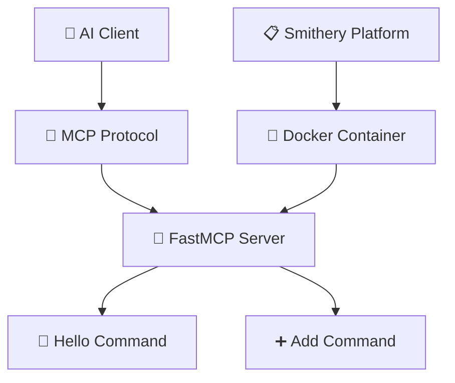
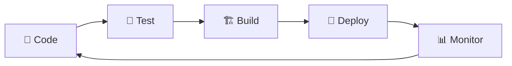

# smithery-mcp-python-template 🐍⚡

[](https://smithery.ai/server/@Yash-Kavaiya/smithery-mcp-python-template)


## 📋 Overview

A comprehensive Python template for building **Model Context Protocol (MCP)** servers using **FastMCP**. This template provides a solid foundation for creating AI-native services that communicate seamlessly with AI agents and clients.

## 🌟 Features

| Feature | Description | Status |
|---------|-------------|--------|
| 🚀 **FastMCP Integration** | Built with FastMCP for efficient server implementation | ✅ Ready |
| 🔧 **STDIO Transport** | Standard I/O based communication protocol | ✅ Ready |
| 🐳 **Docker Support** | Containerized deployment with optimized Dockerfile | ✅ Ready |
| 📦 **Smithery Compatible** | Full integration with Smithery platform | ✅ Ready |
| 🛠️ **Template Commands** | Pre-built greeting and math operations | ✅ Ready |

## 🏗️ Architecture



## 🚀 Quick Start

### Prerequisites 📋
- 🐍 Python 3.12+
- 📦 uv (recommended) or pip
- 🐳 Docker (optional)

### Installation 💾

#### Method 1: Direct Installation
```bash
# Clone the repository
git clone https://github.com/Yash-Kavaiya/smithery-mcp-python-template.git
cd smithery-mcp-python-template

# Install dependencies
uv sync
# or with pip: pip install -e .
```

#### Method 2: Using Smithery CLI
```bash
# Install via Smithery
npx @smithery/cli install @Yash-Kavaiya/smithery-mcp-python-template
```

## 🎮 Available Commands

### 💬 Hello Command
```json
{
  "name": "hello",
  "description": "A simple command that returns a greeting message",
  "parameters": {
    "name": {
      "type": "string",
      "description": "The name of the person to greet",
      "required": true
    }
  }
}
```

**Example Usage:**
```python
# Returns: "Hello, World!"
hello(name="World")
```

### ➕ Add Command
```json
{
  "name": "add",
  "description": "A command that adds two integers",
  "parameters": {
    "a": {
      "type": "integer",
      "description": "The first integer",
      "required": true
    },
    "b": {
      "type": "integer", 
      "description": "The second integer",
      "required": true
    }
  }
}
```

**Example Usage:**
```python
# Returns: 7
add(a=3, b=4)
```

## 🔧 Configuration

### Server Configuration 📝

| Setting | Value | Description |
|---------|-------|-------------|
| **Server Name** | `Smithery MCP Server Python templates` | Display name |
| **Transport** | `stdio` | Communication method |
| **Entry Point** | `main.py` | Main server file |
| **Python Version** | `>=3.12` | Minimum Python requirement |

### Dependencies 📚

```toml
[project]
name = "smithery-mcp-python-templates"
version = "0.1.0"
description = "Add your description here"
readme = "README.md"
requires-python = ">=3.12"
dependencies = [
    "httpx>=0.28.1",
    "mcp[cli]>=1.9.1",
]
```

## 🐳 Docker Deployment

### Build Image 🏗️
```bash
docker build -t smithery-mcp-python-template .
```

### Run Container 🚀
```bash
docker run -p 8000:8000 smithery-mcp-python-template
```

### Docker Configuration 🔧
```dockerfile
FROM python:3.12-slim
WORKDIR /app
COPY . .
RUN pip install --upgrade pip && pip install -e .
CMD ["python", "main.py"]
```

## 📈 Development Workflow



### Development Commands 🛠️

| Command | Purpose | Usage |
|---------|---------|--------|
| `python main.py` | Start server locally | Development testing |
| `docker build .` | Build container | Local deployment |
| `uv sync` | Install dependencies | Environment setup |

## 🧪 Testing

### Local Testing 🏠
```bash
# Start the MCP server
python main.py

# Test with MCP Inspector
npx @modelcontextprotocol/inspector
```

### Command Testing 🎯
```python
# Test hello command
{"method": "tools/call", "params": {"name": "hello", "arguments": {"name": "Test"}}}

# Test add command  
{"method": "tools/call", "params": {"name": "add", "arguments": {"a": 5, "b": 3}}}
```

## 📁 Project Structure

```
smithery-mcp-python-template/
├── 📄 main.py              # Main server implementation
├── 📋 pyproject.toml       # Project configuration
├── 🐳 Dockerfile           # Container configuration  
├── 📄 smithery.yaml        # Smithery deployment config
├── 🔒 uv.lock             # Dependency lock file
├── 🐍 .python-version      # Python version specification
└── 📖 README.md           # This file
```

## 🤝 Contributing

1. 🍴 Fork the repository
2. 🌿 Create a feature branch (`git checkout -b feature/amazing-feature`)
3. 💍 Commit your changes (`git commit -m 'Add amazing feature'`)
4. 📤 Push to the branch (`git push origin feature/amazing-feature`)
5. 🔄 Open a Pull Request

## 📄 License

This project is licensed under the **MIT License** - see the [LICENSE](LICENSE) file for details.

## 🔗 Links

| Resource | URL | Description |
|----------|-----|-------------|
| 🏠 **Smithery Platform** | [smithery.ai](https://smithery.ai) | MCP server registry |
| 📚 **MCP Documentation** | [modelcontextprotocol.io](https://modelcontextprotocol.io) | Protocol specification |
| ⚡ **FastMCP** | [FastMCP Docs](https://github.com/jlowin/fastmcp) | FastMCP framework |
| 🐳 **Docker Hub** | [Docker Repository](https://hub.docker.com) | Container registry |

## 🆘 Support

Need help? Here are your options:

- 📧 **Email**: yash.kavaiya3@gmail.com
- 🐛 **Issues**: [GitHub Issues](https://github.com/Yash-Kavaiya/smithery-mcp-python-template/issues)
- 💬 **Discussions**: [GitHub Discussions](https://github.com/Yash-Kavaiya/smithery-mcp-python-template/discussions)

## 🎉 Acknowledgments

- 🙏 **Anthropic** for the Model Context Protocol
- ⚡ **FastMCP** for the excellent Python framework
- 🏗️ **Smithery** for the deployment platform
- 🌟 **Community** for contributions and feedback

---

<div align="center">

**🚀 Ready to build amazing MCP servers? Get started now! 🚀**

</div>