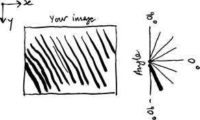
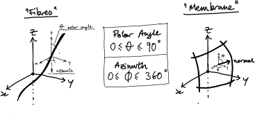

.. _definitions:

******************************
How it works (+ definitions)
******************************

Measuring greyscale orientations
=================================

Measuring greylevel orientations means characterising the *local variations* of greylevels in the image.
This is done in 3 steps:

1. Computing image gradients
-----------------------------
This means computing a gradient for each pixel of the input image.
For a 2D image this results in two gradient "images": the gradient in the x and y directions, and in 3D this is three "images" in x, y, and z.

This is a key step to get right. We provide three options here (in order of preference):
  - gaussian gradients
  - spline gradients
  - finite differences with (`numpy.gradient`)

2. Computing the structure tensor
----------------------------------
Based on the gradients, the `Structure Tensor`_ is then computed in a local neighbourhood which defines a spatial scale.
The scale is defined:

  - (If computing for every pixel) with a gaussian interrogation window defined with a sigma in pixels

  - (If computing with boxes) with a box size in pixels in which the gradient components are averaged

Since the tensor is symmetric, we only return the flattened top right part of the tensor. This means in 2D that the 2x2 matrix gets flattened into a 3-component vector and in 3D the 3x3 matrix gets flattened into a 6-component vector.

There are other packages that can compute the structure tensor, notably `skimage.feature.structure_tensor` which also returns the tensor in a flattened way (although this uses a canny filter for gradients which is OK but not perfect -- see the "chirp" example for how this function compares to ours).

3. Computing local orientations
--------------------------------
The structure tensor can then be analysed for features of interest.

In 2D the only thing that can be analysed is fibres, which themselves are defined by the direction in which the greylevels *don't* vary significantly.

In 3D there are two modes to select from:

  - fibre mode: as in 2D we are still interested in the direction with the minimum variation of greylevels (along a fibre)

  - membrane mode: we're interested in the direction *normal* to a membrane, *i.e.*, the direction of maximum greylevel variation.

For all cases (see below for definitions) we can also optionally compute the **intensity** (trace of the structure tensor: "how strong the gradients are"), the **directionality** ("how strongly directed are the structure tensors"), and the **type** ("how fibrous/membranous the greylevels look").

Definitions
============

Angles
-------

In orientationpy the default output is to give orientations in degrees.
The logic behind this is that:

  - Of all the other choices (radians, unit vectors) this is the most understandable quantity
  - Compared to unit vectors it is more compactly stored in memory (1 element vs 2 in 2D and 2 elements vs 3 in 3D)

There is a function to compute unit vectors from the angular orientations we output (`orientationpy.anglesToVectors`).

Two dimensions
^^^^^^^^^^^^^^^^

Orientations can be represented as a *direction* in 2D.
This can be represented as a single scalar angle.

Since orientation vectors are non-directional, it is only meaningful to represent half the available vectors/angles.
In this library we follow the behaviour of OrientationJ in 2D:

  - Angles are defined from -89.99° to +90.0°

  - 0° means horizontally-aligned (the x-direction of the image)

  - Positive angles represent an anti-clockwise rotation from the horizontal

Three dimensions
^^^^^^^^^^^^^^^^^

In 3D things are a little more tricky, and so require careful definition.

In 3D orientations can be described as two angles in a spherical coordinate system.
As in the 2D case, since orientations are non-directional, only half the available orientation space needs to be described.
In this case, we choose to limit our definition to the positive-z half-sphere:

The two angles are θ (theta), the angle down from the z-axis called the **"polar angle"** and φ (phi) the angle in the xy-plane called the **"azimuth"**, where 0° is aligned with the x-direction.
This is the physics convention as per `Wikipedia - Spherical Coordinate System`_.

In three dimensions we can be interested in the orientations of **fibres** (left), that is to say the direction of the elongated objects OR the orientation of **"membranes"** or "plates" (right), planar objects defined by their *normal vector*.

This distinction corresponds to being interested either in the orientation of the **lowest eigenvalue** (i.e., **fibres**: the direction along the fibre has the lowest greylevel changes) or the **highest eigenvalue** (i.e., **membranes**: the normal direction is the one with the large greylevel changes).

θ and φ are always as two numpy arrays in a list, in that order.

Invariants
----------

The orientation depends on our choice of reference frame (i.e., the coordinate system).
However, we can also calculate certain properties of the structure tensor that remain unaffected by changes in the reference frame.
These properties are known as `invariants`_ because they are independent of the chosen frame. Our tool allows the user to compute three key invariants:

1. **Intensity**: This represents the local strength of the gradients and is referred to as "energy" in OrientationJ. It corresponds to the trace of the structure tensor in both 2D and 3D. It is implemented in :func:`orientationpy.main.computeIntensity`.

2. **Directionality**: This measures how much orientation information is encoded in the structure tensor. It is represented by the `second  main invariant`_, denoted as :math:`J_2`. It is implemented in :func:`orientationpy.main.computeStructureDirectionality`.

3. **Type**: This describes how fibrous or membranous the structure is. It is defined as :math:`\sin(3 \theta_s)`, where :math:`\theta_s` is the `Lode angular coordinate`_. It is implemented in :func:`orientationpy.main.computeStructureType`.

.. _Wikipedia - Spherical Coordinate System: https://en.wikipedia.org/wiki/Spherical_coordinate_system

.. _Structure Tensor: https://en.wikipedia.org/wiki/Structure_tensor

.. _invariants: https://en.wikipedia.org/wiki/Invariants_of_tensors

.. _second main invariant: https://en.wikipedia.org/wiki/Cauchy_stress_tensor#Invariants_of_the_stress_deviator_tensor

.. _Lode angular coordinate: https://en.wikipedia.org/wiki/Lode_coordinates#Lode_angle_%E2%80%93_angular_coordinate_%7F'%22%60UNIQ--postMath-0000002D-QINU%60%22'%7F
