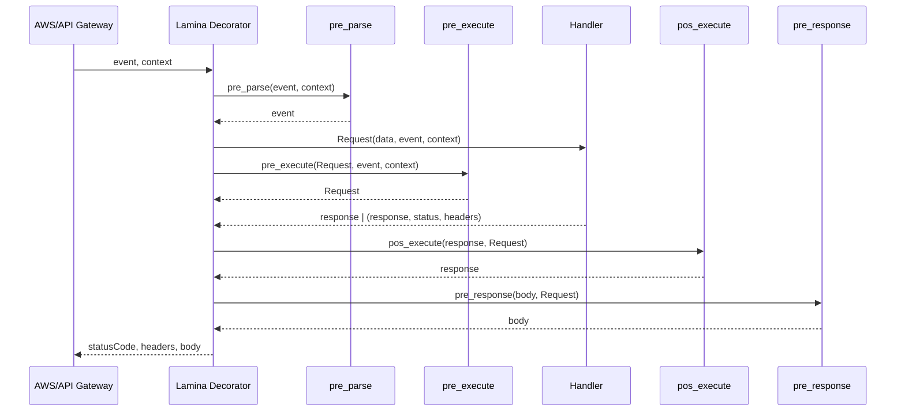
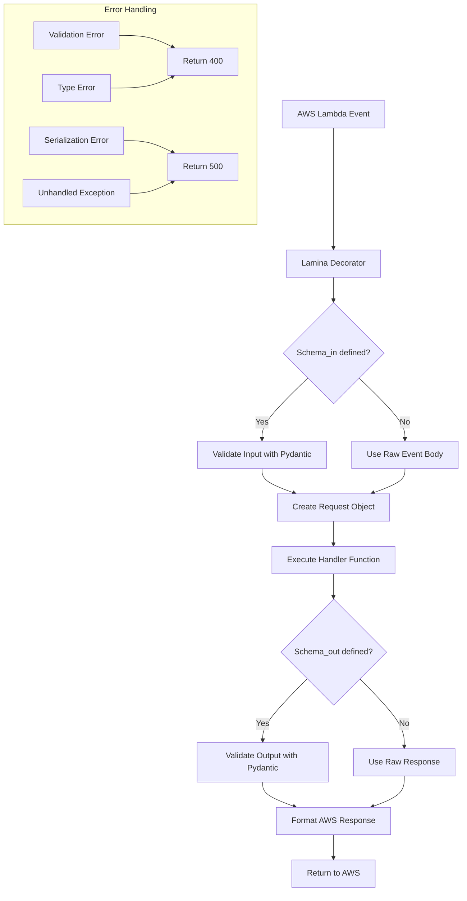

<h1 align="center">Welcome to Lamina</h1>

<p align="center">
<a href="https://pypi.org/project/py-lamina/" target="_blank">
</a>
<a href="https://www.python.org" target="_blank">

</a>
<a href="https://github.com/megalus/lamina/blob/main/LICENSE" target="_blank">

</a>
<a href="https://github.com/megalus/lamina/actions/workflows/tests.yml" target="_blank">

</a>
</p>

## Overview

Lamina (from Portuguese "lâmina", meaning "layer" or "blade") is a lightweight decorator library for AWS Lambda functions. It adds a powerful layer to your Lambda handlers, simplifying development by:

- Integrating both synchronous and asynchronous code in a single function
- Using Pydantic models for robust input and output data validation
- Handling errors gracefully with appropriate HTTP status codes
- Formatting responses according to AWS API Gateway expectations
- Supporting different content types (JSON, HTML, plain text)
- Providing convenient access to the original event and context objects

## Why use Lamina?

AWS Lambda functions often require repetitive boilerplate code for input validation, error handling, and response formatting. Lamina eliminates this boilerplate, allowing you to focus on your business logic while it handles:

- Input validation using Pydantic models
- Error handling with appropriate HTTP status codes
- Response formatting with content type control
- Support for both synchronous and asynchronous functions
- Custom headers support
- AWS Step Functions integration

## Installation

```shell
$ pip install py-lamina
```

Lamina requires Python 3.11 or later and has dependencies on:
- pydantic - For data validation
- asgiref - For async/sync conversion utilities
- loguru - For logging

## Usage

### Basic Example

Create the models for Input and Output data:

```python
# schemas.py
from pydantic import BaseModel

class ExampleInput(BaseModel):
    name: str
    age: int

class ExampleOutput(BaseModel):
    message: str
```

Create your AWS Lambda handler:

```python
# main.py
from typing import Any, Dict
from lamina import lamina, Request
from .schemas import ExampleInput, ExampleOutput

@lamina(schema_in=ExampleInput, schema_out=ExampleOutput)
def handler(request: Request) -> Dict[str, Any]:
    response = {"message": f"Hello {request.data.name}, you are {request.data.age} years old!"}
    return response
```

### Asynchronous Handlers

Lamina seamlessly supports both synchronous and asynchronous handlers:

```python
# main.py
import asyncio
from typing import Any, Dict
from lamina import lamina, Request
from .schemas import ExampleInput, ExampleOutput

@lamina(schema_in=ExampleInput, schema_out=ExampleOutput)
async def handler(request: Request) -> Dict[str, Any]:
    # Perform async operations
    await asyncio.sleep(1)
    response = {"message": f"Hello {request.data.name}, you are {request.data.age} years old!"}
    return response
```

### Customizing Responses

#### Status Codes

The default status code is 200. You can customize it by returning a tuple:

```python
@lamina(schema_in=ExampleInput, schema_out=ExampleOutput)
def handler(request: Request):
    response = {"message": f"Hello {request.data.name}, you are {request.data.age} years old!"}
    return response, 201  # Created status code
```

#### Content Types

Lamina supports different content types through the `content_type` parameter:

```python
from lamina import lamina, Request, Lamina

@lamina(schema_in=ExampleInput, content_type=Lamina.HTML)
def handler(request: Request):
    html = f"""
        <html>
            <head><title>User Profile</title></head>
            <body>
                <h1>Hello {request.data.name}!</h1>
                <p>You are {request.data.age} years old.</p>
            </body>
        </html>
    """
    return html
```

Available content types:
- `Lamina.JSON` (default): `application/json; charset=utf-8`
- `Lamina.HTML`: `text/html; charset=utf-8`
- `Lamina.TEXT`: `text/plain; charset=utf-8`

#### Custom Headers

You can add custom headers by returning them as the third element in the response tuple:

```python
@lamina(schema_in=ExampleInput)
def handler(request: Request):
    response = {"message": f"Hello {request.data.name}!"}
    return response, 200, {
        "Cache-Control": "max-age=3600",
        "X-Custom-Header": "custom-value"
    }
```

## Hooks

Lamina provides four extensibility points executed around your handler.

Configuration (pyproject.toml):

```toml
[tool.lamina]
pre_parse = "lamina.hooks.pre_parse"
pre_execute = "lamina.hooks.pre_execute"
pos_execute = "lamina.hooks.pos_execute"
pre_response = "lamina.hooks.pre_response"
```

Environment variables override these values at runtime:
- LAMINA_PRE_PARSE
- LAMINA_PRE_EXECUTE
- LAMINA_POS_EXECUTE
- LAMINA_PRE_RESPONSE

Hook signatures and responsibilities:
- pre_parse(event, context) -> event
- pre_execute(request, event, context) -> request
- pos_execute(response, request) -> response
- pre_response(body, request) -> body



Example customizing hooks via env:

```python
import os
from lamina import lamina, Request

# Somewhere early in your app setup
os.environ["LAMINA_PRE_PARSE"] = "myproj.hooks:pre_parse"
os.environ["LAMINA_PRE_EXECUTE"] = "myproj.hooks:pre"
os.environ["LAMINA_POS_EXECUTE"] = "myproj.hooks:post"
os.environ["LAMINA_PRE_RESPONSE"] = "myproj.hooks:pre_response"

@lamina()
def handler(request: Request):
    # The request may be modified by pre_execute
    return {"hello": "world"}
```

### The Request Object

The `Request` object provides access to:

- `data`: The validated input data (as a Pydantic model if schema_in is provided)
- `event`: The original AWS Lambda event
- `context`: The original AWS Lambda context

### Using Without Schemas

You can use Lamina without schemas for more flexibility:

```python
import json
from lamina import lamina, Request

@lamina()
def handler(request: Request):
    # Parse the body manually
    body = json.loads(request.event["body"])
    name = body.get("name", "Guest")
    age = body.get("age", "unknown")

    return {
        "message": f"Hello {name}, you are {age} years old!"
    }
```

> **Note**: Without a schema_in, the `request.data` attribute contains the raw body string from the event. You'll need to parse and validate it manually.

### AWS Step Functions Integration

Lamina supports AWS Step Functions with the `step_functions` parameter:

```python
@lamina(schema_in=ExampleInput, schema_out=ExampleOutput, step_functions=True)
def handler(request: Request):
    # For Step Functions, the input is directly available as the event
    # No need to parse from event["body"]
    return {
        "message": f"Step function processed for {request.data.name}"
    }
```

### Error Handling

Lamina automatically handles common errors:

- **Validation Errors**: Returns 400 Bad Request with detailed validation messages
- **Type Errors**: Returns 400 Bad Request when input cannot be parsed
- **Serialization Errors**: Returns 500 Internal Server Error when output cannot be serialized
- **Unhandled Exceptions**: Returns 500 Internal Server Error with the error message

All errors are logged using the loguru library for easier debugging.

## Project Architecture



## Contributing

Contributions are welcome! Here's how you can help:

1. **Fork the repository** and clone it locally
2. **Create a new branch** for your feature or bugfix
3. **Make your changes** and add tests if applicable
4. **Run the tests** to ensure they pass: `poetry run pytest`
5. **Submit a pull request** with a clear description of your changes

Please make sure your code follows the project's style guidelines by running:
```shell
poetry run pre-commit run --all
```

### Development Setup

1. Clone the repository
2. Install dependencies with Poetry:
   ```shell
   poetry install
   ```
3. Install pre-commit hooks:
   ```shell
   poetry run pre-commit install
   ```

## License

This project is licensed under the terms of the MIT license.
