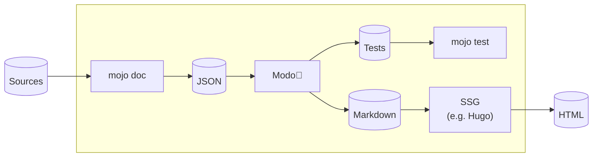

```mermaid
graph LR
  sources[(Sources)]
  mojo_doc[mojo doc]
  JSON[(JSON)]
  Modo[Modo🧯]
  Markdown[(Markdown)]
  Tests[(Tests)]
  mojo_test[mojo test]
  HTML[(HTML)]
  SSG["`SSG
(e.g. Hugo)`"]

  sources-->mojo_doc
  subgraph cmd [ ]
    mojo_doc-->JSON

    JSON-->Modo
    Modo-->Markdown
    Modo-->Tests

    Tests-->mojo_test
    Markdown-->SSG
  end
  SSG-->HTML
```
