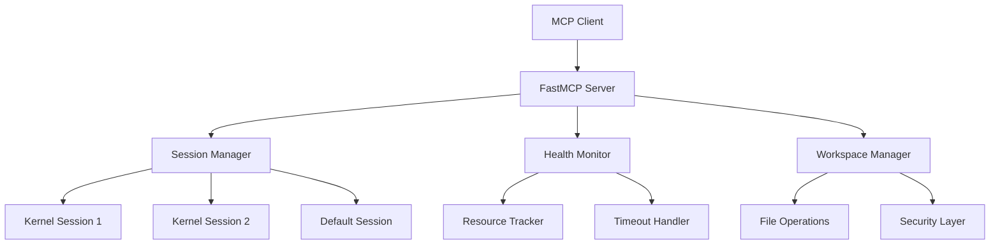

# Python Interpreter MCP Server

[](https://github.com/deadmeme5441/python-mcp-server/actions)
[](https://pypi.org/project/python-mcp-server/)
[](https://www.python.org/downloads/)
[](https://opensource.org/licenses/MIT)
[](https://deadmeme5441.github.io/python-mcp-server/)

A world-class Python interpreter MCP (Model Context Protocol) server that provides secure, isolated Python code execution with advanced session management and health monitoring.

## ✨ Features

### 🚀 **Production-Ready Architecture**
- **FastMCP Middleware Stack**: Professional error handling, timing, and contextual logging
- **Session-Based Isolation**: Multiple independent Python kernels with complete state separation  
- **Health Monitoring**: Real-time kernel diagnostics with intelligent restart capabilities
- **Progressive Timeouts**: Resilient execution with smart retry logic

### 🔒 **Security & Reliability** 
- **Workspace Sandboxing**: Path traversal protection and secure file operations
- **Resource Monitoring**: CPU, memory, and process health tracking
- **State Preservation**: Automatic kernel state backup and restoration
- **Error Resilience**: Graceful handling of kernel failures and timeouts

### 🛠 **Developer Experience**
- **20 Comprehensive Tools**: From basic execution to advanced introspection
- **Code Completion**: IPython-powered intelligent completions
- **File Management**: Read, write, delete operations with safety checks  
- **Package Installation**: Dynamic dependency management with uv/pip
- **Script Execution**: Save and run Python scripts with output capture

## 🚀 Quick Start

### Installation

```bash
pip install python-mcp-server
```

### Basic Usage

Start the server:
```bash
python-mcp-server --port 8000
```

Connect with FastMCP client:
```python
import asyncio
from fastmcp.client import Client

async def main():
    async with Client("http://localhost:8000/mcp") as client:
        # Execute Python code
        result = await client.call_tool("run_python_code", {
            "code": """
import numpy as np
import matplotlib.pyplot as plt

x = np.linspace(0, 10, 100)
y = np.sin(x)

plt.figure(figsize=(10, 6))
plt.plot(x, y, 'b-', linewidth=2)
plt.title('Sine Wave')
plt.grid(True)
plt.show()

print("Plot created successfully!")
"""
        })
        print("Output:", result.data["stdout"])

asyncio.run(main())
```

## 🏗 Architecture



## 🔧 Tools Reference

### Core Execution
- `run_python_code` - Execute Python with output capture
- `code_completion` - IPython-powered completions
- `inspect_object` - Object introspection and documentation
- `restart_kernel` - Clean kernel restart with session awareness

### Session Management  
- `create_session` - Create isolated kernel sessions
- `switch_session` - Switch between sessions
- `list_sessions` - View all active sessions
- `delete_session` - Clean up sessions

### File Operations
- `list_files` - Browse workspace with tree view
- `read_file` / `write_file` / `delete_file` - File operations
- `save_script` / `run_script` - Script management

### Health & Monitoring
- `get_kernel_health` - Comprehensive health metrics
- `check_kernel_responsiveness` - Test kernel response

### Package Management
- `install_dependencies` - Dynamic package installation
- `list_variables` - Inspect kernel namespace

### Utilities
- `ping` - Connectivity test
- `get_workspace_info` - Workspace configuration

## 💡 Advanced Usage

### Session-Based Workflows
```python
# Create isolated sessions for different tasks
await client.call_tool("create_session", {
    "session_id": "data_analysis",
    "description": "Data science workflow"
})

await client.call_tool("create_session", {
    "session_id": "ml_training", 
    "description": "Model training pipeline"
})

# Switch between sessions
await client.call_tool("switch_session", {"session_id": "data_analysis"})
# ... do data analysis work ...

await client.call_tool("switch_session", {"session_id": "ml_training"})  
# ... do ML training work ...
```

### Health Monitoring
```python
# Check system health
health = await client.call_tool("get_kernel_health")
if health.data["status"] != "healthy":
    await client.call_tool("restart_kernel")

# Monitor responsiveness  
responsive = await client.call_tool("check_kernel_responsiveness")
print(f"Response time: {responsive.data['response_time']:.3f}s")
```

## 🔧 Configuration

### Environment Variables
```bash
export MCP_WORKSPACE_DIR="./workspace"    # Workspace directory
export MPLBACKEND="Agg"                   # Matplotlib backend
export PYTHONUNBUFFERED="1"               # Unbuffered output
```

### Command Line Options
```bash
python-mcp-server \
    --port 8000 \
    --host 0.0.0.0 \
    --workspace-dir ./custom_workspace \
    --log-level INFO
```

## 📁 Workspace Structure

```
workspace/
├── scripts/     # Saved Python scripts
├── outputs/     # Generated files (plots, data, etc.)
├── uploads/     # Uploaded files via HTTP
└── (user files) # Any files created during execution
```

## 🤝 Integration Examples

### With Claude Desktop
Add to your MCP configuration:
```json
{
  "mcpServers": {
    "python-interpreter": {
      "command": "python-mcp-server",
      "args": ["--port", "8000"]
    }
  }
}
```

### With Custom Clients
```python
# Raw HTTP/JSON-RPC
import httpx

async def call_tool(tool_name, arguments):
    async with httpx.AsyncClient() as client:
        response = await client.post("http://localhost:8000/mcp", json={
            "jsonrpc": "2.0",
            "method": "tools/call",
            "params": {"name": tool_name, "arguments": arguments},
            "id": 1
        })
        return response.json()
```

## 🧪 Development

### Setup
```bash
git clone https://github.com/deadmeme5441/python-mcp-server.git
cd python-mcp-server
uv sync
```

### Testing
```bash
# Run all tests
uv run pytest tests/ -v

# Run specific test
uv run pytest tests/test_sessions.py -v

# With coverage
uv run pytest --cov=src --cov-report=html
```

### Code Quality
```bash
# Linting
uvx ruff check .

# Type checking
uv run mypy src/

# Formatting
uvx ruff format .
```

## 📚 Documentation

- **[Complete Documentation](https://deadmeme5441.github.io/python-mcp-server/)** - Full guides and API reference
- **[Getting Started](https://deadmeme5441.github.io/python-mcp-server/getting-started/)** - Installation and first steps
- **[Architecture](https://deadmeme5441.github.io/python-mcp-server/architecture/)** - Technical deep dive
- **[Examples](https://deadmeme5441.github.io/python-mcp-server/examples/)** - Practical usage patterns
- **[Troubleshooting](https://deadmeme5441.github.io/python-mcp-server/troubleshooting/)** - Common issues and solutions

## 🔒 Security

- **Workspace Sandboxing**: All operations restricted to configured workspace
- **Path Validation**: Protection against directory traversal attacks  
- **Resource Limits**: Configurable memory and CPU constraints
- **Process Isolation**: Each session runs in isolated Jupyter kernel
- **Input Sanitization**: All inputs validated via Pydantic models

## 🚀 Use Cases

- **AI Agent Environments**: Reliable Python execution for AI agents
- **Educational Platforms**: Safe, isolated code execution for learning
- **Data Analysis Workflows**: Session-based data processing pipelines  
- **Research & Prototyping**: Quick iteration with state preservation
- **Jupyter Alternative**: MCP-native Python execution environment

## 🤝 Contributing

We welcome contributions! Please see our [Contributing Guide](https://deadmeme5441.github.io/python-mcp-server/development/) for details.

1. Fork the repository
2. Create your feature branch: `git checkout -b feature/amazing-feature`
3. Commit your changes: `git commit -m 'Add amazing feature'`
4. Push to the branch: `git push origin feature/amazing-feature`
5. Open a Pull Request

## 📄 License

This project is licensed under the MIT License - see the [LICENSE](LICENSE) file for details.

## 🙏 Acknowledgments

- **[FastMCP](https://github.com/jlowin/fastmcp)** - Excellent MCP framework
- **[Jupyter](https://jupyter.org/)** - Kernel architecture inspiration
- **[Model Context Protocol](https://modelcontextprotocol.io/)** - Protocol specification
- **[uv](https://docs.astral.sh/uv/)** - Fast Python package manager

## 🔗 Links

- **PyPI**: [python-mcp-server](https://pypi.org/project/python-mcp-server/)
- **Documentation**: [deadmeme5441.github.io/python-mcp-server](https://deadmeme5441.github.io/python-mcp-server/)
- **Issues**: [GitHub Issues](https://github.com/deadmeme5441/python-mcp-server/issues)
- **Discussions**: [GitHub Discussions](https://github.com/deadmeme5441/python-mcp-server/discussions)

---

<div align="center">

**[⭐ Star this repo](https://github.com/deadmeme5441/python-mcp-server) if you find it useful!**

Built with ❤️ by [DeadMeme5441](https://github.com/DeadMeme5441)

</div>