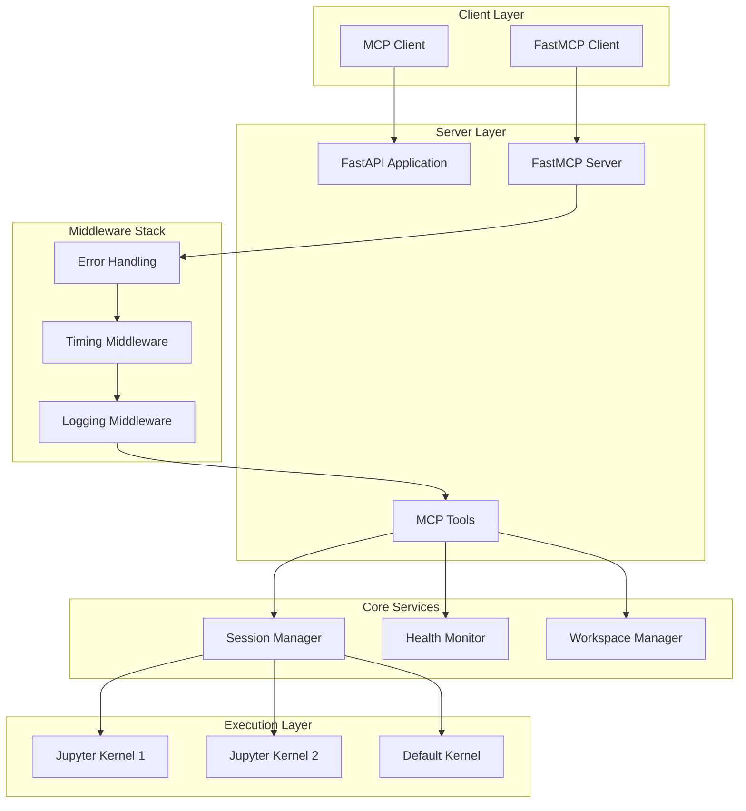

# Architecture

Understanding the technical architecture and design decisions behind the Python MCP Server v0.6.0 with FastMCP integration and production-grade infrastructure.

## High-Level Architecture



## v0.6.0 Package Architecture

The v0.6.0 release introduces a professional package structure following Python best practices:

```
src/python_mcp_server/
├── __init__.py         # Package initialization and exports
├── server.py           # Main FastMCP server implementation
└── ...                 # Future modular components

fastmcp.json           # FastMCP deployment configuration
pyproject.toml         # Modern Python packaging (hatchling)
tests/                 # Comprehensive test suite
docs/                  # Documentation source (MkDocs)
```

### Entry Points and CLI Integration

**CLI Command**: `python-mcp-server`
```python
# pyproject.toml
[project.scripts]
python-mcp-server = "python_mcp_server.server:main"
```

**FastMCP Integration**: Native `fastmcp.json` configuration
```json
{
  "$schema": "https://gofastmcp.com/public/schemas/fastmcp.json/v1.json",
  "source": {
    "type": "filesystem", 
    "path": "src/python_mcp_server/server.py",
    "entrypoint": "mcp"
  },
  "deployment": {
    "transport": "stdio",
    "log_level": "INFO"
  }
}
```

**Multiple Transport Support**:
- **STDIO Mode**: For Claude Desktop integration (`fastmcp run`)
- **HTTP Mode**: For web clients (`fastmcp run --transport http --port 8000`)
- **SSE Mode**: For real-time applications

## FastMCP Middleware Stack

The server uses a sophisticated middleware stack for production-grade reliability:

### Error Handling Middleware
```python
class ErrorHandlingMiddleware:
    """Converts Python exceptions to proper MCP ToolErrors"""
    
    async def __call__(self, request, call_next):
        try:
            return await call_next(request)
        except Exception as e:
            # Convert to ToolError with context
            raise ToolError(f"Internal error: {str(e)}")
```

### Timing Middleware
```python
class TimingMiddleware:
    """Tracks execution time for all tool calls"""
    
    async def __call__(self, request, call_next):
        start = time.time()
        result = await call_next(request)
        duration = time.time() - start
        # Log timing metrics
        return result
```

### Logging Middleware
```python
class LoggingMiddleware:
    """Context-aware logging with FastMCP Context"""
    
    async def __call__(self, request, call_next):
        ctx = get_context()
        logger.info(f"Tool call: {request.tool_name}", extra={
            "session_id": ctx.session_id,
            "call_id": ctx.call_id
        })
        return await call_next(request)
```

## Session Management

### KernelSession Class
Each session encapsulates a Jupyter kernel with complete isolation:

```python
@dataclass
class KernelSession:
    session_id: str
    kernel_manager: AsyncKernelManager
    kernel_client: AsyncKernelClient
    created_at: datetime
    last_activity: datetime
    description: Optional[str] = None
    
    def is_alive(self) -> bool:
        """Check if kernel process is running"""
        return self.kernel_manager.is_alive()
    
    async def restart(self):
        """Restart kernel while preserving session metadata"""
        await self.kernel_manager.restart_kernel()
        self.last_activity = datetime.now()
```

### SessionManager Class
Manages multiple kernel sessions with lifecycle operations:

```python
class SessionManager:
    def __init__(self):
        self.sessions: Dict[str, KernelSession] = {}
        self.current_session = "default"
        
    async def create_session(self, session_id: str, description: Optional[str] = None):
        """Create new isolated kernel session"""
        
    async def get_session(self, session_id: str) -> KernelSession:
        """Get session by ID with validation"""
        
    async def switch_session(self, session_id: str):
        """Switch active session context"""
        
    async def cleanup_session(self, session_id: str):
        """Properly shutdown and cleanup session resources"""
```

## Health Monitoring System

### Resource Tracking
```python
class HealthMonitor:
    async def get_kernel_health(self, session_id: str) -> Dict[str, Any]:
        """Get comprehensive health metrics"""
        kernel = await self.session_manager.get_session(session_id)
        
        if not kernel.is_alive():
            return {"status": "dead", "pid": None}
            
        try:
            process = psutil.Process(kernel.kernel_manager.kernel.pid)
            return {
                "status": "healthy",
                "pid": process.pid,
                "memory_usage": process.memory_info().rss,
                "cpu_percent": process.cpu_percent(),
                "num_threads": process.num_threads(),
                "uptime": time.time() - process.create_time()
            }
        except psutil.NoSuchProcess:
            return {"status": "zombie", "pid": None}
```

### Progressive Timeout Configuration
```python
@dataclass
class TimeoutConfig:
    """Progressive timeout strategy for resilient execution"""
    quick_timeout: float = 5.0      # Fast operations
    normal_timeout: float = 30.0    # Standard operations  
    long_timeout: float = 120.0     # Complex operations
    max_timeout: float = 300.0      # Maximum allowed
    
    def get_timeout_for_operation(self, operation: str) -> float:
        """Return appropriate timeout based on operation type"""
        timeout_map = {
            "code_completion": self.quick_timeout,
            "inspect_object": self.quick_timeout,
            "run_python_code": self.normal_timeout,
            "install_dependencies": self.long_timeout,
            "restart_kernel": self.long_timeout,
        }
        return timeout_map.get(operation, self.normal_timeout)
```

## Security Layer

### Workspace Sandboxing
```python
def _ensure_within_workspace(workspace_dir: Path, target_path: Path) -> Path:
    """Prevent path traversal attacks"""
    try:
        resolved_path = (workspace_dir / target_path).resolve()
        workspace_resolved = workspace_dir.resolve()
        
        # Ensure path is within workspace
        resolved_path.relative_to(workspace_resolved)
        return resolved_path
    except ValueError:
        raise ToolError(f"Path '{target_path}' is outside workspace")
```

### Input Validation
All tool inputs are validated using Pydantic models:

```python
class RunPythonCodeInput(BaseModel):
    code: str = Field(..., description="Python code to execute")
    timeout: Optional[float] = Field(None, ge=1.0, le=300.0)
    
class CreateSessionInput(BaseModel): 
    session_id: str = Field(..., pattern=r"^[a-zA-Z0-9_-]+$")
    description: Optional[str] = Field(None, max_length=200)
```

## Tool Registration Pattern

Each tool follows a consistent pattern:

```python
@mcp.tool()
async def tool_name(
    input_param: str,
    optional_param: Optional[int] = None,
    ctx: Context = Depends(get_context)  # Always last for Context
) -> Dict[str, Any]:
    """Tool description for MCP introspection"""
    
    # 1. Input validation (handled by Pydantic)
    # 2. Context logging
    ctx.logger.info(f"Executing {tool_name}")
    
    # 3. Business logic with error handling
    try:
        result = await perform_operation(input_param)
    except SpecificError as e:
        raise ToolError(f"Operation failed: {str(e)}")
    
    # 4. Return structured response
    return {
        "status": "success",
        "result": result,
        "timestamp": datetime.now().isoformat()
    }
```

## File System Operations

### Workspace Structure
```
workspace/
├── scripts/           # Saved Python scripts (.py files)
├── outputs/          # Generated files (plots, data exports)  
├── uploads/          # HTTP uploaded files
├── .kernel_sessions/ # Hidden: kernel state backups
└── (user_files)      # Any files created during execution
```

### File Safety
- All operations validated against workspace boundaries
- Atomic operations with rollback on failure
- Automatic backup of critical files
- Path sanitization and validation

## Error Handling Strategy

### Hierarchical Error Types
```python
# MCP Protocol Errors
raise ToolError("User-facing error message")

# Internal System Errors  
raise RuntimeError("Internal system error")

# Validation Errors (auto-handled by Pydantic)
class ValidationError(Exception): pass
```

### Recovery Strategies
1. **Kernel Failures**: Automatic restart with state preservation
2. **Timeout Issues**: Progressive retry with backoff
3. **Resource Exhaustion**: Graceful degradation and cleanup
4. **File System Errors**: Atomic operations with rollback

## Performance Considerations

### Memory Management
- Kernel process isolation prevents memory leaks
- Automatic garbage collection in Python kernels
- Session cleanup on timeout/failure

### Scalability
- Each session is independent (horizontal scaling ready)
- Stateless HTTP API design
- Efficient JSON-RPC over HTTP transport

### Resource Limits
```python
# Process limits per kernel
KERNEL_MEMORY_LIMIT = "1GB"
KERNEL_CPU_LIMIT = 2.0  # CPU cores
KERNEL_EXECUTION_TIMEOUT = 300  # seconds
MAX_CONCURRENT_SESSIONS = 10
```

This architecture ensures reliability, security, and performance for production AI agent workloads.