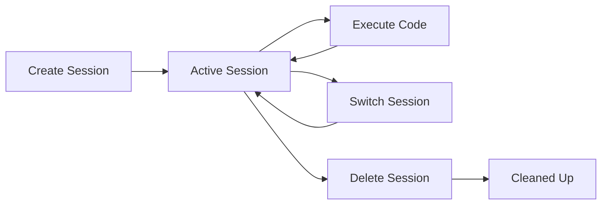

# Session Management

Advanced session management capabilities for isolated Python execution environments in Python MCP Server v0.6.0.

## Overview

The Python MCP Server provides session-based kernel isolation using Jupyter kernels, allowing you to run multiple independent Python environments simultaneously with FastMCP integration. Each session maintains its own:

- Variable namespace and state
- Imported modules and packages
- Execution history
- Resource usage tracking
- Health monitoring

## Core Concepts

### Session Isolation
```python
# Session A
await client.call_tool("create_session", {"session_id": "data_analysis"})
await client.call_tool("switch_session", {"session_id": "data_analysis"})
await client.call_tool("run_python_code", {"code": "x = 100"})

# Session B  
await client.call_tool("create_session", {"session_id": "modeling"})
await client.call_tool("switch_session", {"session_id": "modeling"})
await client.call_tool("run_python_code", {"code": "print('x' in globals())"})  # False
```

### Session Lifecycle


## Session Management API

### Creating Sessions

```python
# Basic session creation
await client.call_tool("create_session", {
    "session_id": "experiment_1"
})

# With description
await client.call_tool("create_session", {
    "session_id": "ml_pipeline",
    "description": "Machine learning training pipeline"
})
```

### Session Information

```python
# List all sessions
sessions = await client.call_tool("list_sessions")
print(f"Active: {sessions.data['active_session']}")
print(f"Total: {sessions.data['total_sessions']}")

for session_id, details in sessions.data['sessions'].items():
    print(f"- {session_id}: {details['description']}")
```

### Switching Between Sessions

```python
# Switch to specific session
result = await client.call_tool("switch_session", {
    "session_id": "ml_pipeline"
})
print(f"Switched from {result.data['previous_session']} to {result.data['current_session']}")
```

### Cleaning Up Sessions

```python
# Delete specific session
await client.call_tool("delete_session", {
    "session_id": "experiment_1"
})

# Note: Cannot delete the "default" session
```

## Advanced Workflows

### Multi-Stage Data Pipeline

```python
async def data_pipeline_workflow():
    # Stage 1: Data Collection
    await client.call_tool("create_session", {
        "session_id": "data_collection",
        "description": "Raw data ingestion and cleaning"
    })
    await client.call_tool("switch_session", {"session_id": "data_collection"})
    
    await client.call_tool("run_python_code", {
        "code": """
import pandas as pd
import requests

# Fetch raw data
response = requests.get('https://api.example.com/data')
raw_data = response.json()

# Initial cleaning
df = pd.DataFrame(raw_data)
df_clean = df.dropna()

# Save intermediate result
df_clean.to_csv('outputs/clean_data.csv', index=False)
print(f"Cleaned data shape: {df_clean.shape}")
"""
    })
    
    # Stage 2: Feature Engineering
    await client.call_tool("create_session", {
        "session_id": "feature_engineering",
        "description": "Feature creation and transformation"
    })
    await client.call_tool("switch_session", {"session_id": "feature_engineering"})
    
    await client.call_tool("run_python_code", {
        "code": """
import pandas as pd
from sklearn.preprocessing import StandardScaler, LabelEncoder

# Load cleaned data
df = pd.read_csv('outputs/clean_data.csv')

# Feature engineering
df['feature_1'] = df['col_a'] * df['col_b']
df['feature_2'] = df['col_c'].rolling(window=3).mean()

# Scaling
scaler = StandardScaler()
numeric_cols = df.select_dtypes(include=['float64', 'int64']).columns
df[numeric_cols] = scaler.fit_transform(df[numeric_cols])

# Save features
df.to_csv('outputs/features.csv', index=False)
print(f"Features shape: {df.shape}")
"""
    })
    
    # Stage 3: Model Training
    await client.call_tool("create_session", {
        "session_id": "model_training",
        "description": "ML model training and validation"
    })
    await client.call_tool("switch_session", {"session_id": "model_training"})
    
    await client.call_tool("install_dependencies", {
        "packages": ["scikit-learn", "joblib"]
    })
    
    await client.call_tool("run_python_code", {
        "code": """
import pandas as pd
from sklearn.model_selection import train_test_split
from sklearn.ensemble import RandomForestClassifier
from sklearn.metrics import accuracy_score
import joblib

# Load features
df = pd.read_csv('outputs/features.csv')
X = df.drop('target', axis=1)
y = df['target']

# Split data
X_train, X_test, y_train, y_test = train_test_split(X, y, test_size=0.2, random_state=42)

# Train model
model = RandomForestClassifier(n_estimators=100, random_state=42)
model.fit(X_train, y_train)

# Evaluate
y_pred = model.predict(X_test)
accuracy = accuracy_score(y_test, y_pred)

# Save model
joblib.dump(model, 'outputs/model.pkl')
print(f"Model accuracy: {accuracy:.4f}")
"""
    })
```

### Parallel Experimentation

```python
async def parallel_experiments():
    experiments = [
        ("linear_model", "Linear regression baseline"),
        ("random_forest", "Random forest with tuning"),
        ("gradient_boost", "Gradient boosting optimization"),
        ("neural_net", "Deep learning approach")
    ]
    
    # Create parallel sessions for experiments
    for exp_id, description in experiments:
        await client.call_tool("create_session", {
            "session_id": exp_id,
            "description": description
        })
    
    # Run experiments in parallel
    results = {}
    for exp_id, _ in experiments:
        await client.call_tool("switch_session", {"session_id": exp_id})
        
        # Each experiment loads data and trains its own model
        await client.call_tool("run_python_code", {
            "code": f"""
# Experiment: {exp_id}
import pandas as pd
import numpy as np
from sklearn.metrics import accuracy_score
import json

# Load shared dataset
df = pd.read_csv('outputs/features.csv')

# Experiment-specific model training code here
# ... (model specific code)

# Save results
results = {{
    'experiment_id': '{exp_id}',
    'accuracy': np.random.random(),  # Placeholder
    'training_time': np.random.random() * 100,
    'params': {{'param1': 'value1'}}
}}

with open(f'outputs/results_{exp_id}.json', 'w') as f:
    json.dump(results, f)

print(f"Experiment {exp_id} completed")
"""
        })
    
    # Collect and compare results
    await client.call_tool("create_session", {
        "session_id": "results_analysis",
        "description": "Compare experiment results"
    })
    await client.call_tool("switch_session", {"session_id": "results_analysis"})
    
    await client.call_tool("run_python_code", {
        "code": """
import json
import pandas as pd
from pathlib import Path

# Collect all experiment results
results = []
for result_file in Path('outputs').glob('results_*.json'):
    with open(result_file) as f:
        results.append(json.load(f))

# Create comparison dataframe
results_df = pd.DataFrame(results)
results_df = results_df.sort_values('accuracy', ascending=False)

print("Experiment Results:")
print(results_df[['experiment_id', 'accuracy', 'training_time']])

# Save final comparison
results_df.to_csv('outputs/experiment_comparison.csv', index=False)
"""
    })
```

### Interactive Development Session

```python
async def interactive_development():
    # Create development session
    await client.call_tool("create_session", {
        "session_id": "dev_session",
        "description": "Interactive development and testing"
    })
    await client.call_tool("switch_session", {"session_id": "dev_session"})
    
    # Set up development environment
    await client.call_tool("install_dependencies", {
        "packages": ["ipython", "jupyter", "matplotlib", "seaborn"]
    })
    
    # Enable rich output
    await client.call_tool("run_python_code", {
        "code": """
import matplotlib.pyplot as plt
import seaborn as sns
import pandas as pd
import numpy as np

# Configure matplotlib for inline plots
plt.style.use('seaborn-v0_8')
sns.set_palette("husl")

print("Development environment ready!")
print("Available tools: matplotlib, seaborn, pandas, numpy")
"""
    })
    
    # Interactive code development
    # (This would typically be done through multiple tool calls)
    
    # Save reusable functions as script
    await client.call_tool("save_script", {
        "name": "analysis_utils",
        "content": """
import pandas as pd
import matplotlib.pyplot as plt
import seaborn as sns

def quick_plot(df, x_col, y_col, title="Quick Plot"):
    '''Create a quick scatter plot'''
    plt.figure(figsize=(10, 6))
    plt.scatter(df[x_col], df[y_col], alpha=0.6)
    plt.xlabel(x_col)
    plt.ylabel(y_col)
    plt.title(title)
    plt.tight_layout()
    return plt

def data_summary(df):
    '''Get quick data summary'''
    return {
        'shape': df.shape,
        'dtypes': df.dtypes.to_dict(),
        'missing': df.isnull().sum().to_dict(),
        'numeric_summary': df.describe().to_dict()
    }
"""
    })
```

## Session Monitoring

### Health Checks
```python
async def monitor_session_health():
    sessions = await client.call_tool("list_sessions")
    
    for session_id in sessions.data['sessions'].keys():
        await client.call_tool("switch_session", {"session_id": session_id})
        
        # Check kernel health
        health = await client.call_tool("get_kernel_health")
        responsive = await client.call_tool("check_kernel_responsiveness")
        
        print(f"Session {session_id}:")
        print(f"  Status: {health.data['status']}")
        print(f"  Responsive: {responsive.data['responsive']}")
        print(f"  Memory: {health.data.get('memory_usage', 0) / 1024**2:.1f} MB")
        
        if health.data['status'] != 'healthy':
            print(f"  ⚠️  Session {session_id} needs attention")
```

### Resource Management
```python
async def cleanup_idle_sessions():
    sessions = await client.call_tool("list_sessions")
    
    for session_id, details in sessions.data['sessions'].items():
        if session_id == 'default':
            continue  # Never delete default session
            
        await client.call_tool("switch_session", {"session_id": session_id})
        health = await client.call_tool("get_kernel_health")
        
        # Check if session has been idle too long
        uptime = health.data.get('uptime', 0)
        memory_usage = health.data.get('memory_usage', 0)
        
        if uptime > 3600 and memory_usage > 500 * 1024**2:  # 1 hour, 500MB
            print(f"Cleaning up idle session: {session_id}")
            await client.call_tool("delete_session", {"session_id": session_id})
```

## Best Practices

### Session Naming
- Use descriptive, lowercase names with underscores
- Include purpose: `data_cleaning`, `model_training`, `visualization`
- Use prefixes for related sessions: `exp_1`, `exp_2`, `exp_3`

### Resource Management
- Clean up sessions when done to free memory
- Monitor memory usage in long-running sessions
- Use session descriptions to document purpose

### State Management
- Save important data to files for cross-session access
- Use scripts for reusable functionality
- Consider session restart for memory cleanup

### Error Recovery
- Always check session health before critical operations
- Implement session restart logic for failed kernels
- Use multiple sessions for fault isolation

The session management system enables sophisticated, production-ready Python execution workflows with complete isolation and resource control.