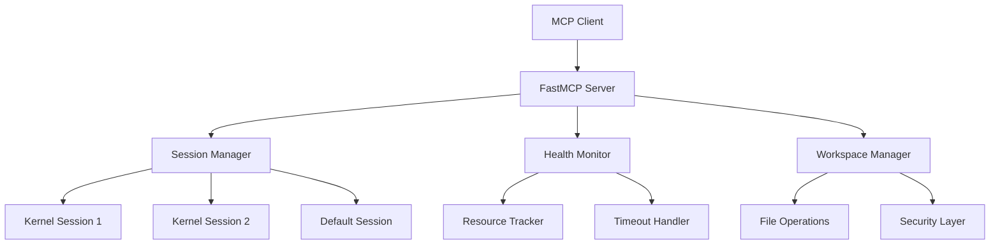

# Python Interpreter MCP Server

[](https://github.com/deadmeme5441/python-mcp-server/actions)
[](https://pypi.org/project/python-mcp-server/)
[](https://www.python.org/downloads/)
[](https://opensource.org/licenses/MIT)
[](https://deadmeme5441.github.io/python-mcp-server/)

A world-class Python interpreter MCP (Model Context Protocol) server that provides secure, isolated Python code execution with advanced session management and health monitoring. Built with FastMCP for production-grade reliability.

## ✨ Features

### 🚀 **Production-Ready Architecture**
- **FastMCP Middleware Stack**: Professional error handling, timing, and contextual logging
- **Session-Based Isolation**: Multiple independent Python kernels with complete state separation  
- **Health Monitoring**: Real-time kernel diagnostics with intelligent restart capabilities
- **Progressive Timeouts**: Resilient execution with smart retry logic

### 🔒 **Security & Reliability** 
- **Workspace Sandboxing**: Path traversal protection and secure file operations
- **Resource Monitoring**: CPU, memory, and process health tracking
- **State Preservation**: Automatic kernel state backup and restoration
- **Error Resilience**: Graceful handling of kernel failures and timeouts

### 🛠 **Developer Experience**
- **Notebook Surface**: One tool to run cells, manage datasets, and export artifacts
- **File Management**: Read, write, delete operations with safety checks  
- **Package Installation**: Dynamic dependency management with uv/pip

### 🎯 **FastMCP Integration**
- **Native FastMCP Configuration**: Built-in `fastmcp.json` for easy deployment
- **CLI Integration**: Works seamlessly with FastMCP CLI commands
- **Multiple Transport Modes**: STDIO, HTTP, Server-Sent Events support
- **Claude Desktop Ready**: Perfect integration with Claude Desktop

## 🚀 Quick Start

### Installation

**Method 1: PyPI (Recommended)**
```bash
pip install python-mcp-server
```

**Method 2: uvx (Isolated)**
```bash
uvx install python-mcp-server
```

**Method 3: FastMCP CLI (For Claude Desktop)**
```bash
fastmcp install claude-desktop python-mcp-server
```

### Basic Usage

**Standalone Server (HTTP Mode)**
```bash
# Start HTTP server
python-mcp-server --host 127.0.0.1 --port 8000

# Custom workspace
python-mcp-server --workspace /path/to/workspace --port 8000
```

**FastMCP CLI (Recommended)**
```bash
# Run with FastMCP (auto-detects fastmcp.json)
fastmcp run

# Run with specific transport
fastmcp run --transport http --port 8000

# For development/testing
fastmcp dev
```

### Client Usage

**FastMCP Client**
```python
import asyncio
from fastmcp.client import Client

async def main():
    async with Client("http://localhost:8000/mcp") as client:
        # Execute Python code
        result = await client.call_tool("run_python_code", {
            "code": """
import numpy as np
import matplotlib.pyplot as plt

x = np.linspace(0, 10, 100)
y = np.sin(x)

plt.figure(figsize=(10, 6))
plt.plot(x, y, 'b-', linewidth=2)
plt.title('Sine Wave')
plt.grid(True)
plt.show()

print("Plot created successfully!")
"""
        })
        print("Output:", result.data["stdout"])

asyncio.run(main())
```

## 🏗 Architecture



## 📦 Package Structure (v1.0.0)

```
src/python_mcp_server/
├── server.py          # Main FastMCP server implementation
├── __init__.py         # Package initialization
└── ...

fastmcp.json           # FastMCP configuration
pyproject.toml         # Package metadata and dependencies
tests/                 # Comprehensive test suite
docs/                  # Documentation source
```

## 🔧 Tools Reference

### Notebook (single surface)
`notebook(action=..., ...)` — one tool for cells, datasets, and exports.

- Actions:
  - `run` — execute a cell; capture stdout/stderr, figures (PNG/SVG), JSON outputs, and a workspace diff. Writes a manifest per cell under `outputs/notebooks/<id>/`.
  - `cells` — list executed cells (from index.json).
  - `cell` — fetch one cell’s manifest.
  - `export` — write a `.ipynb` (and `.html` if available) to `outputs/notebooks/`.
  - `reset` — clear notebook manifests for the same `notebook_id` (kernel is not restarted).
  - `datasets.register` — create/update a DuckDB VIEW over CSV/Parquet files or globs.
  - `datasets.list` — show registered datasets.
  - `datasets.describe` — schema + head(50).
  - `datasets.drop` — remove a registered dataset/view.
  - `datasets.sql` — run SQL across registered views; returns preview and writes full result to Parquet.

### Core Execution
- `run_python_code` - Execute Python with output capture (rich display assets saved to `outputs/`)
- `restart_kernel` - Clean kernel restart with optional state preservation

### File Operations
- `list_files` - Browse workspace (flat or tree view)
- `read_file` / `write_file` / `delete_file` - Safe file operations

### Package Management
- `install_dependencies` - Dynamic dependency installation with uv/pip fallback

## 💡 Advanced Usage

### Notes
- Session isolation, health and concurrency controls run under the hood; the public tool surface is intentionally minimal for agent reliability.

## 🧰 Interpreter / Venv Configuration

The server runs the Jupyter kernel with the same interpreter and environment as the process by default. You can override with flags in both stdio and http modes:

```bash
python-mcp-server \
  --python /path/to/python \
  --venv /path/to/venv \
  --pythonpath "/extra/dir1:/extra/dir2" \
  --transport http --port 8000
```

Environment variables honored: `PYTHON`, `MPLBACKEND=Agg` (default), `MCP_MAX_CONCURRENT_CELLS`, `MCP_MEMORY_BUDGET_MB`, `MCP_SOFT_WATERMARK`, `MCP_HARD_WATERMARK`.

## 📊 Datasets (DuckDB-backed)

Register CSV/Parquet files (or globs) as DuckDB views and query with SQL:

```python
# Register
await client.call_tool("notebook", {
  "action": "datasets.register",
  "dataset_name": "sales",
  "paths": ["data/sales_*.parquet"],
  "format": "parquet"
})

# Describe
await client.call_tool("notebook", {"action": "datasets.describe", "dataset_name": "sales"})

# Query (preview + full Parquet result on disk)
await client.call_tool("notebook", {
  "action": "datasets.sql",
  "query": "select date, sum(amount) as total from sales group by date order by date"
})
```

## 🔧 Configuration

### FastMCP Configuration (`fastmcp.json`)
```json
{
  "$schema": "https://gofastmcp.com/public/schemas/fastmcp.json/v1.json",
  "source": {
    "type": "filesystem",
    "path": "src/python_mcp_server/server.py",
    "entrypoint": "mcp"
  },
  "environment": {
    "type": "uv",
    "python": ">=3.10",
    "dependencies": [
      "fastmcp>=1.0.0",
      "jupyter_client>=8.0.0",
      "matplotlib>=3.7.0",
      "pandas>=2.0.0"
    ],
    "editable": ["."]
  },
  "deployment": {
    "transport": "stdio",
    "log_level": "INFO",
    "env": {
      "MCP_WORKSPACE_DIR": "workspace",
      "MPLBACKEND": "Agg",
      "PYTHONUNBUFFERED": "1"
    }
  }
}
```

### Environment Variables
```bash
export MCP_WORKSPACE_DIR="./workspace"    # Workspace directory
export MPLBACKEND="Agg"                   # Matplotlib backend
export PYTHONUNBUFFERED="1"               # Unbuffered output
```

### Command Line Options
```bash
python-mcp-server \
    --port 8000 \
    --host 0.0.0.0 \
    --workspace ./custom_workspace
```

## 📁 Workspace Structure

```
workspace/
├── scripts/     # Saved Python scripts
├── outputs/     # Generated files (plots, data, etc.)
├── uploads/     # Uploaded files via HTTP
└── (user files) # Any files created during execution
```

## 🤝 Integration Examples

### With Claude Desktop (STDIO Mode)

**Method 1: Direct Command**
```json
{
  "mcpServers": {
    "python-interpreter": {
      "command": "python-mcp-server",
      "args": ["--workspace", "/path/to/workspace"]
    }
  }
}
```

**Method 2: FastMCP CLI (Recommended)**
```bash
# Install for Claude Desktop
fastmcp install claude-desktop fastmcp.json --name "Python Interpreter"
```

This generates the correct configuration automatically.

**Method 3: Direct Python Path**
```json
{
  "mcpServers": {
    "python-interpreter": {
      "command": "python", 
      "args": [
        "/path/to/src/python_mcp_server/server.py",
        "--workspace", "/path/to/workspace"
      ]
    }
  }
}
```

### With Claude Code
```bash
fastmcp install claude-code fastmcp.json --name "Python Interpreter"
```

### With Cursor
```bash
fastmcp install cursor fastmcp.json --name "Python Interpreter"
```

### Custom HTTP Client
```python
# Raw HTTP/JSON-RPC
import httpx

async def call_tool(tool_name, arguments):
    async with httpx.AsyncClient() as client:
        response = await client.post("http://localhost:8000/mcp", json={
            "jsonrpc": "2.0",
            "method": "tools/call",
            "params": {"name": tool_name, "arguments": arguments},
            "id": 1
        })
        return response.json()
```

### With uvx (No Installation)
```bash
# Run directly without installing globally
uvx python-mcp-server --port 8000

# With additional dependencies
uvx --with pandas --with numpy python-mcp-server --port 8000
```

## 🧪 Development

### Setup
```bash
git clone https://github.com/deadmeme5441/python-mcp-server.git
cd python-mcp-server
uv sync
```

### Testing
```bash
# Run all tests
uv run pytest tests/ -v

# Run specific test
uv run pytest tests/test_sessions.py -v

# With coverage
uv run pytest --cov=src --cov-report=html
```

### Code Quality
```bash
# Linting
uvx ruff@latest check .

# Type checking
uv run mypy src/

# Formatting
uvx ruff@latest format .
```

### FastMCP Development
```bash
# Run with FastMCP for development
fastmcp dev

# Test different transports
fastmcp run --transport http --port 8000
fastmcp run --transport stdio
```

## 📚 Documentation

- **[Complete Documentation](https://deadmeme5441.github.io/python-mcp-server/)** - Full guides and API reference
- **[Getting Started](https://deadmeme5441.github.io/python-mcp-server/getting-started/)** - Installation and first steps
- **[Architecture](https://deadmeme5441.github.io/python-mcp-server/architecture/)** - Technical deep dive
- **[Examples](https://deadmeme5441.github.io/python-mcp-server/examples/)** - Practical usage patterns
- **[Troubleshooting](https://deadmeme5441.github.io/python-mcp-server/troubleshooting/)** - Common issues and solutions

## 🔒 Security

- **Workspace Sandboxing**: All operations restricted to configured workspace
- **Path Validation**: Protection against directory traversal attacks  
- **Resource Limits**: Configurable memory and CPU constraints
- **Process Isolation**: Each session runs in isolated Jupyter kernel
- **Input Sanitization**: All inputs validated via Pydantic models

## 🚀 Use Cases

- **AI Agent Environments**: Reliable Python execution for AI agents
- **Educational Platforms**: Safe, isolated code execution for learning
- **Data Analysis Workflows**: Session-based data processing pipelines  
- **Research & Prototyping**: Quick iteration with state preservation
- **Jupyter Alternative**: MCP-native Python execution environment
- **Claude Desktop Integration**: Enhanced Python capabilities for Claude

## 📋 Changelog (v0.6.0)

### 🎉 Major Changes
- **New Package Structure**: Migrated to `src/python_mcp_server/` layout
- **FastMCP Integration**: Added native `fastmcp.json` configuration
- **Fixed CLI Command**: `python-mcp-server` now works correctly
- **Enhanced Installation**: Multiple installation methods supported

### 🔧 Improvements
- **Better Testing**: Fixed all test imports and module structure
- **Documentation**: Updated for new package structure
- **Claude Desktop**: Improved integration and configuration
- **Code Quality**: Full linting compliance and type checking

### 🐛 Bug Fixes
- **Entry Point**: Fixed package entry point configuration
- **Module Imports**: Resolved import issues in tests
- **Build System**: Proper hatchling configuration

## 🤝 Contributing

We welcome contributions! Please see our [Contributing Guide](https://deadmeme5441.github.io/python-mcp-server/development/) for details.

1. Fork the repository
2. Create your feature branch: `git checkout -b feature/amazing-feature`
3. Commit your changes: `git commit -m 'Add amazing feature'`
4. Push to the branch: `git push origin feature/amazing-feature`
5. Open a Pull Request

## 📄 License

This project is licensed under the MIT License - see the [LICENSE](LICENSE) file for details.

## 🙏 Acknowledgments

- **[FastMCP](https://github.com/jlowin/fastmcp)** - Excellent MCP framework
- **[Jupyter](https://jupyter.org/)** - Kernel architecture inspiration
- **[Model Context Protocol](https://modelcontextprotocol.io/)** - Protocol specification
- **[uv](https://docs.astral.sh/uv/)** - Fast Python package manager

## 🔗 Links

- **PyPI**: [python-mcp-server](https://pypi.org/project/python-mcp-server/)
- **Documentation**: [deadmeme5441.github.io/python-mcp-server](https://deadmeme5441.github.io/python-mcp-server/)
- **Issues**: [GitHub Issues](https://github.com/deadmeme5441/python-mcp-server/issues)
- **Discussions**: [GitHub Discussions](https://github.com/deadmeme5441/python-mcp-server/discussions)

---

<div align="center">

**[⭐ Star this repo](https://github.com/deadmeme5441/python-mcp-server) if you find it useful!**

Built with ❤️ by [DeadMeme5441](https://github.com/DeadMeme5441)

</div>
