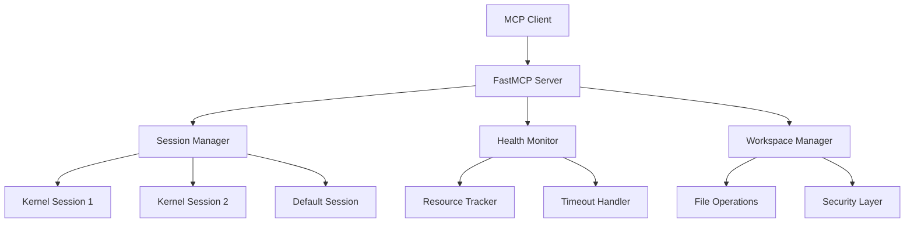

# Python Interpreter MCP Server

A world-class Python interpreter MCP (Model Context Protocol) server that provides secure, isolated Python code execution with advanced session management and health monitoring.

## Features

### 🚀 **Production-Ready Architecture**
- **FastMCP Middleware Stack**: Professional error handling, timing, and contextual logging
- **Session-Based Isolation**: Multiple independent Python kernels with complete state separation  
- **Health Monitoring**: Real-time kernel diagnostics with intelligent restart capabilities
- **Progressive Timeouts**: Resilient execution with smart retry logic

### 🔒 **Security & Reliability** 
- **Workspace Sandboxing**: Path traversal protection and secure file operations
- **Resource Monitoring**: CPU, memory, and process health tracking
- **State Preservation**: Automatic kernel state backup and restoration
- **Error Resilience**: Graceful handling of kernel failures and timeouts

### 🛠 **Developer Experience**
- **20 Comprehensive Tools**: From basic execution to advanced introspection
- **Code Completion**: IPython-powered intelligent completions
- **File Management**: Read, write, delete operations with safety checks  
- **Package Installation**: Dynamic dependency management with uv/pip
- **Script Execution**: Save and run Python scripts with output capture

## Quick Start

```bash
# Install the package
pip install python-interpreter-mcp

# Or run directly
python main.py --port 8000
```

Connect via MCP client:
```python
from fastmcp.client import Client

async with Client("http://localhost:8000/mcp") as client:
    # Execute Python code
    result = await client.call_tool("run_python_code", {
        "code": "print('Hello from MCP!')"
    })
    
    # Create isolated session
    await client.call_tool("create_session", {
        "session_id": "data_analysis"
    })
```

## Architecture Overview



## Use Cases

- **AI Agent Environments**: Provide reliable Python execution for AI agents
- **Educational Platforms**: Safe, isolated code execution for learning
- **Data Analysis Workflows**: Session-based data processing pipelines  
- **Prototyping & Testing**: Quick iteration with state preservation
- **Jupyter Alternative**: MCP-native Python execution environment

## What Makes This Special

Unlike basic Python execution servers, this MCP server provides:

1. **True Session Isolation**: Each session runs in its own Jupyter kernel
2. **Production Monitoring**: Real-time health metrics and diagnostics
3. **Intelligent Recovery**: Smart restart with state preservation  
4. **Enterprise Security**: Workspace sandboxing and path validation
5. **Agent-Optimized**: Designed specifically for AI agent interaction patterns

Ready to get started? Check out our [Getting Started](getting-started.md) guide!