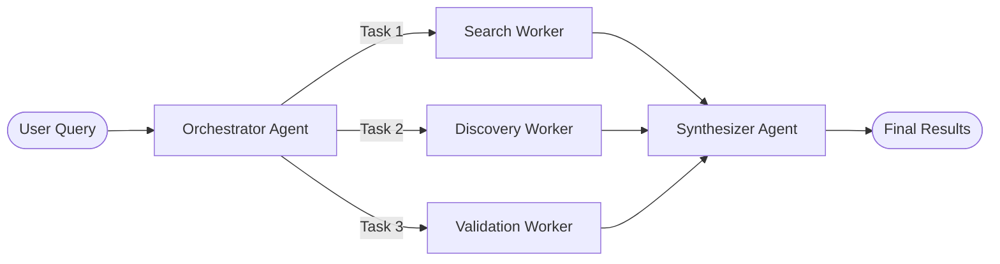

# Reddit Research Agent - Technical Specification

## Executive Summary
A self-contained, single-file Python agent using the Orchestrator-Workers pattern to discover relevant Reddit communities for research questions. The system leverages UV's inline script metadata for automatic dependency management, OpenAI Agent SDK for orchestration, and PRAW for Reddit API access. No manual dependency installation required - just run the script and UV handles everything.

## Single-File Architecture

The entire agent is contained in a single Python file (`reddit_research_agent.py`) with:
- **Inline Dependencies**: Using UV's PEP 723 support, dependencies are declared in the script header
- **Automatic Installation**: UV automatically installs all dependencies on first run
- **No Project Setup**: No `pyproject.toml`, `requirements.txt`, or virtual environment management needed
- **Portable**: Single file can be copied and run anywhere with UV installed

## Architecture Pattern: Orchestrator-Workers



## System Components

### 1. Project Configuration

#### Self-Contained Dependencies
The agent uses UV's inline script metadata (PEP 723) for automatic dependency management. No separate `pyproject.toml` or manual installation required - dependencies are declared directly in the script header and UV handles everything automatically.

#### Environment Variables (`.env`)
```bash
# OpenAI Configuration
OPENAI_API_KEY=sk-...

# Reddit API Configuration
REDDIT_CLIENT_ID=your_client_id
REDDIT_CLIENT_SECRET=your_client_secret
REDDIT_USER_AGENT=RedditResearchAgent/0.1.0 by YourUsername
```

### 2. Core Agents

#### 2.1 Orchestrator Agent
**Purpose**: Analyzes research questions and creates parallel search strategies

```python
orchestrator = Agent(
    name="Research Orchestrator",
    instructions="""
    You are a research orchestrator specializing in Reddit discovery.
    
    Given a research question:
    1. Identify key concepts and terms
    2. Generate multiple search strategies:
       - Direct keyword searches (exact terms)
       - Semantic searches (related concepts, synonyms)
       - Category searches (broader topics, fields)
    3. Output specific tasks for parallel execution
    
    Consider:
    - Technical vs general audience communities
    - Active vs historical discussions
    - Niche vs mainstream subreddits
    """,
    output_type=SearchTaskPlan
)
```

**Output Model**:
```python
class SearchTaskPlan(BaseModel):
    direct_searches: List[str]  # Exact keyword searches
    semantic_searches: List[str]  # Related term searches
    category_searches: List[str]  # Broad topic searches
    validation_criteria: Dict[str, Any]  # Relevance criteria
```

#### 2.2 Worker Agents (Parallel Execution)

##### Search Worker
**Purpose**: Executes direct Reddit searches using PRAW

```python
search_worker = Agent(
    name="Search Worker",
    instructions="Execute Reddit searches and return discovered subreddits",
    tools=[search_subreddits_tool, search_posts_tool]
)
```

##### Discovery Worker
**Purpose**: Finds related communities through analysis

```python
discovery_worker = Agent(
    name="Discovery Worker",
    instructions="Discover related subreddits through sidebars, wikis, and cross-references",
    tools=[get_related_subreddits_tool, analyze_community_tool]
)
```

##### Validation Worker
**Purpose**: Verifies relevance and quality of discovered subreddits

```python
validation_worker = Agent(
    name="Validation Worker",
    instructions="Validate subreddit relevance, activity levels, and quality",
    tools=[get_subreddit_info_tool, check_activity_tool]
)
```

#### 2.3 Synthesizer Agent
**Purpose**: Combines, deduplicates, and ranks all results

```python
synthesizer = Agent(
    name="Result Synthesizer",
    instructions="""
    Synthesize results from all workers:
    
    1. Deduplicate discoveries
    2. Rank by relevance factors:
       - Description alignment with research topic
       - Subscriber count and activity level
       - Content quality indicators
       - Moderation status
    3. Filter out:
       - Inactive communities (< 10 posts/month)
       - Spam/promotional subreddits
       - Quarantined/banned communities
    4. Return top 8-15 subreddits with justification
    
    Provide discovery rationale for each recommendation.
    """,
    output_type=FinalResearchResults
)
```

**Output Model**:
```python
class SubredditRecommendation(BaseModel):
    name: str
    description: str
    subscribers: int
    relevance_score: float
    discovery_method: str
    rationale: str

class FinalResearchResults(BaseModel):
    query: str
    total_discovered: int
    recommendations: List[SubredditRecommendation]
    search_strategies_used: List[str]
    execution_time: float
```

### 3. PRAW Integration Tools (Enhanced)

#### Core Reddit Connection
```python
import praw
from functools import lru_cache
import os

@lru_cache(maxsize=1)
def get_reddit_instance():
    """Singleton Reddit instance for all workers - thread-safe via lru_cache"""
    return praw.Reddit(
        client_id=os.getenv("REDDIT_CLIENT_ID"),
        client_secret=os.getenv("REDDIT_CLIENT_SECRET"),
        user_agent=os.getenv("REDDIT_USER_AGENT"),
        read_only=True  # Read-only mode for research
    )
```

#### Pydantic Models for Type Safety
```python
from pydantic import BaseModel
from typing import List, Optional

class SubredditInfo(BaseModel):
    """Structured subreddit information with validation"""
    name: str
    title: str
    description: str
    subscribers: int
    created_utc: float
    over18: bool
    is_active: bool  # Based on recent activity
    avg_comments_per_post: float
    recent_posts_count: int
    
class ResearchContext(BaseModel):
    """Context passed between tools"""
    research_question: str
    discovered_subreddits: List[str] = []
    search_strategies_used: List[str] = []
```

#### Error Handler for Reddit API Issues
```python
from agents import RunContextWrapper
from typing import Any

def reddit_error_handler(ctx: RunContextWrapper[Any], error: Exception) -> str:
    """
    Handle common Reddit API errors gracefully.
    
    Returns user-friendly error messages for common issues.
    """
    error_str = str(error)
    
    if "403" in error_str or "Forbidden" in error_str:
        return "Subreddit is private or restricted. Skipping this community."
    elif "404" in error_str or "Not Found" in error_str:
        return "Subreddit not found. It may be banned, deleted, or misspelled."
    elif "429" in error_str or "Too Many Requests" in error_str:
        return "Reddit rate limit reached. Waiting before retry."
    elif "prawcore.exceptions" in error_str:
        return f"Reddit API connection issue: {error_str[:50]}. Retrying..."
    else:
        return f"Unexpected Reddit error: {error_str[:100]}"
```

#### Enhanced Function Tools with Type Safety and Error Handling

```python
@function_tool(failure_error_function=reddit_error_handler)
async def search_subreddits_tool(
    ctx: RunContextWrapper[ResearchContext],
    query: str,
    limit: int = 25
) -> List[SubredditInfo]:
    """
    Search for subreddits matching the query with relevance filtering.
    
    Args:
        ctx: Runtime context containing the original research question
        query: Search terms for Reddit (2-512 characters)
        limit: Maximum results to return (1-100, default: 25)
    
    Returns:
        List of SubredditInfo objects with validated data
        
    Note:
        Automatically filters out inactive subreddits (< 100 subscribers)
        and those without recent activity.
    """
    reddit = get_reddit_instance()
    results = []
    original_query = ctx.context.research_question
    
    try:
        for subreddit in reddit.subreddits.search(query, limit=limit):
            # Skip very small/inactive subreddits
            if subreddit.subscribers < 100:
                continue
                
            # Get activity metrics
            try:
                recent_posts = list(subreddit.new(limit=5))
                is_active = len(recent_posts) > 0
                avg_comments = sum(p.num_comments for p in recent_posts) / len(recent_posts) if recent_posts else 0
            except:
                is_active = False
                avg_comments = 0
                recent_posts = []
            
            results.append(SubredditInfo(
                name=subreddit.display_name,
                title=subreddit.title or "",
                description=subreddit.public_description or "",
                subscribers=subreddit.subscribers,
                created_utc=subreddit.created_utc,
                over18=subreddit.over18,
                is_active=is_active,
                avg_comments_per_post=avg_comments,
                recent_posts_count=len(recent_posts)
            ))
    except Exception as e:
        # Let the error handler deal with it
        raise
    
    # Update context with discovered subreddits
    ctx.context.discovered_subreddits.extend([r.name for r in results])
    
    return results

@function_tool(failure_error_function=reddit_error_handler)
async def get_related_subreddits_tool(
    ctx: RunContextWrapper[ResearchContext],
    subreddit_name: str
) -> List[str]:
    """
    Find related subreddits from sidebar, wiki, and community info.
    
    Args:
        ctx: Runtime context for tracking discoveries
        subreddit_name: Name of subreddit to analyze (without r/ prefix)
    
    Returns:
        List of related subreddit names (deduplicated)
        
    Note:
        Searches in sidebar description, wiki pages, and 
        community widgets for related community mentions.
    """
    reddit = get_reddit_instance()
    related = set()  # Use set for automatic deduplication
    
    try:
        subreddit = reddit.subreddit(subreddit_name)
        
        # Parse sidebar for r/ mentions
        if hasattr(subreddit, 'description') and subreddit.description:
            import re
            pattern = r'r/([A-Za-z0-9_]+)'
            matches = re.findall(pattern, subreddit.description)
            related.update(matches)
        
        # Check wiki pages if accessible
        try:
            # Common wiki pages with related subreddits
            wiki_pages = ['related', 'index', 'sidebar', 'communities']
            for page_name in wiki_pages:
                try:
                    wiki_page = subreddit.wiki[page_name]
                    content = wiki_page.content_md
                    matches = re.findall(pattern, content)
                    related.update(matches)
                except:
                    continue
        except:
            pass
            
        # Parse community widgets if available
        try:
            for widget in subreddit.widgets:
                if hasattr(widget, 'text'):
                    matches = re.findall(pattern, widget.text)
                    related.update(matches)
        except:
            pass
            
    except Exception as e:
        # Let the error handler deal with it
        raise
    
    # Remove the original subreddit from related list
    related.discard(subreddit_name)
    
    return list(related)

@function_tool(failure_error_function=reddit_error_handler)
async def validate_subreddit_relevance_tool(
    ctx: RunContextWrapper[ResearchContext],
    subreddit_name: str
) -> SubredditInfo:
    """
    Get detailed subreddit information with relevance validation.
    
    Args:
        ctx: Runtime context containing research question
        subreddit_name: Name of subreddit to validate
    
    Returns:
        SubredditInfo with detailed metrics
        
    Note:
        Checks activity level, moderation status, and 
        content quality indicators.
    """
    reddit = get_reddit_instance()
    
    try:
        subreddit = reddit.subreddit(subreddit_name)
        
        # Force load to check if subreddit exists
        _ = subreddit.id
        
        # Get recent activity for validation
        recent_posts = list(subreddit.new(limit=10))
        
        # Calculate activity metrics
        if recent_posts:
            avg_comments = sum(p.num_comments for p in recent_posts) / len(recent_posts)
            # Check if posts are recent (within last 30 days)
            import time
            current_time = time.time()
            latest_post_age = current_time - recent_posts[0].created_utc
            is_active = latest_post_age < (30 * 24 * 60 * 60)  # 30 days in seconds
        else:
            avg_comments = 0
            is_active = False
        
        return SubredditInfo(
            name=subreddit.display_name,
            title=subreddit.title or "",
            description=subreddit.public_description or "",
            subscribers=subreddit.subscribers,
            created_utc=subreddit.created_utc,
            over18=subreddit.over18,
            is_active=is_active,
            avg_comments_per_post=avg_comments,
            recent_posts_count=len(recent_posts)
        )
        
    except Exception as e:
        # Let the error handler deal with it
        raise
```

### 4. Execution Controller

```python
import asyncio
from typing import List, Dict, Any
from agents import Runner

async def execute_reddit_research(query: str) -> FinalResearchResults:
    """
    Main execution controller for the research process.
    
    Args:
        query: User's research question
    
    Returns:
        Final curated results
    """
    
    # Step 1: Orchestrator creates search plan
    print(f"🎯 Analyzing research question: {query}")
    orchestrator_result = await Runner.run(orchestrator, query)
    search_plan = orchestrator_result.final_output_as(SearchTaskPlan)
    
    # Step 2: Execute workers in parallel
    print("🔍 Executing parallel search strategies...")
    worker_tasks = [
        Runner.run(search_worker, {
            "searches": search_plan.direct_searches,
            "search_type": "direct"
        }),
        Runner.run(discovery_worker, {
            "searches": search_plan.semantic_searches,
            "search_type": "semantic"
        }),
        Runner.run(validation_worker, {
            "searches": search_plan.category_searches,
            "validation_criteria": search_plan.validation_criteria
        })
    ]
    
    worker_results = await asyncio.gather(*worker_tasks)
    
    # Step 3: Synthesize results
    print("🔀 Synthesizing discoveries...")
    synthesis_input = {
        "query": query,
        "worker_results": [r.final_output for r in worker_results],
        "search_plan": search_plan.model_dump()
    }
    
    synthesizer_result = await Runner.run(synthesizer, synthesis_input)
    final_results = synthesizer_result.final_output_as(FinalResearchResults)
    
    return final_results
```

### 5. Main Entry Point (Self-Contained with UV)

```python
#!/usr/bin/env -S uv run --script
# /// script
# requires-python = ">=3.11"
# dependencies = [
#     "openai-agents>=0.1.0",
#     "praw>=7.7.0",
#     "python-dotenv>=1.0.0",
#     "pydantic>=2.0.0",
#     "prawcore>=2.4.0"
# ]
# ///
"""
Reddit Research Agent
Discovers relevant Reddit communities for research questions
using the Orchestrator-Workers pattern.

Usage:
    ./reddit_research_agent.py
    OR
    uv run reddit_research_agent.py
    
No manual dependency installation required - UV handles everything automatically.
"""

import asyncio
import os
from dotenv import load_dotenv
from typing import Optional, List, Dict, Any

# Load environment variables
load_dotenv()

async def main():
    """Main execution function"""
    
    # Validate environment
    required_vars = [
        "OPENAI_API_KEY",
        "REDDIT_CLIENT_ID", 
        "REDDIT_CLIENT_SECRET",
        "REDDIT_USER_AGENT"
    ]
    
    missing = [var for var in required_vars if not os.getenv(var)]
    if missing:
        print(f"❌ Missing environment variables: {', '.join(missing)}")
        return
    
    # Get research query
    query = input("🔬 Enter your research question: ").strip()
    if not query:
        print("❌ Please provide a research question")
        return
    
    try:
        # Execute research
        results = await execute_reddit_research(query)
        
        # Display results
        print(f"\n✅ Discovered {results.total_discovered} subreddits")
        print(f"📊 Top {len(results.recommendations)} recommendations:\n")
        
        for i, rec in enumerate(results.recommendations, 1):
            print(f"{i}. r/{rec.name} ({rec.subscribers:,} subscribers)")
            print(f"   📝 {rec.description[:100]}...")
            print(f"   🎯 Relevance: {rec.relevance_score:.2f}/10")
            print(f"   💡 {rec.rationale}\n")
        
        print(f"⏱️ Execution time: {results.execution_time:.2f} seconds")
        
    except Exception as e:
        print(f"❌ Error during execution: {e}")
        raise

if __name__ == "__main__":
    asyncio.run(main())
```

## Search Strategies

### 1. Direct Search
- Exact keyword matching
- Query variations (singular/plural)
- Common abbreviations

### 2. Semantic Search
- Synonyms and related terms
- Domain-specific terminology
- Conceptual expansions

### 3. Category Search
- Broader topic areas
- Academic disciplines
- Industry sectors

### 4. Discovery Methods
- Sidebar parsing for related communities
- Wiki page analysis
- Cross-post detection
- Moderator overlap analysis

## Quality Metrics

### Relevance Scoring
1. **Description Match** (40%)
   - Keyword presence in description
   - Semantic similarity to query

2. **Activity Level** (30%)
   - Posts per day
   - Comment engagement
   - Active user count

3. **Community Size** (20%)
   - Subscriber count
   - Growth trajectory

4. **Content Quality** (10%)
   - Moderation level
   - Rules complexity
   - Wiki presence

## Error Handling

### API Rate Limits
- Implement exponential backoff
- Cache results for 1 hour
- Batch requests where possible

### Invalid Subreddits
- Skip private/banned communities
- Handle 404 errors gracefully
- Log failures for debugging

### Network Issues
- Retry logic with timeout
- Fallback to cached results
- User notification of degraded service

## Performance Targets

- **Discovery Time**: < 10 seconds for typical query
- **Parallel Workers**: 3-5 concurrent operations
- **Result Count**: 8-15 high-quality recommendations
- **Cache Hit Rate**: > 30% for common topics

## Testing Strategy

### Unit Tests
- Individual tool functions
- PRAW mock responses
- Agent prompt validation

### Integration Tests
- Full workflow execution
- Parallel worker coordination
- Result synthesis accuracy

### Example Test Queries
1. "machine learning ethics"
2. "sustainable urban farming"
3. "quantum computing applications"
4. "remote work productivity"
5. "climate change solutions"

## Future Enhancements

1. **Temporal Analysis**
   - Trending topic detection
   - Historical activity patterns

2. **Content Analysis**
   - Sentiment analysis of discussions
   - Expert identification

3. **Network Analysis**
   - Community overlap mapping
   - Influence flow detection

4. **Personalization**
   - User preference learning
   - Custom ranking weights

## Deployment Considerations

### Usage Instructions
```bash
# Method 1: Direct execution (if file is executable)
chmod +x reddit_research_agent.py
./reddit_research_agent.py

# Method 2: Using UV run
uv run reddit_research_agent.py

# No manual dependency installation needed!
# UV automatically handles all dependencies on first run
```

### Key Benefits of UV Inline Dependencies
- **Zero Setup**: No `pip install` or `uv add` commands needed
- **Self-Contained**: Single file contains code and dependency specifications
- **Reproducible**: Same dependencies installed every time
- **Fast**: UV caches dependencies for quick subsequent runs
- **Version Locked**: Optional `.lock` file ensures exact versions

### Production Deployment
- Use environment-specific `.env` files
- Implement logging and monitoring
- Add result caching layer with Redis/Memcached
- Consider rate limit pooling for multiple users
- Lock dependencies with `uv lock --script reddit_research_agent.py`

## Success Metrics

1. **Coverage**: Discovers 80%+ of relevant subreddits
2. **Precision**: 90%+ relevance accuracy
3. **Speed**: < 10 second average execution
4. **Reliability**: 99%+ uptime with graceful degradation