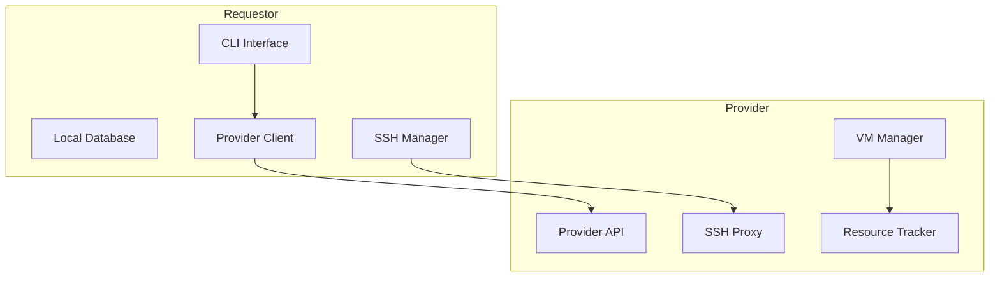
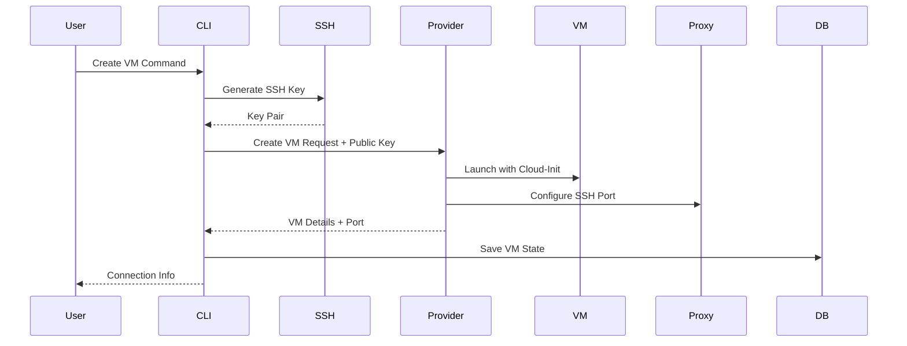
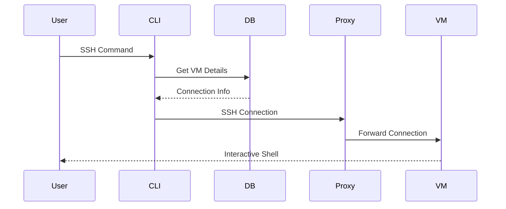

# VM on Golem Requestor

A sophisticated command-line interface for managing virtual machines on the Golem Network. The requestor works in tandem with provider nodes to create and manage VMs with secure SSH access.

## Architecture Overview



## How It Works

### 1. VM Creation Flow



When you create a VM:

1. The requestor generates an SSH key pair or uses your system's existing keys
2. The provider receives the public key and injects it during VM creation via cloud-init
3. The provider allocates a dedicated port and configures SSH forwarding
4. Connection details are stored locally for future access

### 2. SSH Connection Flow



The SSH connection process:

1. The CLI retrieves stored VM details from the local database
2. The provider's proxy system forwards your SSH connection to the VM
3. All traffic is securely routed through the allocated port

## Installation

```bash
# Install using pip
pip install golem-vm-requestor

# Or install from source
git clone https://github.com/golem/vm-on-golem.git
cd vm-on-golem/requestor-server
pip install -e .
```

## Development

To run the application in development mode, you need to set environment variables to configure development-specific settings. These are defined in the `.env.dev` file.

You can run the server in development mode using one of the following methods:

### Using `source`

First, source the development environment variables:

```bash
source .env.dev
```

Then, run any `golem` command. For example:

```bash
poetry run golem vm providers
```

### Prepending variables

Alternatively, you can prepend the environment variables directly to the command:

```bash
GOLEM_REQUESTOR_ENVIRONMENT="development" GOLEM_REQUESTOR_FORCE_LOCALHOST="true" poetry run golem vm providers
```

## Usage

### Provider Discovery

List available providers with their resources:

```bash
golem vm providers
```

Example output:

```
────────────────────────────────────────────────
  🌍 Available Providers (3 total)
────────────────────────────────────────────────
Provider ID     Country   CPU    Memory    Storage
provider-1      🌍 SE     💻 4    🧠 8GB    💾 40GB
provider-2      🌍 US     💻 8    🧠 16GB   💾 80GB
provider-3      🌍 DE     💻 2    🧠 4GB    💾 20GB
────────────────────────────────────────────────
```

### Creating a VM

```bash
golem vm create my-webserver --provider-id provider-1 --cpu 2 --memory 4 --storage 20
```

The system will:

1. Verify provider availability
2. Check resource requirements
3. Set up SSH access
4. Deploy and configure the VM
5. Save connection details locally

Example output:

```
────────────────────────────────────────────────
  🎉 VM Deployed Successfully!
────────────────────────────────────────────────

  VM Details
  ┈┈┈┈┈┈┈┈┈┈┈┈┈┈┈┈┈┈┈┈┈┈┈┈┈┈┈
  🏷️  Name      : my-webserver
  💻 Resources  : 2 CPU, 4GB RAM, 20GB Storage
  🟢 Status     : running

  Connection Details
  ┈┈┈┈┈┈┈┈┈┈┈┈┈┈┈┈┈┈┈┈┈┈┈┈┈┈┈
  🌐 IP Address : 192.168.1.100
  🔌 Port       : 50800

  Quick Connect
  ┈┈┈┈┈┈┈┈┈┈┈┈┈┈┈┈┈┈┈┈┈┈┈┈┈┈┈
  🔑 SSH Command : ssh -i ~/.golem/ssh/id_rsa -p 50800 ubuntu@192.168.1.100
────────────────────────────────────────────────
```

### Managing VMs

List your VMs:

```bash
golem vm list
```

Example output:

```
────────────────────────────────────────────────
  📋 Your VMs (2 total)
────────────────────────────────────────────────
Name          Status         IP Address      Resources
my-webserver  ● running     192.168.1.100   2 CPU, 4GB RAM
my-database   ● stopped     192.168.1.101   4 CPU, 8GB RAM
────────────────────────────────────────────────
```

Other commands:

```bash
# SSH into a VM
golem vm ssh my-webserver

# Stop a VM
golem vm stop my-webserver

# Start a VM
golem vm start my-webserver

# Destroy a VM
golem vm destroy my-webserver
```

## Configuration

The requestor uses a hierarchical configuration system:

1. Environment Variables:

```bash
# Discovery Service
export GOLEM_REQUESTOR_DISCOVERY_URL="http://discovery.golem.network:9001"

# Base Directory (default: ~/.golem)
export GOLEM_REQUESTOR_BASE_DIR="/path/to/golem/dir"

# Individual Paths (override base dir)
export GOLEM_REQUESTOR_SSH_KEY_DIR="/path/to/keys"
export GOLEM_REQUESTOR_DB_PATH="/path/to/database.db"

# Environment Mode (defaults to "production")
export GOLEM_REQUESTOR_ENVIRONMENT="development"  # Optional: Switch to development mode
export GOLEM_REQUESTOR_FORCE_LOCALHOST="true"    # Optional: Force localhost in development mode
```

2. Directory Structure:

```
~/.golem/
  ├── ssh/              # SSH keys
  │   ├── id_rsa       # Private key
  │   └── id_rsa.pub   # Public key
  └── vms.db           # SQLite database
```

## Technical Details

### SSH Key Management

The system intelligently handles SSH keys:

1. Uses existing system SSH keys if available
2. Generates and manages Golem-specific keys if needed
3. Ensures proper key permissions (0600 for private, 0644 for public)
4. Supports key reuse across VMs

### State Management

Local state is maintained in SQLite:

-   VM details and configuration
-   Provider information
-   Connection parameters
-   VM status tracking

### Provider Integration

The requestor communicates with providers through:

1. Discovery service for provider location
2. Direct API calls for VM management
3. SSH proxy system for secure access
4. Resource tracking for capacity management

## Error Handling

The system provides clear error messages and recovery steps:

```
Error: Unable to establish SSH connection (VM may be starting up)
Solution: Wait a few moments and try again. The VM is likely still initializing.

Error: Provider is no longer available (they may have gone offline)
Solution: Choose a different provider or wait for the original to come back online.

Error: VM not found in local database
Solution: The VM may have been manually removed. Use 'golem vm list' to see available VMs.
```

## Contributing

1. Fork the repository
2. Create a feature branch
3. Make your changes
4. Run the tests
5. Submit a pull request
