<h1 align="center"> Universal Scraper</h1>

<h2 align="center"> The Python package for scraping data from any website</h2>

<p align="center">
<a href="https://pypi.org/project/universal-scraper/"></a>
<a href="https://pepy.tech/project/universal-scraper?versions=1*&versions=2*&versions=3*"></a>
<a href="https://pepy.tech/project/universal-scraper?versions=1*&versions=2*&versions=3*"></a>
<a href="https://github.com/WitesoAI/universal-scraper/commits/main"></a>
<a href="#"></a>
</p>

--------------------------------------------------------------------------

A Python module for AI-powered web scraping with customizable field extraction using multiple AI providers (Gemini, OpenAI, Anthropic, and more via LiteLLM).

## 🔄 How Universal Scraper Works

```mermaid
graph TB
    A[🌐 Input URL] --> B[📥 HTML Fetcher]
    B --> B1[CloudScraper Anti-Bot Protection]
    B1 --> C[🧹 Smart HTML Cleaner]
    
    C --> C1[Remove Scripts & Styles]
    C1 --> C2[Remove Ads & Analytics]
    C2 --> C3[Remove Navigation Elements]
    C3 --> C4[Detect Repeating Structures]
    C4 --> C5[Keep 2 Samples, Remove Others]
    C5 --> C6[Remove Empty Divs]
    C6 --> D[📊 98% Size Reduction]
    
    D --> E{🔍 Check Code Cache}
    E -->|Cache Hit| F[♻️ Use Cached Code]
    E -->|Cache Miss| G[🤖 AI Code Generation]
    
    G --> G1[🧠 Choose AI Provider]
    G1 --> G2[Gemini 2.5-Flash Default]
    G1 --> G3[OpenAI GPT-4/GPT-4o]
    G1 --> G4[Claude 3 Opus/Sonnet/Haiku]
    G1 --> G5[100+ Other Models via LiteLLM]
    
    G2 --> H[📝 Generate BeautifulSoup Code]
    G3 --> H
    G4 --> H
    G5 --> H
    
    H --> I[💾 Cache Generated Code]
    F --> J[⚡ Execute Code on Original HTML]
    I --> J
    
    J --> K[📋 Extract Structured Data]
    K --> L{📁 Output Format}
    L -->|JSON| M[💾 Save as JSON]
    L -->|CSV| N[📊 Save as CSV]
    
    M --> O[✅ Complete with Metadata]
    N --> O
    
    style A fill:#e1f5fe
    style D fill:#4caf50,color:#fff
    style E fill:#ff9800,color:#fff
    style F fill:#4caf50,color:#fff
    style G1 fill:#9c27b0,color:#fff
    style O fill:#2196f3,color:#fff
```



**Key Performance Benefits:**
- 🚀 **98% HTML Size Reduction** → Massive token savings
- ⚡ **Smart Caching** → 90%+ API cost reduction on repeat scraping  
- 🤖 **Multi-Provider Support** → Choose the best AI for your use case
- 🔄 **Dual HTML Processing** → Clean HTML for AI analysis, original HTML for complete data extraction

## 💻 Live Working Example

Here's a real working example showing Universal Scraper in action with OpenAI GPT-4o:

```python
>>> from universal_scraper import UniversalScraper
>>> scraper = UniversalScraper(api_key="sk-proj-XXXXXXXXXX", model_name="gpt-4o")
2025-09-06 14:08:13 - code_cache - INFO - CodeCache initialized with database: temp/extraction_cache.db
2025-09-06 14:08:13 - data_extractor - INFO - Code caching enabled
2025-09-06 14:08:13 - data_extractor - INFO - Using LiteLLM with model: gpt-4o
2025-09-06 14:08:13 - data_extractor - INFO - Initialized DataExtractor with model: gpt-4o

>>> # Set fields for e-commerce laptop scraping
>>> scraper.set_fields(["product_name", "product_price", "product_rating", "product_description", "availability"])
2025-09-06 14:08:15 - universal_scraper - INFO - Extraction fields updated: ['product_name', 'product_price', 'product_rating', 'product_description', 'availability']

>>> result = scraper.scrape_url("https://webscraper.io/test-sites/e-commerce/allinone/computers/laptops", save_to_file=True, format='csv')
2025-09-06 14:08:20 - universal_scraper - INFO - Starting scraping for: https://webscraper.io/test-sites/e-commerce/allinone/computers/laptops
2025-09-06 14:08:20 - html_fetcher - INFO - Starting to fetch HTML for: https://webscraper.io/test-sites/e-commerce/allinone/computers/laptops
2025-09-06 14:08:20 - html_fetcher - INFO - Fetching with cloudscraper...
2025-09-06 14:08:21 - html_fetcher - INFO - Successfully fetched content with cloudscraper. Length: 163468
2025-09-06 14:08:21 - html_cleaner - INFO - Starting HTML cleaning process...
2025-09-06 14:08:21 - html_cleaner - INFO - Removed noise. Length: 142586
2025-09-06 14:08:21 - html_cleaner - INFO - Removed headers/footers. Length: 135883
2025-09-06 14:08:21 - html_cleaner - INFO - Focused on main content. Length: 135646
2025-09-06 14:08:21 - html_cleaner - INFO - Found 117 similar structures, keeping 2, removing 115
2025-09-06 14:08:21 - html_cleaner - INFO - Removed 115 repeating structure elements
2025-09-06 14:08:21 - html_cleaner - INFO - Removed repeating structures. Length: 2933
2025-09-06 14:08:21 - html_cleaner - INFO - Removed 3 empty div elements in 1 iterations
2025-09-06 14:08:21 - html_cleaner - INFO - HTML cleaning completed. Original: 150714, Final: 2844
2025-09-06 14:08:21 - html_cleaner - INFO - Reduction: 98.1%
2025-09-06 14:08:21 - data_extractor - INFO - Using HTML separation: cleaned for code generation, original for execution
2025-09-06 14:08:21 - code_cache - INFO - Cache MISS for https://webscraper.io/test-sites/e-commerce/allinone/computers/laptops
2025-09-06 14:08:21 - data_extractor - INFO - Generating BeautifulSoup code with gpt-4o for fields: ['product_name', 'product_price', 'product_rating', 'product_description', 'availability']
2025-09-06 14:08:21 - LiteLLM - INFO - LiteLLM completion() model= gpt-4o; provider = openai
2025-09-06 14:08:25 - LiteLLM - INFO - Wrapper: Completed Call, calling success_handler
2025-09-06 14:08:25 - code_cache - INFO - Code cached for https://webscraper.io/test-sites/e-commerce/allinone/computers/laptops
2025-09-06 14:08:25 - data_extractor - INFO - Successfully generated BeautifulSoup code
2025-09-06 14:08:25 - data_extractor - INFO - Executing generated extraction code...
2025-09-06 14:08:25 - data_extractor - INFO - Successfully extracted data with 117 items
2025-09-06 14:08:25 - universal_scraper - INFO - Successfully extracted data from https://webscraper.io/test-sites/e-commerce/allinone/computers/laptops
>>>

# ✨ Results: 117 laptop products extracted from 163KB HTML in ~5 seconds!
# 🎯 98.1% HTML size reduction (163KB → 2.8KB for AI processing)  
# 💾 Data automatically saved as CSV with product_name, product_price, product_rating, etc.
```

**🔥 What Just Happened:**
1. **Fields Configured** for e-commerce: product_name, product_price, product_rating, etc.
2. **HTML Fetched** with anti-bot protection (163KB)
3. **Smart Cleaning** reduced size by 98.1% (163KB → 2.8KB)
4. **AI Generated** custom extraction code using GPT-4o for specified fields
5. **Code Cached** for future use (90% cost savings on re-runs)
6. **117 Laptop Products Extracted** from original HTML with complete data
7. **Saved as CSV** ready for analysis with all specified product fields

## How It Works

1. **HTML Fetching**: Uses cloudscraper or selenium to fetch HTML content, handling anti-bot measures
2. **Smart HTML Cleaning**: Removes 91%+ of noise (scripts, ads, navigation, repeated structures, empty divs) while preserving data structure
3. **Structure-Based Caching**: Creates structural hash and checks cache for existing extraction code
4. **AI Code Generation**: Uses your chosen AI provider (Gemini, OpenAI, Claude, etc.) to generate custom BeautifulSoup code on cleaned HTML (only when not cached)
5. **Code Execution**: Runs the cached/generated code on original HTML to extract ALL data items
6. **JSON Output**: Returns complete, structured data with metadata and performance stats

## Features

- 🤖 **Multi-Provider AI Support**: Uses Google Gemini by default, with support for OpenAI, Anthropic, and 100+ other models via LiteLLM
- 🎯 **Customizable Fields**: Define exactly which fields you want to extract (e.g., company name, job title, salary)
- 🚀 **Smart Caching**: Automatically caches extraction code based on HTML structure - saves 90%+ API tokens on repeat scraping
- 🧹 **Smart HTML Cleaner**: Removes noise and reduces HTML by 91%+ - significantly cuts token usage for AI processing
- 🔧 **Easy to Use**: Simple API for both quick scraping and advanced use cases
- 📦 **Modular Design**: Built with clean, modular components
- 🛡️ **Robust**: Handles edge cases, missing data, and various HTML structures
- 💾 **Multiple Output Formats**: Support for both JSON (default) and CSV export formats
- 📊 **Structured Output**: Clean, structured data output with comprehensive metadata

## Installation (Recommended)

```
pip install universal-scraper
```

## Installation

1. **Clone the repository**:
   ```bash
   git clone <repository-url>
   cd Universal_Scrapper
   ```

2. **Install dependencies**:
   ```bash
   pip install -r requirements.txt
   ```

   Or install manually:
   ```bash
   pip install google-generativeai beautifulsoup4 requests selenium lxml html5lib fake-useragent
   ```

3. **Install the module**:
   ```bash
   pip install -e .
   ```

## Quick Start

### 1. Set up your API key

**Option A: Use Gemini (Default - Recommended)**
Get a Gemini API key from [Google AI Studio](https://makersuite.google.com/app/apikey):

```bash
export GEMINI_API_KEY="your_gemini_api_key_here"
```

**Option B: Use OpenAI**
```bash
export OPENAI_API_KEY="your_openai_api_key_here"
```

**Option C: Use Anthropic Claude**
```bash
export ANTHROPIC_API_KEY="your_anthropic_api_key_here"
```

**Option D: Pass API key directly**
```python
# For any provider - just pass the API key directly
scraper = UniversalScraper(api_key="your_api_key")
```

### 2. Basic Usage

```python
from universal_scraper import UniversalScraper

# Option 1: Auto-detect provider (uses Gemini by default)
scraper = UniversalScraper(api_key="your_gemini_api_key")

# Option 2: Specify Gemini model explicitly
scraper = UniversalScraper(api_key="your_gemini_api_key", model_name="gemini-2.5-flash")

# Option 3: Use OpenAI
scraper = UniversalScraper(api_key="your_openai_api_key", model_name="gpt-4")

# Option 4: Use Anthropic Claude
scraper = UniversalScraper(api_key="your_anthropic_api_key", model_name="claude-3-sonnet-20240229")

# Option 5: Use any other provider supported by LiteLLM
scraper = UniversalScraper(api_key="your_api_key", model_name="llama-2-70b-chat")

# Set the fields you want to extract
scraper.set_fields([
    "company_name", 
    "job_title", 
    "apply_link", 
    "salary_range",
    "location"
])

# Check current model
print(f"Using model: {scraper.get_model_name()}")

# Scrape a URL (default JSON format)
result = scraper.scrape_url("https://example.com/jobs", save_to_file=True)

print(f"Extracted {result['metadata']['items_extracted']} items")
print(f"Data saved to: {result.get('saved_to')}")

# Scrape and save as CSV
result = scraper.scrape_url("https://example.com/jobs", save_to_file=True, format='csv')
print(f"CSV data saved to: {result.get('saved_to')}")
```

### 3. Convenience Function

For quick one-off scraping:

```python
from universal_scraper import scrape

# Quick scraping with default JSON format
data = scrape(
    url="https://example.com/jobs",
    api_key="your_gemini_api_key",
    fields=["company_name", "job_title", "apply_link"]
)

# Quick scraping with CSV format
data = scrape(
    url="https://example.com/jobs",
    api_key="your_gemini_api_key",
    fields=["company_name", "job_title", "apply_link"],
    format="csv"
)

# Quick scraping with OpenAI
data = scrape(
    url="https://example.com/jobs",
    api_key="your_openai_api_key",
    fields=["company_name", "job_title", "apply_link"],
    model_name="gpt-4"
)

# Quick scraping with Anthropic Claude
data = scrape(
    url="https://example.com/jobs",
    api_key="your_anthropic_api_key",
    fields=["company_name", "job_title", "apply_link"],
    model_name="claude-3-haiku-20240307"
)

print(data['data'])  # The extracted data
```

## 📁 Export Formats

Universal Scraper supports multiple output formats to suit your data processing needs:

### JSON Export (Default)
```python
# JSON is the default format
result = scraper.scrape_url("https://example.com/jobs", save_to_file=True)
# or explicitly specify
result = scraper.scrape_url("https://example.com/jobs", save_to_file=True, format='json')
```

**JSON Output Structure:**
```json
{
  "url": "https://example.com",
  "timestamp": "2025-01-01T12:00:00",
  "fields": ["company_name", "job_title", "apply_link"],
  "data": [
    {
      "company_name": "Example Corp",
      "job_title": "Software Engineer", 
      "apply_link": "https://example.com/apply/123"
    }
  ],
  "metadata": {
    "raw_html_length": 50000,
    "cleaned_html_length": 15000,
    "items_extracted": 1
  }
}
```

### CSV Export
```python
# Export as CSV for spreadsheet analysis
result = scraper.scrape_url("https://example.com/jobs", save_to_file=True, format='csv')
```

**CSV Output:**
- Clean tabular format with headers
- All fields as columns, missing values filled with empty strings
- Perfect for Excel, Google Sheets, or pandas processing
- Automatically handles varying field structures across items

### Multiple URLs with Format Choice
```python
urls = ["https://site1.com", "https://site2.com", "https://site3.com"]

# Save all as JSON (default)
results = scraper.scrape_multiple_urls(urls, save_to_files=True)

# Save all as CSV
results = scraper.scrape_multiple_urls(urls, save_to_files=True, format='csv')
```

### CLI Usage

**🎉 NEW in v1.6.0**: Full multi-provider CLI support!

```bash
# Gemini (default) - auto-detects from environment
universal-scraper https://example.com/jobs --output jobs.json

# OpenAI GPT models
universal-scraper https://example.com/products --api-key YOUR_OPENAI_KEY --model gpt-4 --format csv

# Anthropic Claude models  
universal-scraper https://example.com/data --api-key YOUR_ANTHROPIC_KEY --model claude-3-haiku-20240307

# Custom fields extraction
universal-scraper https://example.com/listings --fields product_name product_price product_rating

# Batch processing multiple URLs
universal-scraper --urls urls.txt --output-dir results --format csv --model gpt-4o-mini

# Verbose logging with any provider
universal-scraper https://example.com --api-key YOUR_KEY --model gpt-4 --verbose
```

**🔧 Advanced CLI Options:**
```bash
# Set custom extraction fields
universal-scraper URL --fields title price description availability

# Use environment variables (auto-detected)
export OPENAI_API_KEY="your_key"
universal-scraper URL --model gpt-4

# Multiple output formats
universal-scraper URL --format json    # Default
universal-scraper URL --format csv     # Spreadsheet-ready

# Batch processing
echo -e "https://site1.com\nhttps://site2.com" > urls.txt
universal-scraper --urls urls.txt --output-dir batch_results
```

**🔗 Provider Support**: All 100+ models supported by LiteLLM work in CLI! See [LiteLLM Providers](https://docs.litellm.ai/docs/providers) for complete list.

**📝 Development Usage** (from cloned repo):
```bash
python main.py https://example.com/jobs --api-key YOUR_KEY --model gpt-4
```

## 🧹 Smart HTML Cleaning

**Reduces HTML size by 98%+** before sending to AI - dramatically cuts token usage:

### What Gets Removed
- **Scripts & Styles**: JavaScript, CSS, and style blocks
- **Ads & Analytics**: Advertisement content and tracking scripts
- **Navigation**: Headers, footers, sidebars, and menu elements  
- **Metadata**: Meta tags, SEO tags, and hidden elements
- **Empty Elements**: Recursively removes empty div elements that don't contain meaningful content
- **Noise**: Comments, unnecessary attributes, and whitespace

### Repeating Structure Reduction (NEW!)
The cleaner now intelligently detects and reduces repeated HTML structures:

- **Pattern Detection**: Uses structural hashing + similarity algorithms to find repeated elements
- **Smart Sampling**: Keeps 2 samples from groups of 3+ similar structures (e.g., 20 job cards → 2 samples)
- **Structure Preservation**: Maintains document flow and parent-child relationships
- **AI Optimization**: Provides enough samples for pattern recognition without overwhelming the AI

### Empty Element Removal (NEW!)
The cleaner now intelligently removes empty div elements:

- **Recursive Processing**: Starts from innermost divs and works outward
- **Content Detection**: Preserves divs with text, images, inputs, or interactive elements
- **Structure Preservation**: Maintains parent-child relationships and avoids breaking important structural elements
- **Smart Analysis**: Removes placeholder/skeleton divs while keeping functional containers

**Example**: Removes empty animation placeholders like `<div class="animate-pulse"></div>` while preserving divs containing actual content.

### HTML Separation for Execution (NEW!)
The system uses a two-phase approach for optimal results:

- **Phase 1**: Cleaned HTML (91% smaller) sent to AI for BeautifulSoup code generation
- **Phase 2**: Original HTML used for code execution to extract ALL data items
- **Result**: Best of both worlds - efficient AI analysis + complete data extraction

## 🚀 Smart Caching (NEW!)

**Saves 90%+ API tokens** by reusing extraction code for similar HTML structures:

### Cache Management
```python
scraper = UniversalScraper(api_key="your_key")

# View cache statistics
stats = scraper.get_cache_stats()
print(f"Cached entries: {stats['total_entries']}")
print(f"Total cache hits: {stats['total_uses']}")

# Clear old entries (30+ days)
removed = scraper.cleanup_old_cache(30)
print(f"Removed {removed} old entries")

# Clear entire cache
scraper.clear_cache()

# Disable/enable caching
scraper.disable_cache()  # For testing
scraper.enable_cache()   # Re-enable
```

## Advanced Usage

### Multiple URLs

```python
scraper = UniversalScraper(api_key="your_api_key")
scraper.set_fields(["title", "price", "description"])

urls = [
    "https://site1.com/products",
    "https://site2.com/items", 
    "https://site3.com/listings"
]

# Scrape all URLs and save as JSON (default)
results = scraper.scrape_multiple_urls(urls, save_to_files=True)

# Scrape all URLs and save as CSV for analysis
results = scraper.scrape_multiple_urls(urls, save_to_files=True, format='csv')

for result in results:
    if result.get('error'):
        print(f"Failed {result['url']}: {result['error']}")
    else:
        print(f"Success {result['url']}: {result['metadata']['items_extracted']} items")
```

### Custom Configuration

```python
scraper = UniversalScraper(
    api_key="your_api_key",
    temp_dir="custom_temp",      # Custom temporary directory
    output_dir="custom_output",  # Custom output directory  
    log_level=logging.DEBUG,     # Enable debug logging
    model_name="gpt-4"           # Custom model (OpenAI, Gemini, Claude, etc.)
)

# Configure for e-commerce scraping
scraper.set_fields([
    "product_name",
    "product_price", 
    "product_rating",
    "product_reviews_count",
    "product_availability",
    "product_description"
])

# Check and change model dynamically
print(f"Current model: {scraper.get_model_name()}")
scraper.set_model_name("gpt-4")  # Switch to OpenAI
print(f"Switched to: {scraper.get_model_name()}")

# Or switch to Claude
scraper.set_model_name("claude-3-sonnet-20240229")
print(f"Switched to: {scraper.get_model_name()}")

result = scraper.scrape_url("https://ecommerce-site.com", save_to_file=True)
```

## API Reference

### UniversalScraper Class

#### Constructor
```python
UniversalScraper(api_key=None, temp_dir="temp", output_dir="output", log_level=logging.INFO, model_name=None)
```

- `api_key`: AI provider API key (auto-detects provider, or set specific env vars)
- `temp_dir`: Directory for temporary files
- `output_dir`: Directory for output files
- `log_level`: Logging level
- `model_name`: AI model name (default: 'gemini-2.5-flash', supports 100+ models via LiteLLM)
  - See [LiteLLM Providers](https://docs.litellm.ai/docs/providers) for complete model list and setup

#### Methods

- `set_fields(fields: List[str])`: Set the fields to extract
- `get_fields() -> List[str]`: Get current fields configuration
- `get_model_name() -> str`: Get current Gemini model name
- `set_model_name(model_name: str)`: Change the Gemini model
- `scrape_url(url: str, save_to_file=False, output_filename=None, format='json') -> Dict`: Scrape a single URL
- `scrape_multiple_urls(urls: List[str], save_to_files=True, format='json') -> List[Dict]`: Scrape multiple URLs

### Convenience Function

```python
scrape(url: str, api_key: str, fields: List[str], model_name: Optional[str] = None, format: str = 'json') -> Dict
```

Quick scraping function for simple use cases. Auto-detects AI provider from API key pattern.

**Note**: For model names and provider-specific setup, refer to the [LiteLLM Providers Documentation](https://docs.litellm.ai/docs/providers).

## Output Format

The scraped data is returned in a structured format:

```json
{
  "url": "https://example.com",
  "timestamp": "2025-01-01T12:00:00",
  "fields": ["company_name", "job_title", "apply_link"],
  "data": [
    {
      "company_name": "Example Corp",
      "job_title": "Software Engineer", 
      "apply_link": "https://example.com/apply/123"
    }
  ],
  "metadata": {
    "raw_html_length": 50000,
    "cleaned_html_length": 15000,
    "items_extracted": 1
  }
}
```

## Common Field Examples

### Job Listings
```python
scraper.set_fields([
    "company_name",
    "job_title", 
    "apply_link",
    "salary_range",
    "location",
    "job_description",
    "employment_type",
    "experience_level"
])
```

### E-commerce Products
```python
scraper.set_fields([
    "product_name",
    "product_price",
    "product_rating", 
    "product_reviews_count",
    "product_availability",
    "product_image_url",
    "product_description"
])
```

### News Articles
```python
scraper.set_fields([
    "article_title",
    "article_content",
    "article_author",
    "publish_date", 
    "article_url",
    "article_category"
])
```

## Example Files

- `example_usage.py`: Comprehensive examples of different usage patterns
- `test_module.py`: Test suite for the module

## 🤖 Multi-Provider AI Support

Universal Scraper now supports multiple AI providers through LiteLLM integration:

### Supported Providers
- **Google Gemini** (Default): `gemini-2.5-flash`, `gemini-1.5-pro`, etc.
- **OpenAI**: `gpt-4`, `gpt-4-turbo`, `gpt-3.5-turbo`, etc.
- **Anthropic**: `claude-3-opus-20240229`, `claude-3-sonnet-20240229`, `claude-3-haiku-20240307`
- **100+ Other Models**: Via LiteLLM including Llama, PaLM, Cohere, and more

**📚 For complete model names and provider setup**: See [LiteLLM Providers Documentation](https://docs.litellm.ai/docs/providers)

### Usage Examples

```python
# Gemini (Default - Free tier available)
scraper = UniversalScraper(api_key="your_gemini_key")
# Auto-detects as gemini-2.5-flash

# OpenAI
scraper = UniversalScraper(api_key="sk-...", model_name="gpt-4")

# Anthropic Claude
scraper = UniversalScraper(api_key="sk-ant-...", model_name="claude-3-haiku-20240307")

# Environment variable approach
# Set GEMINI_API_KEY, OPENAI_API_KEY, or ANTHROPIC_API_KEY
scraper = UniversalScraper()  # Auto-detects from env vars

# Any other provider from LiteLLM (see link above for model names)
scraper = UniversalScraper(api_key="your_api_key", model_name="llama-2-70b-chat")
```

### Model Configuration Guide

**📋 Quick Reference for Popular Models:**
```python
# Gemini Models
model_name="gemini-2.5-flash"        # Fast, efficient
model_name="gemini-1.5-pro"          # More capable

# OpenAI Models  
model_name="gpt-4"                   # Most capable
model_name="gpt-4o-mini"             # Fast, cost-effective
model_name="gpt-3.5-turbo"           # Legacy but reliable

# Anthropic Models
model_name="claude-3-opus-20240229"      # Most capable
model_name="claude-3-sonnet-20240229"    # Balanced
model_name="claude-3-haiku-20240307"     # Fast, efficient

# Other Popular Models (see LiteLLM docs for setup)
model_name="llama-2-70b-chat"        # Meta Llama
model_name="command-nightly"          # Cohere
model_name="palm-2-chat-bison"        # Google PaLM
```

**🔗 Complete Model List**: Visit [LiteLLM Providers Documentation](https://docs.litellm.ai/docs/providers) for:
- All available model names
- Provider-specific API key setup
- Environment variable configuration
- Rate limits and pricing information

### Model Auto-Detection
If you don't specify a model, the scraper automatically selects:
- **Gemini**: If `GEMINI_API_KEY` is set or API key contains "AIza"
- **OpenAI**: If `OPENAI_API_KEY` is set or API key starts with "sk-"
- **Anthropic**: If `ANTHROPIC_API_KEY` is set or API key starts with "sk-ant-"

## Troubleshooting

### Common Issues

1. **API Key Error**: Make sure your API key is valid and set correctly:
   - Gemini: Set `GEMINI_API_KEY` or pass directly
   - OpenAI: Set `OPENAI_API_KEY` or pass directly
   - Anthropic: Set `ANTHROPIC_API_KEY` or pass directly
2. **Model Not Found**: Ensure you're using the correct model name for your provider
3. **Empty Results**: The AI might need more specific field names or the page might not contain the expected data
4. **Network Errors**: Some sites block scrapers - the tool uses cloudscraper to handle most cases
5. **Model Name Issues**: Check [LiteLLM Providers](https://docs.litellm.ai/docs/providers) for correct model names and setup instructions

### Debug Mode

Enable debug logging to see what's happening:

```python
import logging
scraper = UniversalScraper(api_key="your_key", log_level=logging.DEBUG)
```

## Core Contributors

<!-- ALL-CONTRIBUTORS-LIST:START - Do not remove or modify this section -->
<!-- prettier-ignore-start -->
<!-- markdownlint-disable -->

<table>
<tr>

<td align="center">
    <a href="https://github.com/PushpenderIndia">
        <kbd></kbd><br />
        <sub><b>Pushpender Singh</b></sub>
    </a><br />
    <a href="https://github.com/WitesoAI/universal-scraper/commits?author=PushpenderIndia" title="Code"> :computer: </a> 
</td>

<td align="center">
    <a href="https://github.com/Ayushi0405">
        <kbd></kbd><br />
        <sub><b>Ayushi Gupta</b></sub>
    </a><br />
    <a href="https://github.com/WitesoAI/universal-scraper/commits?author=Ayushi0405" title="Code"> :computer: </a> 
</td>

</tr>
</tr>
</table>

<!-- markdownlint-enable -->
<!-- prettier-ignore-end -->
<!-- ALL-CONTRIBUTORS-LIST:END -->

Contributions of any kind welcome!

## Contributing

1. Fork the repository
2. Create a feature branch
3. Make your changes
4. Run tests: `python test_module.py`
5. Submit a pull request

## License

MIT License - see LICENSE file for details.

## Changelog

### v1.7.0 - HTML Form Optimization Release
- 🔧 **NEW**: Select options limiting - automatically reduces select tags to maximum 2 options
- 🧹 **ENHANCEMENT**: Improved HTML cleaning with form element optimization
- 📦 **OPTIMIZATION**: Further reduces HTML size by removing excessive form options
- 🎯 **FEATURE**: Smart form simplification preserves essential functionality while reducing complexity
- ⚡ **PERFORMANCE**: Reduced token usage in AI processing through cleaner HTML forms

### v1.6.0 - Enhanced CLI with Full Multi-Provider Support Release
- 🚀 **NEW**: Complete CLI rewrite with LiteLLM multi-provider support
- 🔧 **NEW**: CLI now supports OpenAI, Anthropic, and 100+ other AI models  
- 📝 **NEW**: `--api-key` and `--model` CLI arguments for any provider
- 🎯 **NEW**: `--fields` CLI argument for custom field extraction
- 🔄 **ENHANCEMENT**: Dynamic help examples showing `universal-scraper` instead of `python main.py`
- 📋 **ENHANCEMENT**: Better CLI error handling and user feedback
- 🌍 **ENHANCEMENT**: Environment variable auto-detection in CLI
- 🛠️ **API**: Backward compatible - existing CLI usage still works
- ⚡ **PERFORMANCE**: CLI now uses same optimized pipeline as Python API

### v1.5.0 - Multi-Provider AI Support Release
- 🚀 **NEW**: LiteLLM integration for 100+ AI models support
- 🤖 **NEW**: Support for OpenAI GPT models (gpt-4, gpt-3.5-turbo, etc.)
- 🧠 **NEW**: Support for Anthropic Claude models (claude-3-opus, claude-3-sonnet, claude-3-haiku)
- 🔧 **NEW**: Automatic provider detection based on API key patterns
- 🔧 **NEW**: Environment variable auto-detection (OPENAI_API_KEY, ANTHROPIC_API_KEY, GEMINI_API_KEY)
- 📝 **FEATURE**: Flexible model switching with `set_model_name()` method
- 🔄 **ENHANCEMENT**: Backward compatibility maintained - Gemini remains default
- 📚 **DOCS**: Comprehensive multi-provider usage examples and setup guides
- ⚡ **API**: Updated all methods to work seamlessly with any supported AI provider

### v1.4.0 - CSV Export Support Release
- 📊 **NEW**: CSV export functionality with `format='csv'` parameter
- 📈 **NEW**: Support for both JSON (default) and CSV output formats
- 🔧 **NEW**: CLI `--format` flag for choosing output format
- 📋 **FEATURE**: Automatic field detection and consistent CSV structure
- 🔄 **FEATURE**: Universal data format compatibility (Excel, Google Sheets, pandas)
- 📝 **DOCS**: Comprehensive CSV export documentation with examples
- 🛠️ **API**: Updated all scraping methods to support format parameter
- ✨ **ENHANCEMENT**: JSON remains the default format for backward compatibility

### v1.2.0 - Smart Caching & HTML Optimization Release
- 🚀 **NEW**: Intelligent code caching system - **saves 90%+ API tokens**
- 🧹 **HIGHLIGHT**: Smart HTML cleaner reduces payload by 91%+ - **massive token savings**
- 🔧 **NEW**: Structural HTML hashing for cache key generation
- 🔧 **NEW**: SQLite-based cache storage with metadata
- 🔧 **NEW**: Cache management methods: `get_cache_stats()`, `clear_cache()`, `cleanup_old_cache()`
- 🔧 **NEW**: Automatic cache hit/miss detection and logging  
- 🔧 **NEW**: URL normalization (removes query params) for better cache matching
- ⚡ **PERF**: 5-10x faster scraping on cached HTML structures
- 💰 **COST**: Significant API cost reduction (HTML cleaning + caching combined)
- 📁 **ORG**: Moved sample code to `sample_code/` directory

### v1.1.0
- ✨ **NEW**: Gemini model selection functionality
- 🔧 Added `model_name` parameter to `UniversalScraper()` constructor
- 🔧 Added `get_model_name()` and `set_model_name()` methods
- 🔧 Enhanced convenience `scrape()` function with `model_name` parameter  
- 🔄 Updated default model to `gemini-2.5-flash`
- 📚 Updated documentation with model examples
- ✅ Fixed missing `cloudscraper` dependency

### v1.0.0
- Initial release
- AI-powered field extraction
- Customizable field configuration
- Multiple URL support
- Comprehensive test suite
