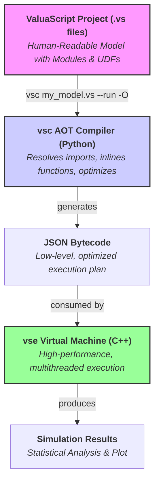
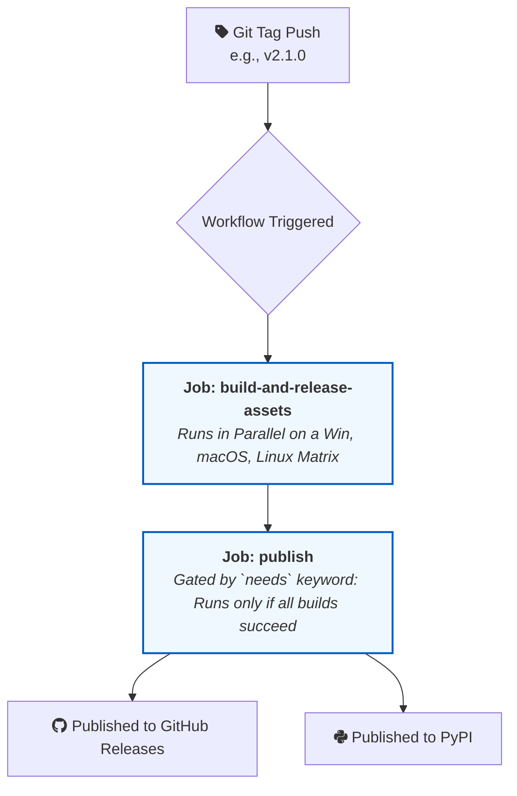

# ValuaScript & The Quantitative Simulation Engine

[](https://github.com/Alessio2704/monte-carlo-simulator/actions)
[](https://opensource.org/licenses/MIT)
[](https://isocpp.org/std/the-standard)
[](https://www.python.org/downloads/)

**A high-performance, multithreaded C++ engine for quantitative financial modeling, driven by ValuaScript—a simple, dedicated scripting language with an intelligent, optimizing Ahead-of-Time (AOT) compiler and support for User-Defined Functions and Modules.**

## 📖 About The Project

This project was born from the need to bridge the gap between the intuitive but slow nature of spreadsheet-based financial modeling and the powerful but often verbose nature of general-purpose programming languages. The goal is to provide a platform that offers the **usability** of a dedicated modeling language with the **raw performance** of compiled, multithreaded C++.

It is designed to execute complex, multi-year, stochastic financial models, running hundreds of thousands of Monte Carlo simulations in seconds—a task that would take minutes or hours in traditional tools.

### Key Features

- **✨ Simple & Powerful Language:** Models are defined in **ValuaScript (`.vs`)**, a clean, declarative language with a **familiar, spreadsheet-like formula syntax**.
  - **User-Defined Functions:** Create reusable, type-safe functions with the `func` keyword, complete with docstrings, strict scoping, and recursive call detection.
  - **📦 Code Modularity & Reusability:** Organize complex models into clean, reusable modules with `@import`. The compiler resolves the entire dependency graph, supporting nested and shared ("diamond") dependencies.
  - **Ergonomic Syntax:** Includes intuitive bracket syntax (`variable[index]`) for element access, slice-like syntax (`variable[:-1]`) for deleting elements, and numeric separators (`1_000_000`) for enhanced readability.
- **🚀 High-Performance Backend:** A core engine written in modern C++17, fully multithreaded to leverage all available CPU cores. It acts as a lightweight, highly efficient **Virtual Machine (VM)** that executes pre-compiled bytecode.
- **🐍 Intelligent AOT Compiler:** A robust **Ahead-of-Time (AOT)** compiler, `vsc`, that performs all semantic analysis and optimization _before_ execution. It compiles ValuaScript into a low-level JSON bytecode, performing advanced optimizations:
  - **Function Inlining:** User-defined functions are seamlessly inlined into the main execution plan, eliminating call overhead.
  - **Loop-Invariant Code Motion:** Deterministic calculations are automatically moved out of the main simulation loop.
  - **Dead Code Elimination:** Unused variables and functions are stripped from the final bytecode.
- **🛡️ Compile-Time Safety:** Catches logical errors (type mismatches, incorrect function arguments, undefined variables, circular imports, recursion) at compile time, providing instant feedback and preventing runtime failures.
- **🛠️ Professional VS Code Extension:** A full-featured extension providing:
  - Dynamic, maintainable syntax highlighting.
  - A comprehensive set of code snippets for all language features.
  - A Python-based Language Server for real-time, as-you-type error diagnostics.
  - **Hover-for-Help** on both built-in and user-defined functions, showing signatures and docstrings, with full support for imported modules.
  - A **live, hover-for-value** feature that provides instant feedback by invoking the full compiler/engine toolchain in the background.
  - A custom file icon for `.vs` files.
- **⚙️ Streamlined Workflow:** A `--run` flag allows for a seamless, one-step compile-and-execute experience.
- **📊 Instant Visualization:** A `--plot` flag automatically generates a histogram of the simulation output.
- **🎲 Integrated Monte Carlo Simulation:** Natively supports a rich library of statistical distributions (`Normal`, `Pert`, `Lognormal`, etc.).
- **🧪 Robust & Tested:** Comprehensive, modular unit test suite for both the C++ engine (GoogleTest & CTest) and the Python compiler (Pytest), validated by a professional CI/CD pipeline on every release.

## 🏛️ Architecture: AOT Compiler & Virtual Machine

The project follows a modern **Ahead-of-Time (AOT) Compiler and Virtual Machine (VM)** model. This clean separation of concerns ensures maximum performance, maintainability, and compile-time safety.

1.  **`vsc` (The AOT Compiler - Python):** Performs all the "thinking." It parses the high-level `.vs` script, resolves the `@import` dependency graph, validates user-defined functions, performs rigorous type checking, runs optimizations like function inlining and dead code elimination, and resolves all variable names to integer indices. Its output is a low-level, highly optimized **JSON bytecode**.
2.  **`vse` (The Virtual Machine - C++):** A "dumb, fast" execution engine. It does no analysis or string parsing. It simply loads the pre-compiled JSON bytecode and executes the instructions at maximum speed using a multithreaded simulation loop.

This architecture eliminates runtime overhead, resulting in superior performance and execution stability compared to a traditional interpreter model.



**Example JSON Bytecode Structure:**
The AOT compiler transforms a `.vs` script into a low-level bytecode where all variable names are pre-resolved to integer indices.

```json
{
  "simulation_config": { "num_trials": 10000 },
  "variable_registry": ["growth_rate", "random_growth", "std_dev"],
  "output_variable_index": 1,
  "pre_trial_steps": [
    {
      "type": "literal_assignment",
      "result_index": 0,
      "value": 0.1
    },
    {
      "type": "literal_assignment",
      "result_index": 2,
      "value": 0.02
    }
  ],
  "per_trial_steps": [
    {
      "type": "execution_assignment",
      "result_index": 1,
      "function": "Normal",
      "args": [
        { "type": "variable_index", "value": 0 },
        { "type": "variable_index", "value": 2 }
      ]
    }
  ]
}
```

## 🚀 Quick Installation

Get started in minutes with our automated installation scripts.

#### Prerequisites

1.  **Python 3.9+ must be installed.** You can download it from [python.org](https://python.org).
    - On Windows, ensure you check the box **"Add Python to PATH"** during installation.
2.  **Administrator/sudo privileges** are required to add the tools to your system's PATH.

### macOS & Linux

Open your terminal and run the following one-line command:

```bash
/bin/bash -c "$(curl -fsSL https://raw.githubusercontent.com/Alessio2704/monte-carlo-simulator/main/scripts/install.sh)"
```

### Windows

Open a new **PowerShell terminal as Administrator** (right-click the Start Menu > "Terminal (Admin)") and run:

```powershell
Set-ExecutionPolicy Bypass -Scope Process -Force; [System.Net.ServicePointManager]::SecurityProtocol = [System.Net.ServicePointManager]::SecurityProtocol -bor 3072; iex ((New-Object System.Net.WebClient).DownloadString('https://raw.githubusercontent.com/Alessio2704/monte-carlo-simulator/main/scripts/install.ps1'))
```

After installation, **you must open a new terminal window** for the `vsc` and `vse` commands to be available.

---

## ✨ Interactive Development with the VS Code Extension

ValuaScript comes with a powerful VS Code extension that provides a rich, interactive development experience, turning the editor into a live modeling environment.

### Live Value Preview (Hover-for-Value)

The flagship feature of the extension is the live value preview. Simply hover your mouse over any variable in your script to see its calculated value instantly, even if its logic depends on functions from multiple imported files.

**How it Works:**
When you hover over a variable, the extension communicates with the `vsc` language server, which:

1.  Performs a rapid, in-memory **AOT compilation** of your script in "preview mode," resolving all `@import` statements.
2.  Generates a temporary, optimized **JSON bytecode** focused _only_ on the code needed to calculate that specific variable.
3.  Invokes the high-performance C++ **VM** (`vse`) in the background with this bytecode.
4.  Receives the result from the engine and displays it directly in the hover tooltip.

This entire process is seamless and typically completes in milliseconds.

- For **deterministic** variables, it shows the exact calculated `Value`.
- For **stochastic** variables (those depending on a distribution like `Normal`), it runs a small number of trials (e.g., 100) and displays the `Mean Value`.

### Real-time Diagnostics and Hover-for-Help

The extension provides immediate feedback as you type, underlining errors and providing descriptive messages. You can also hover over any built-in or user-defined function—whether defined locally or in an imported module—to see its full signature, a summary of what it does, and details about its parameters and return value.

---

## ⚙️ The Automation Pipeline: Professional CI/CD

This project is built and delivered using a professional Continuous Integration and Continuous Delivery (CI/CD) pipeline powered by GitHub Actions. This ensures that every release is reliable, portable, and trustworthy.

#### The Automation Heartbeat: Git-Tag-Triggered Releases

The entire release lifecycle begins when a developer pushes a Git tag in the format `vX.Y.Z`. This single event triggers the automated workflow, eliminating manual errors and guaranteeing a consistent process.



---

### Stage 1: Build, Test, and Verify (The Matrix Job)

The moment a tag is pushed, a matrix of parallel jobs spins up to build and test ValuaScript across all three major operating systems simultaneously.

<details>
<summary><strong>Click to see the platform-specific build strategies</strong></summary>

#### **Windows Build**

- **Native Toolchain:** The C++ VM is compiled using the native Microsoft Visual C++ compiler (MSVC).
- **Validation:** After a successful build, **CTest** is run to execute the full, modular C++ test suite.

#### **macOS Build**

- **Native Toolchain:** The VM is built using the default Clang compiler provided by Apple's command-line tools.
- **Validation:** **CTest** is immediately executed to validate the build.

#### **Linux Build & Portability**

- **The Challenge:** Building C++ applications for Linux is complex due to variations in system libraries (like GLIBC).
- **The Solution:** We solve this by building inside a **Docker container running `ubuntu:22.04`**. This links our C++ VM against an older, stable version of GLIBC, guaranteeing that the final `vse` executable is highly portable.
- **Validation:** Critically, our **CTest** suite is also run _inside this same container_, ensuring we are testing the exact artifact that will be released.

#### **Python & VS Code Packaging**

- Since the Python compiler and VS Code extension are platform-agnostic, they are built and packaged just once for efficiency.

</details>

---

### Stage 2: Publish to the World

This stage only runs if **all build and test jobs in Stage 1 have passed**.

1.  **Consolidate Artifacts:** The publish job downloads all validated build artifacts.
2.  **Publish to PyPI:** The Python compiler package (`valuascript-compiler`) is automatically published to the **Python Package Index (PyPI)**.
3.  **Create GitHub Release:** A new public release is created on GitHub, and all binary artifacts and the VS Code extension are uploaded.

### The Final Link: User-Facing Scripts

The `install.sh` and `install.ps1` scripts are the public "front door" to this automated backend, automatically detecting the user's OS and architecture, finding the latest release, and downloading the correct asset.

## 🗑️ Uninstalling

To completely remove ValuaScript from your system, you can use our one-line uninstallation scripts.

#### macOS & Linux

```bash
/bin/bash -c "$(curl -fsSL https://raw.githubusercontent.com/Alessio2704/monte-carlo-simulator/main/scripts/uninstall.sh)"
```

#### Windows

Open PowerShell and run:

```powershell
Set-ExecutionPolicy Bypass -Scope Process -Force; iex ((New-Object System.Net.WebClient).DownloadString('https://raw.githubusercontent.com/Alessio2704/monte-carlo-simulator/main/scripts/uninstall.ps1'))
```

## 📜 ValuaScript Language Guide

#### Settings (`@` Directives)

```valuascript
# Defines the number of Monte Carlo trials to run. (Required)
@iterations = 100_000

# Specifies which variable's final value should be collected. (Required)
@output = final_result

# Exports all trial results to a CSV file. (Optional)
@output_file = "simulation_results.csv"
```

#### The Compiler & Optimizations

- **`vsc <input_file>`**: Compiles a script into a JSON bytecode file.
- **`--run`**: Compiles and then immediately executes the simulation.
- **`-O` or `--optimize`**: Enables **Dead Code Elimination**.
- **`-v` or `--verbose`**: Provides detailed feedback on the compiler's optimization process.

#### Variable Assignment (`let`)

```valuascript
# Literals
let tax_rate = 0.21
let margin_forecast = [0.25, 0.26]

# Infix Expressions
let cost_of_equity = risk_free_rate + beta * equity_risk_premium

# Vector Element Access
let my_vector = [100, 200, 300]
let first_element = my_vector[0]   # Accesses the first element (100)
let last_element = my_vector[-1]    # Accesses the last element (300)
let vector_without_last = my_vector[:-1] # Returns a new vector [100, 200]
```

#### User-Defined Functions (`func`)

ValuaScript supports fully type-checked, user-defined functions. They are powerful tools for creating reusable, modular logic.

- **Strict Scoping:** Functions can only access their own parameters and locally defined variables. They cannot access global variables, ensuring pure, predictable behavior.
- **Compile-Time Validation:** The compiler checks for correct types, argument counts, and prevents recursion.
- **Optimization:** Functions are inlined by the compiler to eliminate call overhead.

````valuascript
# Define a reusable function with typed parameters and a return type
func calculate_cogs(sales: vector, gross_margin: scalar) -> vector {
    """Calculates Cost of Goods Sold from a sales vector and a margin."""
    let cogs_vector = sales * (1 - gross_margin)
    return cogs_vector
}

# --- Main script body ---
@iterations = 1000
@output = final_cogs

let revenue = grow_series(1000, 0.1, 5)
let margin = Normal(0.4, 0.05)

# Call the user-defined function
let final_cogs = calculate_cogs(revenue, margin)```

#### Modules (`@import` & `@module`)

You can organize complex models into clean, reusable files called modules.

A **module** is a `.vs` file that contains only the `@module` directive and one or more `func` definitions. It cannot contain global `let` statements or execution directives like `@iterations` or `@output`.

A **runnable script** can then import functions from any module using the `@import` directive, which takes a relative path to the module file.

**Example:**

**File: `modules/utils.vs`**
```valuascript
@module

func calculate_npv(rate: scalar, cashflows: vector) -> scalar {
    """A reusable helper to calculate Net Present Value."""
    return npv(rate, cashflows)
}
````

**File: `main_model.vs`**

```valuascript
@import "modules/utils.vs"

@iterations = 10_000
@output = project_value

let discount_rate = 0.08
let future_cashflows = [100, 110, 115, 120]

# Call the function imported from the module
let project_value = calculate_npv(discount_rate, future_cashflows)
```

## 🔬 Development & Contribution

### Running Tests

**1. C++ Engine Tests (GoogleTest & CTest)**

```bash
# First, configure and build the project from the root directory
cmake -S . -B build
cmake --build build

# Then, run the full test suite from the build directory
cd build
ctest --verbose
```

**2. Python Compiler Tests (Pytest)**

```bash
# Navigate to the compiler directory
cd compiler

# (Optional but Recommended) Create a virtual environment
python3 -m venv venv
source venv/bin/activate # On Windows: .\venv\Scripts\activate

# Install the compiler and its development dependencies
pip install -e .[dev]

# Run the tests
pytest -v
```

## 🗺️ Roadmap

### Version History

#### ✅ Version 2.1.0 (Current)

This version introduces **Modules**, a major new capability for organizing and reusing code.

- **Language Feature:** Full support for code modularity via the `@module` and `@import` directives. The compiler can resolve complex, nested, and shared dependency graphs.
- **Compiler:** The entire validation and compilation pipeline is now module-aware.
- **VS Code Extension:** All features, including hover-for-help and go-to-definition, now work seamlessly across imported files.

#### Version 2.0.0

This version introduced User-Defined Functions and a more robust compiler architecture.

- **Language Feature:** Full support for **User-Defined Functions** (`func`, `return`), including type-checking, docstrings, strict scoping, and recursion detection.
- **Compiler:** Implemented **function inlining** as a core optimization step.

---

### 🔜 Tier 1: Next Immediate Feature

- [ ] **Empirical Distribution Sampler (`create_sampler_from_data`)**

  - **Why:** Models often require inputs that follow a specific, but not standard, distribution. This feature would allow users to create a custom sampler directly from a real-world data series (e.g., historical stock returns), significantly improving model realism.
  - **User-Facing Syntax (Example):**

  ```valuascript
  # 1. Read the historical data from a CSV file.
  let price_history = read_csv_vector("data/prices.csv", "Price")

  # 2. Create a custom sampler based on that data.
  let price_sampler = create_sampler_from_data(price_history)

  # 3. Use the sampler like any other distribution (e.g., Normal, Pert).
  let future_price = price_sampler()
  ```

### 🚀 Tier 2: The Performance Frontier

- [ ] **GPU Acceleration via CUDA/OpenCL**
  - **Why:** The ultimate performance goal. This represents a paradigm shift beyond simple multi-threading. The "embarrassingly parallel" nature of Monte Carlo simulations—where each trial is independent—is a perfect workload for the thousands of cores in a modern GPU. This would allow the engine to execute thousands of simulation trials _simultaneously_, leading to an order-of-magnitude performance increase for very large models.
  - **User-Facing Impact:** This would likely be enabled via a simple flag (`vsc my_model.vs --run --gpu`), offloading the massive computational work to the GPU without requiring changes to the ValuaScript model itself.

## 📄 License

This project is distributed under the MIT License. See the `LICENSE` file for more information.
