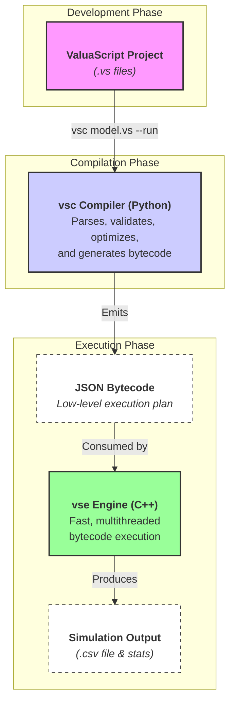

# ValuaScript & The Quantitative Simulation Engine

[](https://github.com/Alessio2704/monte-carlo-simulator/actions)
[](https://opensource.org/licenses/MIT)
[](https://isocpp.org/std/the-standard)
[](https://www.python.org/downloads/)

A high-performance, multithreaded C++ engine for quantitative financial modeling, driven by **ValuaScript**—a simple, dedicated scripting language featuring an intelligent, optimizing Ahead-of-Time (AOT) compiler, a rich feature set including modules and user-defined functions, and a professional VS Code extension with live value previews.

---

## Why ValuaScript?

Financial modeling often forces a choice between two extremes: the intuitive but slow, error-prone nature of spreadsheets, and the powerful but verbose, complex nature of general-purpose programming languages.

ValuaScript was created to bridge this gap. It provides a platform that offers the **usability and readability** of a dedicated modeling language with the **raw performance** of compiled, multithreaded C++. It is purpose-built to execute complex, stochastic financial models, running hundreds of thousands of Monte Carlo simulations in seconds—a task that would take minutes or hours in traditional tools.

## Key Features

### The ValuaScript Language: Simple, Expressive, and Modular

- **✨ Familiar Syntax:** A clean, declarative language with an intuitive, spreadsheet-like formula syntax.
- **📦 Code Modularity & Reusability:** Organize complex models into clean, reusable modules with `@import`. The compiler resolves the entire dependency graph, supporting nested and shared ("diamond") dependencies.
- **🔧 User-Defined Functions:** Create reusable, type-safe functions using the `func` keyword, complete with docstrings, strict lexical scoping, and compile-time recursion detection.
- **🛡️ Compile-Time Safety:** Catch logical errors like type mismatches, incorrect function arguments, undefined variables, and circular imports at compile time, not runtime.
- **🎲 Integrated Monte Carlo Support:** Natively supports a rich library of statistical distributions (`Normal`, `Pert`, `Lognormal`, `Beta`, etc.).

### The AOT Compiler & C++ Engine: Performance Through Architecture

- **🚀 High-Performance Backend:** The core engine is a multithreaded Virtual Machine (VM) written in modern C++17, designed to leverage all available CPU cores for maximum parallelism.
- **🧠 Intelligent AOT Compiler:** A robust Ahead-of-Time (AOT) compiler (`vsc`) performs all semantic analysis and optimization _before_ execution, generating a low-level JSON bytecode for the engine.
- **⚙️ Advanced Optimizations:**
  - **Function Inlining:** User-defined functions are seamlessly inlined into the main execution plan, eliminating call overhead.
  - **Loop-Invariant Code Motion:** Deterministic calculations are automatically identified and moved out of the main simulation loop, running only once.
  - **Dead Code Elimination:** Unused variables and functions are stripped from the final bytecode to minimize its size and complexity.

### The VS Code Extension: A Rich IDE Experience

- **⚡ Live Value Preview:** Hover over any variable to see its calculated value instantly. For stochastic variables, the engine runs a sample simulation in the background and displays the mean.
- **🔍 Real-Time Diagnostics:** Get immediate, as-you-type feedback on errors and warnings.
- **💡 Hover-for-Help:** See full signatures and docstrings for all built-in and user-defined functions, with support across imported modules.
- **▶️ Go-to-Definition:** Seamlessly navigate to the source of any user-defined function, even if it's in another file.

## Architecture: AOT Compiler & Virtual Machine

The project follows a modern AOT Compiler and Virtual Machine (VM) model. This clean separation of concerns ensures maximum performance and compile-time safety by eliminating runtime overhead.

1.  **The `vsc` Compiler (Python):** This is the "brain." It parses the high-level `.vs` script, resolves the `@import` graph, validates all logic, runs optimizations, and emits a low-level **JSON bytecode**.
2.  **The `vse` Engine (C++):** This is the "muscle." It is a fast, multithreaded VM that does no analysis; it simply loads the pre-compiled bytecode and executes the instructions at maximum speed.



## Quick Installation

Get started in minutes with our automated installation scripts.

#### Prerequisites

1.  **Python 3.9+** must be installed and available in your PATH.
2.  **Administrator/sudo privileges** are required to add the tools to your system's PATH.

### macOS & Linux

Open your terminal and run the following one-line command:

```bash
/bin/bash -c "$(curl -fsSL https://raw.githubusercontent.com/Alessio2704/monte-carlo-simulator/main/scripts/install.sh)"
```

### Windows

Open a new **PowerShell terminal as Administrator** and run:

```powershell
Set-ExecutionPolicy Bypass -Scope Process -Force; [System.Net.ServicePointManager]::SecurityProtocol = [System.Net.ServicePointManager]::SecurityProtocol -bor 3072; iex ((New-Object System.Net.WebClient).DownloadString('https://raw.githubusercontent.com/Alessio2704/monte-carlo-simulator/main/scripts/install.ps1'))
```

After installation, **you must open a new terminal window** for the changes to take effect.

## Example: A Simple Modular DCF Model

This example demonstrates how ValuaScript combines modules, user-defined functions, and stochastic variables to create a clean, readable, and powerful model.

**File: `modules/finance_utils.vs`**

```valuascript
@module

func calculate_wacc(beta: scalar) -> scalar {
    """Calculates a simple Weighted Average Cost of Capital."""
    let equity_premium = 0.05
    let risk_free_rate = 0.02
    return risk_free_rate + beta * equity_premium
}

func present_value(cashflows: vector, discount_rate: scalar) -> scalar {
    """Discounts a vector of cash flows to their present value."""
    return npv(discount_rate, cashflows)
}
```

**File: `main.vs`**

```valuascript
@import "modules/finance_utils.vs"

@iterations = 50_000
@output = dcf_value
@output_file = "dcf_simulation.csv"

# --- Inputs ---
let initial_revenue = 1000.0
let asset_beta = 1.2

# Stochastic variable for revenue growth
let revenue_growth = Normal(0.10, 0.15)

# --- Logic ---
let discount_rate = calculate_wacc(asset_beta)
let future_revenues = grow_series(initial_revenue, revenue_growth, 5)

# Call the imported function to get the final result
let dcf_value = present_value(future_revenues, discount_rate)
```

**To run this model:**

```bash
# Compile and execute the simulation, with optimizations and plotting
vsc main.vs --run -O --plot
```

## ValuaScript Language Guide

<details>
<summary><strong>Directives & The Compiler</strong></summary>

- `@iterations = <number>`: **(Required)** Defines the number of Monte Carlo trials to run.
- `@output = <variable>`: **(Required)** Specifies which variable's final value should be collected.
- `@output_file = "<path>"`: **(Optional)** Exports all trial results to a CSV file.
- `@module`: Declares a file as a module containing only `func` definitions.
- `@import "<path>"`: Imports all functions from a module file.

The compiler `vsc` can be invoked with several flags:

- `--run`: Compiles and then immediately executes the simulation.
- `-O` or `--optimize`: Enables **Dead Code Elimination**.
- `--plot`: Automatically generates a histogram of the simulation output.
- `-v` or `--verbose`: Provides detailed feedback on the compiler's optimization process.

</details>

<details>
<summary><strong>Variables, Expressions, and Conditionals</strong></summary>

```valuascript
# --- Variable Assignment (`let`) ---

# Literals (with numeric separators for readability)
let tax_rate = 0.21
let initial_investment = 1_500_000

# Infix Expressions
let cost_of_equity = risk_free_rate + beta * equity_risk_premium

# Vector Literals
let margin_forecast = [0.25, 0.26, 0.28]

# --- Element and Slice Access ---
let my_vector = [100, 200, 300]
let first_element = my_vector[0]   # Accesses the first element (100)
let last_element = my_vector[-1]    # Accesses the last element (300)

# The slice syntax [:-index] creates a new vector with the element at 'index' removed.
let vector_without_last = my_vector[:-1] # Returns a new vector [100, 200]

# --- Conditional Logic (if/then/else) ---
let tax_regime = if is_high_income then 0.40 else 0.25
```

</details>

<details>
<summary><strong>User-Defined Functions (UDFs) & Modules</strong></summary>

ValuaScript supports fully type-checked, user-defined functions. They are powerful tools for creating reusable, modular logic with several key features:

- **Strict Scoping:** Functions can only access their own parameters and locally defined variables. They cannot access global variables, ensuring pure, predictable behavior.
- **Compile-Time Validation:** The compiler checks for correct types, argument counts, and prevents recursion.
- **Optimization:** Functions are inlined by the compiler to eliminate call overhead.

```valuascript
# Define a reusable function with typed parameters and a return type
func calculate_cogs(sales: vector, gross_margin: scalar) -> vector {
    """Calculates Cost of Goods Sold from a sales vector and a margin."""
    let cogs_vector = sales * (1 - gross_margin)
    return cogs_vector
}

# --- Main script body ---
@iterations = 1000
@output = final_cogs

let revenue = grow_series(1000, 0.1, 5)
let margin = Normal(0.4, 0.05)

# Call the user-defined function
let final_cogs = calculate_cogs(revenue, margin)
```

</details>

<details>
<summary><strong>Built-in Function Reference</strong></summary>

A comprehensive library of built-in functions is available for math, series manipulation, I/O, and statistical sampling.

| Category                 | Functions                                                                                                                                                            |
| ------------------------ | -------------------------------------------------------------------------------------------------------------------------------------------------------------------- |
| **Math**                 | `log`, `log10`, `exp`, `sin`, `cos`, `tan`                                                                                                                           |
| **Vector & Series**      | `grow_series`, `compound_series`, `interpolate_series`, `sum_series`, `series_delta`, `npv`, `get_element`, `delete_element`, `compose_vector`, `capitalize_expense` |
| **Statistical Samplers** | `Normal`, `Lognormal`, `Beta`, `Uniform`, `Bernoulli`, `Pert`, `Triangular`                                                                                          |
| **Data I/O**             | `read_csv_scalar`, `read_csv_vector`                                                                                                                                 |

</details>

## Development & Contribution

This project is built with a professional CI/CD pipeline and has a comprehensive test suite. Contributions are welcome.

### Running Tests

**1. C++ Engine Tests (GoogleTest & CTest)**

```bash
# First, configure and build the project from the root directory
cmake -S . -B build
cmake --build build

# Then, run the full test suite from the build directory
cd build
ctest --verbose
```

**2. Python Compiler Tests (Pytest)**

```bash
# Navigate to the compiler directory
cd compiler

# (Optional but Recommended) Create and activate a virtual environment
python3 -m venv venv
source venv/bin/activate # On Windows: .\venv\Scripts\activate

# Install the compiler and its development dependencies
pip install -e .[dev]

# Run the tests
pytest -v
```

## Roadmap

- [ ] **Empirical Distribution Sampler:** Add a `create_sampler_from_data` function to allow users to create a custom sampler from a real-world data series (e.g., historical stock returns), significantly improving model realism.
- [ ] **GPU Acceleration:** Explore CUDA/OpenCL to offload the "embarrassingly parallel" Monte Carlo workload to the GPU, providing an order-of-magnitude performance increase for massive simulations.

## License

This project is distributed under the MIT License. See the `LICENSE` file for more information.
