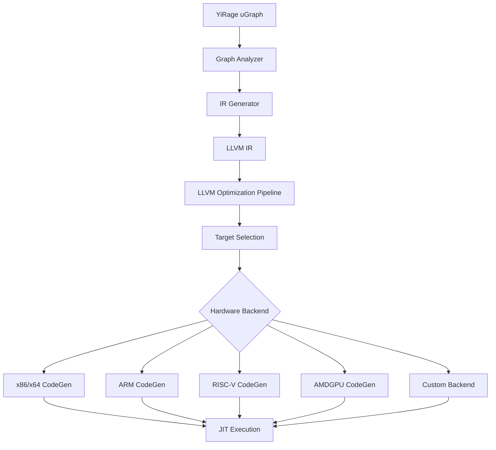

# YiRage LLVM后端技术设计

## 1. 架构概览



## 2. 核心组件设计

### 2.1 LLVM Backend Manager

```cpp
namespace yirage {
namespace backend {
namespace llvm_backend {

class LLVMBackendManager {
public:
    struct TargetInfo {
        std::string triple;        // 如 "x86_64-unknown-linux-gnu"
        std::string cpu;           // 如 "skylake", "cortex-a77"
        std::string features;      // 如 "+avx2,+fma", "+neon"
        llvm::CodeGenOpt::Level opt_level;
    };
    
    static std::unique_ptr<LLVMBackend> create_backend(const TargetInfo& target);
    static std::vector<TargetInfo> get_available_targets();
    static TargetInfo detect_host_target();
    
private:
    static bool initialize_llvm_once();
    static void register_all_targets();
};

} // namespace llvm_backend
} // namespace backend
} // namespace yirage
```

### 2.2 IR Translation Engine

```cpp
class YiRageToLLVMTranslator {
public:
    struct TranslationContext {
        llvm::LLVMContext& llvm_context;
        llvm::Module& module;
        llvm::IRBuilder<>& builder;
        
        // 类型映射
        std::unordered_map<DataType, llvm::Type*> type_map;
        
        // 值映射 (YiRage tensor ID -> LLVM Value)
        std::unordered_map<DTensor::TensorId, llvm::Value*> value_map;
        
        // 函数环境
        llvm::Function* current_function = nullptr;
    };
    
    YiRageToLLVMTranslator(TranslationContext& ctx) : ctx_(ctx) {}
    
    // 主要翻译接口
    llvm::Function* translate_graph(const KNGraph& graph);
    
    // 算子翻译
    llvm::Value* translate_matmul(const KNOperator& op);
    llvm::Value* translate_element_wise(const KNOperator& op);
    llvm::Value* translate_rms_norm(const KNOperator& op);
    llvm::Value* translate_attention(const KNOperator& op);
    
private:
    TranslationContext& ctx_;
    
    // 辅助方法
    llvm::Type* get_llvm_type(DataType dt);
    llvm::Value* create_tensor_load(const DTensor& tensor, 
                                   const std::vector<llvm::Value*>& indices);
    llvm::Value* create_tensor_store(const DTensor& tensor,
                                    const std::vector<llvm::Value*>& indices,
                                    llvm::Value* value);
    
    // 循环生成
    struct LoopNest {
        std::vector<llvm::Value*> indices;
        std::vector<llvm::BasicBlock*> headers;
        std::vector<llvm::BasicBlock*> bodies;
        std::vector<llvm::BasicBlock*> exits;
    };
    
    LoopNest create_loop_nest(const std::vector<int>& bounds);
    void generate_vectorized_loop(const LoopNest& nest, 
                                 std::function<void(const std::vector<llvm::Value*>&)> body);
};
```

### 2.3 硬件特定优化器

```cpp
class HardwareOptimizer {
public:
    virtual ~HardwareOptimizer() = default;
    virtual void optimize_module(llvm::Module& module) = 0;
    virtual void setup_target_machine(llvm::TargetMachine& tm) = 0;
};

// x86特定优化
class X86Optimizer : public HardwareOptimizer {
public:
    void optimize_module(llvm::Module& module) override {
        // AVX/AVX-512向量化优化
        enable_auto_vectorization(module);
        
        // Cache优化
        optimize_memory_access_patterns(module);
        
        // 指令调度
        optimize_instruction_scheduling(module);
    }
    
private:
    void enable_auto_vectorization(llvm::Module& module);
    void optimize_memory_access_patterns(llvm::Module& module);
    void optimize_instruction_scheduling(llvm::Module& module);
};

// ARM特定优化
class ARMOptimizer : public HardwareOptimizer {
public:
    void optimize_module(llvm::Module& module) override {
        // NEON向量化
        enable_neon_vectorization(module);
        
        // 能耗优化
        optimize_for_power_efficiency(module);
        
        // ARM特定指令选择
        optimize_arm_instructions(module);
    }
    
private:
    void enable_neon_vectorization(llvm::Module& module);
    void optimize_for_power_efficiency(llvm::Module& module);
    void optimize_arm_instructions(llvm::Module& module);
};

// RISC-V特定优化
class RISCVOptimizer : public HardwareOptimizer {
public:
    void optimize_module(llvm::Module& module) override {
        // RVV (RISC-V Vector Extension) 优化
        if (has_rvv_support()) {
            enable_rvv_vectorization(module);
        }
        
        // RISC-V特定优化
        optimize_riscv_instructions(module);
    }
    
private:
    bool has_rvv_support();
    void enable_rvv_vectorization(llvm::Module& module);
    void optimize_riscv_instructions(llvm::Module& module);
};
```

### 2.4 JIT执行引擎

```cpp
class YiRageJITEngine {
public:
    struct JITConfig {
        llvm::CodeGenOpt::Level optimization_level = llvm::CodeGenOpt::Aggressive;
        bool enable_fast_isel = false;
        bool enable_debug_info = false;
        size_t code_cache_size = 256 * 1024 * 1024; // 256MB
    };
    
    YiRageJITEngine(const LLVMBackendManager::TargetInfo& target,
                    const JITConfig& config = {});
    
    // 编译和执行
    using CompiledFunction = void(*)(void** inputs, void** outputs, void* workspace);
    
    CompiledFunction compile_function(llvm::Function* func);
    void execute_function(CompiledFunction func, 
                         const std::vector<void*>& inputs,
                         const std::vector<void*>& outputs,
                         void* workspace = nullptr);
    
    // 缓存管理
    void clear_cache();
    size_t get_cache_size() const;
    
private:
    std::unique_ptr<llvm::orc::LLJIT> jit_;
    std::unique_ptr<llvm::TargetMachine> target_machine_;
    
    // 函数缓存
    std::unordered_map<std::string, CompiledFunction> function_cache_;
    
    void setup_optimization_pipeline();
    std::string generate_function_key(llvm::Function* func);
};
```

## 3. 算子实现示例

### 3.1 矩阵乘法实现

```cpp
llvm::Value* YiRageToLLVMTranslator::translate_matmul(const KNOperator& op) {
    auto inputs = op.get_inputs();
    auto outputs = op.get_outputs();
    
    // 获取输入张量
    auto a_tensor = inputs[0];
    auto b_tensor = inputs[1];
    auto c_tensor = outputs[0];
    
    // 获取维度信息
    auto a_shape = a_tensor.get_shape();
    auto b_shape = b_tensor.get_shape();
    auto c_shape = c_tensor.get_shape();
    
    int M = a_shape[0];
    int K = a_shape[1];
    int N = b_shape[1];
    
    // 创建循环索引
    auto i_type = llvm::Type::getInt32Ty(ctx_.llvm_context);
    auto zero = llvm::ConstantInt::get(i_type, 0);
    auto M_const = llvm::ConstantInt::get(i_type, M);
    auto K_const = llvm::ConstantInt::get(i_type, K);
    auto N_const = llvm::ConstantInt::get(i_type, N);
    
    // 生成三重循环
    generate_matmul_loops(M_const, K_const, N_const, a_tensor, b_tensor, c_tensor);
    
    return ctx_.value_map[c_tensor.get_id()];
}

void YiRageToLLVMTranslator::generate_matmul_loops(
    llvm::Value* M, llvm::Value* K, llvm::Value* N,
    const DTensor& A, const DTensor& B, const DTensor& C) {
    
    auto& context = ctx_.llvm_context;
    auto& builder = ctx_.builder;
    auto func = ctx_.current_function;
    
    // 创建基本块
    auto i_loop_header = llvm::BasicBlock::Create(context, "i_loop_header", func);
    auto i_loop_body = llvm::BasicBlock::Create(context, "i_loop_body", func);
    auto j_loop_header = llvm::BasicBlock::Create(context, "j_loop_header", func);
    auto j_loop_body = llvm::BasicBlock::Create(context, "j_loop_body", func);
    auto k_loop_header = llvm::BasicBlock::Create(context, "k_loop_header", func);
    auto k_loop_body = llvm::BasicBlock::Create(context, "k_loop_body", func);
    auto k_loop_end = llvm::BasicBlock::Create(context, "k_loop_end", func);
    auto j_loop_end = llvm::BasicBlock::Create(context, "j_loop_end", func);
    auto i_loop_end = llvm::BasicBlock::Create(context, "i_loop_end", func);
    
    auto i32_type = llvm::Type::getInt32Ty(context);
    auto zero = llvm::ConstantInt::get(i32_type, 0);
    auto one = llvm::ConstantInt::get(i32_type, 1);
    
    // i循环
    builder.CreateBr(i_loop_header);
    builder.SetInsertPoint(i_loop_header);
    auto i_phi = builder.CreatePHI(i32_type, 2, "i");
    i_phi->addIncoming(zero, builder.GetInsertBlock());
    auto i_cmp = builder.CreateICmpSLT(i_phi, M, "i_cmp");
    builder.CreateCondBr(i_cmp, i_loop_body, i_loop_end);
    
    // j循环
    builder.SetInsertPoint(i_loop_body);
    builder.CreateBr(j_loop_header);
    builder.SetInsertPoint(j_loop_header);
    auto j_phi = builder.CreatePHI(i32_type, 2, "j");
    j_phi->addIncoming(zero, i_loop_body);
    auto j_cmp = builder.CreateICmpSLT(j_phi, N, "j_cmp");
    builder.CreateCondBr(j_cmp, j_loop_body, j_loop_end);
    
    // k循环和计算
    builder.SetInsertPoint(j_loop_body);
    
    // 初始化C[i][j] = 0
    auto c_ptr = create_tensor_element_ptr(C, {i_phi, j_phi});
    auto float_type = llvm::Type::getFloatTy(context);
    auto zero_f = llvm::ConstantFP::get(float_type, 0.0);
    builder.CreateStore(zero_f, c_ptr);
    
    builder.CreateBr(k_loop_header);
    builder.SetInsertPoint(k_loop_header);
    auto k_phi = builder.CreatePHI(i32_type, 2, "k");
    k_phi->addIncoming(zero, j_loop_body);
    auto k_cmp = builder.CreateICmpSLT(k_phi, K, "k_cmp");
    builder.CreateCondBr(k_cmp, k_loop_body, k_loop_end);
    
    // k循环体: C[i][j] += A[i][k] * B[k][j]
    builder.SetInsertPoint(k_loop_body);
    
    auto a_ptr = create_tensor_element_ptr(A, {i_phi, k_phi});
    auto b_ptr = create_tensor_element_ptr(B, {k_phi, j_phi});
    auto c_val = builder.CreateLoad(float_type, c_ptr, "c_val");
    auto a_val = builder.CreateLoad(float_type, a_ptr, "a_val");
    auto b_val = builder.CreateLoad(float_type, b_ptr, "b_val");
    
    auto mul_val = builder.CreateFMul(a_val, b_val, "mul_val");
    auto add_val = builder.CreateFAdd(c_val, mul_val, "add_val");
    builder.CreateStore(add_val, c_ptr);
    
    // 循环递增和回跳
    auto k_next = builder.CreateAdd(k_phi, one, "k_next");
    k_phi->addIncoming(k_next, k_loop_body);
    builder.CreateBr(k_loop_header);
    
    // 结束k循环
    builder.SetInsertPoint(k_loop_end);
    auto j_next = builder.CreateAdd(j_phi, one, "j_next");
    j_phi->addIncoming(j_next, k_loop_end);
    builder.CreateBr(j_loop_header);
    
    // 结束j循环
    builder.SetInsertPoint(j_loop_end);
    auto i_next = builder.CreateAdd(i_phi, one, "i_next");
    i_phi->addIncoming(i_next, j_loop_end);
    builder.CreateBr(i_loop_header);
    
    // 结束i循环
    builder.SetInsertPoint(i_loop_end);
}
```

### 3.2 向量化优化

```cpp
class VectorizationOptimizer {
public:
    static void optimize_matmul_vectorization(llvm::Function* func, 
                                            int vector_width = 8) {
        // 检测可向量化的循环
        auto loops = detect_vectorizable_loops(func);
        
        for (auto& loop : loops) {
            if (can_vectorize(loop)) {
                vectorize_loop(loop, vector_width);
            }
        }
    }
    
private:
    struct LoopInfo {
        llvm::BasicBlock* header;
        llvm::BasicBlock* body;
        llvm::PHINode* induction_var;
        std::vector<llvm::Instruction*> vectorizable_ops;
    };
    
    static std::vector<LoopInfo> detect_vectorizable_loops(llvm::Function* func);
    static bool can_vectorize(const LoopInfo& loop);
    static void vectorize_loop(const LoopInfo& loop, int vector_width);
};
```

## 4. 构建系统集成

### 4.1 CMake配置

```cmake
# Find LLVM
find_package(LLVM REQUIRED CONFIG)

message(STATUS "Found LLVM ${LLVM_PACKAGE_VERSION}")
message(STATUS "Using LLVMConfig.cmake in: ${LLVM_DIR}")

# Set LLVM compile flags
separate_arguments(LLVM_DEFINITIONS_LIST NATIVE_COMMAND ${LLVM_DEFINITIONS})
add_definitions(${LLVM_DEFINITIONS_LIST})

# Include LLVM headers
include_directories(${LLVM_INCLUDE_DIRS})

# Map LLVM components to libraries
llvm_map_components_to_libnames(llvm_libs
    Core
    IRReader
    Analysis
    TransformUtils
    ExecutionEngine
    MCJIT
    OrcJIT
    X86
    ARM
    AArch64
    RISCV
    AMDGPU
    Support
    Target
    MC
    Object
    RuntimeDyld
    )

# LLVM backend option
option(YIRAGE_USE_LLVM "Enable LLVM backend support" ON)

if(YIRAGE_USE_LLVM)
    add_definitions(-DYIRAGE_USE_LLVM)
    
    # LLVM backend library
    add_library(yirage_llvm_backend STATIC
        src/backend/llvm/llvm_backend.cpp
        src/backend/llvm/ir_translator.cpp
        src/backend/llvm/jit_engine.cpp
        src/backend/llvm/hardware_optimizer.cpp
        src/backend/llvm/x86_optimizer.cpp
        src/backend/llvm/arm_optimizer.cpp
        src/backend/llvm/riscv_optimizer.cpp
        )
    
    target_link_libraries(yirage_llvm_backend ${llvm_libs})
    target_include_directories(yirage_llvm_backend PUBLIC
        ${CMAKE_CURRENT_SOURCE_DIR}/include
        ${LLVM_INCLUDE_DIRS}
        )
endif()
```

### 4.2 Python绑定扩展

```python
# python/yirage/backend_config.py 扩展

class BackendType(Enum):
    CPU = "cpu"
    CUDA = "cuda" 
    MPS = "mps"
    LLVM = "llvm"  # 新增LLVM后端

class LLVMConfig:
    """LLVM后端特定配置"""
    
    def __init__(self):
        self.target_triple = self._detect_target_triple()
        self.target_cpu = self._detect_target_cpu()
        self.target_features = self._detect_target_features()
        self.optimization_level = "O2"
        self.enable_vectorization = True
        self.enable_fast_math = True
    
    @staticmethod
    def _detect_target_triple():
        """自动检测目标三元组"""
        import platform
        import subprocess
        
        system = platform.system().lower()
        machine = platform.machine().lower()
        
        if machine in ['x86_64', 'amd64']:
            arch = 'x86_64'
        elif machine in ['aarch64', 'arm64']:
            arch = 'aarch64'
        elif machine.startswith('riscv'):
            arch = 'riscv64'
        else:
            arch = machine
        
        if system == 'linux':
            return f"{arch}-unknown-linux-gnu"
        elif system == 'darwin':
            return f"{arch}-apple-darwin"
        elif system == 'windows':
            return f"{arch}-pc-windows-msvc"
        else:
            return f"{arch}-unknown-{system}"
    
    @staticmethod
    def _detect_target_cpu():
        """检测目标CPU"""
        import cpuinfo
        
        info = cpuinfo.get_cpu_info()
        brand = info.get('brand_raw', '').lower()
        
        # 简化的CPU检测逻辑
        if 'intel' in brand:
            if 'skylake' in brand or 'kaby lake' in brand:
                return 'skylake'
            elif 'haswell' in brand:
                return 'haswell'
            else:
                return 'generic'
        elif 'amd' in brand:
            if 'zen' in brand:
                return 'znver1'
            else:
                return 'generic'
        elif 'apple' in brand or 'm1' in brand or 'm2' in brand:
            return 'apple-a14'  # Apple Silicon
        else:
            return 'generic'
    
    @staticmethod 
    def _detect_target_features():
        """检测目标特性"""
        import cpuinfo
        
        info = cpuinfo.get_cpu_info()
        flags = info.get('flags', [])
        
        features = []
        
        # x86特性检测
        if 'avx2' in flags:
            features.append('+avx2')
        if 'avx512f' in flags:
            features.append('+avx512f')
        if 'fma' in flags:
            features.append('+fma')
        
        # ARM特性检测 
        if 'neon' in flags:
            features.append('+neon')
        
        return ','.join(features) if features else ''

# 使用示例
def set_llvm_backend(target_triple=None, target_cpu=None, target_features=None):
    """设置LLVM后端"""
    config = LLVMConfig()
    
    if target_triple:
        config.target_triple = target_triple
    if target_cpu:
        config.target_cpu = target_cpu  
    if target_features:
        config.target_features = target_features
    
    _backend_config.set_backend(BackendType.LLVM, config)
```

## 5. 测试和验证

### 5.1 单元测试

```cpp
// tests/test_llvm_backend.cpp
#include <gtest/gtest.h>
#include "yirage/backend/llvm/llvm_backend.h"

class LLVMBackendTest : public ::testing::Test {
protected:
    void SetUp() override {
        target_info_.triple = "x86_64-unknown-linux-gnu";
        target_info_.cpu = "skylake";
        target_info_.features = "+avx2,+fma";
        
        backend_ = LLVMBackendManager::create_backend(target_info_);
    }
    
    LLVMBackendManager::TargetInfo target_info_;
    std::unique_ptr<LLVMBackend> backend_;
};

TEST_F(LLVMBackendTest, BasicMatMul) {
    // 创建简单的矩阵乘法图
    auto graph = create_test_matmul_graph(128, 128, 128);
    
    // 编译图
    backend_->compile_graph(graph);
    
    // 准备测试数据
    auto inputs = create_test_inputs();
    auto outputs = create_test_outputs();
    
    // 执行
    backend_->execute(inputs.data(), outputs.data());
    
    // 验证结果
    EXPECT_TRUE(verify_matmul_result(inputs, outputs));
}

TEST_F(LLVMBackendTest, VectorizationOptimization) {
    // 测试向量化优化
    auto graph = create_element_wise_graph(1024);
    
    backend_->compile_graph(graph);
    
    // 验证生成的LLVM IR包含向量指令
    auto ir_code = backend_->get_generated_ir();
    EXPECT_TRUE(ir_code.find("vector") != std::string::npos);
}
```

### 5.2 性能基准测试

```python
# benchmark/llvm_backend_benchmark.py

import yirage as yr
import time
import numpy as np

def benchmark_llvm_backends():
    """对比不同LLVM目标的性能"""
    
    targets = [
        ("x86_64-unknown-linux-gnu", "skylake", "+avx2,+fma"),
        ("x86_64-unknown-linux-gnu", "haswell", "+avx2"),
        ("aarch64-unknown-linux-gnu", "cortex-a77", "+neon"),
        ("riscv64-unknown-linux-gnu", "generic", ""),
    ]
    
    results = {}
    
    for triple, cpu, features in targets:
        if not yr.is_target_available(triple):
            continue
            
        print(f"Testing target: {triple}, CPU: {cpu}")
        
        # 设置LLVM后端
        yr.set_llvm_backend(triple, cpu, features)
        
        # 创建测试图
        graph = yr.new_kernel_graph()
        a = graph.new_input((1024, 1024), yr.DT_FLOAT32)
        b = graph.new_input((1024, 1024), yr.DT_FLOAT32) 
        c = graph.matmul(a, b)
        output = graph.new_output(c)
        
        # 编译
        compiled_graph = graph.compile()
        
        # 准备数据
        a_data = np.random.randn(1024, 1024).astype(np.float32)
        b_data = np.random.randn(1024, 1024).astype(np.float32)
        c_data = np.zeros((1024, 1024), dtype=np.float32)
        
        # 预热
        for _ in range(5):
            compiled_graph.run([a_data, b_data], [c_data])
        
        # 基准测试
        times = []
        for _ in range(100):
            start = time.perf_counter()
            compiled_graph.run([a_data, b_data], [c_data])
            end = time.perf_counter()
            times.append((end - start) * 1000)  # ms
        
        avg_time = np.mean(times)
        std_time = np.std(times)
        
        results[f"{triple}_{cpu}"] = {
            'avg_time_ms': avg_time,
            'std_time_ms': std_time,
            'throughput_gflops': (2 * 1024**3) / (avg_time / 1000) / 1e9
        }
        
        print(f"  Average time: {avg_time:.2f}±{std_time:.2f} ms")
        print(f"  Throughput: {results[f'{triple}_{cpu}']['throughput_gflops']:.1f} GFLOPS")
    
    return results

if __name__ == "__main__":
    results = benchmark_llvm_backends()
    
    # 保存结果
    import json
    with open('llvm_backend_benchmark.json', 'w') as f:
        json.dump(results, f, indent=2)
```

## 6. 部署和集成

### 6.1 Docker支持

```dockerfile
# docker/Dockerfile.llvm-backend
FROM ubuntu:22.04

# 安装LLVM
RUN apt-get update && apt-get install -y \
    llvm-15 \
    llvm-15-dev \
    clang-15 \
    cmake \
    ninja-build \
    python3 \
    python3-pip

# 设置LLVM环境
ENV LLVM_CONFIG=llvm-config-15

# 构建YiRage with LLVM backend
COPY . /workspace/yirage
WORKDIR /workspace/yirage

RUN mkdir build && cd build && \
    cmake -DYIRAGE_USE_LLVM=ON \
          -DLLVM_DIR=/usr/lib/llvm-15/cmake \
          -GNinja .. && \
    ninja

RUN pip3 install -e .

# 测试LLVM后端
RUN python3 -c "
import yirage as yr
yr.set_backend('llvm')
print('✓ LLVM backend available')
"
```

### 6.2 CI/CD集成

```yaml
# .github/workflows/llvm-backend-ci.yml
name: LLVM Backend CI

on: [push, pull_request]

jobs:
  llvm-backend-test:
    name: LLVM Backend (${{ matrix.target }})
    runs-on: ubuntu-latest
    strategy:
      matrix:
        target:
          - x86_64-unknown-linux-gnu
          - aarch64-unknown-linux-gnu
          - riscv64-unknown-linux-gnu
    
    steps:
    - uses: actions/checkout@v4
    
    - name: Install LLVM
      run: |
        sudo apt-get update
        sudo apt-get install -y llvm-15 llvm-15-dev clang-15
    
    - name: Setup Python
      uses: actions/setup-python@v4
      with:
        python-version: '3.10'
    
    - name: Build with LLVM backend
      run: |
        mkdir build && cd build
        cmake -DYIRAGE_USE_LLVM=ON -DLLVM_DIR=/usr/lib/llvm-15/cmake -GNinja ..
        ninja
    
    - name: Test LLVM backend
      run: |
        pip install -e .
        python tests/test_llvm_backend.py --target ${{ matrix.target }}
```

这个LLVM集成设计为YiRage提供了强大的多硬件后端支持能力，使其能够在几乎任何LLVM支持的硬件平台上运行，大大扩展了项目的适用范围和商业价值。
