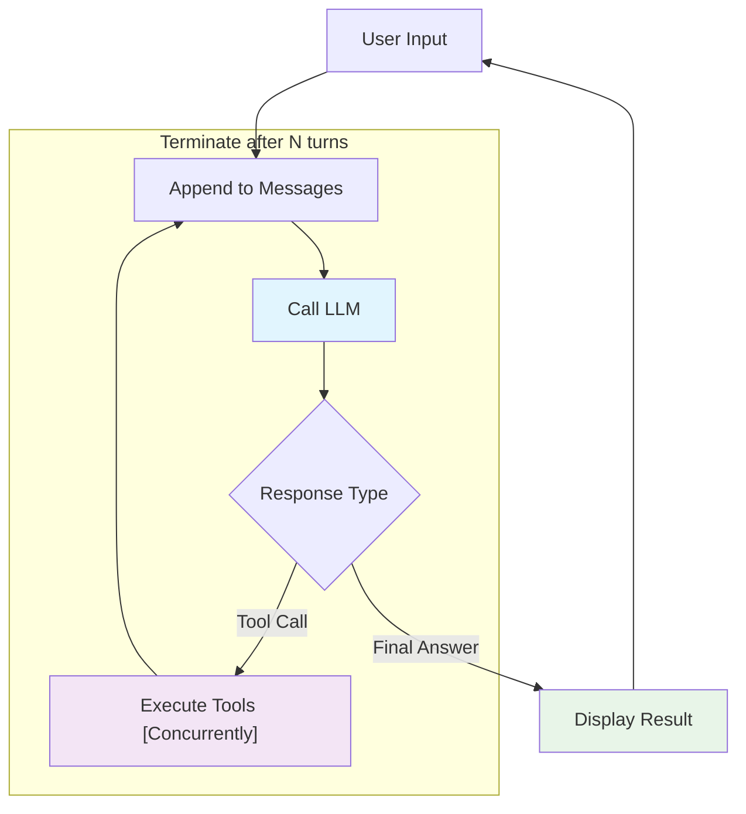

# z007: Nimble LLM Agent


_pronounced: "zee-double-oh-seven"_ 
## TL;DR

While frameworks like LangChain, Semantic Kernel, and AutoGen provide comprehensive toolkits with extensive abstractions, they can obscure the fundamental mechanics of how agents actually work. Understanding these baseline principles is essential for debugging, optimization, and building reliable systems.

The `z007` agent (~600 lines) demonstrates that effective AI agents operate on three simple principles:

1. **Conversations are accumulated message lists**
2. **Tools and MCPs are executed through structured calls and appended to the message list** 
3. **Repeat until the conversation teminates**

## Demo


## Start the Agent
```bash
uvx z007
```

## Baseline Architecture

### Agent Evaluation Loop



### Message Accumulation as State Management

Agent can use message history as their primary state:

```python
messages = []
# System prompt is passed as a separate parameter to the LLM
messages.append({"role": "user", "content": [{"text": prompt}]})

# In AWS Bedrock system prompt specified sepratelly, but locally it's a message with different role:
if self.system_prompt:
    converse_params["system"] = [{"text": self.system_prompt}]
```

Each turn adds to this list, building the context that enables coherent multi-turn conversations. This approach is simple and effective.

### Tool Registry: Unified Interface for tool calling

Tools extend agent capabilities and tools can be specified in couple flavors: 
* individal python functions, or
* collection of functionality through MCPs

```python
class ToolRegistry:
    def __init__(self) -> None:
        self.tools: dict[str, Callable] = {}  # Local functions
        self.mcp_servers: dict[str, subprocess.Popen] = {}  # External processes
        self.mcp_tools: dict[str, str] = {}  # Tool → server mapping
```

**Contrast with existing frameworks:**
- **LangChain**: Sofisticated / complex tool abstractions with multiple inheritance hierarchies
- **AutoGen**: Agent-centric tool ownership with message routing sofistication / complexity
- **z007**: Simple registry pattern with unified execution interface

### Tool Execution: From Function to LLM Call

Python functions become AI-callable tools through python introspection of function name, parameters names, doc string and assotiated type hints:

```python
def calculator_tool(expression: str) -> str:
    """Performs mathematical calculations"""
    return str(eval(expression))

# Registry automatically converts to LLM tool spec:
{
    "toolSpec": {
        "name": "calculator_tool",
        "description": "Performs mathematical calculations", 
        "inputSchema": {"json": {"type": "object", "properties": {...}}}
    }
}
```

**Tool execution cycle:**
1. LLM decides to use tool → returns `tool_use` stop reason
2. Extract tool calls from assistant message
3. Execute tools concurrently using structured concurrency
4. Add results back to conversation as user message

```python
# Concurrent execution pattern
async with anyio.create_task_group() as tg:
    for i, (name, input_data, use_id) in enumerate(tool_calls):
        async def run_tool(idx=i, n=name, d=input_data, u=use_id):
            results[idx] = await execute_single_tool(n, d, u)
        tg.start_soon(run_tool)
```

## Turn-Based Conversation Loop

The conversation loop manages multi-step reasoning through iterative turns:

```python
async def run_conversation(self, prompt: str) -> list[Any]:
    messages = [...]  # Initialize with system prompt and user message
    
    for turn in range(self.max_turns):  # Prevent infinite loops
        response = await anyio.to_thread.run_sync(
            lambda: self.bedrock.converse(messages=messages, toolConfig=tool_config)
        )
        
        if response['stopReason'] == 'tool_use':
            # Execute tools, add results to messages, continue
        else:
            break  # Final answer provided
    
    return responses
```

**Key differences from framework approaches:**
- **Semantic Kernel**: Complex pipeline orchestration with multiple abstractions
- **LangChain**: Chain-based execution with rigid step sequences  
- **z007**: Simple loop with turn limits and direct message manipulation

The `max_turns` parameter balances capability with reliability—too few limits complex reasoning, too many risks infinite loops.

## Complete Interaction Trace

**Input**: "What is 15 * 23, and then multiply that result by 2?"

**Turn 1**: LLM calls calculator → `calculator_tool("15 * 23")` → "345"  
**Turn 2**: LLM calls calculator → `calculator_tool("345 * 2")` → "690"  
**Turn 3**: LLM provides final answer → "First, 15 * 23 = 345. Then, 345 * 2 = 690. So the final answer is 690."

**Final message history**:
```python
[
    {"role": "user", "content": [{"text": "What is 15 * 23, and then multiply that result by 2?"}]},
    {"role": "assistant", "content": [{"toolUse": {...}}]},  # First calculation
    {"role": "user", "content": [{"toolResult": {...}}]},   # Result: "345"
    {"role": "assistant", "content": [{"toolUse": {...}}]},  # Second calculation  
    {"role": "user", "content": [{"toolResult": {...}}]},   # Result: "690"
    {"role": "assistant", "content": [{"text": "First, 15 * 23 = 345..."}]}
]
```

This demonstrates how message accumulation enables multi-step "reasoning".

## Framework Comparison and Design Choices

### When to Choose Comprehensive Frameworks

**LangChain**: Best for complex document processing, extensive integrations, and rapid prototyping with pre-built components. Trade-off: Heavy abstractions can obscure debugging.

**AutoGen**: Excels at multi-agent conversations and role-based interactions. Trade-off: Complex message routing and agent lifecycle management.

**Semantic Kernel**: Strong for enterprise integration with Microsoft ecosystem and plugin architecture. Trade-off: Complex configuration and steep learning curve.

### When to Choose Purposeful Simplicity (z007)

**Educational understanding**: Clear visibility into agent mechanics without framework abstractions.

**Custom requirements**: Easy to modify core behavior without fighting framework assumptions.

**Performance optimization**: Minimal overhead and direct control over async execution patterns.

## Key Design Principles

1. **Message history as state**: Eliminates complex state machines while enabling context preservation
2. **Unified tool interface**: Same execution pattern for local functions and external MCP servers  
3. **Structured concurrency**: Safe parallel execution without callback complexity
4. **Graceful degradation**: Tool failures don't cascade to conversation failures
5. **Resource lifecycle management**: Proper cleanup through context managers

## Conclusion

z007 operates on simple principles: accumulated messages, structured tool calls, and turn-based reasoning loops. Understanding these fundamentals enables confident debugging, optimization, and extension regardless of framework choice.
